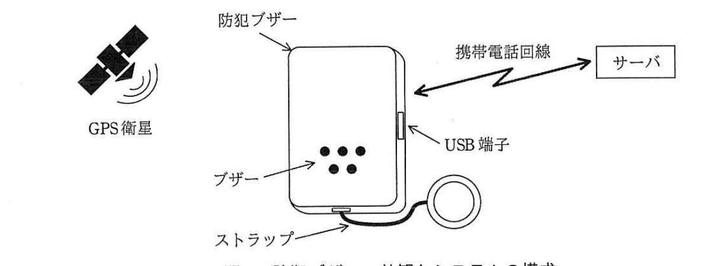

# 2018年春期（平成30年度）応用情報技術者試験 午後 問7（選択）
## 組込みシステム開発：児童の見守り機能付き防犯ブザー（Q社）

---

## 問題文

**問7** 児童の見守り機能付き防犯ブザーに関する次の記述を読んで、設問1〜3に答えよ。

Q社は、児童の見守り機能付き防犯ブザー（以下、防犯ブザーという）を開発している。防犯ブザーは、ストラップを引き抜くとブザーを大音量で鳴動させて周囲に危険を知らせる機能、ブザーが鳴動開始した場合及び鳴動停止した場合に、その動作（以下、ブザー動作という）をサーバに通知する機能、及びGPSで測位した緯度・経度をサーバに通知（以下、位置登録という）することを定期的に行う機能をもつ。サーバとの通信は、携帯電話回線経由で行う。

保護者は、利用者IDとパスワードでサーバにログインして、ブザー動作の通知を電子メールで受信するためのメールアドレスを登録したり、防犯ブザーの位置を地図画面で確認したりすることができる。

防犯ブザーの外観とシステムの構成を図1に示す。

> GPS衛星から防犯ブザーへ測位情報を送信。防犯ブザーはブザー（複数の穴）、ストラップ、USB端子を備え、携帯電話回線経由でサーバと双方向通信する。

---

### 〔防犯ブザーの構成〕

防犯ブザーは、省電力機能を備えたMPU、日付時刻用タイマ、ブザー、挿抜式のストラップ、GPSユニット、移動検出ユニット、通信部、充電式電池、及び充電のためのUSB端子で構成される。

MPUは、通常モード及び省電力モードの二つのモードをもち、省電力モードに移行する命令を実行すると、消費電力の少ない省電力モードに移行する。省電力モードで割込みが発生すると、通常モードに復帰する。

MPUは、16ビットタイマをもつ。このタイマはダウンカウンタで、カウンタに値を設定して動作を開始すると、カウント値が0になった次のカウントクロックで割込みを発生させる。また、このタイマのカウントクロックはMPUの動作クロックを32分周した信号である。

なお、MPUの動作クロックは、16MHzである。

日付時刻用タイマは、1秒単位で日付時刻を設定することができる。日付時刻を設定して動作を開始すると、設定した日付時刻になったときに割込みを発生させる。

移動検出ユニットは、一定以上の揺れを検出するたびに、防犯ブザーが移動しているものとして割込みを発生させる。

---

### 〔防犯ブザーの仕様〕

- ストラップの引抜き（以下、抜去という）が発生するとブザーの鳴動を開始し、ストラップの差込み（以下、挿入という）が発生するとブザーの鳴動を停止する。
- 防犯ブザーが通信圏外にある場合は、位置登録及びブザー動作のサーバへの通知は行わない。
- 防犯ブザーが通信圏内にある場合は、定期的に位置登録を行う。また、ブザー動作を行ったときは、その内容をサーバに通知する。
- 通信圏内では、移動状態又は静止状態の、いずれかの状態をとる。移動状態では、位置登録の周期（以下、登録周期という）を5分にする。静止状態では、消費電力の低減を図るために登録周期を30分にする。通信圏外から通信圏内に入った直後は、状態を静止状態にする。
  - 静止状態で移動を検出すると、直ちに位置登録を行い、状態を移動状態にする。
  - 移動状態で、登録周期中に一度も移動を検出しなかったときは、位置登録を行った後、状態を静止状態にする。

---

### 〔防犯ブザーのソフトウェア構成〕

防犯ブザーの組込みソフトウェアには、リアルタイムOSを使用する。防犯ブザーの主な割込みハンドラの処理概要を表1に、防犯ブザーの主なタスクの処理概要を表2に、それぞれ示す。

### 表1 防犯ブザーの主な割込みハンドラの処理概要

| 割込みハンドラ名 | 処理概要 |
|---|---|
| 移動検出 | 移動検出ユニットが割込みを発生させたことを、メインタスクに通知する。 |
| ストラップ | 抜去又は挿入が発生したことを、メインタスクに通知する。 |
| 16ビットタイマ | 16ビットタイマが割込みを発生させたことを、タイマタスクに通知する。 |
| 日付時刻用タイマ | 日付時刻用タイマが割込みを発生させたことを、タイマタスクに通知する。 |

### 表2 防犯ブザーの主なタスクの処理概要

| タスク名 | 処理概要 |
|---|---|
| メイン | 移動検出割込みハンドラ、ストラップ割込みハンドラ及び各タスクからの通知を待ち、受けた通知に従って防犯ブザーの状態の管理、登録周期の管理、位置登録の処理及びブザー動作の処理を行う。 |
| 測位 | メインタスクからの要求を待ち、要求に従ってGPSユニットを起動して測位を行い、結果をメインタスクに通知する。 |
| 通信 | 一定間隔で、通信圏内にあるか否かを確認し、メインタスクに通知する。メインタスクからの要求を待ち、要求に従ってメッセージをサーバに送信する。 |
| タイマ | メインタスクからの、登録周期の計測開始、登録周期の計測停止、及び登録周期の変更の要求を待ち、要求に従って日付時刻用タイマを設定して、動作を開始又は停止させる。動作を開始させた場合は、日付時刻用タイマ割込みハンドラからの通知を待つ。日付時刻用タイマ割込みハンドラから通知を受けると、同じ登録周期で再度日付時刻用タイマを設定して動作を開始させた後、位置登録のタイミングであることをメインタスクに通知する。 |
| アイドル | 他の全てのタスクが待ち状態になると実行され、MPUを省電力モードにする。 |

---

### 〔メインタスクの主な処理〕

- 通信圏外にある場合に、通信タスクから通信圏内となったことを通知されると、状態を静止状態にして位置登録を行い、登録周期の計測を開始して移動検出割込みを許可する。
- 移動を検出したことが通知されると、移動検出割込みを禁止する。その後、防犯ブザーの状態に従って次の処理を行う。
  - 静止状態であれば、`[　a　]`を行い、状態を移動状態にして`[　b　]`を変更した後、移動を検出したことを記憶するメモリ領域（以下、移動検出情報という）をクリアして、移動検出割込みを許可する。
  - 移動状態であれば、移動検出情報のセットだけを行い、移動検出割込みは禁止したままとする。
- 移動状態で位置登録のタイミングであることが通知されると、①移動検出情報を確認して処理を行う。その後、移動検出情報をクリアして移動検出割込みを許可する。
- 通信圏外であることが通知されると、移動検出割込みを禁止し、登録周期の計測を停止する。

---

## 設問

### 設問1 防犯ブザーの動作について、(1)、(2)に答えよ。

(1) 通信圏内にある防犯ブザーが、ある日の午前8時00分に静止状態から移動状態となった。防犯ブザーが次に静止状態になったのは午前8時20分であり、その後、同日の午前9時20分まで静止状態のままであった。防犯ブザーが午前8時台に位置登録を行った回数は何回か。整数で求めよ。

(2) 通信圏内にある防犯ブザーが、5分よりも短い間隔で位置登録を行うことがある。それはどのようなときか。40字以内で述べよ。

### 設問2 タイマタスクの設計に関する検討について、(1)、(2)に答えよ。

(1) 登録周期の計測に16ビットタイマを用いて100ミリ秒を計測し、16ビットタイマ割込みの発生が通知された回数を数えて位置登録のタイミングを通知する方式を考えてみた。この場合に、16ビットタイマのカウント値に設定する値を10進数で求めよ。ここで、1MHz=10⁶Hzとし、ソフトウェアの動作時間は考慮しなくてよいものとする。

(2) 検討の結果、登録周期の計測には16ビットタイマを使用せず、日付時刻用タイマを使用することにした。日付時刻用タイマを使用する理由を20字以内で述べよ。

### 設問3 〔メインタスクの主な処理〕について、(1)、(2)に答えよ。

(1) 本文中の`[　a　]`、`[　b　]`に入れる適切な字句を答えよ。

(2) 本文中の下線①について、移動検出情報がセットされていないときだけ、メインタスクがタイマタスクに行う要求を、表2中の字句で答えよ。

---

## 解答と解説

### 設問1

**(1) 正解：6回**

午前8時00分に移動状態となり、登録周期5分で位置登録するため、8:05, 8:10, 8:15, 8:20（静止状態に戻るタイミングでも位置登録を行う）まで移動状態での位置登録が4回。8:20に静止状態となった後は登録周期30分となるが、8:20〜9:20（60分間）静止状態が継続したため、8:50, 9:20（ただし9:20は9時台）の位置登録がある。8時台に含まれるのは8:05, 8:10, 8:15, 8:20, 8:50の5回に加え、状態遷移の仕様上、静止状態に戻った直後の位置登録がカウントされるかを考慮すると、IPA公式解答は**6回**。

**IPA公式：6**

**(2) 正解例：静止状態で位置登録を行った後、5分経過する前に移動を検出したとき（40字以内）**

静止状態では登録周期30分だが、その途中で移動を検出すると、〔防犯ブザーの仕様〕の「静止状態で移動を検出すると、直ちに位置登録を行い、状態を移動状態にする」により、5分未満の間隔で位置登録が発生する場合がある。

**IPA公式：静止状態で位置登録を行った後、5分経過する前に移動を検出したとき**

---

### 設問2

**(1) 正解：49,999**

16ビットタイマはダウンカウンタで、カウントクロックはMPU動作クロック（16MHz）を32分周した信号＝16MHz÷32＝500kHz（周期2マイクロ秒）。100ミリ秒を計測するには、100ミリ秒÷2マイクロ秒＝50,000カウント必要。ダウンカウンタはカウント値が0になった次のクロックで割込みを発生させるため、設定値は50,000－1＝**49,999**。

**IPA公式：49,999**

**(2) 正解例：消費電力を小さくできるから（20字以内）**

16ビットタイマを用いて100ミリ秒ごとに割込みを発生させ、それを積算して登録周期（5分・30分）を計測する方式では、MPUが頻繁に割込みで起こされて処理を行う必要があり、消費電力が大きくなる。一方、日付時刻用タイマは長い間隔（分単位）で1回だけ割込みを発生させられるため、その間MPUを省電力モードに保つことができ、消費電力を抑えられる。

**IPA公式：消費電力を小さくできるから**

---

### 設問3

**(1) 正解：a = 位置登録、b = 登録周期**

静止状態で移動を検出した場合、〔防犯ブザーの仕様〕より「直ちに位置登録を行い、状態を移動状態にする」とあるため、a には**位置登録**が入る。状態が移動状態に変わったことに伴い、登録周期も静止状態の30分から移動状態の5分に切り替える必要があるため、b には**登録周期**が入る。

**IPA公式：a = 位置登録、b = 登録周期**

**(2) 正解：登録周期の変更**

下線①「移動検出情報を確認して処理を行う」際、移動検出情報がセットされていない（＝登録周期中に一度も移動を検出しなかった）ときは、〔防犯ブザーの仕様〕より状態を静止状態に変更し、登録周期を30分に変更する必要がある。したがって、メインタスクがタイマタスクに行う要求は表2の**登録周期の変更**。

**IPA公式：登録周期の変更**

---

## 参考：主要キーワード

| 用語 | 説明 |
|------|------|
| ダウンカウンタ | 設定値から0に向かって減算していくカウンタ。0に達すると割込みなどのイベントを発生させる |
| 分周 | クロック信号の周波数を整数分の1に変換すること。本問ではMPU動作クロックを32分周してカウントクロックとする |
| 省電力モード | 消費電力を抑えるためにMPUの動作を停止・低速化する状態。割込みで通常モードに復帰する |
| リアルタイムOS（RTOS） | タスクの優先度やイベント応答性を保証しながら複数タスクを制御するOS。組込みシステムでよく使われる |
| メインタスク／タイマタスク | 役割ごとに分割されたタスク設計。イベント（割込み通知）を待ち受け、要求に応じて処理を実行する協調動作モデル |
| 移動検出情報 | 移動を検出したことを一時的に記憶するメモリ領域。登録周期の終わりに状態遷移の判定に使われるフラグ的役割を持つ |
