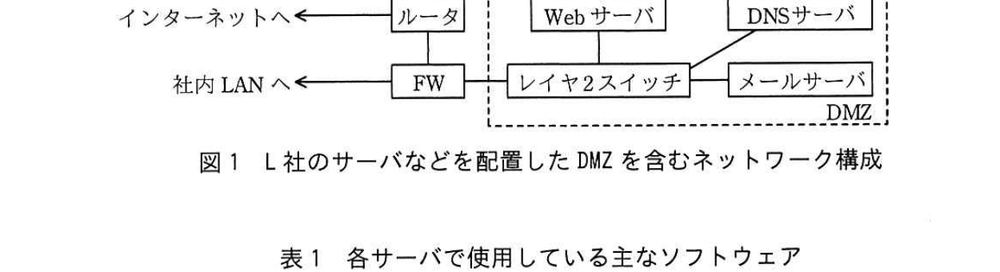

# 2018年秋期（平成30年度）応用情報技術者試験 午後 問1（必須）
## 情報セキュリティ：インターネットサービス向けサーバのセキュリティ対策（L社）

---

## 問題文

**問1** インターネットサービス向けサーバのセキュリティ対策に関する次の記述を読んで、設問1〜3に答えよ。

食品販売業を営むL社では、社内外の電子メール（以下、メールという）を扱うメールサーバ、商品を紹介するWebサーバ及び自社ドメイン名を管理するDNSサーバを運用している。L社情報システム部のM部長は、インターネット経由の外部からのサイバー攻撃への対策が重要だと考え、当該サイバー攻撃にさらされるおそれのあるサーバの脆弱性診断を行うように、情報システム部のNさんに指示した。L社のサーバなどを配置したDMZを含むネットワーク構成を図1に、各サーバで使用している主なソフトウェアを表1に示す。

なお、L社のセキュリティポリシでは、各サーバで稼働するサービスへのアクセス制限は、ファイアウォール（以下、FWという）及び各サーバのOSがもつFW機能の両方で実施することになっている。

> インターネット―ルータ―FW―（社内LANと、DMZ内のレイヤ2スイッチ経由でWebサーバ、DNSサーバ、メールサーバが接続）という構成。

### 表1 各サーバで使用している主なソフトウェア

| サーバ名 | ソフトウェア |
|---|---|
| メールサーバ | OS-A、メールサーバソフトウェア |
| Webサーバ | OS-B、Webサーバソフトウェア、DBMS、商品検索ソフトウェア（社外に委託して開発した自社ソフトウェア） |
| DNSサーバ | OS-A、DNSサーバソフトウェア |

---

### 〔脆弱性診断の実施〕

Nさんは、社外のセキュリティベンダであるQ社に、メールサーバ、Webサーバ及びDNSサーバの脆弱性診断を実施してもらい、脆弱性診断の内容とその結果を受け取った。Q社が実施した脆弱性診断の内容の抜粋を表2に、Q社から受け取った脆弱性診断結果の抜粋を表3に示す。

### 表2 Q社が実施した脆弱性診断の内容（抜粋）

| 項番 | 項目 | 実施内容 |
|---|---|---|
| 診1 | ポートスキャン | インターネット側から対象サーバにTCPスキャン及び`[　a　]`スキャンを実施し、稼働しているサービスに関する情報を収集する。 |
| 診2 | 既知の脆弱性に対する診断 | 使用しているソフトウェアのバージョンなどから既知の脆弱性がないことを確認する。 |
| 診3 | ソフトウェア設定診断 | OS、ミドルウェア、アプリケーションの設定の不備などがないことを確認する。 |
| 診4 | Webアプリケーション診断 | Webアプリケーションについて、`[　b　]`の不備、Webページの出力処理の不備などがないことを確認する。 |

### 表3 Q社から受け取った脆弱性診断結果（抜粋）

| 項番 | 対象サーバ | 脆弱性診断の項番 | 対象ソフトウェア | 脆弱性の内容 |
|---|---|---|---|---|
| 脆1 | メールサーバ | `[　c　]` | メールサーバソフトウェア | 送信ドメイン認証機能が未設定なので、インターネットから届く送信元メールアドレスを偽装したスパムメールを受信してしまう状態であった。 |
| 脆2 | Webサーバ | 診1 | OS-B | DBMSに接続するためのTCPポートにインターネットからアクセス可能であった。 |
| 脆3 | Webサーバ | 診3 | Webサーバソフトウェア | 脆弱な暗号化通信方式が使用できてしまう設定であり、情報漏えいのおそれがあった。 |
| 脆4 | Webサーバ | 診4 | 商品検索ソフトウェア | 入力値チェックの不備によって、データベースに蓄積された非公開情報が閲覧されるおそれがあった。 |
| 脆5 | DNSサーバ | 診2 | DNSサーバソフトウェア | DNSサーバソフトウェアの脆弱性によって、ゾーン情報がリモートから操作可能であった。 |

---

### 〔発見された脆弱性への対策の検討〕

Nさんは、表3の脆弱性診断結果の内容を確認し、発見された脆弱性に対して実施すべき対策の案を検討した。検討結果を表4に示す。

### 表4 発見された脆弱性に対して実施すべき対策（案）

| 脆弱性診断結果の項番 | 実施すべき対策 |
|---|---|
| 脆1 | メールサーバソフトウェアに送信ドメイン認証機能として`[　d　]`認証の設定を行う。送信元メールアドレスのドメイン名からDNSに問合せを行い、`[　d　]`レコードから正規のIPアドレスを調べる。受信したメールの`[　e　]`IPアドレスと照合して、なりすましの受信メールをフィルタリングする。 |
| 脆2 | `[　f　]`と、`[　g　]`のOSがもつFW機能で、DBMSに接続するためのTCPポートを閉塞して、インターネットからDBMSにアクセスできないようにする。 |
| 脆3 | WebサーバソフトウェアのD定を変更して、脆弱な暗号化通信方式を使用禁止にする。 |
| 脆4 | SQL文を組み立てる際に害のあるコードが入力値に含まれていないか十分にチェックして`[　h　]`を防止する。 |
| 脆5 | DNSサーバソフトウェアの脆弱性に対応する修正ソフトウェアがリリースされているので、これを適用する。 |

Nさんは、脆弱性診断結果（表3）と、実施すべき対策の案（表4）をM部長に報告した。報告を受けたM部長は、Nさんが検討した表4の脆弱性対策を速やかに実施することと、中長期的な脆弱性対策を検討することを指示した。

---

### 〔中長期的な脆弱性対策〕

Nさんは、OSやミドルウェアなどの市販ソフトウェアと社外に委託して開発する自社ソフトウェアについて、L社が中長期的に取り組むべき脆弱性対策の案を検討した。検討結果を表5に示す。

### 表5 L社が中長期的に取り組むべき脆弱性対策（案）

| 市販ソフトウェア | 社外に委託して開発する自社ソフトウェア |
|---|---|
| ・サーバで使用しているソフトウェアの製造元・提供元から更新情報を入手する。 ・①社外の関連する組織から脆弱性情報を入手して活用する。 ・運用・保守要員に対するセキュリティ教育を実施し、脆弱性対策への意識を高める。 | ・ソフトウェア開発の委託先企業との契約に、セキュアコーディングの実施を盛り込む。 ・②ソフトウェア開発の委託先企業のセキュリティ対策の実施状況を確認する。 ・③ソフトウェアの企画・設計段階からセキュリティ機能を組み込むようにセキュリティの専門家を参加させる。 |

Nさんは、表5の脆弱性対策の案を盛り込んだ改善計画を策定し、その結果をM部長に報告した。改善計画を確認したM部長は、この改善計画を基に具体的な取組みを検討するようにNさんに指示した。

---

## 設問

### 設問1 〔脆弱性診断の実施〕について、(1)、(2)に答えよ。

(1) 表2中の`[　a　]`、`[　b　]`に入れる適切な字句を解答群の中から選び、記号で答えよ。

**解答群：**
ア　ARP　　イ　IT資産管理
ウ　UDP　　エ　XML
オ　インシデント管理　　カ　ウイルス
キ　セッション管理　　ク　ログ管理

(2) 表3中の`[　c　]`に入れる適切な字句を答えよ。

### 設問2 〔発見された脆弱性への対策の検討〕について、(1)〜(3)に答えよ。

(1) 表4中の`[　d　]`、`[　e　]`に入れる適切な字句を解答群の中から選び、記号で答えよ。

**解答群：**
ア　MX　　イ　PTR　　ウ　SMTP　　エ　SPF
オ　送信先　　カ　送信元　　キ　中継先　　ク　中継元

(2) 表4中の`[　f　]`、`[　g　]`に入れる適切な字句を、図1中の構成機器の名称で答えよ。

(3) 表4中の`[　h　]`に入れる適切なサイバー攻撃手法の名称を15字以内で答えよ。

### 設問3 〔中長期的な脆弱性対策〕について、(1)、(2)に答えよ。

(1) 表5中の下線①、②の各対策に該当する項目として適切なものを解答群の中からそれぞれ選び、記号で答えよ。

**解答群：**
ア　インシデント発生時の緊急対応体制を整備する。
イ　公開されている脆弱性情報データベースを確認する。
ウ　実施すべきセキュリティ対策を定めて定期的に監査する。
エ　セキュリティ対策に関する予算を増額する。
オ　リスク分析を定期的に実施して対応計画を立案する。

(2) 表5中の下線③について、表3の項番"脆3"で発見された脆弱性への対策として、ソフトウェアの企画・設計段階からセキュリティの専門家を参加させる狙いを30字以内で述べよ。

---

## 解答と解説

### 設問1

**(1) 正解：a = ウ（UDP）、b = キ（セッション管理）**

- a：ポートスキャンで稼働サービスの情報を収集するには、TCPだけでなくUDPポートに対するスキャンも必要。
- b：Webアプリケーション診断では、Webページの出力処理（XSS等）の不備に加え、ログイン状態の管理などの**セッション管理**の不備（セッションハイジャック等）がないかを確認する。

**IPA公式：a = ウ、b = キ**

**(2) 正解：診3**

脆1「メールサーバソフトウェアの送信ドメイン認証機能が未設定」という脆弱性は、ソフトウェアの設定に関する不備であり、表2の脆弱性診断項目のうち**診3**（ソフトウェア設定診断）に該当する。

**IPA公式：診3**

---

### 設問2

**(1) 正解：d = エ（SPF）、e = カ（送信元）**

- d：送信ドメイン認証の代表的な仕組みはSPF（Sender Policy Framework）。送信元ドメインのDNSに設定された**SPF**レコードから正規の送信元IPアドレスを取得する。
- e：SPFレコードから調べた正規のIPアドレスと、実際に受信したメールの**送信元**IPアドレスを照合し、一致しなければなりすましと判定する。

**IPA公式：d = エ、e = カ**

**(2) 正解：f = FW、g = Webサーバ**

DBMSに接続するためのTCPポートへのインターネットからのアクセスを遮断するには、境界に位置する**FW**と、DBMSが稼働するサーバである**Webサーバ**のOSがもつFW機能の両方で閉塞する必要がある（L社のセキュリティポリシに準拠）。

**IPA公式：f = FW、g = Webサーバ**

**(3) 正解：SQLインジェクション（8字）**

SQL文を組み立てる際に悪意あるコードが入力値に含まれないかチェックすることで防止する攻撃は**SQLインジェクション**。

**IPA公式：SQLインジェクション**

---

### 設問3

**(1) 正解：下線①＝イ、下線②＝ウ**

- 下線①「社外の関連する組織から脆弱性情報を入手して活用する」は、JPCERT/CCなどが**公開されている脆弱性情報データベースを確認する**（イ）ことに該当する。
- 下線②「ソフトウェア開発の委託先企業のセキュリティ対策の実施状況を確認する」は、**実施すべきセキュリティ対策を定めて定期的に監査する**（ウ）ことに該当する。

**IPA公式：下線①＝イ、下線②＝ウ**

**(2) 正解例：危殆化していない暗号化通信方式を採用するため（30字以内）**

脆3の脆弱性は「脆弱な暗号化通信方式が使用できてしまう設定」であった。企画・設計段階からセキュリティの専門家を参加させる狙いは、開発時点から安全性が確認された（危殆化していない）暗号化通信方式を最初から採用し、後になって脆弱な設定が使われることを防ぐことにある。

**IPA公式：危殆化していない暗号化通信方式を採用するため**

---

## 参考：主要キーワード

| 用語 | 説明 |
|------|------|
| 脆弱性診断 | ポートスキャン、既知の脆弱性チェック、設定診断、Webアプリケーション診断などにより、システムの脆弱性を発見するプロセス |
| SPF（Sender Policy Framework） | 送信元ドメインが許可するメールサーバのIPアドレスをDNSのSPFレコードに公開し、受信側がそれと照合してなりすましを検知する送信ドメイン認証技術 |
| SQLインジェクション | 悪意あるSQL文の断片を入力値に混入させ、データベースを不正に操作・閲覧させる攻撃手法。入力値の適切なチェック（エスケープ処理等）で防止する |
| セキュアコーディング | 脆弱性を生まないようなコーディング規約・手法に従って安全なプログラムを開発すること |
| セキュリティ・バイ・デザイン | ソフトウェアの企画・設計段階からセキュリティを組み込む開発アプローチ。後付けの対策よりも根本的な脆弱性の作り込みを防げる |
| 危殆化（暗号アルゴリズムの） | 技術の進歩や解読手法の発見により、従来安全とされていた暗号アルゴリズムや通信方式の安全性が低下すること |
