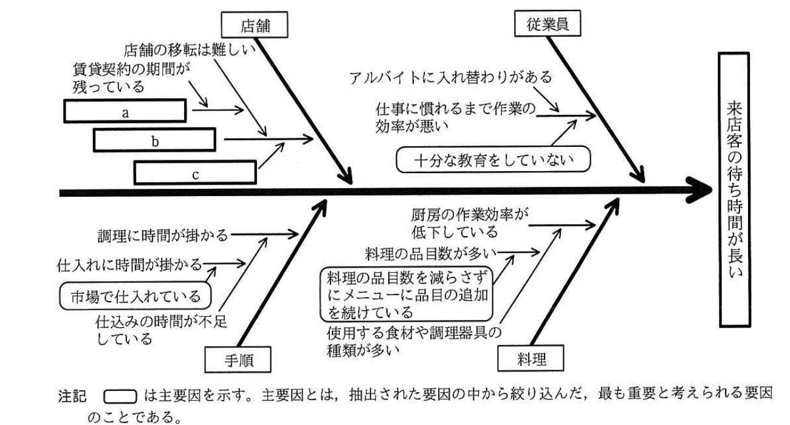
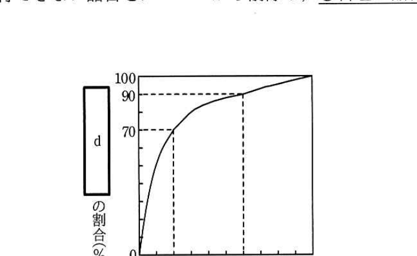

# 2018年秋期（平成30年度）応用情報技術者試験 午後 問2（選択）
## 経営戦略：レストラン経営（R店／S氏）

---

## 問題文

**問2** レストラン経営に関する次の記述を読んで、設問1〜4に答えよ。

R店は個人経営の洋食レストランであり、大都市にある乗降客の多い駅の近くの貸しビルに、数年前に開店した。厨房とホールに、それぞれ従業員が数名配置され、夕方から営業を開始している。最近は、売上が横ばい状態の上に、食材価格の高騰の影響で経費が増加しており、黒字経営とはいえ、利益は減少傾向にある。そこで、経営者のS氏は売上の伸び悩みや利益の減少の原因を調査・分析し、経営の改善を図ることにした。

---

### 〔来店客へのアンケートの結果〕

S氏は、まず来店客に対して、R店に関する印象・意見を求めるアンケートを実施し、その結果を次のとおりまとめた。

**（好評点）**
- 店が駅から近くて行きやすい。店内がきれいで、雰囲気も良い。
- ハンバーグステーキがとてもおいしい。
- 料理の品目が頻繁にメニューに追加されるので、店のホームページなどで時々チェックしている。追加された料理がおいしそうだと、お店に足を運びたくなる。
- スマートフォンで稼働するアプリケーションソフトウェア（以下、携帯アプリという）を使って予約できるのは、便利である。
- 会計時に、スタンプカードにスタンプを押してもらって、スタンプが一定数たまると、料理が一品無料になるなどの特典は、お得感があってうれしい。

**（不評点）**
- 注文してから、料理が運ばれてくるまでに、時間が掛かる。
- 来店客で混雑する時間帯は、携帯アプリや電話などで予約しておかないと、入店までかなり待たされる。
- 料理の品目数が多く、メニューに写真が掲載されていないので、品名だけではどれを選んだらよいか悩んでしまう。店の従業員に料理の説明をしてもらわなければ、注文する料理を決められないので、もっと親切なメニューにしてほしい。
- おいしくて安全な料理を食べたいが、料理に使われている食材を、誰がどのようにして作っているか分からない。
- スタンプカードを忘れた場合に、スタンプがたまらないのは不便である。
- ディナーの営業だけでなく、ランチの営業もしてほしい。

---

### 〔"来店客の待ち時間が長い問題"の要因分析〕

次にS氏は、来店客へのアンケートの結果のうち、売上に直結する顧客回転率を上げるために"来店客の待ち時間が長い問題"について改善が急務と考え、店の主要メンバとブレーンストーミングを行いその要因を分析した。分析は、従業員、店舗、料理、手順に分けて行った。挙げられた要因は、次のとおりである。

**(1) 従業員**
- アルバイトには入れ替わりがあるが、新規のアルバイトを雇った場合、十分な教育をしていないので、仕事に慣れるまで作業の効率が悪い。

**(2) 店舗**
- 貸しビルの店舗の増改築は難しく、客席の数を増やせない。
- 賃貸契約の期間が残っており、多額の解約手数料が掛かるので、店舗の移転は難しい。

**(3) 料理**
- 料理の品目数を減らさずにメニューに品目の追加を続けているので、料理の品目数が多くなってしまった。
- 料理の品目数の増加に伴い、使用する食材や調理器具の種類が増加するので、厨房の作業効率が低下している。

**(4) 手順**
- 仕込みの時間が不足しているので、調理に時間が掛かっている。
- 食材は市場で仕入れており、仕入れに多くの時間が掛かっている。これが、仕込みの時間の不足の原因となっている。
- 農家と契約して食材を直送してもらうことによって、仕入れに掛かる時間を減らせる。仕入れに掛かる時間を減らせば、その時間を仕込みなど、他の作業に回せる。

S氏は、"来店客の待ち時間が長い問題"の要因を、図1の特性要因図にまとめた。

> 特性（背骨の右端）＝「来店客の待ち時間が長い」。4本の大骨は 従業員・店舗・手順・料理。
> - 従業員：中骨「アルバイトに入れ替わりがある」「仕事に慣れるまで作業の効率が悪い」、主要因（角丸枠）「十分な教育をしていない」。
> - 店舗：中骨「店舗の移転は難しい」「賃貸契約の期間が残っている」と、空欄ボックス `[　a　]`・`[　b　]`・`[　c　]`（店舗要因）。「賃貸契約の期間が残っている」→`[　a　]`→「店舗の移転は難しい」、`[　c　]`→`[　b　]` の因果でつながる。
> - 手順：中骨「調理に時間が掛かる」「仕入れに時間が掛かる」「仕込みの時間が不足している」、主要因（角丸枠）「市場で仕入れている」。
> - 料理：中骨「厨房の作業効率が低下している」「料理の品目数が多い」「使用する食材や調理器具の種類が多い」、主要因（角丸枠）「料理の品目数を減らさずにメニューに品目の追加を続けている」。
> - 注記：□（角丸枠）は主要因を示す。主要因とは、抽出された要因の中から絞り込んだ、最も重要と考えられる要因のことである。

---

### 〔"来店客の待ち時間が長い問題"の改善策〕

S氏は、図1で抽出された主要因に対して改善策を立てた。

- 主要因"料理の品目数を減らさずにメニューに品目の追加を続けている"について、図2のABC曲線を作成した。これを基に検討した結果、A及びBグループの品目数が最適な品目数であるという結論になったので、B、Cグループのうちから、将来の伸びが期待できない品目をメニューから削除し、①料理の品目数を絞ることにした。
- 主要因"市場で仕入れている"について、農家と契約し、食材を直送してもらうことによって、仕入れの時間を減らして、仕込みの時間を増やす。
- 主要因"十分な教育をしていない"について、アルバイトを雇用したときに活用する教育用のマニュアルを作成する。

> 縦軸＝`[　d　]`の割合（%）、横軸＝料理の品目数の割合（%）。品目数を売上金額の大きい順に並べた累積曲線で、横軸20%で縦軸70%、横軸60%で縦軸90%、横軸100%で縦軸100%に達する。A グループ＝品目数の割合0〜20%、B グループ＝20〜60%、C グループ＝60〜100%。

---

### 〔その他の問題の改善策〕

S氏は、来店客へのアンケートの結果から、"来店客の待ち時間が長い問題"以外にも、利益改善に向けて重要だと思える問題を特定し、次の改善策を立てた。また、仕入先として予定している農家と交渉した結果、食材をたくさん仕入れると、仕入単価を下げる契約が可能なことが分かったので、この方法も活用したいと考えた。

- メニューに写真やおすすめする理由を入れて、来店客が料理を選びやすいようにする。
- ②来店客にも契約農家、生産方法などが分かるようにして、顧客満足度を高める。
- スタンプカードの不便さを解消するために、既存の情報システムを活用して、`[　e　]`。
- ③ハンバーグステーキと野菜サラダをセットにしたおすすめ料理を紹介し、セット料理がより多く売れるようにする。

---

### 〔ランチ営業の検討〕

仕入れに掛かる時間の短縮によって、ランチ営業の時間も取れるので、S氏は、ランチ営業の開始を判断するために、収益見込みを確認した。ランチ営業の開始に伴って、R店の固定費が増加することはない。そこで、固定費の総額を、ディナー営業とランチ営業に売上高で配賦し、ランチ営業の1か月の収益見込みを表1のとおり作成した。

### 表1 ランチ営業の収益見込み

（単位：千円／月）

| 科目 | 金額 |
|---|---|
| 売上高 | 3,000 |
| 変動費 | 2,000 |
| 固定費 | 1,050 |
| 利益 | △50 |

ランチ営業の収益見込みでは、利益がマイナスとなった。しかし、今後ランチ営業で見込みどおりの売上高しか得られなかったとしても表1において、`[　f　]`ことから、S氏は、ランチ営業を始めることにした。

---

## 設問

### 設問1 図1中の`[　a　]`〜`[　c　]`に入れる適切な字句を、それぞれ15字以内で述べよ。

### 設問2 〔"来店客の待ち時間が長い問題"の改善策〕について、(1)、(2)に答えよ。

(1) 図2中の`[　d　]`に入れる適切な字句を、10字以内で答えよ。

(2) 本文中の下線①を実施した後、料理品目を追加する場合に、考慮すべきことは何か。15字以内で述べよ。

### 設問3 〔その他の問題の改善策〕について、(1)〜(3)に答えよ。

(1) 本文中の下線②のことを何というか。適切な字句を解答群の中から選び、記号で答えよ。

**解答群：**
ア　アクセシビリティ　　イ　エンプロイヤビリティ　　ウ　トレーサビリティ　　エ　ユーザビリティ

(2) 本文中の`[　e　]`に入れる適切な字句を、30字以内で述べよ。

(3) 本文中の下線③によって利益が改善する理由を、売上の増加以外に、30字以内で述べよ。

### 設問4 〔ランチ営業の検討〕について、本文中の`[　f　]`に入れる、ランチ営業を始めることにした理由を解答群の中から選び、記号で答えよ。

**解答群：**
ア　"売上高－固定費"がプラスである
イ　"売上高－変動費"がプラスである
ウ　"変動費－固定費"がプラスである

---

## 解答と解説

### 設問1

**正解：a = 多額の解約手数料が掛かる、b = 客席の数を増やせない、c = 店舗の増改築は難しい**

図1の店舗要因は、本文(2)店舗の記述に対応する。「賃貸契約の期間が残っており、多額の解約手数料が掛かるので、店舗の移転は難しい」から、「賃貸契約の期間が残っている」→ a＝**多額の解約手数料が掛かる** →「店舗の移転は難しい」という因果でつながる。また「貸しビルの店舗の増改築は難しく、客席の数を増やせない」から、c＝**店舗の増改築は難しい** → b＝**客席の数を増やせない** という因果でつながる。

**IPA公式：a = 多額の解約手数料が掛かる、b = 客席の数を増やせない、c = 店舗の増改築は難しい**

---

### 設問2

**(1) 正解：d = 売上金額の累積**

図2のABC曲線は、料理の品目を売上金額の大きい順に並べ、その**売上金額の累積**の割合（%）を縦軸に取るパレート分析の一手法である。

**IPA公式：d = 売上金額の累積**

**(2) 正解例：最適な品目数を維持する。**

下線①で品目数を絞った後も、料理の品目を追加する場合には、無制限に品目を増やして再び品目数が多くなることを避け、A・Bグループを中心とした**最適な品目数を維持する**ことを考慮すべきである。

**IPA公式：最適な品目数を維持する。**

---

### 設問3

**(1) 正解：ウ（トレーサビリティ）**

下線②「来店客にも契約農家、生産方法などが分かるようにして」は、食材がどこの農家でどのように生産されたかを追跡できるようにすることであり、これは**トレーサビリティ**（追跡可能性）に該当する。

**IPA公式：ウ**

**(2) 正解例：携帯アプリにスタンプカードの代替機能をもたせる**

スタンプカードを忘れるとスタンプがたまらないという不便さを解消するため、既存の情報システムである**携帯アプリにスタンプカードの代替機能をもたせる**ことで、来店客が常に携帯する端末上でスタンプを管理できるようにする。

**IPA公式：携帯アプリにスタンプカードの代替機能をもたせる**

**(3) 正解例：食材の仕入量が増え、仕入単価を下げられるから**

下線③のセット料理を紹介してセット料理がより多く売れるようにすると、ハンバーグステーキのひき肉と野菜サラダの野菜という契約農家からの食材のセット需要が高まる。仕入先の農家とは食材をたくさん仕入れると仕入単価を下げる契約が可能なので、**食材の仕入量が増え、仕入単価を下げられる**ことで、売上の増加以外にも利益が改善する。

**IPA公式：食材の仕入量が増え，仕入単価を下げられるから**

---

### 設問4

**正解：イ（"売上高－変動費"がプラスである）**

ランチ営業の収益見込みは利益△50千円と赤字だが、固定費（1,050千円）はランチ営業を始めなくても発生する費用であり、固定費の総額を売上高で配賦したものにすぎない。したがって、限界利益（売上高－変動費 ＝ 3,000－2,000 ＝ 1,000千円）がプラスであれば、その分だけ固定費の回収に貢献し、R店全体の利益は改善する。この考え方が、ランチ営業開始の判断根拠となる。

**IPA公式：イ**

---

## 参考：主要キーワード

| 用語 | 説明 |
|------|------|
| 特性要因図（フィッシュボーン図） | 問題（特性）に対する要因を、大骨・中骨・小骨の形で体系的に整理し、原因を分析するためのQC七つ道具の一つ |
| ブレーンストーミング | 自由な発想で意見を出し合い、要因や解決策を幅広く洗い出す発想法 |
| ABC曲線（パレート図） | 品目を売上金額などの大きい順に並べ、累積比率を示す曲線。重要度に応じてA・B・Cにグループ分けし、優先順位付けに用いる |
| トレーサビリティ | 食材や製品の生産・流通過程を追跡できる状態にすること。品質保証や安心感の向上につながる |
| 限界利益（売上高－変動費） | 売上高から変動費を差し引いた利益。固定費の回収に充当できる金額を示し、事業継続の意思決定に用いられる |
| 固定費・変動費 | 固定費は売上高の増減に関わらず一定に発生する費用、変動費は売上高に応じて増減する費用。損益分岐点分析の基礎となる |
