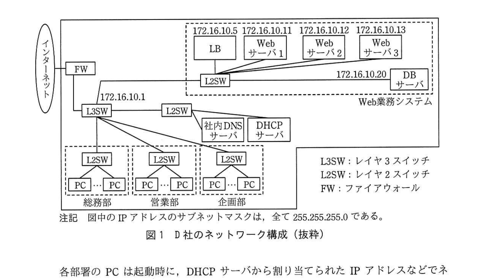

# 2018年秋期（平成30年度）応用情報技術者試験 午後 問5（選択）
## ネットワーク：Webシステムの負荷分散と不具合対応（D社／F社）

---

## 問題文

**問5** Webシステムの負荷分散と不具合対応に関する次の記述を読んで、設問1〜3に答えよ。

D社は、小売業を営む社員数約300名の中堅企業であり、取り扱う商品の販売数が順調に増加している。D社では、共通基盤となるWeb業務システム上で販売管理や在庫管理、財務会計などの複数の業務機能がそれぞれ稼働している。

Web業務システムは、Webサーバ機能とアプリケーションサーバ機能の両方を兼ね備えたサーバ（以下、Webサーバという）3台と負荷分散装置（以下、LBという）1台、データベースサーバ（以下、DBサーバという）1台で構成される。

D社では総務部がWeb業務システムとネットワークの運用管理を所管しており、情報システム課のEさんが運用管理を担当している。Web業務システムを含むD社のネットワーク構成を図1に示す。

> インターネット－FW－L3SW（172.16.10.1）と接続し、L3SWから総務部・営業部・企画部それぞれのL2SW配下のPC群、及びL2SW経由で社内DNSサーバ・DHCPサーバへ接続。またL3SWからWeb業務システム（点線枠）内のL2SWへ接続し、そこにLB（172.16.10.5）、Webサーバ1（172.16.10.11）、Webサーバ2（172.16.10.12）、Webサーバ3（172.16.10.13）、DBサーバ（172.16.10.20）が接続される。注記：図中のIPアドレスのサブネットマスクは、全て255.255.255.0である。

各部署のPCは起動時に、DHCPサーバから割り当てられたIPアドレスなどでネットワーク設定が行われる。PCから販売管理機能を利用する場合、販売管理機能を提供するプログラムに割り当てられたURLを指定し、Webブラウザでアクセスする。

---

### 〔LBによるWebサーバの負荷分散の動作〕

LBは、各部署のPCからWebサーバに対するアクセスをラウンドロビン方式でWebサーバ1〜3に分散して接続する。LBを利用することによって、Webサーバ1台で運用した場合と比較して、応答性能と可用性の向上を実現している。

Webブラウザで Web業務システムのURLを指定してアクセスすると、LBは、Webサーバを一つ選択して、当該サーバ宛てにパケットを送出する。例えば、Webサーバ2が選択された場合、LBはパケットの送信元のIPアドレスを`[　a　]`、送信先のIPアドレスを`[　b　]`に置き換えてパケットを送出する。

またLBは、pingコマンドを用いたヘルスチェック機能を有しており、pingコマンドに対して応答しなかったWebサーバへのアクセスを停止する。

---

### 〔不具合事象の発生〕

ある日、Web業務システムの定期保守作業において、販売管理機能のプログラムをバージョンアップしたところ、応答時間が急に遅くなり、Webブラウザにエラーが表示される、という報告が営業部から情報システム課に多く寄せられた。

---

### 〔不具合事象の切分け〕

営業部の多くのPCで同様な事象が発生していたので、Eさんは PCが原因ではないと考え、PCとWebサーバ間の通信に不具合が発生したと考えた。

Eさんは、営業部のPCを利用して、原因の切分けを行った。確認項目と確認結果を表1に示す。

### 表1 確認項目と確認結果

| 項番 | 確認項目 | 確認結果 |
|---|---|---|
| 1 | PCからLBへのpingテストの結果は良好か。また、LBからWebサーバ1〜3へのpingテストの結果は良好か。 | pingテストの結果は全て良好だった。 |
| 2 | L2SW、L3SW、LBの各システムログファイルに問題となるメッセージがあるか。 | 問題となるメッセージはなかった。 |
| 3 | PCで`[　c　]`コマンドを用いた、社内DNSサーバの名前解決テストの結果は良好か。 | 名前解決テストの結果は良好だった。 |
| 4 | Webサーバ1〜3のHTTP通信ログファイルに問題となるメッセージがあるか。 | Webブラウザにエラーが表示されたときのWebサーバとPC間におけるHTTP通信メッセージそのものが存在しなかった。そのとき以外のメッセージには、問題となるメッセージはなかった。 |
| 5 | Webサーバ1〜3への同時アクセス数が設定最大値を超えていないか。 | 同時アクセス数は設定最大値以内であることを通信ログから確認できた。 |
| 6 | Webサーバ1〜3のシステムログファイルに問題となるメッセージがあるか。 | Webサーバから DBサーバへのアクセスエラーメッセージ、及びTCPポートが確保できないという内容のエラーメッセージがあった。 |
| 7 | DBサーバのシステムログファイルに問題となるメッセージがあるか。 | 問題となるメッセージはなかった。 |

Eさんはここまでの調査結果を整理して、今回の不具合の原因として想定される被疑箇所について次のような仮説を立てた。

項番1と2の結果から、PCとWebサーバ1〜3の間のIP層のネットワーク通信には問題がない。また、項番3の結果から、Web業務システムのURLに対する名前解決にも問題はない。項番4と6の結果から、①特定のWeb画面を表示するときだけ、Webブラウザで HTTP通信がタイムアウトとなり、タイムアウトエラーを表示していると考えた。

Eさんは、ネットワーク通信の不具合についての仮説に対する確認テストを行うために、Web業務システムを開発したF社のテスト環境を利用して不具合を再現させ、ネットワークモニタとシステムリソースモニタを利用して状況を詳細に調べたところ、Webサーバ1〜3で利用可能なTCPポートが一時的に枯渇する事象が発生していることが分かった。

F社から、Webサーバ1〜3での利用可能なTCPポート数の増加、②Webサーバ1〜3でのTCPコネクションが閉じるまでの猶予状態であるTIME_WAIT状態のタイムアウト値の短縮、及び販売管理機能のプログラムの実行環境においてWebサーバからDBサーバへの通信時のTCPポート再利用について、Eさんは改善項目の回答をもらった。

---

### 〔改善すべき問題点〕

Eさんは、不具合の修正が終わった後に、不具合の切分け作業の問題点を考えた。③Webサーバ1〜3やL3SW、LBのそれぞれに記録されたログメッセージの対応関係の特定を推測に頼らざるを得ず難しかった。また、Webサーバで通信ログを調べる際に④送信元のPCがすぐに特定できなかった。

Eさんは、ネットワーク運用の観点から改善策の検討を進めた。

---

## 設問

### 設問1 本文中の`[　a　]`、`[　b　]`に入れる適切なIPアドレスを答えよ。

### 設問2 〔不具合事象の切分け〕について、(1)〜(3)に答えよ。

(1) 表1中の`[　c　]`に入れる適切な字句を答えよ。

(2) 本文中の下線①について、具体的にどのような不具合が生じていると考えたかを30字以内で述べよ。

(3) 本文中の下線②によって得られる改善の効果を35字以内で述べよ。

### 設問3 〔改善すべき問題点〕について、(1)、(2)に答えよ。

(1) 本文中の下線③について、適切な解決方法を解答群の中から選び、記号で答えよ。

**解答群：**
ア　NTPによる時刻同期機能を導入する。
イ　ウイルス対策ソフトを導入する。
ウ　各機器で取得したログファイルを個々に確認する。
エ　各機器のデバッグログも表示されるようにする。

(2) 本文中の下線④について、送信元のPCをすぐに特定できない理由を25字以内で述べよ。

---

## 解答と解説

### 設問1

**正解：a = 172.16.10.5、b = 172.16.10.12**

LBはWebサーバへのアクセスを負荷分散するため、宛先NAT（DNAT）／送信元NAT的な変換を行う。クライアントからのパケットの送信先がLB自身（172.16.10.5）宛てになっているので、LBがWebサーバ2（172.16.10.12）を選択した場合、パケットの送信元IPアドレスをLB自身のIPアドレス**172.16.10.5**（a）に、送信先IPアドレスを選択されたWebサーバ2のIPアドレス**172.16.10.12**（b）に置き換えて送出する。

**IPA公式：a = 172.16.10.5、b = 172.16.10.12**

---

### 設問2

**(1) 正解：c = nslookup 又は dig**

社内DNSサーバによる名前解決のテストを行うコマンドは、**nslookup**（又は**dig**）である。

**IPA公式：c = nslookup 又は dig**

**(2) 正解例：Webサーバから DBサーバへのアクセスがエラーとなった。**

表1項番6で、Webサーバのシステムログに「DBサーバへのアクセスエラー」「TCPポートが確保できない」という内容のメッセージがあったことから、Webサーバのアプリケーション層（DBサーバとの通信）で不具合が発生し、その結果としてHTTP応答が返せずタイムアウトになったと考えられる。

**IPA公式：Webサーバから DBサーバへのアクセスがエラーとなった。**

**(3) 正解例：Webサーバ1〜3で再利用できるTCPポート数を増やせること**

TIME_WAIT状態のタイムアウト値を短縮することで、使用済みのTCPポートがより早く解放され再利用可能になる。これにより、**Webサーバ1〜3で再利用できるTCPポート数を増やせる**という効果が得られ、TCPポート枯渇の再発防止につながる。

**IPA公式：Webサーバ1～3で再利用できるTCPポート数を増やせること**

---

### 設問3

**(1) 正解：ア（NTPによる時刻同期機能を導入する。）**

複数の機器（Webサーバ、L3SW、LBなど）に記録されたログメッセージの対応関係（どのイベントとどのイベントが同一の事象に起因するか）を特定するには、各機器の時刻が正確に同期している必要がある。時刻がずれていると、ログのタイムスタンプを頼りに時系列で突き合わせることが困難になる。そのため、**NTPによる時刻同期機能を導入する**ことが解決策となる。

**IPA公式：ア**

**(2) 正解例：送信元のIPアドレスはLBのものになるから**

LBがWebサーバへ転送する際、送信元IPアドレスをLB自身のIPアドレスに置き換える（設問1のとおり）ため、Webサーバ側の通信ログに記録される送信元IPアドレスは全てLBのものとなり、実際にアクセスした個々のPCのIPアドレスは記録されない。そのため、Webサーバの通信ログだけからは送信元のPCをすぐに特定できない。

**IPA公式：送信元の IPアドレスは LBのものになるから**

---

## 参考：主要キーワード

| 用語 | 説明 |
|------|------|
| 負荷分散装置（LB） | 複数のサーバへのアクセスを分散させる装置。ラウンドロビン方式などで振り分け、送信元・送信先IPアドレスを書き換えて転送する |
| ラウンドロビン方式 | リクエストを順番に複数のサーバへ均等に割り振る負荷分散アルゴリズム |
| TCPポートの枯渇 | 短時間に大量のTCP接続が生成・解放されると、TIME_WAIT状態のポートが多数残留し、利用可能なポートが一時的に不足する現象 |
| TIME_WAIT状態 | TCPコネクションを能動的にクローズした側が、再送パケットなどに対応するために一定時間保持する待機状態 |
| NTP（Network Time Protocol） | ネットワーク機器の時刻をサーバと同期させるプロトコル。複数機器のログの時系列突合せに不可欠 |
| ヘルスチェック機能 | LBがpingなどで各サーバの生死を定期的に確認し、応答のないサーバへの振り分けを停止する機能 |
