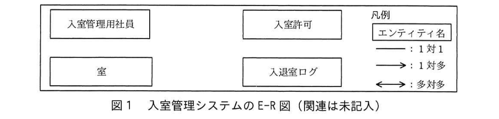

# 2018年秋期（平成30年度）応用情報技術者試験 午後 問6（選択）
## データベース：入室管理システムの設計（H社）

---

## 問題文

**問6** 入室管理システムの設計に関する次の記述を読んで、設問1〜5に答えよ。

H社は中堅の食品会社で、社内システムのデータベースの統合を検討している。現在、社内システムごとにデータベースのサーバを用意して運用しているが、関係データベース管理システム（以下、RDBMSという）のライセンスコストと運用コストを削減するために1台のサーバに統合し、各社内システムのデータベースは、統合したサーバのRDBMSでスキーマを分けて管理することになった。

---

### 〔社員情報の共用〕

全ての社内システムは、社員IDや氏名などの社員情報を使用する。現在は、人事システムが管理している社員情報のマスタデータを月次処理で各社内システムに配布して運用しているが、最新の情報が反映されるのが翌月になること、月次処理の運用負荷が大きいことなどから改善が望まれている。今回、サーバを統合するに当たり、各社内システムにデータを配布するのではなく、人事システムが管理する社員情報に関連する実表を参照する方式に変更することを検討している。人事システムの社員情報に関連する実表を表1に示す。

### 表1 人事システムの社員情報に関連する実表

| 実表名 | 列名 |
|---|---|
| 社員 | 社員ID, 氏名, 勤務区分, 入社年月日, 生年月日, 社内メールアドレス, 社内電話番号, 自宅住所, 自宅電話番号, 役職, 所属組織ID |
| 組織 | 組織ID, 組織名, 組織長の社員ID, 上位組織の組織ID |

（注記　勤務区分は、在職中、休職中、出向中、退職のいずれかを表す。）

セキュリティの観点から検討した結果、人事システム以外の社内システムから社員情報に関連する実表を直接参照するのではなく、社員情報を使用する社内システムごとに必要な列だけをビュー表として公開し、ビュー表を参照する方式を採用することに決定した。

---

### 〔入室管理システム〕

会社内の特別な部屋の入退室管理を行う入室管理システムは、サーバ統合の対象となるシステムの一つである。入室管理システムで利用する主な実表とビュー表を表2に、E-R図を図1に、入室に関する主なユースケースを表3に示す。

### 表2 入室管理システムで利用する主な表

| 表名 | 種別 | 列名 |
|---|---|---|
| 入室管理用社員 | ビュー表 | 社員ID, 氏名, 勤務区分 |
| 室 | 実表 | 室ID, 室名 |
| 入室許可 | 実表 | 社員ID, 室ID, 入室許可開始年月日, 入室許可終了年月日 |
| 入退室ログ | 実表 | 社員ID, 室ID, 日時, 入退室区分, 許可区分 |

（注記　ビュー表"入室管理用社員"は、表1の実表"社員"から入室管理システム用に社員ID、氏名、勤務区分を射影したビュー表である。）



> 4つのエンティティ「入室管理用社員」「入室許可」「室」「入退室ログ」が2×2に配置されており、関連（線）は未記入の状態。凡例：実線＝1対1、矢印線（片矢印）＝1対多、両矢印線＝多対多。

### 表3 入室管理システムの入室に関する主なユースケース

| ユースケース名 | 概要 |
|---|---|
| 入室申請 | 入室希望社員について、所属する組織の組織長が入室管理システムの管理者に申請書を提出する。申請書には、申請者（組織長の氏名）、入室希望社員の社員ID、氏名、入室する室名、入室許可開始年月日と入室許可終了年月日、入室の目的を記入する。 |
| 入室許可登録 | 管理者は、申請書が届いたら、入室管理システムの入室許可登録画面で入室希望社員の社員IDを入力し、表示された氏名が正しいこと、勤務区分が在職中であること、及び申請書の入室の目的が適切であることを確認して、問題がなければ入室を許可する。許可すると申請内容が実表"入室許可"に登録される。既に実表"入室許可"に同じ社員ID、室ID、入室許可開始年月日の行が存在する場合は、入室許可終了年月日を更新する。 |
| 入室 | 室の前に設置されているカードリーダに社員証をかざすと、社員証から社員IDを読み取る。実表"入室許可"で入室可否をチェックして、入室が許可されていれば、ドアを開錠し、実表"入退室ログ"に入退室区分が'入室'、許可区分が'OK'で記録する。入室が許可されていなければ、ドアを開錠せず、実表"入退室ログ"に入退室区分が'入室'、許可区分が'NG'で記録する。 |

表3のユースケース"入室"で、入室可否をチェックし、否の場合は0を、可の場合は1以上を返すSQL文を図2に示す。ここで、":社員ID"は指定された社員IDを格納する埋込み変数、":室ID"は指定された室IDを格納する埋込み変数、":今日"はSQL文実行時の現在日付を格納する埋込み変数である。また、ROOMは入室管理システムのスキーマ名で、表は"スキーマ名.表名"で表記する。

```sql
図2 入室可否をチェックするSQL文
SELECT [　a　] FROM ROOM.入室許可 WHERE 社員ID = :社員ID
       AND 室ID = :室ID
       AND 入室許可開始年月日 <= :今日
       AND 入室許可終了年月日 >= :今日
```

---

### 〔各社内システムのRDBMSユーザ〕

社内システムごとにデータベース管理者（以下、DBAという）が存在する。DBAは表の所有者であり、他のユーザに対して、自分が所有する表へのアクセス権限を付与することができる。DBAは、各社内システムのアプリケーションプログラム（以下、APという）が表のデータにアクセスすることができるようにAP用のユーザに対して、適切な権限を付与する。各社内システムのスキーマ名と、DBA用、AP用のRDBMSユーザ名を表4に示す。

### 表4 各社内システムのスキーマ名とRDBMSユーザ名（抜粋）

| システム名 | スキーマ名 | DBA用ユーザ名 | AP用ユーザ名 |
|---|---|---|---|
| 人事システム | HR | HR_DBA | HR_AP |
| 入室管理システム | ROOM | ROOM_DBA | ROOM_AP |

---

### 〔RDBMSの表のアクセス権限に関する主な仕様〕

使用しているRDBMSの表のアクセス権限に関する主な仕様を(1)、(2)に示す。

(1) 表のデータに対して、所有者以外のユーザが参照、挿入、更新及び削除を行うためには、表に対して対応するアクセス権限（SELECT、INSERT、UPDATE及びDELETEの各権限）を所有者から付与してもらう必要がある。

(2) ビュー表にアクセスする場合、そのビュー表が参照する表のアクセス権限は不要である。

---

### 〔入室管理システム用の社員ビュー表〕

表2のビュー表"入室管理用社員"を定義するSQL文を図3に示す。

```sql
図3 ビュー表"入室管理用社員"を定義するSQL文
CREATE VIEW HR.入室管理用社員（社員ID, 氏名, 勤務区分）AS
    SELECT 社員ID, 氏名, 勤務区分 FROM HR.社員
```

このビュー表を入室管理システムのAPが参照だけできるように権限を付与するSQL文を図4に示す。

```sql
図4 ビュー表"入室管理用社員"を参照するための権限を付与するSQL文
[　b　] [　c　] ON [　d　] TO [　e　]
```

---

### 〔入室申請時の確認の強化〕

管理者は、"申請者が入室希望社員の組織長であること"を確認することになった。そのため、ビュー表"入室管理用社員"に組織長の氏名が必要となり、図5に示すSQL文に変更した。

```sql
図5 変更したビュー表"入室管理用社員"を定義するSQL文
CREATE VIEW HR.入室管理用社員（社員ID, 氏名, 勤務区分, 組織長氏名）AS
    SELECT T1.社員ID, T1.氏名, T1.勤務区分, T2.氏名
    FROM HR.社員 T1, HR.社員 T2, HR.組織 T3
    WHERE [　f　]
```

---

## 設問

### 設問1 図1に適切なエンティティ間の関連を記入し、E-R図を完成させよ。図1の凡例に倣うこと。

### 設問2 表2に示した実表"入室許可"における、主キーを答えよ。

### 設問3 図2中の`[　a　]`に入れる適切な字句を答えよ。

### 設問4 ビュー表"入室管理用社員"について、(1)、(2)に答えよ。

(1) 図4中の`[　b　]`〜`[　e　]`に入れる適切な字句を答えよ。なお、表は"スキーマ名.表名"で表記すること。

(2) ビュー表を参照する権限を付与するSQL文を実行するユーザ名を答えよ。

### 設問5 図5中の`[　f　]`に入れる適切な式を答えよ。

---

## 解答と解説

### 設問1

**正解：入室管理用社員 →（1対多）→ 入室許可、室 →（1対多）→ 入室許可、入室管理用社員 →（1対多）→ 入退室ログ、室 →（1対多）→ 入退室ログ**

一人の社員（入室管理用社員）は複数の入室許可・入退室ログをもち得るが、一つの入室許可・入退室ログは一人の社員に対応するので、入室管理用社員から入室許可、及び入室管理用社員から入退室ログへは1対多の関連となる。同様に、一つの室は複数の入室許可・入退室ログをもち得るので、室から入室許可、室から入退室ログへも1対多の関連となる。

**IPA公式：入室管理用社員－（1対多）－入室許可、室－（1対多）－入室許可、入室管理用社員－（1対多）－入退室ログ、室－（1対多）－入退室ログ**

---

### 設問2

**正解：社員ID、室ID、入室許可開始年月日**

〔入室許可登録〕のユースケースに「既に実表"入室許可"に同じ社員ID、室ID、入室許可開始年月日の行が存在する場合は、入室許可終了年月日を更新する」とあることから、この3列の組合せで一意に行が特定されることが分かる。したがって、主キーは**社員ID、室ID、入室許可開始年月日**である。

**IPA公式：社員ID，室ID，入室許可開始年月日**

---

### 設問3

**正解：a = COUNT(*)**

入室可否のチェックでは、条件に合致する行が存在するかどうかだけが重要であり、否の場合は0、可の場合は1以上を返す必要があるため、該当行数をカウントする**COUNT(\*)**を用いる。

**IPA公式：a = COUNT(\*)**

---

### 設問4

**(1) 正解：b = GRANT、c = SELECT、d = HR.入室管理用社員、e = ROOM_AP**

ビュー表を参照する権限を付与するSQL文は、`GRANT SELECT ON <対象の表> TO <権限を与えるユーザ>` の形式である。参照権限のみを付与するので権限の種類は**SELECT**（c）、対象の表はスキーマ名を付けて**HR.入室管理用社員**（d）、権限を付与する相手は入室管理システムのAP用ユーザである**ROOM_AP**（e）となる。

**IPA公式：b = GRANT、c = SELECT、d = HR.入室管理用社員、e = ROOM_AP**

**(2) 正解：HR_DBA**

ビュー表"入室管理用社員"は人事システムのスキーマ（HR）に属しており、その所有者（DBA）でなければ他ユーザへの権限付与はできない。したがって、権限付与のSQL文を実行するのは人事システムのDBA用ユーザである**HR_DBA**である。

**IPA公式：HR_DBA**

---

### 設問5

**正解：f = T1.所属組織ID = T3.組織ID AND T3.組織長の社員ID = T2.社員ID**

組織長の氏名を取得するには、対象社員（T1）の所属組織ID（T1.所属組織ID）から組織（T3）を特定し（T1.所属組織ID = T3.組織ID）、その組織の組織長の社員ID（T3.組織長の社員ID）と一致する社員（T2）を求めて、その氏名（T2.氏名）を組織長氏名として取得する必要がある。

**IPA公式：f = T1.所属組織ID = T3.組織ID AND T3.組織長の社員ID = T2.社員ID**

---

## 参考：主要キーワード

| 用語 | 説明 |
|------|------|
| RDBMSのスキーマ統合 | 複数の社内システムのデータベースを1台のサーバに集約し、システムごとにスキーマを分けて管理することでライセンス・運用コストを削減する手法 |
| ビュー表 | 実表に対するSELECT文を定義として持つ仮想的な表。必要な列だけを射影して公開することで、元の実表への直接アクセスを制限できる |
| GRANT文 | RDBMSにおいて、表やビューへのアクセス権限（SELECT、INSERT、UPDATE、DELETEなど）を他のユーザに付与するSQL文 |
| 表の所有者（DBA） | 表を作成したユーザで、その表に対する全ての権限を持ち、他ユーザへの権限付与（GRANT）を行える |
| 自己結合（セルフジョイン） | 同一の表を異なる別名（エイリアス）で複数回参照し、組織長の氏名を取得するようなケースで用いる結合手法 |
| E-R図とカーディナリティ | エンティティ間の関連の多重度（1対1、1対多、多対多）を表す図。業務ルールに基づいて関連の方向と多重度を正しく設定する必要がある |
