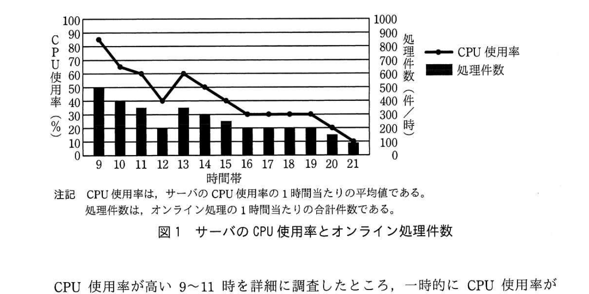
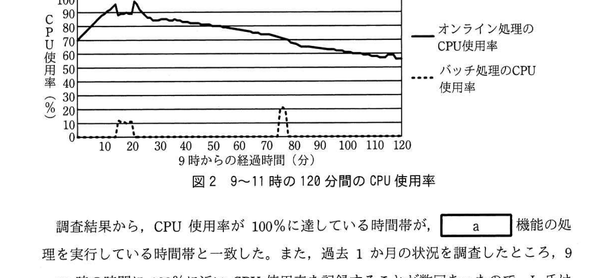

# 2018年秋期（平成30年度）応用情報技術者試験 午後 問10（選択）
## サービスマネジメント：キャパシティ管理（K社／G社顧客管理システム）

---

## 問題文

**問10** キャパシティ管理に関する次の記述を読んで、設問1〜3に答えよ。

K社は、ガス会社G社の情報システム子会社であり、G社に顧客管理サービス（以下、本サービスという）を提供している。本サービスは、G社が家庭用電力事業に新規参入したときに、K社がその事業の顧客管理を支援するためのシステム（以下、本システムという）を導入して開始されたものである。G社は本サービスを利用して、営業部門の電力料金計算・請求業務、及びコールセンタでの顧客からの問合せ対応・新規顧客受付業務を行っている。

K社では、年に数回の計画停止期間以外は、毎日9時から22時まで、本サービスのオンラインサービスを提供している。

---

### 〔本システムの概要〕

本システムは、サーバ1台で稼働し、表1に示す五つの機能をオンライン処理又はバッチ処理で実現している。

### 表1 本システムの機能

| 項番 | 機能名称 | 処理形態 | 概要 |
|---|---|---|---|
| 1 | 顧客情報照会 | オンライン処理 | 顧客データベース（以下、顧客DBという）を参照する。 |
| 2 | 検針データ取込み | 日中バッチ処理¹⁾ | 検針会社のシステムから検針データを受信し、顧客DBを更新する。 |
| 3 | 顧客DBバックアップ | 夜間バッチ処理²⁾ | 顧客DBのバックアップを取得する。 |
| 4 | 電力料金計算・請求 | 夜間バッチ処理²⁾ | 顧客ごとの電力料金計算及び請求処理を行い、顧客DBを更新する。 |
| 5 | 顧客情報登録・変更 | オンライン処理 | 新規顧客の登録や既存顧客の情報の変更などで顧客DBを更新する。 |

（注記　項番の数字は、本サービスにおける機能の重要度を高い順に1〜5で表す。）
（注¹⁾　日中バッチ処理は、オンラインサービス提供時間帯の9〜22時に1時間間隔で起動され、数分間で完了する。日々の検針データが料金に影響する契約もあるので、障害が発生した場合でも、当処理は、当日の当初予定から3時間以内に実行する必要がある。）
（注²⁾　夜間バッチ処理は、オンライン処理終了後の22時から、顧客DBバックアップ機能、電力料金計算・請求機能の順番に実行する。通常、全ての夜間バッチ処理が終了してからオンライン処理を開始する。夜間バッチ処理中は、他の処理では顧客DBの参照はできるが更新はできない。）

---

### 〔本サービスのキャパシティ管理〕

K社のL氏は、ITサービスマネージャとして本サービスのキャパシティ管理を担当し、具体的には次の業務を行っている。

**(1) キャパシティ計画**

① 毎年1回、G社営業部門から本サービスに対する需要予測を入手し、G社と合意したサービスを考慮して資源の使用量を見積もる。これを基に、キャパシティを拡充するための期間、監視項目、監視項目のしきい値などのキャパシティ計画を作成し、G社に説明している。

**(2) キャパシティ監視**

① オンライン処理の監視項目は、サーバのCPU使用率、オンライン応答時間及びオンライン処理件数であり、1分間隔で集計し、測定値として収集する。ここで、オンライン応答時間とは、サーバが要求を受け付けてから応答するまでの時間のことである。バッチ処理の監視項目は、1分間隔で集計するサーバのCPU使用率及び毎日のバッチ処理時間である。

② 監視項目の測定値が、あらかじめ決められたしきい値を超えた場合は、インシデントとして対応する。

なお、社内及び社外のネットワークには十分なキャパシティがあり、サービス提供に支障がないので、監視項目を設定していない。

**(3) 分析及び対策**

① 監視項目の測定値について、キャパシティ計画で見積もったとおりに資源が使用されているかなどの視点から毎月1回分析を行う。また、夜間バッチ処理時間については、毎月1回妥当性を確認する。

② キャパシティに関わるインシデントの対応を終了した後は、キャパシティ計画の妥当性を検討し、必要に応じてキャパシティ計画を見直す。

---

### 〔オンライン応答時間の悪化〕

本サービスの提供を開始してから6か月後のある日、9時15分にオンライン応答時間の測定値がしきい値を超えたことから、K社はインシデント対応を開始した。また、コールセンタからK社に"オンライン処理の応答が遅い"というクレームがあった。このときは、数分後にオンライン応答時間の悪化は解消されたので、K社では解決策は必要ないと判断し、インシデント対応を終了した。

翌日L氏は、前日のオンラインサービス提供時間帯のサーバの資源使用状況について分析することにした。このときのサーバのCPU使用率とオンライン処理件数は図1に示すとおりである。

> 横軸は時間帯（9〜21時）、左軸はCPU使用率（%）、右軸は処理件数（件/時）。CPU使用率は9時に85%と最も高く、その後10時65%、11時60%、12時40%、13時60%、14時50%、15時40%、16〜19時は30%程度、20時20%、21時10%と全体的に低下傾向。処理件数（棒グラフ）は9時が最多（500件/時）で、以降緩やかに減少していく。

CPU使用率が高い9〜11時を詳細に調査したところ、一時的にCPU使用率が100%となっているときがあることが判明した。9〜11時の120分間の1分間隔のCPU使用率は、図2に示すとおりである。

> 横軸は9時からの経過時間（分、0〜120分）。実線（オンライン処理のCPU使用率）は開始時70%から急上昇し15分前後で一時的に100%近くまで達し（一部100%到達）、その後緩やかに低下し120分後には60%程度まで下がる。破線（バッチ処理のCPU使用率）は通常0%だが、15〜20分頃と75〜80分頃の2回、一時的に10〜25%程度のピークが発生している。

調査結果から、CPU使用率が100%に達している時間帯が、`[　a　]`機能の処理を実行している時間帯と一致した。また、過去1か月の状況を調査したところ、9〜11時の時間に100%に近いCPU使用率を記録することが数回あったので、L氏はすぐに実施する暫定策として、午前中は、`[　a　]`機能の処理を実行せず、12時に実行することにした。また、恒久策として、3か月後にサーバのCPU能力向上を行うことにした。

---

### 〔夜間バッチ処理の終了時刻の遅延〕

オンライン応答時間の悪化から数日後に、夜間バッチ処理の終了時刻が遅延するインシデントが発生し、オンラインサービスの開始が遅れた。その結果、顧客情報照会ができないことから、コールセンタの業務に支障を来した。

そこで、インシデント対応の`[　b　]`として、機能を縮退してオンライン処理を行うことをG社と合意し、`[　c　]`機能だけでオンライン処理を行うことにした。その間、コールセンタで顧客情報登録・変更があった場合は、夜間バッチ処理が終了し、オンラインサービスが正常に回復した後に対応することにした。

L氏は、インシデントの発生原因を調査し、次のように整理した。

- 夜間バッチ処理では、顧客DBに登録された全顧客を対象に処理を行っている。夜間バッチ処理の設計では、顧客の登録数（以下、顧客登録数という）が50万件になるまでは処理が9時までに終了するとしていた。
- 本年度当初にG社営業部門が提示したシステム要件では、顧客登録数が前述の50万件に達するのは1年半後となっていた。しかし、G社営業部門では2か月前から臨時キャンペーンを行い、顧客登録数が予測よりも早く50万件を超えたので、夜間バッチ処理の終了時刻に遅延が発生した。

そこで、L氏は、①顧客DBの顧客登録数を監視項目として追加し、日常的に監視することにした。さらに、G社の協力を得て不要な顧客情報を顧客DBから削除し、顧客登録数を減らした。

L氏は、今後の顧客登録数の増加について、次のように整理した。

- G社営業部門の見通しでは、2年後に顧客登録数が100万件に達する。
- 顧客登録数が100万件に達するまでは、9時までに夜間バッチ処理を終了できるように検討し、3か月後に予定しているサーバのCPU能力向上計画に反映する。

---

### 〔キャパシティ管理の強化〕

L氏は、サーバのCPU能力を向上させるまで、オンライン応答時間の悪化が起きない方策を検討した。CPU使用率とオンライン応答時間の関連性を分析した結果、CPU使用率が95%を超えるとオンライン応答時間が急激に悪化する傾向があることが分かった。そこで、L氏は、オンラインサービスへの影響を軽減するためにCPU使用率のしきい値を、95%よりも低い値に設定し、応答時間の遅延が発生する前に`[　d　]`として対応することにした。また、今回の夜間バッチ処理の終了時刻の遅延に関連して、今後は②G社営業部門と定期的に打合せを行い、本サービスに対する需要予測に影響を与える、G社のキャンペーンの実施などに関する情報を事前に入手することにした。

---

## 設問

### 設問1 〔オンライン応答時間の悪化〕について、(1)、(2)に答えよ。

(1) 本サービスにおけるインシデント管理の目的を解答群の中から選び、記号で答えよ。

**解答群：**
ア　G社営業部門やコールセンタと合意したサービスを迅速に回復するため
イ　応答時間の悪化の傾向分析を通じてインシデントの再発を防止するため
ウ　応答時間の悪化の根本原因を特定し、恒久的な解決策を提案するため
エ　コールセンタからの苦情に関するサービス報告書を作成するため

(2) 本文中の`[　a　]`に入れる適切な字句を表1中の機能名称から選べ。解答欄には表1中の機能名称に対応する項番を答えよ。

### 設問2 〔夜間バッチ処理の終了時刻の遅延〕について、(1)〜(3)に答えよ。

(1) 本文中の`[　b　]`に入れる適切な字句を解答群の中から選び、記号で答えよ。

**解答群：**
ア　恒久策　　イ　暫定策　　ウ　奨励策　　エ　リスク軽減策

(2) 本文中の`[　c　]`に入れる適切な字句を表1中の機能名称から選べ。解答欄には表1中の機能名称に対応する項番を答えよ。

(3) 本文中の下線①で顧客登録数を監視項目として追加する目的を、25字以内で述べよ。

### 設問3 〔キャパシティ管理の強化〕について、(1)、(2)に答えよ。

(1) 本文中の`[　d　]`に入れる適切な字句を、10字以内で答えよ。

(2) 本文中の下線②でG社営業部門との打合せで情報を入手する目的を、キャパシティ管理の観点から25字以内で具体的に述べよ。

---

## 解答と解説

### 設問1

**(1) 正解：ア（G社営業部門やコールセンタと合意したサービスを迅速に回復するため）**

インシデント管理の目的は、発生した障害・事象によって中断・低下したサービスを、合意されたサービスレベルへ**迅速に回復する**ことである。傾向分析や根本原因の恒久的解決は問題管理の役割であり、インシデント管理の目的ではない。

**IPA公式：ア**

**(2) 正解：a = 2（検針データ取込み）**

図2より、CPU使用率が100%に達している時間帯は日中バッチ処理の実行タイミングと一致する。表1で日中バッチ処理に該当するのは項番**2（検針データ取込み）**である。

**IPA公式：a = 2**

---

### 設問2

**(1) 正解：イ（暫定策）**

原因の恒久的な解消（サーバのCPU能力向上など）を待たずに、機能を縮退してオンライン処理を継続するという応急的な対応は**暫定策**（イ）である。

**IPA公式：b = イ**

**(2) 正解：c = 1（顧客情報照会）**

夜間バッチ処理の終了遅延によりコールセンタの業務（顧客情報照会）に支障が出たため、重要度が最も高い機能である項番**1（顧客情報照会）**だけでオンライン処理を継続することにした。

**IPA公式：c = 1**

**(3) 正解例：夜間バッチ処理の終了時刻の予測を行うため**

夜間バッチ処理は顧客DBの全顧客を対象に処理するため、処理時間は顧客登録数に依存する。顧客登録数を監視項目として追加することで、顧客登録数の増加傾向から**夜間バッチ処理の終了時刻の予測を行う**ことができ、遅延の再発を未然に防ぐことができる。

**IPA公式：夜間バッチ処理の終了時刻の予測を行うため**

---

### 設問3

**(1) 正解：d = インシデント**

CPU使用率が95%を超えるとオンライン応答時間が急激に悪化する傾向があるため、しきい値を95%より低い値に設定しておき、実際の応答時間悪化（インシデント）が発生する前の段階で異常を検知し、**インシデント**として早期に対応する。

**IPA公式：d = インシデント**

**(2) 正解例：キャパシティ計画への影響を把握するため**

G社営業部門のキャンペーン実施などの情報を事前に入手することで、需要予測に影響を与える事象を早期に把握し、**キャパシティ計画への影響を把握する**ことができ、資源不足によるインシデントの発生を未然に防ぐことができる。

**IPA公式：キャパシティ計画への影響を把握するため**

---

## 参考：主要キーワード

| 用語 | 説明 |
|------|------|
| キャパシティ管理 | サービスの需要に見合った資源（CPU、メモリ、ネットワークなど）を計画・監視・分析し、将来の拡充を計画するITサービスマネジメントプロセス |
| インシデント管理 | サービスの中断・低下（インシデント）を検知し、合意されたサービスレベルへ迅速に回復することを目的とするプロセス |
| 暫定策と恒久策 | 暫定策は根本原因を解消せず応急的にサービスを継続させる対応、恒久策は根本原因を取り除く抜本的な対応 |
| 監視項目としきい値 | CPU使用率や応答時間など、資源状況を把握するために定期的に測定する項目と、インシデントとして対応すべき水準を示す基準値 |
| キャパシティ計画の見直し | インシデント対応終了後や需要予測の変化（キャンペーンなど外部要因を含む）に応じて、監視項目・しきい値・拡充計画を継続的に見直すこと |
