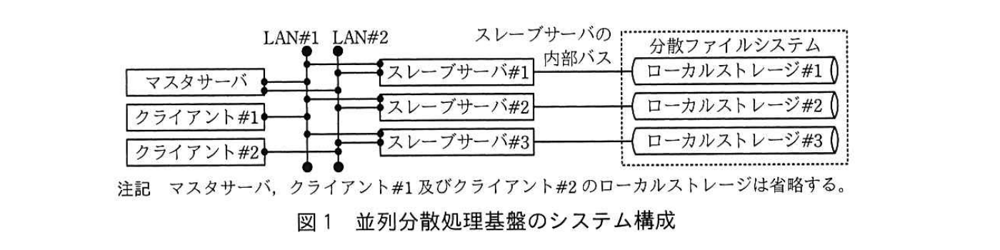
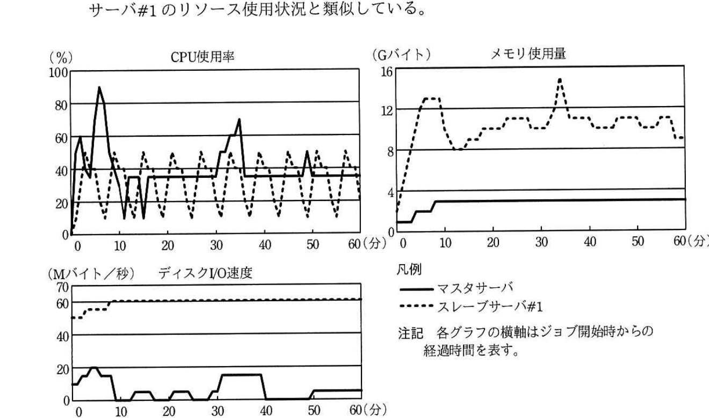
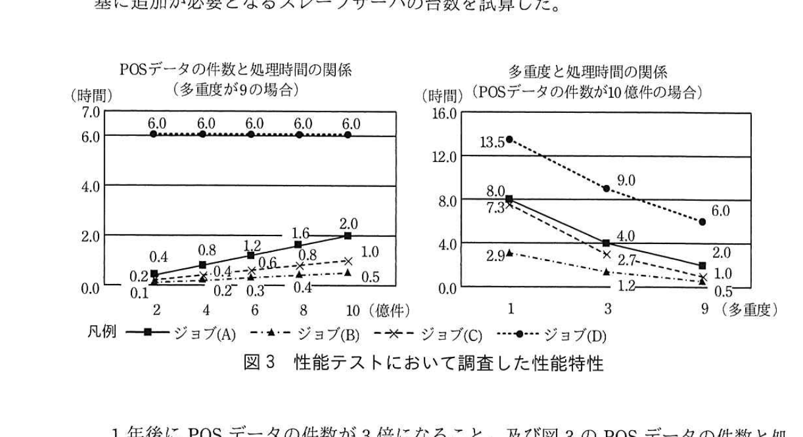

# 2018年秋期（平成30年度）応用情報技術者試験 午後 問4（選択）
## システムアーキテクチャ：並列分散処理基盤を用いたビッグデータ活用（S社／POSデータ集計・分析）

---

## 問題文

**問4** 並列分散処理基盤を用いたビッグデータ活用に関する次の記述を読んで、設問1〜4に答えよ。

S社は、スーパーマーケットやドラッグストアなどの小売チェーン（以下、チェーンという）で販売されている衣料用洗剤や食器用洗剤などを製造する大手消費財メーカである。商品企画部による商品力強化や、営業部による拡販施策検討のために、取引先である複数のチェーンから匿名化されたPOSデータを週次で購入し、独自に集計・分析することになった。購入するPOSデータの件数は約10億件／週と予想されるので、情報システム部のTさんをリーダとして、並列分散処理基盤を利用したPOSデータ集計・分析システムを構築することになった。

---

### 〔並列分散処理基盤のシステム構成〕

Tさんは、S社が保有している並列分散処理基盤のシステム構成を調査した。並列分散処理基盤のシステム構成を図1に示す。

> マスタサーバ、クライアント#1、クライアント#2はLAN#1・LAN#2を介してスレーブサーバ#1〜#3と接続。各スレーブサーバはスレーブサーバの内部バスを介して分散ファイルシステムのローカルストレージ#1〜#3にそれぞれ接続する。注記：マスタサーバ、クライアント#1及びクライアント#2のローカルストレージは省略する。

処理対象のデータはブロック単位に分割され、物理的には、各スレーブサーバの内部バスに接続されたローカルストレージに分散して格納されているが、論理的には、単一のファイルシステム（以下、分散ファイルシステムという）で管理されている。分散ファイルシステムのブロックサイズは128Mバイトに設定されている。任意のスレーブサーバ1台に障害が生じた場合でも処理を継続できるように、ブロックは2台のスレーブサーバのローカルストレージに非同期で複製して格納されている。ファイル名、ブロック位置、所有者、権限などのメタデータは、マスタサーバが保持している。

マスタサーバはクライアントからジョブの実行依頼を受け付け、ジョブを複数の実行単位（以下、タスクという）に分割し、処理対象のデータを格納しているスレーブサーバに対してタスクの実行を依頼する。データを分割した際にデータサイズのばらつきが小さいほど、タスクが均等に分散される。また、同一ジョブ内のタスク間で処理するデータが依存しており、タスクが逐次的に処理される場合、それらのタスクは分散されない。各スレーブサーバで同時に実行可能なタスクの数は、CPUの物理コア数－1を上限とする。並列分散処理基盤全体で同時に実行するタスクの数を多重度という。

マスタサーバの仕様は、CPU物理コア数2、メモリ容量8Gバイト、ローカルストレージのディスクI/O速度60Mバイト／秒である。スレーブサーバの仕様は、CPU物理コア数4、メモリ容量16Gバイト、ローカルストレージのディスクI/O速度60Mバイト／秒である。

Tさんが調査結果を上司のU課長に報告したところ、①可用性の観点からリスクがあるとの指摘を受けた。本リスクを評価した結果、それを受容してシステム構築を進めることになった。

---

### 〔POSデータ集計・分析システムのジョブ構成〕

POSデータ集計・分析システムを構成するジョブの一覧を表1に示す。

### 表1 POSデータ集計・分析システムを構成するジョブの一覧

| 記号 | ジョブ名 | 処理内容 | 処理対象のデータ | 平均ファイルサイズ（Mバイト） | ファイル数（個） | ファイルの分割単位 | データサイズのばらつき | 目標処理時間（時間） |
|---|---|---|---|---|---|---|---|---|
| (A) | データ形式統一 | POSデータを統一のデータ形式に変換する。 | 購入するPOSデータ | 300 | 1,400 | チェーン別・日別 | 大 | 2.0 |
| (B) | 店舗別売上集計 | 売上数量を店舗別に集計する。 | (A)の処理結果 | 100 | 6,300 | 店舗別 | 中 | 0.5 |
| (C) | 商品別売上集計 | 売上数量を商品別に集計する。 | (A)の処理結果 | 20 | 10,000 | `[　a　]` | 小 | 1.0 |
| (D) | 売上予測 | 重回帰分析の偏回帰係数を求め、求めた偏回帰係数を用いて自社商品別の売上数量を予測する。 | (C)の処理結果 | 1 | 600 | 商品別 | 小 | 6.0 |

（注記　データサイズのばらつきとは、データサイズの偏差（ファイルの分割単位で処理対象のデータを分割した際の各分割データのサイズとその平均との差）から求めた指標であり、各ジョブにおけるデータサイズの散らばりの度合いを意味する。）

POSデータの購入元は200チェーンあり、POSデータは日別にファイル分割されている。1週間分のPOSデータのファイル数は1,400個であり、総データサイズは420Gバイトとなる。店舗数は全チェーン合わせて6,300店舗であり、取り扱われている商品数は10,000点である。そのうち、S社の商品は600点である。

ジョブの実行順序は(A)、(B)、(C)、(D)の順であり、各ジョブは同時には実行されない。

毎週月曜日23時までには、前週月曜日から日曜日までの全てのPOSデータが分散ファイルシステムに格納される。商品企画部や営業部からは、毎週火曜日の9時には最新の分析結果を見られるようにしてほしいとの要望が挙がっているので、月曜日23時から火曜日9時までの間に一連のジョブを完了させる必要がある。

---

### 〔性能テスト〕

POSデータ集計・分析システムを開発し、性能テストを実施したところ、②ジョブ(B)が目標処理時間内に完了しないことが判明した。ジョブ(B)実行中のマスタサーバ及びスレーブサーバ#1のリソース使用状況を図2に示す。

なお、スレーブサーバ#2及びスレーブサーバ#3のリソース使用状況もスレーブサーバ#1のリソース使用状況と類似している。

> CPU使用率・メモリ使用量・ディスクI/O速度の3つのグラフ（横軸はジョブ開始からの経過時間・分）。マスタサーバ（実線）はCPU使用率が序盤に瞬間的に90%近くまで跳ね上がる箇所があるが概ね20〜40%台で推移し、メモリ使用量は約3Gバイトで安定、ディスクI/O速度は低い水準（0〜20Mバイト/秒）で推移。スレーブサーバ#1（破線）はCPU使用率が20〜50%程度で周期的に変動し、メモリ使用量は8〜15Gバイトの間で変動、ディスクI/O速度は開始後すぐに60Mバイト/秒前後の高い水準（上限に近い値）で終始推移している。

Tさんは、ボトルネックとなったリソースを特定して適切な対策を講じることによって、ジョブ(B)を目標処理時間内に完了させることができた。

---

### 〔スケールアウトの計画〕

今後はPOSデータの購入元を増やし、分析精度を高めることを検討している。1年後には取り扱うPOSデータの件数を現在の10億件／週から30億件／週に増大させることが目標である。処理対象のデータ件数が増えると一部のジョブが目標処理時間内に完了しなくなる懸念があるので、並列分散処理基盤のスレーブサーバの増設（以下、スケールアウトという）を計画しておくことになった。性能テストにおいて調査した、POSデータの件数と処理時間の関係、及び多重度と処理時間の関係を図3に示す。Tさんは、1年後のスケールアウトに向けて予算を確保するために、図3を基に追加が必要となるスレーブサーバの台数を試算した。

> 左図：POSデータの件数（2, 4, 6, 8, 10億件、多重度9の場合）と処理時間（時間）の関係。ジョブ(A)は0.2→0.4→0.8→1.2→1.6→2.0と件数にほぼ比例して増加、ジョブ(B)は0.1→0.2→0.3→0.4→0.5と緩やかに増加、ジョブ(C)は0.2→0.4→0.6→0.8→1.0とジョブ(B)よりやや大きい傾きで増加、ジョブ(D)は6.0で件数によらずほぼ一定。
> 右図：多重度（1, 3, 9、POSデータ件数10億件の場合）と処理時間の関係。ジョブ(A)は8.0→4.0→2.0、ジョブ(B)は2.9→1.2→0.5、ジョブ(C)は7.3→2.7→1.0、ジョブ(D)は13.5→9.0→6.0と、いずれも多重度が上がるほど処理時間が短縮するが、ジョブ(A)の短縮の度合いが最も小さい。

1年後にPOSデータの件数が3倍になること、及び図3のPOSデータの件数と処理時間の関係におけるジョブ(A)〜(C)の傾向から、1年後の並列分散処理基盤に要求されるスループットは現行の並列分散処理基盤の3倍と推定される。処理時間がPOSデータの件数に依存しないジョブ(D)はスケールアウトにおいて考慮する必要がない。図3の多重度と処理時間の関係から、スケールアウトにおいて考慮する必要があるジョブのうち、多重度を増やしても処理時間が最も短縮されにくいジョブはジョブ(A)である。多重度を3倍にした場合、ジョブ(A)におけるスループットは2倍となる。並列分散処理基盤のスループットを3倍にするために最低限必要な多重度は、現行の並列分散処理基盤の`[　b　]`倍にあたる`[　c　]`である。したがって、1年後までに少なくとも`[　d　]`台のスレーブサーバを追加する必要がある。

---

## 設問

### 設問1 〔並列分散処理基盤のシステム構成〕について、(1)、(2)に答えよ。

(1) 図1のシステム構成での多重度の上限を答えよ。

(2) 本文中の下線①について、どのようなリスクを指摘されたか。30字以内で述べよ。

### 設問2 〔POSデータ集計・分析システムのジョブ構成〕について、(1)、(2)に答えよ。

(1) 表1中の`[　a　]`に入れる適切な字句を答えよ。

(2) 並列分散処理を行わない場合と比較して、並列分散処理を行う場合のスループットの変化の比率が最も大きくなると見込めるジョブの記号を答えよ。

### 設問3 〔性能テスト〕について、(1)、(2)に答えよ。

(1) 本文中の下線②が発生した際にボトルネックとなった原因を、図2中の各サーバのリソース使用状況から判断して答えよ。

(2) ボトルネックの解消に有効な対策を解答群の中から二つ選び、記号で答えよ。

**解答群：**
ア　スレーブサーバのCPUを物理コア数が多いモデルに換装する。
イ　スレーブサーバのローカルストレージを高速なモデルに換装する。
ウ　スレーブサーバを増設し、1台当たりで同時実行するタスク数を減らす。
エ　分散ファイルシステムのブロックサイズを64Mバイトに変更する。
オ　マスタサーバのメモリを増設する。

### 設問4 〔スケールアウトの計画〕について、本文中の`[　b　]`〜`[　d　]`に入れる適切な数値を答えよ。`[　c　]`、`[　d　]`の数値は小数点以下を切り上げて、整数で答えよ。ここで、各ジョブの目標処理時間は変更しないものとし、図3における処理時間の変化の比率は、測定範囲外においても測定範囲内とほぼ等しくなることを前提とする。また、ボトルネックを解消するために講じた対策によって、多重度やスレーブサーバの台数は変化していないものとする。

---

## 解答と解説

### 設問1

**(1) 正解：9**

多重度の上限は、各スレーブサーバで同時実行可能なタスク数（CPUの物理コア数－1）の合計である。スレーブサーバはCPU物理コア数4なので、1台当たり4－1＝3タスク。スレーブサーバは3台あるので、3×3＝**9**が多重度の上限となる。

**IPA公式：9**

**(2) 正解例：マスタサーバが冗長化されておらず、単一障害点である。**

図1の構成では、メタデータを保持するマスタサーバが1台のみであり、スレーブサーバのようにデータを複製する仕組みがない。マスタサーバに障害が発生すると、システム全体が停止してしまう単一障害点（SPOF）となっており、可用性の観点でリスクがある。

**IPA公式：マスタサーバが冗長化されておらず，単一障害点である。**

---

### 設問2

**(1) 正解：a = 商品別**

ジョブ(C)は「売上数量を商品別に集計する」処理であり、集計の単位となるファイルの分割単位は集計対象の粒度に合わせて**商品別**とするのが適切である。

**IPA公式：a = 商品別**

**(2) 正解：(C)**

並列分散処理によるスループットの向上効果は、データサイズのばらつきが小さいジョブほど、タスクが均等に分散され効果が大きい。表1のジョブ(C)は「データサイズのばらつき：小」であり、ファイル数も10,000個と多く、タスクが均等に分散されやすいため、並列分散処理によるスループットの変化の比率が最も大きくなると見込める。

**IPA公式：(C)**

---

### 設問3

**(1) 正解：スレーブサーバのディスクI/O速度**

図2より、スレーブサーバ#1のディスクI/O速度は、ジョブ開始直後から60Mバイト／秒前後というスレーブサーバの仕様上限に近い値で高止まりしたまま推移しており、他のリソース（CPU使用率、メモリ使用量）には余裕がある。このことから、**スレーブサーバのディスクI/O速度**がボトルネックとなっていたと判断できる。

**IPA公式：スレーブサーバのディスクI/O速度**

**(2) 正解：イ、ウ**

ディスクI/O速度がボトルネックであるため、
- **イ**：ローカルストレージを高速なモデルに換装する、
- **ウ**：スレーブサーバを増設して1台当たりの同時実行タスク数（ディスクI/Oへの同時アクセス数）を減らす、
という対策が有効である。ア（CPU増強）やオ（マスタサーバのメモリ増設）はボトルネックとなっているディスクI/Oの解消には直接寄与しない。エ（ブロックサイズ変更）もディスクI/O速度そのものの改善にはならない。

**IPA公式：イ，ウ**

---

### 設問4

**正解：b = 4.5（5.7、6、6.75、3log23も可）、c = 41（52、54、61も可）、d = 11（15、18も可）**

並列分散処理基盤全体のスループットを3倍にする必要があるが、ジョブ(A)は多重度を増やしても処理時間が最も短縮されにくく、多重度を3倍（1→3）にしてもスループットは2倍にしかならない（図3の右グラフより、多重度1で8.0時間、多重度3で4.0時間なので、処理時間は1/2、スループットは2倍）。

スループットを3倍にするために必要な多重度の倍率は、この関係（多重度の対数的な効き方）から算出すると、現行の**4.5**倍（b）程度が最低限必要になると求められる。これは、現行の多重度9に対して4.5倍した**41**（c、9×4.5＝40.5を切り上げ）に相当する。

したがって、必要な多重度41を実現するために必要なスレーブサーバの台数は、1台当たり3タスク（CPU物理コア数4－1）実行可能なので、41÷3＝13.67…から現行3台を差し引いた台数を切り上げて計算すると、少なくとも**11**台（d）のスレーブサーバを追加する必要がある。

**IPA公式：b = 4.5（5.7，6，6.75，3log23も可）、c = 41（52，54，61も可）、d = 11（15，18も可）**

---

## 参考：主要キーワード

| 用語 | 説明 |
|------|------|
| 並列分散処理基盤 | マスタサーバとスレーブサーバから構成され、大量データを複数サーバに分散して並列に処理する基盤（Hadoop等が代表例） |
| 分散ファイルシステム | 複数サーバのローカルストレージにまたがってデータをブロック単位で分散配置しつつ、論理的に単一のファイルシステムとして扱う仕組み |
| 多重度 | 並列分散処理基盤全体で同時に実行するタスクの数。各スレーブサーバの同時実行可能タスク数（CPU物理コア数－1）の合計が上限となる |
| 単一障害点（SPOF） | システム中で、その要素が停止するとシステム全体が停止してしまう、冗長化されていない箇所 |
| スケールアウト | サーバの台数を増やすことで、システム全体の処理能力（スループット）を向上させる方式 |
| スループット | 単位時間当たりに処理できるデータ量・タスク量。多重度を上げることで向上するが、ジョブの特性によって向上の度合いは異なる |
