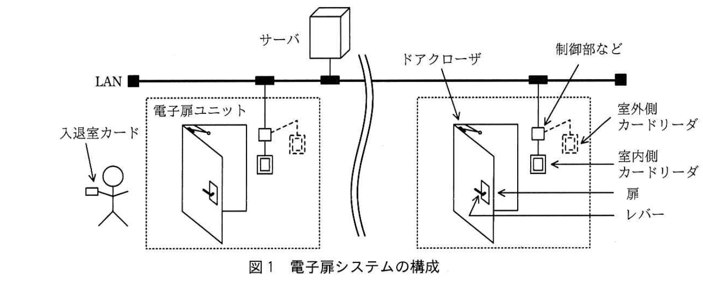
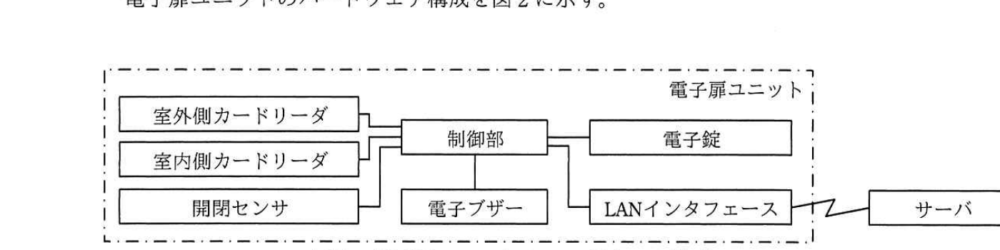
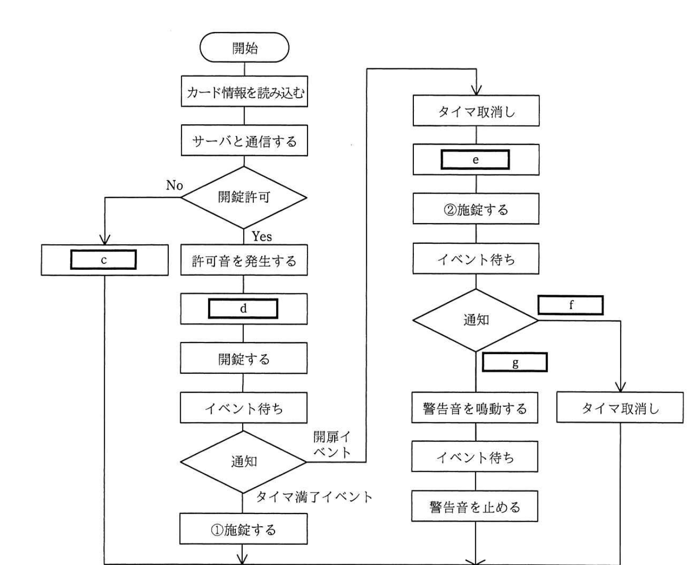

# 2018年秋期（平成30年度）応用情報技術者試験 午後 問7（選択）
## 組込みシステム開発：カードを使用した電子扉システムの設計（E社）

---

## 問題文

**問7** カードを使用した電子扉システムの設計に関する次の記述を読んで、設問1〜3に答えよ。

E社は、電子錠を開発している会社である。E社では、RFIDタグを内蔵したカード（以下、入退室カードという）を使用して、扉の電子錠を制御するシステム（以下、電子扉システムという）を開発することになった。

電子扉システムは企業向けであり、従業員ごとに個別の入退室カードを配布して、従業員の入退室管理に用いる。

---

### 〔電子扉システムの構成〕

電子扉システムは、扉、カードリーダ、制御部などから成る電子扉ユニットと、各電子扉ユニットとLANで接続されたサーバから構成される。電子扉システムの構成を図1に示す。

- ドアクローザは、扉の上部に有り、内蔵するばねの力で扉を自動的に閉める。
- レバーは扉の室内側と室外側に有り、電子錠で開錠／施錠される。開錠状態では、レバーを下に回して扉を開けることができ、手を放すとレバーは元に戻り扉は閉まる。施錠状態では、扉は開けられない。また、扉を開けたまま施錠することができ、このときには扉が閉まると扉を開けることができなくなる。
- カードリーダは、室内側と室外側に取り付けられている。
- 電子扉ユニットには、扉識別コードが設定されている。

> LANにサーバと複数の電子扉ユニットが接続される。各電子扉ユニット（点線枠）は、扉・ドアクローザ・レバー・室内側カードリーダ・室外側カードリーダ・制御部などから成る。入退室者は入退室カードを室外側（又は室内側）カードリーダにかざして扉を開閉する。

---

### 〔電子扉ユニットのハードウェア構成〕

電子扉ユニットのハードウェア構成を図2に示す。

> 電子扉ユニット内部で、室外側カードリーダ・室内側カードリーダ・開閉センサが制御部に接続され、制御部は電子ブザー、電子錠、LANインタフェースにも接続される。LANインタフェースはLANを介してサーバと通信する。

- 扉識別コードは、電子扉ユニットごとに割り当てられ、制御部が保持する。
- 入退室カードには、カードごとに割り当てられたカード識別コード、有効期限などの情報を格納する。
- 制御部は、MPUを内蔵しており、各ハードウェアを制御する。
- カードリーダは、室内側及び室外側に1台ずつ設置し、室内側を示すコードと、室外側を示すコード（以下、リーダ設置区分コードという）をそれぞれ割り当てる。カードリーダは、入退室カードの情報を読み込む。
- 開閉センサは、扉が開いたこと及び扉が閉まったことを検出する。
- 電子ブザーは、単発音の許可音・エラー音を発生したり、連続音の警告音を鳴動したりする。
- 電子錠は扉のレバーを開錠／施錠する。
- LANインタフェースは、LANに接続してサーバと通信する。

---

### 〔電子扉システムの動作〕

(1) 入退室カードをカードリーダにかざすと、入退室カードの情報を読み込み、電子扉ユニットの情報とあわせてサーバに送信する。

(2) サーバからの応答が開錠許可なら、許可音を発生して開錠する。開錠してからt₁秒以内に扉が開かないときは施錠する。

(3) サーバからの応答が開錠許可でないとき、エラー音を発生する。

(4) 扉が開いてから、t₂秒以内に扉が閉まらないとき、扉が閉まるまで警告音を鳴動し続ける。

t₁及びt₂は、必要に応じて変更が可能で、t₂＞t₁＞1秒とする。

---

### 〔制御部とサーバ間の通信〕

サーバは、入退室可能な入退室カードの保有者の情報を扉ごとに管理する。

(1) 制御部は、カードリーダで入退室カードの情報を読み込んだとき、`[　a　]`、`[　b　]`及びリーダ設置区分コードをサーバに送信する。

(2) サーバは、`[　a　]`で入退室カードの保有者を特定し、`[　b　]`で入退室する扉を特定し、リーダ設置区分コードで入室又は退室を識別する。これらの情報から、入退室カードの保有者が入退室を許可されているか判定して、判定結果を制御部に送信する。

---

### 〔制御部のプログラムの処理〕

制御部のプログラムの処理フローを図3に示す。この処理は、室内側又は室外側のカードリーダに入退室カードをかざすと開始される。また、この処理の間に新たに入退室カードがかざされても、終了するまで処理を続行する。

- タイマは、OSのタイマ機能を使用する。タイマに時間を設定すると計時が始まり、設定した時間が経過するとタイマ満了イベントが通知される。タイマが満了する前にタイマ取消しを行うと、タイマ満了イベントは通知されない。
- 開閉センサは扉が開いたときに開扉イベントを通知し、扉が閉まったときに閉扉イベントを通知する。
- 処理"カード情報を読み込む"では、入退室カードの情報を読み込む。
- 処理"イベント待ち"では、開扉イベント、閉扉イベント、及びタイマ満了イベントを待ち受ける。
- 処理"開錠する"及び処理"施錠する"では、制御部が電子錠に開錠又は施錠を通知する。その通知から実際に電子錠が開錠／施錠するのに1秒掛かり、その間、次の処理は行わない。

> 開始→カード情報を読み込む→サーバと通信する→（開錠許可の判定）No側は`[　c　]`へ、Yes側は許可音を発生する→`[　d　]`→開錠する→イベント待ち→（通知の判定）開扉イベント側は右側フローへ、タイマ満了イベント側は「①施錠する」へ進み終了。右側フロー：タイマ取消し→`[　e　]`→②施錠する→イベント待ち→（通知の判定）`[　f　]`側はタイマ取消しへ進み終了、`[　g　]`側は警告音を鳴動する→イベント待ち→警告音を止める→終了。

---

### 〔不具合の発生〕

電子扉システムの動作をテストしていたところ、扉を開けたままt₂秒経過しても警告音が鳴動しない不具合が、図3の"①施錠する"を処理した後に発生した。

なお、不具合が発生したときに、入退室カードの情報は正しく読み込まれており、LAN及びサーバに問題はなく、ハードウェア及びソフトウェアは通常の処理をしていた。

---

## 設問

### 設問1 〔制御部とサーバ間の通信〕について、本文中の`[　a　]`、`[　b　]`に入れる適切な字句を、本文中の字句を用いて答えよ。

### 設問2 〔制御部のプログラムの処理〕について、(1)〜(3)に答えよ。

(1) 図3中の`[　c　]`に入れる適切な処理を、本文中の字句を用いて答えよ。

(2) 図3中の`[　d　]`、`[　e　]`に入れる適切な処理を、解答群の中から選び、記号で答えよ。

**解答群：**
ア　イベント待ち　　イ　開錠する　　ウ　施錠する
エ　タイマ取消し　　オ　タイマにt₁秒を設定する　　カ　タイマにt₂秒を設定する

(3) 図3中の`[　f　]`、`[　g　]`に入れる適切なイベントを、本文中の字句を用いて答えよ。

### 設問3 〔不具合の発生〕について、不具合が発生する条件を35字以内で述べよ。

---

## 解答と解説

### 設問1

**正解：a = カード識別コード、b = 扉識別コード**

サーバは入退室カードの保有者を扉ごとに管理しているため、制御部から送信すべき情報は、カードの保有者を特定する**カード識別コード**（a）と、対象の扉を特定する**扉識別コード**（b）である。

**IPA公式：a = カード識別コード、b = 扉識別コード**

---

### 設問2

**(1) 正解：c = エラー音を発生する**

〔電子扉システムの動作〕(3)に「サーバからの応答が開錠許可でないとき、エラー音を発生する」とあるので、開錠許可がNoの場合の処理は**エラー音を発生する**である。

**IPA公式：c = エラー音を発生する**

**(2) 正解：d = オ（タイマにt₁秒を設定する）、e = カ（タイマにt₂秒を設定する）**

〔電子扉システムの動作〕(2)より、開錠してからt₁秒以内に扉が開かないときは施錠するとあるため、開錠する前に**タイマにt₁秒を設定する**（オ）必要がある。また、(4)より、扉が開いてからt₂秒以内に扉が閉まらないとき警告音を鳴動するとあるため、施錠する前（開扉イベント後、施錠前）に**タイマにt₂秒を設定する**（カ）必要がある。

**IPA公式：d = オ、e = カ**

**(3) 正解：f = 閉扉イベント、g = タイマ満了イベント**

右側フローの「通知」分岐では、扉が閉まった場合はそのまま終了（タイマ取消しへ）し、閉まらないままタイマが満了した場合は警告音を鳴動する。したがって、扉が閉じたことを示す**閉扉イベント**（f）を受けた場合はタイマ取消しへ、時間切れを示す**タイマ満了イベント**（g）を受けた場合は警告音を鳴動する、という分岐になる。

**IPA公式：f = 閉扉、g = タイマ満了**

---

### 設問3

**正解例："①施錠する"処理中に扉を開き、そのままt₂秒経過したとき。**

図3の"①施錠する"処理は、電子錠への通知から実際に施錠されるまで1秒掛かり、その間は次の処理を行わない仕様である。この施錠処理の実行中（次の処理を受け付けない1秒間）に扉が開けられてしまうと、開扉イベントの検知やタイマ設定（e：タイマにt₂秒を設定する）が行われないまま扉が開いた状態になり、t₂秒が経過しても警告音を鳴動する処理に入れない。

**IPA公式："①施錠する"処理中に扉を開き，そのまま t2 秒経過したとき。**

---

## 参考：主要キーワード

| 用語 | 説明 |
|------|------|
| RFIDタグ | 電波を用いて非接触でID情報を読み取る技術。入退室カードなどの個体識別に利用される |
| 扉識別コード・カード識別コード | 電子扉ユニット（扉）とカードをそれぞれ一意に識別するコード。サーバでの入退室許可判定に用いられる |
| イベント駆動処理 | 開扉・閉扉・タイマ満了などのイベントの発生を待ち受け、イベントに応じて処理を分岐させるプログラム構造 |
| OSのタイマ機能 | 指定時間の経過を検知し、タイマ満了イベントを通知する機能。タイマ満了前に取り消すことも可能 |
| 排他的な処理区間 | 電子錠の開錠／施錠通知から実際の動作完了までの間、次の処理を受け付けない区間。この間に生じる状態変化（扉が開く等）を考慮しないと不具合の原因になる |
