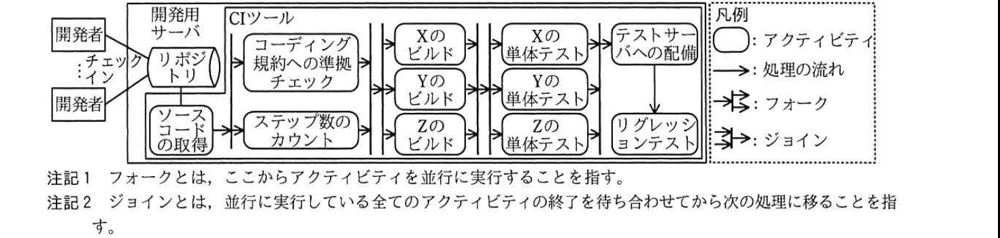

# 2018年秋期（平成30年度）応用情報技術者試験 午後 問8（選択）
## 情報システム開発：継続的インテグレーション（C社／フリマサービス）

---

## 問題文

**問8** 継続的インテグレーションに関する次の記述を読んで、設問1〜4に答えよ。

C社は、会員間で物品の売買ができるサービス（以下、フリマサービスという）を提供する会社である。出品したい商品の写真をスマートフォンやタブレットで撮影して簡単に出品できることが人気を呼び、C社のフリマサービスには、約1,000万人の会員が登録している。

C社には、サービス部と開発部がある。サービス部では、フリマサービスに関する会員からの問合せ・クレーム・改善要望の対応を行っている。開発部は、フリマサービスを利用するためのスマートフォン用アプリケーション（以下、Xという）、タブレット用アプリケーション（以下、Yという）、及びサーバ側アプリケーション（以下、Zという）について、開発から運用までを担当している。

競合のW社が新機能を次々にリリースして会員数を増加させていることを受け、C社でも新機能を早くリリースすることを目的に、開発プロセスの改善を行うことになった。開発プロセスの改善は、開発部のD君が担当することになった。

---

### 〔課題のヒアリング〕

D君は、開発部とサービス部に現状の開発プロセスの課題をヒアリングした。

**開発部：** リリースするたびに、追加・変更した機能とは直接関係しない既存機能で障害が発生しており、会員からクレームが多数出ている。機能追加・機能変更に伴い、設計工程では既存機能に対する影響調査を、テスト工程ではテストの強化を行っている。しかし、①既存機能に対する影響調査とテストを網羅的に行うことは、限られた工数では難しい。

**サービス部：** 会員からのクレームや改善要望は日々記録しているが、現在の開発サイクルでは改善要望の対応に最大6か月掛かる。改善要望をまとめて大規模に機能追加する開発方法から、短いサイクルで段階的に機能追加する開発方法に変更してほしい。

---

### 〔継続的インテグレーションの導入〕

D君は、既存機能に対するテストを含めたテストの効率向上及び段階的な機能追加を実現するために、フリマサービスの開発プロジェクトに継続的インテグレーション（以下、CIという）を導入することにした。CIとは、開発者がソースコードの変更を頻繁にリポジトリに登録（以下、チェックインという）して、ビルドとテストを定期的に実行する手法であり、`[　a　]`に採用されている。CIの主な目的は`[　b　]`、`[　c　]`、及びリリースまでの時間の短縮である。

D君は、開発用サーバにリポジトリとCIツールをインストールし、図1に記載のワークフローとアクティビティを設定した。D君が設定したワークフローでは、リポジトリからソースコードを取得し、コーディング規約への準拠チェックとステップ数のカウントの後に、各アプリケーションのビルドと追加・変更箇所に対する単体テストを行い、テストサーバへ配備して、全アプリケーションを対象とするリグレッションテストを実行する。

またD君は、このワークフローを2時間ごとに実行するように設定し、各アクティビティの実行結果は正常・異常にかかわらずX、Y、Zの担当チームメンバ全員に電子メール（以下、メールという）で送信するように設定した。

なお、ワークフロー内のアクティビティは、前のアクティビティが全て正常終了した場合だけ、次のアクティビティが実行できるようにした。



> 開発者がチェックインしたソースコードは開発用サーバのリポジトリに登録される。CIツールは、リポジトリからのソースコード取得後、コーディング規約への準拠チェックとステップ数のカウントを実行（フォーク・並行実行）し、両方が正常終了後（ジョイン）、X・Y・Zそれぞれのビルドを並行実行、続いてX・Y・Zそれぞれの単体テストを並行実行し、全て正常終了後（ジョイン）にテストサーバへの配備を行い、最後にリグレッションテストを実行する。凡例：フォークは並行実行の開始、ジョインは並行実行した全アクティビティの終了待ち合わせ。

---

### 〔テストプログラムの作成〕

D君は、単体テストで利用するテストプログラムを作成した。テスト対象のプログラムとテストプログラムの例を図2に示す。テスト対象のプログラムであるcheckTimeは、時と分を示す二つの整数値を引数hourとminで受け取り、hourが0以上24未満の値かつminが0以上60未満の値であったらtrueを返し、それ以外の値であったらfalseを返すプログラムである。一方、テストプログラムであるtest_checkTimeは、境界値テストの考え方に基づき、6種類の境界値に対してそれぞれcheckTimeを呼び出し、全ての呼出しで仕様どおりの値を返したらtrueを、それ以外ならfalseを返すプログラムである。

また、D君はこれまで手作業で行っていたリグレッションテストについてもCIツールで自動実行できるように、テストプログラムを作成した。

なお、新機能のリリース後には、新機能の単体テストで用いたテストプログラムは、リグレッションテストのテストプログラムとして再利用することにした。

```
図2 テスト対象のプログラムとテストプログラムの例

//テスト対象のプログラム
function checkTime(hour, min)
  if(hour が 0よりも小さい 又は 24以上)
    return false
  else if(min が 0よりも小さい 又は 60以上)
    return false
  end if
  return true
end function

//テストプログラム
function test_checkTime()
  if(checkTime(-1, 0)が false と等しい かつ
     checkTime(24, 0)が [　d　] と等しい かつ
     checkTime(0, -1)が false と等しい かつ
     checkTime(0, 60)が false と等しい かつ
     checkTime(0, 0)が true と等しい かつ
     checkTime(23, 59)が true と等しい)
    return true
  end if
  return false
end function
```

---

### 〔CIの試行〕

次にD君は、フリマサービスのアプリケーションの全てのソースコードをリポジトリに移行し、CIの試行を開始した。試行開始から1か月後、D君の設定したCIツールは問題なく動作していたが、開発部のメンバから次の3点を指摘された。

**指摘1：** 一つの要求を実現するために必要なソースコードの変更は多岐にわたるので、チェックインは1週間に1回程度行っている。ワークフローは2時間ごとに動作するように設定されているが、1週間に1度で十分である。

**指摘2：** Yの単体テストでエラーが検出されていたが、CIツールから送信されるメールが非常に多く、Yを担当するチームはエラーに気付かず、1日放置されていた。②開発者がエラーに気付くように、CIツールから送信されるメールを限定してほしい。

**指摘3：** Xのビルドでエラーが検出され、単体テストまでワークフローが流れないことが多い。このため、Zを担当するチームでは、開発者の開発PC上でCIツールと同じテストケースを実行しており、③CIの導入効果が出ていない。

D君は、この3点の指摘について必要な対策を実施するとともに、要件定義から設計までのプロセスの見直しも行い、フリマサービスの開発プロジェクトにCIを適用した。その結果、段階的な機能追加を実現させ、新機能のリリースサイクルを短縮した。

---

## 設問

### 設問1 本文中の`[　a　]`〜`[　c　]`に入れる適切な字句を解答群の中から選び、記号で答えよ。

**解答群：**
ア　ウォータフォールモデル　　イ　エクストリームプログラミング
ウ　設計の曖昧性の排除　　エ　ソフトウェア品質の向上
オ　バグの早期発見　　カ　プロトタイピングモデル
キ　網羅的なテストケースの作成　　ク　要件定義と設計の期間短縮

### 設問2 本文中の下線①について、(1)、(2)に答えよ。

(1) 既存機能に対するテストを行うために必要なCIツールのアクティビティを、図1中の字句を用いて答えよ。

(2) 既存機能に対するテストについて、設定したテストケース数の妥当性を評価するために考慮すべき値を解答群の中から選び、記号で答えよ。

**解答群：**
ア　各アプリケーションのステップ数　　イ　設計書の変更ページ数
ウ　対応する改善要望数　　エ　追加機能のステップ数

### 設問3 図2中の`[　d　]`に入れる適切な字句を答えよ。

### 設問4 〔CIの試行〕について、(1)〜(3)に答えよ。

(1) 本文中の指摘1について、指摘者に対するアドバイスとして、誤っているものを解答群の中から選び、記号で答えよ。

**解答群：**
ア　改善要望に対応したソースコードから随時チェックインする。
イ　一つの要求を細かな要求に細分化して開発する。
ウ　プログラムを小さな機能単位に分割して開発する。
エ　変更中のソースコードでもよいので随時チェックインする。

(2) 本文中の下線②について、CIツールから送信されるメールを限定する方法を、正常時のメールの送信を停止する以外に35字以内で述べよ。

(3) 本文中の下線③について、CIツールのワークフローをどのように修正するとよいか。40字以内で述べよ。

---

## 解答と解説

### 設問1

**正解：a = イ（エクストリームプログラミング）、b = エ（ソフトウェア品質の向上）、c = オ（バグの早期発見）（b、cは順不同）**

CI（継続的インテグレーション）は、頻繁なチェックインとビルド・テストの自動実行を特徴とするアジャイル開発手法である**エクストリームプログラミング**（イ）で採用されているプラクティスの一つである。CIの主な目的は、頻繁にテストを実行することによる**ソフトウェア品質の向上**（エ）と**バグの早期発見**（オ）、及びリリースまでの時間の短縮である。

**IPA公式：a = イ、b・c = エ，オ（順不同）**

---

### 設問2

**(1) 正解：リグレッションテスト**

既存機能に影響がないことを確認するテストは、図1中の**リグレッションテスト**である。

**IPA公式：リグレッションテスト**

**(2) 正解：ア（各アプリケーションのステップ数）**

既存機能に対するテストケース数の妥当性は、テスト対象となるプログラムの規模（コード量）に対して十分なテストケースが用意されているかで評価すべきであり、これは**各アプリケーションのステップ数**を基準に考慮する。

**IPA公式：ア**

---

### 設問3

**正解：d = false**

checkTimeの仕様では、hourが24以上の場合はfalseを返す。境界値テストとして、hourの上限値の境界であるhour=24は仕様の範囲外（0以上24"未満"）であるため、checkTime(24, 0)は**false**を返すのが正しい仕様である。

**IPA公式：d = false**

---

### 設問4

**(1) 正解：エ（変更中のソースコードでもよいので随時チェックインする。）**

指摘1は、1つの要求の変更が多岐にわたるためチェックインが週1回程度になっているという内容である。これに対する適切なアドバイスは、要求を細分化し（イ）、機能単位に分割して開発し（ウ）、完成した単位から随時チェックインする（ア）ことである。一方、**エ**の「変更中の（未完成の）ソースコードでもよいので随時チェックインする」は、ビルドやテストが失敗する不完全なコードを頻繁に登録することになり、CIの前提（正しく動作する単位でのチェックイン）に反するため、誤ったアドバイスである。

**IPA公式：エ**

**(2) 正解例：各アプリケーションの担当チームにだけメールするようにする。**

現状は全アクティビティの実行結果をX、Y、Zの担当チームメンバ全員に送信しているため、自分に関係のないメールも大量に届き、必要な情報が埋もれてしまう。**各アプリケーションの担当チームにだけメールするようにする**ことで、開発者は自分が担当するアプリケーションのエラーにすぐ気付けるようになる。

**IPA公式：各アプリケーションの担当チームにだけメールするようにする。**

**(3) 正解例：各アプリケーションのビルド終了後、待ち合わせせず単体テストに移る。**

現状のワークフローでは、X・Y・Zのビルドが全て正常終了する（ジョイン）まで単体テストに進めない設定になっている。Xのビルドでエラーが出るとYやZが正常でも単体テストに進めず、Zのチームが独自にテストを実施する事態を招いている。**各アプリケーションのビルド終了後、待ち合わせせず単体テストに移る**ようにワークフローを修正すれば、Xのビルドエラーに関係なくYやZは単体テストまで自動的に進められる。

**IPA公式：各アプリケーションのビルド終了後，待ち合わせせず単体テストに移る。**

---

## 参考：主要キーワード

| 用語 | 説明 |
|------|------|
| 継続的インテグレーション（CI） | 開発者が頻繁にソースコードをリポジトリにチェックインし、ビルドとテストを自動的・定期的に実行する開発手法 |
| エクストリームプログラミング（XP） | 頻繁なリリース、ペアプログラミング、テスト駆動開発、継続的インテグレーションなどを特徴とするアジャイル開発手法の一つ |
| 境界値テスト | 入力値の有効範囲の境界（最小値、最大値、その前後）に着目してテストケースを設計する技法 |
| リグレッションテスト（回帰テスト） | プログラムの変更が既存機能に悪影響を及ぼしていないかを確認するためのテスト |
| フォークとジョイン | ワークフローにおいて、フォークは複数の処理を並行実行に分岐させること、ジョインは並行処理全ての終了を待ち合わせて次に進むことを指す |
