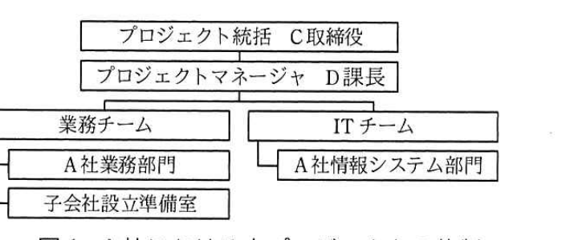
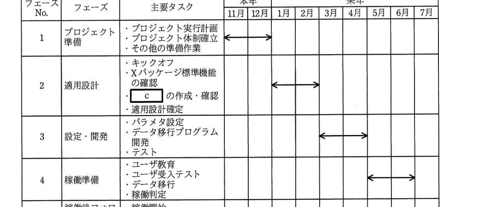

# 2018年秋期（平成30年度）応用情報技術者試験 午後 問9（選択）
## プロジェクトマネジメント：ERPソフトウェアパッケージ導入プロジェクトの計画（A社／B社）

---

## 問題文

**問9** ERPソフトウェアパッケージ導入プロジェクトの計画に関する次の記述を読んで、設問1〜3に答えよ。

A社は中堅の産業機械メーカである。A社では、顧客の機械設備更改の需要が横ばい状態で、好転する兆しも見えないことから、今後大きな成長が期待できるIoT関連事業の拡大に取り組むことにした。そのために、A社の100%子会社としてIoT関連事業に特化したB社を設立することを決定した。

---

### 〔IoT関連事業の中期計画〕

IoT関連事業の中期計画の概要は次のとおりである。

- 製品ラインアップ拡充、M&Aなどを通じて、今後5年間でB社の売上をA社の現在のIoT関連事業の売上の5倍程度の規模までに拡大し、将来の主力事業の一つにする。
- 来年の7月1日のB社の事業開始日に合わせて、B社の基幹業務システム（以下、B社基幹システムという）をA社が構築する。

B社基幹システムを構築するプロジェクト（以下、本プロジェクトという）はA社の取締役会で承認され、A社のIoT関連事業とITを統括するC取締役が本プロジェクトの立上げに着手した。

---

### 〔本プロジェクトの概要〕

**(1) 本プロジェクトの方針**

- B社基幹システムを、B社の事業開始日に合わせて構築する。本プロジェクトの納期を守るために、部門をまたがる意思決定はトップダウンで行う。
- 短期間での構築を実現するために、ERPソフトウェアパッケージを採用する。
- 将来のB社の成長に役立つように、A社のIoT関連事業に詳しい要員を主体とした体制で本プロジェクトを遂行する。

**(2) `[　a　]`の発行**

C取締役は、本プロジェクトを公式に認可する文書として、本プロジェクトの方針を含めた`[　a　]`を発行した。

**(3) 評価指標の設定**

本プロジェクトのKPI（重要業績評価指標）として、納期、コスト、品質などを評価するための指標が設定された。

**(4) 本プロジェクトの体制**

- ①C取締役が、本プロジェクトを統括する。
- A社情報システム部門のD課長が、プロジェクトマネージャとして本プロジェクトの遂行責任を負い、その下に業務チームとITチームを置く。
- A社における本プロジェクトの体制を、図1に示す。

> プロジェクト統括（C取締役）の下にプロジェクトマネージャ（D課長）が置かれ、その下に業務チーム（A社業務部門、子会社設立準備室から構成）とITチーム（A社情報システム部門から構成）の2チームがある。

**(5) ERPソフトウェアパッケージの導入**

- A社は`[　a　]`に基づいて、ERPソフトウェアパッケージに関する`[　b　]`を作成し、ITベンダ5社に提示した。
- `[　b　]`への回答を基に、ITベンダ5社の能力、経験、提案内容、導入期間、価格などを比較した結果、X社製のERPソフトウェアパッケージ（以下、Xパッケージという）を選定することにした。
- A社はXパッケージのライセンスをX社から購入し、導入・適用作業は本プロジェクトの要員が主体となって行う。X社の技術サービス部門では、Xパッケージに関する充実した教育コース、Xパッケージの導入・適用作業の支援サービスを提供している。
- ITチームには、Xパッケージに関する知識はあるが、業務チームには、Xパッケージに関する知識はない。

---

### 〔プロジェクト実行計画の策定〕

D課長は、`[　a　]`に基づいて、プロジェクト実行計画書を作成した。このプロジェクト実行計画書に記載した内容は、次のとおりである。

**(1) スコープ**

- B社基幹システムの対象業務を、会計、購買、生産及び販売物流とする。
- 本プロジェクトの期間が短いことから、Xパッケージの標準機能の利用を前提とする。標準機能を用いた業務のイメージを早期に把握するために、`[　c　]`を作成し、実際に動作させて検証・評価する。
- IoT関連事業の中期計画に基づき、B社基幹システムの稼働後に`[　d　]`を可能にするため、クラウドサービスを利用してXパッケージを運用する。
- 業務プロセスと、Xパッケージの標準機能の間にギャップが存在した場合には、Xパッケージのパラメタ設定を変更する。パラメタ設定の変更で対応できないときは、Xパッケージの標準機能に業務プロセスを合わせる。
- Xパッケージに投入できるデータ形式は、Xパッケージの仕様によって規定されている。このため、A社の基幹業務システムからB社基幹システムへのデータ移行プログラムが必要になる。このデータ移行プログラムは、A社の基幹業務システムからのデータ抽出、Xパッケージに合わせた`[　e　]`、Xパッケージへのデータ投入の3機能から成る。

**(2) スケジュール**

- 本プロジェクトのフェーズ、その主要タスク及びスケジュールを図2に示す。
- プロジェクト開始日は来年の1月1日、稼働開始日は来年の7月1日とする。

> フェーズ1「プロジェクト準備」（本年11月〜12月）：プロジェクト実行計画、プロジェクト体制確立、その他準備作業。フェーズ2「適用設計」（来年1月〜2月）：キックオフ、Xパッケージ標準機能の確認、`[　c　]`の作成・確認、適用設計確定。フェーズ3「設定・開発」（来年3月〜4月）：パラメタ設定、データ移行プログラム開発、テスト。フェーズ4「稼働準備」（来年5月〜6月）：ユーザ教育、ユーザ受入テスト、データ移行、稼働判定。フェーズ5「稼働後フォロー」（来年7月）：稼働開始、プロジェクト終了判定。

---

### 〔プロジェクト実行計画書のレビュー〕

D課長は、プロジェクト実行計画書について、C取締役のレビューを受けた。その結果、B社基幹システムの稼働開始日を厳守するために、スケジュールに関するリスク管理を徹底するようC取締役から指示された。そこで、D課長は、導入において発生しがちなリスクについて、既にXパッケージを導入している他社にヒアリングを行った。D課長は、このヒアリングの結果を踏まえて特定したリスクについて発生確率、追加工期、優先度、リスク対応戦略、及び具体的な対応策を取りまとめ、リスク管理表を作成した。ここでリスク対応戦略は、PMBOKガイド第5版に基づいて分類した。リスク管理表のうち、優先度"高"のものを表1に示す。

### 表1 リスク管理表（抜粋）

| リスクNo. | リスクの内容 | 発生確率 | 追加工期 | 優先度 | リスク対応戦略 | 具体的な対応策 |
|---|---|---|---|---|---|---|
| 1 | 業務チームには、Xパッケージに関する知識がないので、適用設計フェーズが遅延する。 | 50% | 2.0か月 | 高 | 軽減 | ②プロジェクト準備フェーズで実行可能な施策を実施する。 |
| 2 | 関連部門との調整によって、本プロジェクトの意思決定に時間が掛かってしまい、予定どおり検討が進まず、適用設計フェーズが遅延する。 | 40% | 1.0か月 | 高 | 軽減 | 本プロジェクトの意思決定の場にC取締役が参加して、遅れが生じないようにする。 |

表1以外のリスクについては、脅威を全て除去することは困難であり、かつ、発生確率も非常に低いことから、リスク対応戦略は`[　f　]`とした。ただし、表1以外のリスクが発生した場合の対応コストに充てるために、コンティンジェンシ予備を確保することにした。

---

## 設問

### 設問1 〔本プロジェクトの概要〕について、(1)〜(3)に答えよ。

(1) 本文中の`[　a　]`に入れる最も適切な字句を解答群の中から選び、記号で答えよ。

**解答群：**
ア　WBS　　イ　プロジェクト開始資料
ウ　プロジェクト憲章　　エ　プロジェクト評価指標

(2) 本文中の下線①とすることの狙いは何か。35字以内で述べよ。

(3) 本文中の`[　b　]`に入れる適切な字句を、5字以内で答えよ。

### 設問2 〔プロジェクト実行計画の策定〕について、(1)〜(3)に答えよ。

(1) 本文中の`[　c　]`に入れる適切な字句を、10字以内で答えよ。

(2) 本文中の`[　d　]`に入れる、B社基幹システムの稼働後に可能とする事柄を、35字以内で述べよ。

(3) 本文中の`[　e　]`に入れる適切な字句を、10字以内で答えよ。

### 設問3 〔プロジェクト実行計画書のレビュー〕について、(1)、(2)に答えよ。

(1) 表1中の下線②について、実行可能な施策を35字以内で述べよ。

(2) 本文中の`[　f　]`に入れる最も適切な字句を解答群の中から選び、記号で答えよ。

**解答群：**
ア　回避　　イ　活用　　ウ　強化　　エ　共有　　オ　受容　　カ　転嫁

---

## 解答と解説

### 設問1

**(1) 正解：ウ（プロジェクト憲章）**

プロジェクトを公式に認可し、プロジェクトの方針などを含めてプロジェクトマネージャに権限を与える文書は**プロジェクト憲章**である。

**IPA公式：ウ**

**(2) 正解例：業務とITの両部門にまたがる意思決定をトップダウンで行うこと**

C取締役が本プロジェクトを統括することで、業務チーム（業務部門）とITチーム（情報システム部門）にまたがる意思決定を、部門間の調整に時間を掛けずにトップダウンで迅速に行うことができる。これは、本プロジェクトの方針である「部門をまたがる意思決定はトップダウンで行う」ことを実現する狙いである。

**IPA公式：業務と ITの両部門にまたがる意思決定をトップダウンで行うこと**

**(3) 正解：b = RFP**

ITベンダに提案を依頼するために提示する文書は**RFP**（提案依頼書）である。

**IPA公式：b = RFP**

---

### 設問2

**(1) 正解：c = プロトタイプ**

標準機能を用いた業務のイメージを早期に把握し、実際に動作させて検証・評価するものは**プロトタイプ**である。

**IPA公式：c = プロトタイプ**

**(2) 正解例：今後の売上規模の拡大にあわせて、柔軟にシステムを拡張すること**

〔IoT関連事業の中期計画〕にあるとおり、B社の売上を今後5年間で5倍程度に拡大する計画であるため、B社基幹システムもその成長に応じて**柔軟にシステムを拡張すること**が稼働後に可能である必要がある。クラウドサービスの利用は、こうした将来の規模拡大に対する拡張性を確保するための施策である。

**IPA公式：今後の売上規模の拡大にあわせて，柔軟にシステムを拡張すること**

**(3) 正解：e = データ形式への変換**

データ移行プログラムは、A社基幹業務システムからのデータ抽出、Xパッケージの仕様に合わせた**データ形式への変換**、Xパッケージへのデータ投入の3機能から成る。

**IPA公式：e = データ形式への変換**

---

### 設問3

**(1) 正解例：Xパッケージの教育コースを業務チームに受講させる。**

リスクNo.1は「業務チームにXパッケージに関する知識がない」ことが原因で適用設計フェーズが遅延するリスクである。本文中に「X社の技術サービス部門では、Xパッケージに関する充実した教育コースを提供している」とあるので、プロジェクト準備フェーズのうちに**Xパッケージの教育コースを業務チームに受講させる**ことで、知識不足を事前に解消し、リスクを軽減できる。

**IPA公式：X パッケージの教育コースを業務チームに受講させる。**

**(2) 正解：オ（受容）**

発生確率が低く、脅威を全て除去することが困難なリスクについては、特段の予防的対応は取らず、発生した場合に対処する**受容**（オ）戦略が適切である。本文にコンティンジェンシ予備（発生時の対応コストに充てる予備費）を確保するとあることからも、受容戦略であることが裏付けられる。

**IPA公式：オ**

---

## 参考：主要キーワード

| 用語 | 説明 |
|------|------|
| プロジェクト憲章 | プロジェクトの存在を公式に認可し、プロジェクトマネージャに権限を与える文書。プロジェクトの方針や目的を含む |
| RFP（提案依頼書） | 発注者がベンダに対して、提案してほしい内容や要件を提示する文書。ベンダ選定の基礎資料となる |
| ERPパッケージの標準機能とパラメタ設定 | ERPパッケージ導入では、独自開発を避けて標準機能を活用し、パラメタ設定で業務に適合させることで短期間・低コストでの導入を図る |
| PMBOKのリスク対応戦略（脅威） | 回避・軽減・転嫁・受容の4種類。脅威の除去が困難かつ発生確率が低い場合は受容を選び、対応コストにはコンティンジェンシ予備を充てる |
| コンティンジェンシ予備 | 特定されたリスクが実際に発生した場合の対応コストに充てるため、あらかじめ確保しておく予備費 |
| プロトタイプ（プロトタイピング） | 実際に動作するモデルを早期に作成し、検証・評価することで、要求や業務イメージの認識齟齬を防ぐ手法 |
