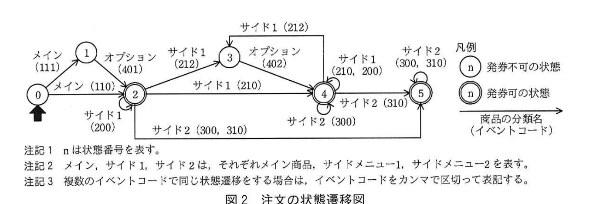

# 2019年春期（平成31年度）応用情報技術者試験 午後 問3（選択）
## プログラミング：券売機の注文の状態を判定するプログラム（T社/U社）

---

## 問題文

**問3** 券売機の注文の状態を判定するプログラムに関する次の記述を読んで、設問1〜3に答えよ。

T社では、U社が経営する飲食店の店舗に設置する券売機のシステムを開発している。U社が店舗で提供する商品には、丼物や定食などのメイン商品のほか、みそ汁やサラダなどのサイドメニューがある。

U社では、特定の種類の商品を組み合わせたものをセットメニューとし、単品で注文した場合よりも安く提供している。

---

### 〔食券購入時の要件〕

食券購入時の主な要件を図1に示す。

**〔食券購入時の操作の流れ〕**
- 利用者は、券売機の画面上に表示されるボタンを押すことで食券を購入する。
- 食券の購入は1名ずつ行う。
- 利用者は、購入したい全ての商品を指定後、合計金額を投入し、発券ボタンを押す。

**〔メニューの構成〕**
- 商品はメイン商品、サイドメニュー1、サイドメニュー2、オプションに分類される。商品には、サイズやドレッシングの種類など、オプションの指定が必須なものがある。
- メイン商品は必ず1品注文する必要がある。サイドメニューの注文は任意である。
- メイン商品1品に対し、サイドメニューは複数注文することができる。
- 券売機の画面は、メイン商品の選択画面、サイドメニュー1の選択画面、サイドメニュー2の選択画面の順に遷移する。サイドメニュー1を注文しない場合は、サイドメニュー1の選択画面での注文をスキップできる。オプションは、オプションの指定が必須の商品の選択画面で指定できる。

**〔発券ボタンの制御〕**
- 発券ボタンはメイン商品の注文後、任意のタイミングで押すことができる。ただし、オプションの指定が必須な商品でオプションが未指定の場合は、押すことができない。

**〔セットメニューの値引きのルール〕**
- セットメニューに適用できるメイン商品、サイドメニュー1、サイドメニュー2を、それぞれ1品以上選んだ場合、50円値引きする。値引きは食券購入ごとに1回だけ適用される。

### 図1 食券購入時の主な要件

商品と分類の具体例を表1に示す。表1中のNは分類番号、Sはセットメニューへの適用可否、Oはオプションの指定に関する情報である。Sは1のものがセットメニューへの適用可の商品である。分類番号1〜3で、Oが0以外のものは、オプションの指定が必須であることを示し、Oの値は、分類番号4のOの値と対応している。オプションを指定する際には、Oの値が一致するオプションだけが選択できる。

### 表1 商品と分類の具体例

**メイン商品（分類番号1）**

| 名称 | N | S | O | 価格 |
|------|---|---|---|------|
| 牛丼 | 1 | 1 | 1 | 380 |
| 豚丼 | 1 | 1 | 1 | 350 |
| 鮭定食 | 1 | 1 | 0 | 450 |

**サイドメニュー1（分類番号2）**

| 名称 | N | S | O | 価格 |
|------|---|---|---|------|
| 野菜サラダ | 2 | 1 | 2 | 100 |
| ポテトサラダ | 2 | 1 | 2 | 130 |
| 漬物 | 2 | 1 | 0 | 100 |
| 生卵 | 2 | 0 | 0 | 60 |
| 温泉卵 | 2 | 0 | 0 | 70 |

**サイドメニュー2（分類番号3）**

| 名称 | N | S | O | 価格 |
|------|---|---|---|------|
| みそ汁 | 3 | 1 | 0 | 60 |
| 豚汁 | 3 | 0 | 0 | 190 |
| スープ | 3 | 1 | 0 | 200 |

**オプション（分類番号4）**

| 名称 | N | S | O | 価格 |
|------|---|---|---|------|
| 並 | 4 | 0 | 1 | 0 |
| 大盛り | 4 | 0 | 1 | 100 |
| 特盛り | 4 | 0 | 1 | 200 |
| ゴマドレッシング | 4 | 0 | 2 | 0 |
| 和風ドレッシング | 4 | 0 | 2 | 0 |

---

### 〔注文の状態の判定手順〕

券売機は、画面上で商品を選択するボタンが押されるたびに、商品の情報を蓄積する。そして、蓄積した商品の情報を用いて状態遷移を初期状態から評価し直し、注文の状態を判定する。状態の判定には図2の状態遷移図を用いる。初期状態は0である。表1のN、S、Oを左から順に並べた3桁の数をイベントコードと呼び、イベントコードの値によって状態の遷移先を制御する。

### 図2 注文の状態遷移図



> **状態遷移：**
> - 0 →メイン(111)→ 1 →オプション(401)→ 2
> - 0 →メイン(110)→ 2
> - 2 →サイド1(200)→ 2（自己遷移）
> - 2 →サイド1(212)→ 3 →オプション(402)→ 4
> - 2 →サイド1(210)→ 4
> - 2 →サイド2(300,310)→ 5
> - 4 →サイド1(210,200)→ 4（自己遷移）、サイド2(300)→ 4（自己遷移）
> - 4 →サイド2(310)→ 5
> - 5 →サイド2(300,310)→ 5（自己遷移）
> - 状態0,1：発券不可／状態2,3,4,5：発券可（凡例の二重丸）

状態の判定処理では、商品の情報を入力された順に取得し、状態遷移図に基づいて状態遷移を評価する。例えば牛丼、大盛り、漬物を注文した場合、状態は0、1、2、4の順に遷移する。この場合、最後の状態が発券可の状態なので、発券ボタンを押すことができる。また、値引きのルールの条件を満たさないので、値引きはしない。

---

### 〔状態遷移表〕

状態遷移図をプログラムとして実装するためには、状態遷移図を状態遷移表にして取り扱う。注文の状態遷移表を表2に示す。表2は、状態番号とイベントコードの組合せの表であり、表の各マスには遷移先の状態番号と、遷移の際の値引きの金額が入る。

例えば、図2で状態が2のときに漬物の注文が入ると状態4に遷移し、値引きは発生しないので、表2では、状態番号が2でイベントコードが210のマスには4:0が入る。遷移後の状態が発券可の状態なので、発券ボタンを押すことができる。

### 表2 注文の状態遷移表

| 状態番号 | 110 | 111 | 200 | 210 | 212 | 300 | 310 | 401 | 402 | 発券可 |
|---------|-----|-----|-----|-----|-----|-----|-----|-----|-----|--------|
| 0 | 2:0 | 1:0 | E:0 | E:0 | E:0 | E:0 | E:0 | E:0 | E:0 | false |
| 1 | E:0 | E:0 | E:0 | E:0 | E:0 | E:0 | E:0 | 2:0 | E:0 | false |
| 2 | E:0 | E:0 | 2:0 | 4:0 | 3:0 | 5:0 | 5:0 | E:0 | E:0 | true |
| 3 | E:0 | E:0 | E:0 | E:0 | E:0 | E:0 | E:0 | E:0 | 4:0 | `[　ア　]` |
| 4 | E:0 | E:0 | 4:0 | 4:0 | `[　イ　]` | 4:0 | 5:50 | E:0 | E:0 | true |
| 5 | E:0 | E:0 | E:0 | E:0 | E:0 | 5:0 | 5:0 | E:0 | E:0 | true |

> 注記1：各マスには、"遷移先の状態番号：値引きの金額"が入る。
> 注記2：Eは想定しない遷移であることを意味する。

---

### 〔券売機の注文の状態を判定するプログラム〕

券売機の注文の状態を判定するプログラム（以下、判定プログラムという）を作成した。判定プログラムは、画面上で商品を選択するボタンが押されるたびに実行される。注文の状態を判定する手順を図3に示す。判定プログラム中で利用する主な変数、定数及び関数を表3に、作成した判定プログラムを図4に示す。

### 図3 注文の状態を判定する手順

1. 状態番号を0、注文金額を0、値引金額を0として初期化する。
2. 注文された商品を先頭から順に一つ参照し、商品の金額を注文金額に加算する。
3. 注文された商品のイベントコードを算出する。
4. 状態遷移の際の値引きの金額を取得し、値引金額に加算する。
5. 状態遷移表を参照し、現在の状態番号とイベントコードから次の状態番号を取得して、状態番号を更新する。
6. (5)で取得した次の状態番号がEだった場合は、エラー終了として処理を中断する。
7. 未処理の注文が残っていれば(2)に戻って次の商品を処理する。
8. 状態遷移表を参照し、発券の可否を判定して、発券ボタンの状態を変化させる。

### 表3 判定プログラム中で利用する主な変数、定数及び関数

| 名称 | 種類 | 内容 |
|------|------|------|
| status_table[stat][ev] | 配列 | 表2の注文の状態遷移表を格納した2次元配列である。statは遷移前の状態番号、evはget_event_index()で取得する値又はACCEPT_INDEXである。配列の要素は構造体で、status_table[stat][ev].statusで遷移先の状態番号を、status_table[stat][ev].discountで値引きの金額を、status_table[stat][ACCEPT_INDEX].acceptで、発券可の列の値を参照できる。 |
| ACCEPT_INDEX | 定数 | 配列status_tableの、発券可の列のインデックス番号である。 |
| get_event_index(code) | 関数 | codeにイベントコードを指定して実行すると、それに対応する、配列status_tableの列のインデックス番号を返す。codeは整数である。 |
| order[] | 配列 | 注文された商品の情報が順番に入る配列である。商品の情報を格納する構造体を要素にもつ。i番目の注文については、order[i].N、order[i].S、order[i].O、order[i].Aで、それぞれ表1のN、S、O及び商品の金額を参照できる。配列の添字は1から始まる。N、S、O及び商品の金額は整数である。 |
| order_count | 変数 | 注文された商品の数である。 |

### 図4 作成した判定プログラム

```
status ← 0     // 状態番号
amount ← 0     // 注文金額
discount ← 0   // 値引金額
accepted ← false
for( i を 1 から order_count まで繰り返す )
  amount ← amount + [　ウ　]
  event_code ← [　エ　] + order[i].O
  event_index ← get_event_index( event_code )
  discount ← discount + [　オ　]
  status ← [　カ　]
  if( status が E に等しい )
    エラー終了
  endif
endfor
accepted ← status_table[ status ][ ACCEPT_INDEX ].accept
if ( [　キ　] )
  発券ボタンを押せるようにする
else
  発券ボタンを押せないようにする
endif
```

> 注記：判定プログラムがエラー終了となった場合は、券売機の画面上にエラーが発生した旨を表示し、処理を中断する。

---

## 設問

### 設問1 状態遷移について、(1)、(2)に答えよ。

**(1)** 鮭定食、野菜サラダ、ゴマドレッシング、みそ汁の順番で注文が入った場合の状態遷移について、図2の状態番号を使って遷移する順を答えよ。

**(2)** 表2中の `[　ア　]`、`[　イ　]` に入れる適切な字句を答えよ。

### 設問2 図4中の `[　ウ　]` 〜 `[　キ　]` に入れる適切な字句を答えよ。

### 設問3 図4の判定プログラムについて、プログラムに変更を加えず、表1、2の内容を変更するだけで対応できる要件を解答群の中から二つ選び、記号で答えよ。ここで、表1、2の内容について、業務運用中の変更は行わないものとする。

**解答群：**
ア 12:00〜14:00の間はランチタイムとし、鮭定食を一時的に提供しないようにする。
イ オプションの指定が必須なメイン商品について、並、大盛り、特盛りのオプションの指定の後に、ご飯にかけるつゆの量について、普通、多め、少なめの指定ができるようにする。
ウ サイドメニュー1とサイドメニュー2の商品で、セットメニューに組み込める商品を複数個ずつ注文したときに、値引きも複数回適用する。
エ メイン商品にカレーを追加する。カレーには並、大盛りを指定できるが、特盛りは指定できない。

---

## 解答と解説

### 設問1

**(1) 正解：0, 2, 3, 4, 5**

- 鮭定食（メイン商品、O=0）：イベントコード110 → 状態 0→2
- 野菜サラダ（サイド1、O=2）：イベントコード212 → 状態 2→3
- ゴマドレッシング（オプション、O=2）：イベントコード402 → 状態 3→4
- みそ汁（サイド2、O=0）：イベントコード300 → 状態 4のまま（自己遷移、310ではなく300なので4→4だが、表2では300は4:0なので4のまま）

したがって遷移順は **0, 2, 3, 4, 5** ではなく、実際には最後まで状態4に留まるように見えるが、IPA公式解答は「0, 2, 3, 4, 5」である。みそ汁のイベントコード（3,1,0→310）で状態4→5に遷移するため、最終的に5に到達する。

**IPA公式：0, 2, 3, 4, 5**

**(2) ア = false / イ = 4:0**

- ア：状態3は発券可否の情報を持たないマス（オプション指定待ちの中間状態）であり、発券不可＝**false**
- イ：状態4でイベントコード212（サイド1の追加選択、値引きなし）が入っても状態は4のまま、値引きは発生しない＝**4:0**

**IPA公式：ア = false、イ = 4:0**

---

### 設問2

**ウ = order[i].A**

`amount ← amount + [　ウ　]` は注文金額に商品の金額を加算する処理。表3よりorder[i].Aが商品の金額を参照する。

**エ = order[i].N*100 + order[i].S*10**

イベントコードはN、S、Oを左から順に並べた3桁の数。`event_code ← [エ] + order[i].O` の形なので、エはN×100 + S×10（下1桁がOで加算される）。

**オ = status_table[status][event_index].discount**

値引金額の加算元は状態遷移表の該当マスの値引き金額。

**カ = status_table[status][event_index].status**

状態番号の更新は状態遷移表の該当マスの遷移先状態番号。

**キ = acceptedがtrueに等しい**

発券ボタンを押せるようにする条件は、accepted変数がtrueであること。

**IPA公式：**
- ウ = order[i].A
- エ = order[i].N*100 + order[i].S*10
- オ = status_table[status][event_index].discount
- カ = status_table[status][event_index].status
- キ = acceptedがtrueに等しい

---

### 設問3

**正解：イ、エ**

プログラムのロジックを変えずに、**表1（商品マスタ）・表2（状態遷移表）へのデータ追加・変更だけ**で実現できる要件を選ぶ。

- イ：オプション指定必須のメイン商品にさらに「つゆの量」という追加オプション区分を設ける → 新しい分類・オプションをマスタに追加するだけで対応可能
- エ：カレーという新メイン商品を、指定できるオプションを制限しつつ追加 → 表1に新商品と対応するオプションの組み合わせを追加するだけで対応可能
- ア：時間帯による提供制限は、時刻に応じた動的な制御がプログラムに必要（マスタ変更だけでは不可）
- ウ：値引きの複数回適用は、現在のプログラムが「食券購入ごとに1回だけ」という仕様で作られているため、ロジック自体の変更が必要

**IPA公式：イ、エ**

---

## 参考：主要キーワード

| 用語 | 説明 |
|------|------|
| 状態遷移図 | システムの状態と、状態間を移る条件（イベント）を図で表したモデル |
| 状態遷移表 | 状態遷移図を、現在状態×イベントの2次元表で表現したもの。プログラム実装に向く |
| イベントコード | 入力（商品情報など）から状態遷移を判定するために合成される識別コード |
| 構造体 | 複数の異なる型のデータをひとまとめにして扱うデータ型 |
| セットメニュー値引き | 複数分類にまたがる商品の組み合わせ購入時に適用される割引ルール |
