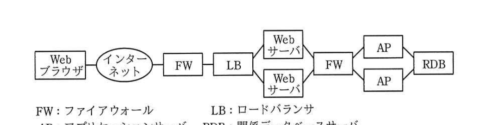
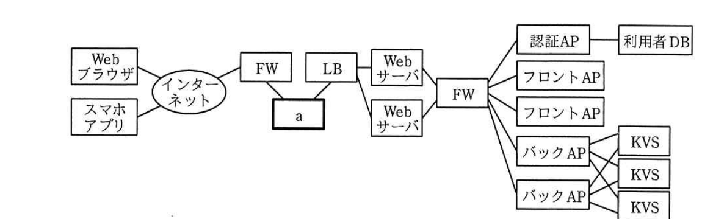

# 2019年春期（平成31年度）応用情報技術者試験 午後 問4（選択）
## システムアーキテクチャ：システム構成の見直し（S社電子書籍サービス）

---

## 問題文

**問4** システム構成の見直しに関する次の記述を読んで、設問1〜3に答えよ。

S社は、電子書籍をPCやタブレット、スマートフォンのWebブラウザで購読するサービスを提供している。利用者数の増加に伴うシステムの応答性能の低下や、近年のWebブラウザの機能の向上に対応するために、現状のシステム構成を見直すことになった。

---

### 〔現状のシステム構成と稼働状況〕

現状のシステム構成を図1に、各機器の機能と稼働状況を表1に示す。

### 図1 現状のシステム構成

> Webブラウザ ─ インターネット ─ FW ─ LB ─ [Webサーバ×2] ─ FW ─ [AP×2] ─ RDB
> （FW：ファイアウォール、LB：ロードバランサ、AP：アプリケーションサーバ、RDB：関係データベースサーバ）

### 表1 各機器の機能と稼働状況（抜粋）

| 機器名 | 機能と稼働状況 |
|--------|---------------|
| Webサーバ | Webブラウザからの要求をAPに引き渡して、その処理結果をWebコンテンツとしてWebブラウザに返す。WebコンテンツをTLSによって暗号化する機能を兼ねているので、CPU負荷が高い。 |
| AP | 利用者の認証、電子書籍情報を検索する処理、端末の種別に応じて電子書籍データを変換する処理及び利用者にポイントを定期的に付与するバッチ処理など、複数の処理を担っている。利用者数の多い時間帯は、CPU使用率が80％を超える状態が続くことがあり、その時間帯にバッチ処理が実行されると、Webブラウザからのリクエストに対する応答待ちが極端に長くなってしまうことがある。 |
| RDB | 利用者の情報、電子書籍の書籍名や著者などの書籍情報と書籍の本文や画像情報を保持する。CPU負荷は低いが、ディスクの読込み負荷が常に高い。 |

---

### 〔新システムの構成の検討〕

現状のシステムへの負荷の問題を解消するために、次の方針に沿った新システムの構成を検討する。

- 費用や変更容易性を考慮し、仮想環境上に新システムを構築する。
- Webサーバの CPU負荷を軽減するために専用の機器を導入する。
- Webブラウザよりも操作性に優れたスマートフォン用のアプリケーションプログラム（以下、スマホアプリという）を開発して、それにも対応するようにAP上の処理を見直す。
- 電子書籍データをRDB上に集中配置する方式から、KVS（Key-Value Store）を用いて複数のサーバに分散配置する方式に変更する。

新システムの構成を図2に、各機器の機能を表2に示す。

### 図2 新システムの構成

> Webブラウザ／スマホアプリ ─ インターネット ─ FW ─ [　a　] ─ LB ─ [Webサーバ×2] ─ FW ─ 認証AP（→利用者DB）／フロントAP×2／バックAP×2（→KVS×3）

### 表2 各機器の機能（抜粋）

| 機器名 | 機能 |
|--------|------|
| 認証AP | 利用者の認証を行うWeb APIを提供する。Web APIはフロントAP又はバックAPからWebサーバを介して呼び出される。 |
| 利用者DB | 利用者の情報を保持するデータ管理システムである。 |
| フロントAP | `[　b　]` を行い、バックAPから電子書籍データを取得し、Webブラウザの種類に応じたWebコンテンツとして変換してWebサーバに返す。 |
| バックAP | `[　b　]` を行い、KVSから電子書籍情報の検索や電子書籍データの取得を行うWeb APIを提供する。Web APIはフロントAP又はスマホアプリからWebサーバを介して呼び出される。また、利用者にポイントを定期的に付与するバッチ処理も行う。 |
| KVS | 電子書籍の書籍名や著者などの書籍情報と、書籍の本文や画像情報をキーバリュー形式で保持するデータ管理システムである。複数台のサーバで同じデータを保持することによって、現状のシステムで高かった `[　c　]` を分散する。 |

---

### 〔新システムの構成の評価〕

新システムの構成の評価を行う。

**・フロントAPとバックAPのスケーリング**

スマホアプリの優位性から、利用者はWebブラウザの利用からスマホアプリの利用に移行していくことが予想される。この変化に応じて、**①フロントAPとバックAPの台数を見直すことが可能である。**

将来的には、Webブラウザの機能の向上に伴い、フロントAPで変換されたコンテンツを表示する方式から、Webブラウザ上で実行されるアプリケーションプログラムが処理する方式に変更することで、**②スマホアプリと同様のデータ処理をWebブラウザだけで実現することができる。**

**・バックAPの課題**

現状のシステムのAP上の問題が新システムの構成でも解消されておらず、バックAPへのリクエストに対する**③応答待ちが極端に長くなってしまうおそれがある。**

---

## 設問

### 設問1 〔新システムの構成の検討〕について、(1)、(2)に答えよ。

**(1)** 図2中の `[　a　]` に入れる適切な字句を答えよ。

**(2)** 表2中の `[　b　]`、`[　c　]` に入れる適切な字句を答えよ。

### 設問2 システムの稼働率について、(1)、(2)に答えよ。

なお、各機器及びサービスの稼働率は次のとおりとして、図1と図2で同名のものは同じ稼働率、記載のないものは1とする。

Webサーバ＝w、AP＝a、フロントAP＝f、バックAP＝b、RDB＝r、KVS＝k

**(1)** 図1のシステム全体の稼働率を解答群の中から選び、記号で答えよ。

**解答群：**
ア　w²a²r　　　イ　(1−w²)(1−a²)(1−r)
ウ　(1−(1−w²))(1−(1−a²))r　　　エ　(1−(1−w)²)(1−(1−a)²)r

**(2)** 図2中のスマホアプリを用いた場合のシステムの稼働率を解答群の中から選び、記号で答えよ。

**解答群：**
ア　w²b²k³　　　イ　w²f²b²k³
ウ　(1−w²)(1−b²)(1−k³)　　　エ　(1−w²)(1−f²)(1−b²)(1−k³)
オ　(1−(1−w)²)(1−(1−b)²)(1−(1−k)³)
カ　(1−(1−w)²)(1−(1−f)²)(1−(1−b)²)(1−(1−k)³)

### 設問3 〔新システムの構成の評価〕について、(1)〜(3)に答えよ。

**(1)** 本文中の下線①にあるフロントAPとバックAPの台数はそれぞれどのように変化するか。解答群の中から選び、記号で答えよ。ただし、システム全体へのリクエスト数は変わらないものとし、機器の台数は必要かつ最も少ない台数にすること。

**解答群：**
ア　少なくなる　　イ　多くなる　　ウ　変わらない

**(2)** 本文中の下線②とはどのような処理か。40字以内で述べよ。

**(3)** 本文中の下線③の問題を回避するためには、表2中の機器の機能に変更を加える必要がある。対象となる機器を表2から選び、加える変更について、30字以内で述べよ。

---

## 解答と解説

### 設問1

**(1) a = TLSアクセラレータ**

新システムではWebサーバのCPU負荷軽減のため、TLSの暗号化・復号処理を専用機器（TLSアクセラレータ）にオフロードする。図中でFWとLBの間に配置される専用機器。

**IPA公式：a = TLSアクセラレータ**

**(2) b = 利用者の認証 / c = ディスクの読込み負荷**

- b：フロントAP・バックAPともに共通する処理として、Web APIを呼び出す前段で認証APを呼び出して**利用者の認証**を行う必要がある。
- c：現状システムのRDBは「ディスクの読込み負荷が常に高い」という課題があった。KVSに複数台分散配置することでこの**ディスクの読込み負荷**を分散する。

**IPA公式：b = 利用者の認証、c = ディスクの読込み負荷**

---

### 設問2

**(1) エ**

図1の構成：Webブラウザ→FW→LB→Webサーバ×2（並列冗長）→FW→AP×2（並列冗長）→RDB（単一）

冗長化された2台構成の稼働率は「1−(1−稼働率)²」。Webサーバ・APの冗長ユニットとRDB（単一）の直列で全体稼働率は：
(1−(1−w)²) × (1−(1−a)²) × r

**IPA公式：エ**

**(2) オ**

スマホアプリ利用時はフロントAPを経由せず、Webサーバ→バックAP（2台冗長）→KVS（3台冗長、いずれか1台でも生きていれば可）という構成になる。
(1−(1−w)²) × (1−(1−b)²) × (1−(1−k)³)

**IPA公式：オ**

---

### 設問3

**(1) フロントAPの台数＝ア（少なくなる） / バックAPの台数＝ウ（変わらない）**

スマホアプリの利用が増えると、フロントAP（Webブラウザ向けのコンテンツ変換を担当）を経由するリクエストは減少するため、フロントAPの必要台数は**少なくなる**。一方、バックAP（Web API処理・データ取得の実処理）はWebブラウザ経由・スマホアプリ経由のどちらのリクエストも受けるため、全体のリクエスト数が変わらない前提では**台数は変わらない**。

**IPA公式：フロントAPの台数＝ア、バックAPの台数＝ウ**

**(2) 正解（40字以内）：バックAPから電子書籍データを取得しWebコンテンツに変換する処理**

現在フロントAPが担っている「バックAPから電子書籍データを取得し、Webブラウザの種類に応じたWebコンテンツとして変換する」処理を、Webブラウザ上で動作するアプリケーションプログラム自身が行うようにする、という意味。

**IPA公式：バックAPから電子書籍データを取得しWebコンテンツに変換する処理**

**(3) 機器：バックAP／変更（30字以内）：バッチ処理とその他の処理が実行される機器を分ける。**

現状の課題（ポイント付与バッチ処理と他のリクエスト処理が同一AP上で実行されると応答待ちが極端に長くなる）が新システムのバックAPでも残っている。バックAPの機能を分離し、**バッチ処理を実行する機器と、通常のリクエストを処理する機器を分ける**ことで問題を回避する。

**IPA公式：機器＝バックAP、変更＝バッチ処理とその他の処理が実行される機器を分ける。**

---

## 参考：主要キーワード

| 用語 | 説明 |
|------|------|
| TLSアクセラレータ | TLS（暗号化通信）の暗号化・復号処理を専用ハードウェアで肩代わりし、他機器のCPU負荷を軽減する装置 |
| KVS（Key-Value Store） | キーと値の組でデータを管理する、スケールアウトに向いたデータストア |
| 稼働率計算（並列冗長） | n台の機器を並列冗長構成にした場合の稼働率は 1−(1−単体稼働率)ⁿ で計算する |
| フロントAP／バックAP分離 | クライアント種別ごとのコンテンツ変換（フロント）と実処理・データアクセス（バック）を分離するアーキテクチャ |
| スケールアウト | サーバ台数を増減することでシステム全体の処理能力を調整する方式 |
