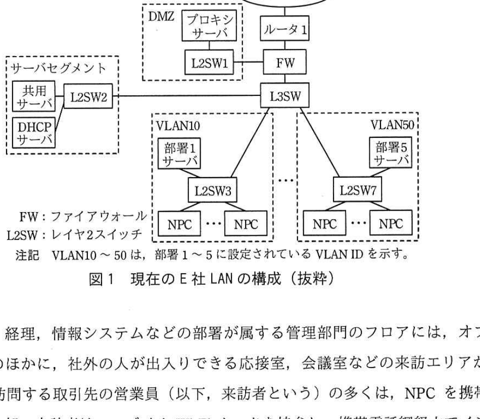
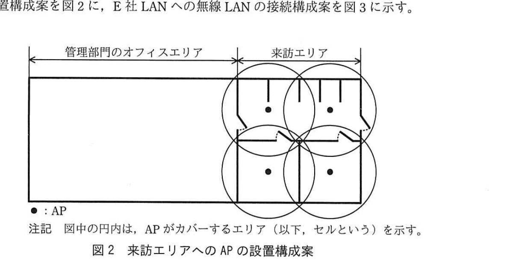
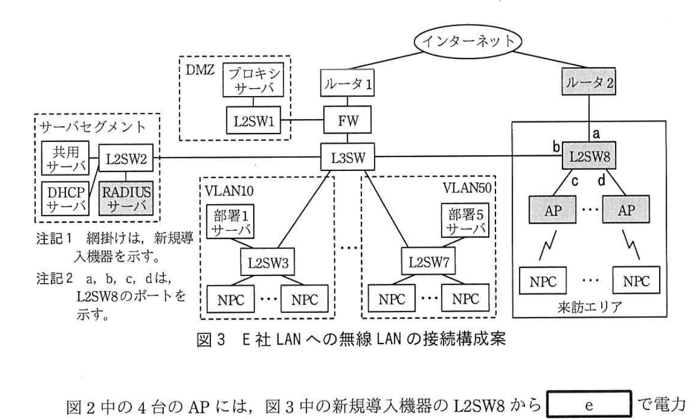

# 2019年春期（平成31年度）応用情報技術者試験 午後 問5（選択）
## ネットワーク：無線LANの導入（E社）

---

## 問題文

**問5** 無線LANの導入に関する次の記述を読んで、設問1〜3に答えよ。

E社は、社員数が150名のコンピュータ関連製品の販売会社であり、オフィスビルの2フロアを使用している。社員は、オフィス内でノートPC（以下、NPCという）を有線LANに接続して、業務システムの利用、Web閲覧などを行っている。社員によるインターネットの利用は、DMZのプロキシサーバ経由で行われている。現在のE社LANの構成を図1に示す。

E社の各部署にはVLANが設定されており、NPCからは、所属部署のサーバ（以下、部署サーバという）及び共用サーバが利用できる。DHCPサーバからIPアドレスなどのネットワーク情報をNPCに設定するために、レイヤ3スイッチ（以下、L3SWという）でDHCP `[　a　]` を稼働させている。

### 図1 現在のE社LANの構成（抜粋）

> インターネット ─ ルータ1 ─ FW ─ L3SW ─ 各VLAN（VLAN10〜VLAN50、部署サーバ・NPC群）
> DMZ：プロキシサーバ ─ L2SW1 ─ FW
> サーバセグメント：共用サーバ・DHCPサーバ ─ L2SW2 ─ L3SW

総務、経理、情報システムなどの部署が属する管理部門のフロアには、オフィスエリアのほかに、社外の人が出入りできる応接室、会議室などの来訪エリアがある。E社を訪問する取引先の営業員（以下、来訪者という）の多くは、NPCを携帯している。一部の来訪者は、モバイルWi-Fiルータを持参し、携帯電話網経由でインターネットを利用することもあるが、多くの来訪者から、来訪エリアでインターネットを利用できる環境を提供してほしいとの要望が挙がっていた。また、社員からは、来訪エリアでもE社LANを利用できるようにしてほしいとの要望があった。そこで、E社では、来訪エリアへの無線LANの導入を決めた。

情報システム課のF課長は、部下のGさんに、無線LANの構成と運用方法について検討するよう指示した。F課長の指示を受けたGさんは、最初に、無線LANの構成を検討した。

---

### 〔無線LANの構成の検討〕

Gさんは、来訪者が無線LAN経由でインターネットを利用でき、社員が無線LAN経由でE社LANに接続して有線LANと同様の業務を行うことができる、来訪エリアの無線LANの構成を検討した。

無線LANで使用する周波数帯は、高速通信が可能なIEEE 802.11acとIEEE 802.11nの両方で使用できる `[　b　]` GHz帯を採用する。データ暗号化方式には、`[　c　]` 鍵暗号方式のAES（Advanced Encryption Standard）が利用可能なWPA2を採用する。来訪者による社員へのなりすまし対策には、IEEE `[　d　]` を採用し、クライアント証明書を使った認証を行う。この認証を行うために、RADIUSサーバを導入する。来訪者の認証は、RADIUSサーバを必要としない、簡便なPSK（Pre-Shared Key）方式で行う。

無線LANアクセスポイント（以下、APという）は、来訪エリアの天井に設置する。APは `[　e　]` 対応の製品を選定して、APのための電源工事を不要にする。

これらの検討を基に、Gさんは無線LANの構成を設計した。来訪エリアへのAPの設置構成案を図2に、E社LANへの無線LANの接続構成案を図3に示す。

### 図2 来訪エリアへのAPの設置構成案

> 管理部門のオフィスエリアに隣接する来訪エリアに、4台のAPが円形のセル（カバーエリア）を重ねて配置されている（2×2の格子状配置）。

### 図3 E社LANへの無線LANの接続構成案

> インターネット ─ ルータ2（新規導入）─ a ─ L2SW8（新規導入、ポートb）─ c/d ─ AP×2（新規導入）─ 来訪エリアのNPC
> サーバセグメントにRADIUSサーバを新規導入（L2SW2経由）
> 注記1：網掛けは、新規導入機器を示す。　注記2：a、b、c、dは、L2SW8のポートを示す。

図2中の4台のAPには、図3中の新規導入機器のL2SW8から `[　e　]` で電力供給する。APには、社員向けと来訪者向けの2種類のESSIDを設定する。図3中の来訪エリアにおいて、APに接続した来訪者のNPCと社員のNPCは、それぞれ異なるVLANに所属させ、利用できるネットワークを分離する。

社員のNPCは、APに接続するとRADIUSサーバでクライアント認証が行われ、認証後にVLAN情報がRADIUSサーバからAPに送信される。APに実装されたダイナミックVLAN機能によって、当該NPCの通信パケットに対して、APでVLAN10〜50の部署向けのVLANが付与される。一方、来訪者のNPCは、APに接続するとPSK認証が行われる。**①認証後に、NPCの通信パケットに対して、APで来訪者向けのVLAN100が付与される。**

社員と来訪者が利用できるネットワークを分離するために、図3中の**②L2SW8のポートに、VLAN10〜50又はVLAN100を設定する。** ルータ2では、DHCPサーバ機能を稼働させる。

次に、Gさんは、無線LANの運用について検討した。

---

### 〔無線LANの運用〕

RADIUSサーバは、認証局機能をもつ製品を導入して、社員のNPC向けのクライアント証明書とサーバ証明書を発行する。クライアント証明書は、無線LANの利用を希望する社員に配布する。来訪者のNPC向けのPSK認証に必要な事前共有鍵（パスフレーズ）は、毎日変更し、無線LANの利用を希望する来訪者に対して、来訪者向けESSIDと一緒に伝える。

来訪者のNPCの通信パケットは、APでVLAN IDが付与されるとルータ2と通信できるようになり、ルータ2のDHCPサーバ機能によってNPCにネットワーク情報が設定され、インターネットを利用できるようになる。社員のNPCの通信パケットは、APでVLAN IDが付与されるとサーバセグメントに設置されているDHCPサーバと通信できるようになり、DHCPサーバによってネットワーク情報が設定され、E社LANを利用できるようになる。

Gさんは、検討結果を基に、無線LANの導入構成と運用方法を設計書にまとめ、F課長に提出した。設計内容はF課長に承認され、実施されることになった。

---

## 設問

### 設問1 本文中の `[　a　]` 〜 `[　e　]` に入れる最も適切な字句を解答群の中から選び、記号で答えよ。

**解答群：**
ア 2.4　　イ 5　　ウ 802.11a　　エ 802.1X
オ PoE　　カ PPPoE　　キ 共通　　ク クライアント
ケ 公開　　コ パススルー　　サ リレーエージェント

### 設問2 〔無線LANの構成の検討〕について、(1)〜(3)に答えよ。

**(1)** 図2中のセルの状態で、来訪エリア内で電波干渉を発生させないために、APの周波数チャネルをどのように設定すべきか。30字以内で述べよ。

**(2)** 本文中の下線①を実現するためのVLANの設定方法を解答群の中から選び、記号で答えよ。

**解答群：**
ア ESSIDに対応してVLANを設定する。
イ IPアドレスに対応してVLANを設定する。
ウ MACアドレスに対応してVLANを設定する。

**(3)** 本文中の下線②について、一つのVLANを設定する箇所と複数のVLANを設定する箇所を、それぞれ図3中のa〜dの記号で全て答えよ。

### 設問3 〔無線LANの運用〕について、社員及び来訪者のNPCに設定されるデフォルトゲートウェイの機器を、それぞれ図3中の名称で答えよ。

---

## 解答と解説

### 設問1

**a = サ（リレーエージェント） / b = イ（5） / c = キ（共通） / d = エ（802.1X） / e = オ（PoE）**

- a：L3SWで「DHCP `[a]`」を稼働させ、異なるVLANセグメントにあるDHCPサーバとNPCの間でDHCP要求・応答を中継する機能 = **DHCPリレーエージェント**
- b：IEEE 802.11ac／802.11nの両方が使用できる周波数帯 = **5GHz帯**
- c：AESは共通鍵（対称鍵）暗号方式 = **共通鍵暗号方式**
- d：クライアント証明書による認証を実現する規格 = **IEEE 802.1X**
- e：LANケーブル経由で電力供給し、AP用の電源工事を不要にする技術 = **PoE（Power over Ethernet）**

**IPA公式：a = サ、b = イ、c = キ、d = エ、e = オ**

---

### 設問2

**(1) 正解（30字以内）：4台のAPに、それぞれ異なる周波数チャネルを設定する。**

図2のように隣接するAPのセルが重なっている配置では、同一チャネルを使うと電波干渉（同一チャネル干渉）が発生する。隣接するAP同士で異なるチャネルを割り当てることで干渉を回避する。

**IPA公式：4台のAPに、それぞれ異なる周波数チャネルを設定する。**

**(2) ア**

下線①はAP接続後にPSK認証を経て、来訪者向けVLAN100が付与される仕組み。来訪者・社員は異なるESSID（社員向け／来訪者向け）に接続するため、**ESSIDに対応してVLANを設定する**方式が該当する。

**IPA公式：ア**

**(3) 一つのVLANを設定する箇所：a／複数のVLANを設定する箇所：b、c、d**

- a（L2SW8とルータ2の間）：来訪者用のVLAN100のみが流れるアップリンクポート → 単一VLAN
- b（L2SW8とL3SWの間）：社員向けの複数部署VLAN（VLAN10〜50）が全て流れるトランクポート → 複数VLAN
- c、d（L2SW8とAP間）：各APは社員向け・来訪者向け両方のSSIDを収容するため、それぞれのポートに複数VLANが流れる → 複数VLAN

**IPA公式：一つのVLANを設定する箇所＝a、複数のVLANを設定する箇所＝b、c、d**

---

### 設問3

**正解：社員のNPC＝L3SW／来訪者のNPC＝ルータ2**

- 社員のNPCは、VLAN10〜50に所属しE社LAN内のDHCPサーバからネットワーク情報を得る。既存のE社LANにおいてVLAN間ルーティングを行うのはL3SWであるため、デフォルトゲートウェイは**L3SW**。
- 来訪者のNPCは、VLAN100に所属し、新規導入したルータ2のDHCPサーバ機能からネットワーク情報を得てインターネットを利用する。そのためデフォルトゲートウェイは**ルータ2**。

**IPA公式：社員のNPC＝L3SW、来訪者のNPC＝ルータ2**

---

## 参考：主要キーワード

| 用語 | 説明 |
|------|------|
| DHCPリレーエージェント | 異なるサブネット（VLAN）間でDHCPの要求・応答を中継する機能 |
| IEEE 802.1X | ポートベースの認証規格。RADIUSサーバと連携し、クライアント証明書などによる認証を行う |
| WPA2／AES | 無線LANの暗号化規格。AESは共通鍵暗号方式によるブロック暗号 |
| ダイナミックVLAN | 認証結果に応じて、接続してきた端末に動的にVLANを割り当てる機能 |
| PoE（Power over Ethernet） | LANケーブルを通じて電力を供給する技術。APなどの電源工事を省略できる |
| チャネル干渉 | 近接する無線LANアクセスポイントが同一チャネルを使うことで発生する電波干渉。隣接APには異なるチャネルを割り当てて回避する |
| PSK（Pre-Shared Key）方式 | 事前共有鍵を用いた簡易な無線LAN認証方式。個別認証サーバを必要としない |
