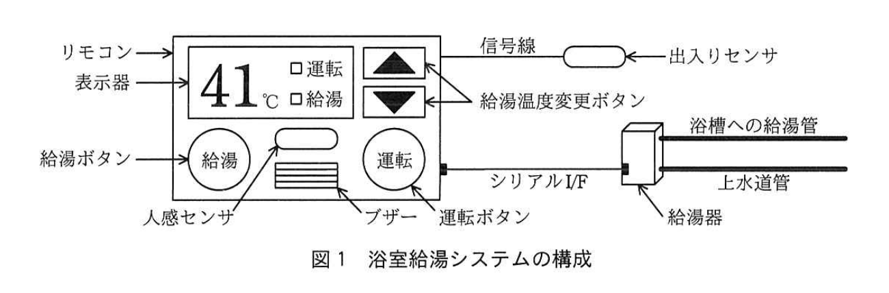
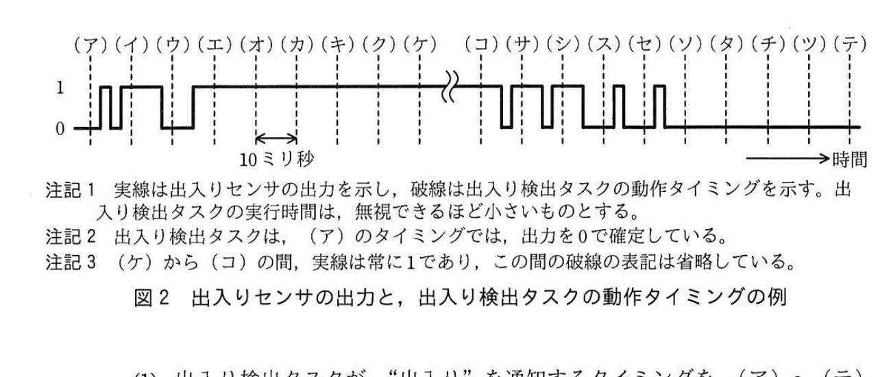
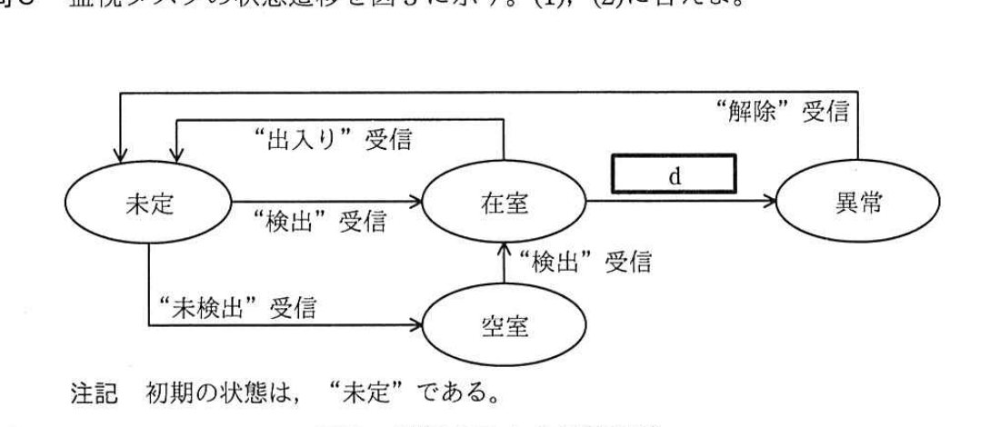

# 2019年春期（平成31年度）応用情報技術者試験 午後 問7（選択）
## 組込みシステム開発：家庭用浴室給湯システム（G社）

---

## 問題文

**問7** 家庭用浴室給湯システムに関する次の記述を読んで、設問1〜3に答えよ。

G社は、家庭用浴室給湯システム（以下、浴室給湯システムという）を開発している。浴室給湯システムは、設定された給湯温度で浴槽に給湯を行う機能と、浴室に入った人が洗い場又は浴槽で動かなくなる事象（以下、異常事象という）を監視して、異常事象が発生したらブザーで同居人に知らせる機能をもつ。浴室給湯システムは、浴室内に設置されるリモコン、浴室の出入口に設置される出入りセンサ、及び浴室外に設置される給湯器で構成される。浴室給湯システムの構成を図1に、浴室給湯システムの構成要素の概要を表1に示す。

### 図1 浴室給湯システムの構成

> リモコン（表示器・給湯ボタン・人感センサ・ブザー・運転ボタン・給湯温度変更ボタン）── 信号線 ── 出入りセンサ
> リモコン ── シリアルI/F ── 給湯器 ── 浴槽への給湯管／上水道管

### 表1 浴室給湯システムの構成要素の概要

| 構成要素名 | 概要 |
|-----------|------|
| リモコン | ・表示器、人感センサ、ブザー、運転ボタン、給湯ボタン、給湯温度変更ボタン、及びMCUで構成される。 ・表示器は、設定された給湯温度と、給湯器の運転状態を表示する。 ・人感センサは、人の動きを検出したときは1を、検出しなかったときは0を、1秒ごとに出力する。人の動きを検出する範囲は、浴室内に限られる。 ・出入りセンサと接続され、出入りセンサの出力を読み出すことができる。 ・給湯器と接続され、給湯器に指示を送信することができる。 |
| 出入りセンサ | ・人が浴室の出入口を横切っていることを検出している間は1を、それ以外の間は0を出力する。人が浴室に入ったのか、浴室から出たのかは判別できない。 ・非常に短い間隔で0と1を交互に出力する現象が発生することがある。 |
| 給湯器 | ・リモコンからの指示に従い、運転、停止、給湯、及び給湯温度の変更を行う。 ・リモコンからの各指示のデータ長は、いずれも3バイトの固定長である。 ・シリアルI/Fの通信速度は、9,600ビット／秒である。 |

> 注記：人感センサの出力、出入りセンサの出力、及びリモコンの各ボタンの入力は、MCUの入力ポートで読み出すことができる。

---

### 〔出入りセンサの出力の確定方法〕

MCUは、出入りセンサの出力を1回の読出しでは確定せず、10ミリ秒周期で出力を読み出して、5回連続で同じ値が読み出せたときに確定し、その値を確定値とする。

---

### 〔リモコンの動作〕

**(1)** リモコンは、各ボタンによって操作を受け付け、給湯器に指示を送信する。

- 運転ボタンが押されたら給湯器の運転又は停止、給湯ボタンが押されたら給湯、給湯温度変更ボタンが押されたら給湯温度の変更というように、ボタンに応じた指示を給湯器に送信する。

**(2)** リモコンは、人の浴室の出入り及び異常事象を監視する。

- 人感センサの出力が1であれば、人が浴室に入ったと判定する。
- 人が浴室に入ったと判定した後、出入りセンサの確定値が1となった後で人感センサの出力が0となれば、人が浴室から出たと判定する。
- 人が浴室に入ったと判定した後、出入りセンサの確定値が1となる前に、人感センサの出力が連続して3分以上0であれば、異常事象と判定する。
- 異常事象と判定したら、いずれかのボタンが押されるまでブザーを鳴動する。

---

### 〔リモコンのソフトウェア構成〕

リモコンの組込みソフトウェアには、リアルタイムOSを使用する。異常事象の監視に関係する主なタスクの一覧を表2に示す。

### 表2 異常事象の監視に関係する主なタスクの一覧

| タスク名 | 処理概要 |
|---------|---------|
| メイン | ・リモコン全体の管理及びブザーの鳴動制御を行う。 ・監視タスクから"異常"が通知されたら、ブザーを鳴動させる。 ・ブザーの鳴動を停止したときは、"解除"を監視タスクに通知する。 |
| 出入り検出 | ・10ミリ秒周期で出入りセンサの出力を読み出す。 ・確定値が1となったら、"出入り"を監視タスクに通知する。 ・一度"出入り"を通知したら、次に"出入り"を通知するのは、確定値が一度0となった後で、再び確定値が1となったときである。 |
| 人検出 | ・500ミリ秒周期で人感センサの出力を読み出す。 ・出力が1であれば"検出"を、出力が0であれば"未検出"を監視タスクに通知する。 |
| 監視 | ・出入り検出タスク及び人検出タスクの通知から、異常事象を判定する。 ・異常事象と判定した場合は、メインタスクに"異常"を通知する。 |

---

## 設問

### 設問1 浴室給湯システムの仕様について、(1)、(2)に答えよ。

**(1)** 次の記述中の `[　a　]` 〜 `[　c　]` に入れる適切な字句を答えよ。

> 浴室給湯システムは、`[　a　]` センサと `[　b　]` センサを併用して異常事象を監視している。これは、`[　a　]` センサだけでは、`[　a　]` センサの出力が1の状態から連続して0となった場合において、人が `[　c　]` ときの事象か、異常事象が発生したときの事象かを判別できないからである。

**(2)** リモコンが給湯器に指示を一つ送信するとき、シリアルI/Fにおける通信時間は何ミリ秒か。答えは小数第2位を切り上げて、小数第1位まで求めよ。ここで、1バイトのデータは10ビットで送信され、ソフトウェアの動作時間は考慮しなくてよいものとする。

### 設問2 出入りセンサの出力と、出入り検出タスクの動作タイミングの例を図2に示す。図2について、(1)、(2)に答えよ。

### 図2 出入りセンサの出力と、出入り検出タスクの動作タイミングの例

> 注記1：実線は出入りセンサの出力を示し、破線は出入り検出タスクの動作タイミングを示す。出入り検出タスクの実行時間は、無視できるほど小さいものとする。
> 注記2：出入り検出タスクは、（ア）のタイミングでは、出力を0で確定している。
> 注記3：（ケ）から（コ）の間、実線は常に1であり、この間の破線の表記は省略している。

**(1)** 出入り検出タスクが、"出入り"を通知するタイミングを、（ア）〜（テ）の記号で答えよ。

**(2)** 出入り検出タスクが"出入り"を通知した後、出力を0で確定する最初のタイミングを、（ア）〜（テ）の記号で答えよ。

### 設問3 監視タスクの状態遷移を図3に示す。(1)、(2)に答えよ。

### 図3 監視タスクの状態遷移

> 状態：未定（初期状態）／在室／空室／異常
> 遷移：未定→（"検出"受信）→在室／未定→（"未検出"受信）→空室／空室→（"検出"受信）→在室／在室→（"出入り"受信）→未定／在室→（`[　d　]`）→異常／異常→（"解除"受信）→未定
> 注記：初期の状態は、"未定"である。

**(1)** 図3中の `[　d　]` に入れる適切な遷移条件を、他タスクからの通知名を用いて20字以内で答えよ。

**(2)** 次の記述中の `[　e　]`、`[　f　]` に入れる適切な状態名を答えよ。

> "空室"状態のときに、1人の人が浴室に入った。その後、別の1人の人が浴室に入った。このときの監視タスクの状態遷移は、"空室"→"`[　e　]`"→"`[　f　]`"→"在室"となった。

---

## 解答と解説

### 設問1

**(1) a = 人感 / b = 出入り / c = 浴室から出た**

- a、b：本文で明示されている2種類のセンサは人感センサと出入りセンサ。文脈から「`[a]`センサだけでは...判別できない」という文における`[a]`は**人感センサ**、併用対象の`[b]`は**出入りセンサ**。
- c：人感センサの出力が1から連続して0となった場合、それは「人が浴室から出た」（出入りセンサが1を検出した後）ときの正常な事象か、「異常事象」（出ていないのに反応がなくなった）かの2通りが考えられる、という文脈。

**IPA公式：a = 人感、b = 出入り、c = 浴室から出た**

**(2) 3.2（ミリ秒）**

シリアルI/Fの通信速度は9,600ビット／秒。1バイト＝10ビットで送信されるので、1バイトの通信時間は 10 ÷ 9600 ≒ 0.0010417秒 ≒ 1.0417ミリ秒。指示は3バイト固定長なので、3バイト分の通信時間は 1.0417 × 3 ≒ 3.125ミリ秒。小数第2位を切り上げて小数第1位まで求めると **3.2ミリ秒**。

**IPA公式：3.2**

---

### 設問2

**(1) （ク）**

出入り検出タスクは10ミリ秒周期で出入りセンサの出力を読み出し、5回連続で同じ値が読み出せたときに確定する。図中で出力が1になってから5回連続で1が続いた最初のタイミングが（ク）であり、ここで確定値が1となり"出入り"を通知する。

**IPA公式：（ク）**

**(2) （チ）**

"出入り"通知後、次に確定値が0となる（5回連続で0が読み出される）最初のタイミングは（チ）である。

**IPA公式：（チ）**

---

### 設問3

**(1) d = 連続して361回"未検出"を受信（20字以内）**

人検出タスクは500ミリ秒周期で人感センサ出力を読み出す。異常事象の判定条件は「人感センサの出力が連続して3分以上0」であること。3分＝180秒＝180,000ミリ秒。500ミリ秒周期で数えると180,000 ÷ 500 = 360回の周期が経過することになるが、最初の受信を含めて連続361回"未検出"を受信した時点で3分以上0が継続したと判定できる。

**IPA公式：連続して361回"未検出"を受信**

**(2) e = 在室 / f = 未定**

"空室"状態で1人目が入室すると人検出タスクから"検出"を受信し、"空室"→"在室"に遷移する。その後、出入りセンサがいったん確定値0に戻った後（1人目の入室完了に伴う出入り検知）、"出入り"を受信して"在室"→"未定"に遷移し、続いて2人目の入室で再度"検出"を受信して"未定"→"在室"に遷移する。

したがって遷移は "空室"→"**在室**"→"**未定**"→"在室"となる。

**IPA公式：e = 在室、f = 未定**

---

## 参考：主要キーワード

| 用語 | 説明 |
|------|------|
| チャタリング対策（出力の確定） | センサの不安定な出力（0と1の交互出力）を防ぐため、複数回連続して同じ値が読めたときに確定値とする手法 |
| リアルタイムOS | 決められた時間内での応答を保証する組込み向けOS。タスクの優先度制御や周期実行を管理する |
| 状態遷移設計 | イベント（他タスクからの通知）に応じてシステムの状態を遷移させる設計手法。組込みソフトウェアで多用される |
| シリアルI/F通信時間の計算 | (ビット数 ÷ 通信速度) で1バイトあたりの送信時間を求め、データ長（バイト数）を掛けて算出する |
| MCU（マイクロコントローラユニット） | センサ入力の読出しや周辺機器の制御を行う小型の演算処理装置 |
