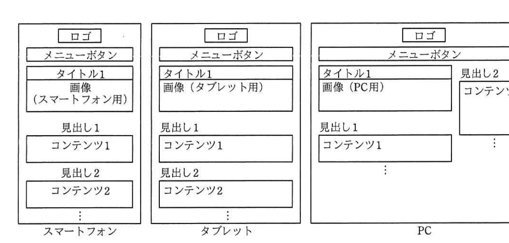

# 2019年春期（平成31年度）応用情報技術者試験 午後 問8（選択）
## 情報システム開発：Webサイトの開発（J社）

---

## 問題文

**問8** Webサイトの開発に関する次の記述を読んで、設問1〜5に答えよ。

J社は、コーヒー店をチェーン展開する外食事業者である。J社が運営するコーヒー店のWebサイトは開設後数年が経過し、デザインが古くなっていることから、Webサイトのリニューアルを実施することになった。

J社のシステム部門に所属するK君は、Webサイトの担当として、リニューアルに当たってのデザイン及び開発方針を整理することになった。

---

### 〔リニューアルにおけるWebサイトデザインの要件〕

リニューアルに当たり、システム部門のL部長から"スマートフォンやタブレットからのアクセスが大きな割合を占めることから、Webサイトにアクセスする手段に応じて、Webサイトの表示を切り替え、利用者が見やすいWebサイトにすること"との要件が示された。

---

### 〔実現案の検討〕

K君は、スマートフォン、タブレット及びPCをWebサイトにアクセスするデバイスとして想定し、この要件に対する実現方法として、次の2案を比較検討した。

- 案1：Webサイトにアクセスする Webブラウザやデバイスのスクリーンサイズ（画面幅）を基準に、表示を切り替える方法
- 案2：Webサイトにアクセスする Webブラウザやデバイスのユーザエージェント情報によって、表示を切り替える方法

案1は、`[　a　]` と呼ばれる手法である。

K君が調査した両案の特徴を表1に示す。

### 表1 K君が調査した両案の特徴

| 項目 | 案1 | 案2 |
|------|-----|-----|
| Webサイト表示の切替え方法 | 様々なデバイスに対して単一の `[　b　]` ファイルを使用する。Webブラウザのウィンドウ幅を基準に、CSSで表示を切り替える。 | デバイスごとに最適化した複数の `[　b　]` ファイルを準備しておく。Webサーバへのアクセス時に通知されるユーザエージェント情報（Webブラウザの `[　c　]` や `[　d　]` の情報）に応じて、適切な `[　b　]` ファイルにリダイレクトを行うことで表示を切り替える。 |
| 表示速度 | リダイレクトを行わないので、表示の遅延は発生しない。ただし、PCの高解像度ディスプレイ用の画像をスマートフォンでも共通して使用する場合には、表示の遅延が発生する。 | 案1と比較した場合、リダイレクトを行う分、表示の遅延が発生する。 |
| デザインの自由度 | どのデバイスでも同じ `[　b　]` ファイルを表示するので、基本的なデザインは共通となる。そのため、デバイスごとに大幅にデザインを変更することは難しい。 | デバイスごとに異なる `[　b　]` ファイルを表示するので、デバイスごとに自由にデザインすることが可能である。 |

K君は表1の両案の特徴を比較し、次の理由から案1を採用する方針とした。

- J社が運営するコーヒー店のWebサイトでは、デバイスごとに大きくデザインを変更する必要がない。
- **①案2は初期開発や将来のデザイン変更において、開発コストが大きくなると考えられる。**

---

### 〔デザインイメージの作成〕

K君は、スマートフォン、タブレット及びPCの3種類のデバイスに対して、それぞれのウィンドウ幅に適したデザインイメージを作成した。

K君が作成したデバイスごとのデザインイメージを図1に示す。

### 図1 K君が作成したデバイスごとのデザインイメージ



> スマートフォン：ロゴ／メニューボタン／タイトル1＋画像（スマートフォン用）／見出し1＋コンテンツ1／見出し2＋コンテンツ2…（シングルカラム）
> タブレット：同様の構成だがシングルカラムで画像はタブレット用
> PC：ロゴ／メニューボタン／タイトル1＋画像（PC用）＋見出し1・コンテンツ1（左カラム）／見出し2＋コンテンツ2…（右カラム、2カラムレイアウト）

スマートフォンとタブレットはシングルカラムのレイアウトとし、PCは2カラムのレイアウトとした。また、見出しや画像の水平方向のレイアウトは、スマートフォンではセンタリング、タブレットとPCでは左寄せとし、上下方向のレイアウトはデバイスにかかわらず上寄せとした。画像はデバイスごとのWebブラウザに合わせたサイズ、縦横比の画像を表示することとし、繰返し表示は行わないこととした。

---

### 〔ブレークポイントの決定〕

案1の実現方法では、デバイスの解像度、ウィンドウの幅・向きなどの指定条件に合わせて別々のCSSを適用する"メディアクエリ"の機能によってCSSを切り替える。Webブラウザのウィンドウ幅でCSSを切り替える条件を"ブレークポイント"という。ブレークポイントはピクセルで指定し、単位はpxで表す。

K君は、図1のデザインイメージに合わせて、スマートフォンとタブレットのブレークポイントを768px、タブレットとPCのブレークポイントを1,024pxとし、表2のように対象デバイスごとのWebブラウザで想定されるウィンドウ幅の範囲を決定した。

### 表2 K君が決定したウィンドウ幅の範囲

| 対象デバイス | ウィンドウ幅の範囲 |
|-------------|-------------------|
| スマートフォン | 320〜767px |
| タブレット | 768〜1,023px |
| PC | 1,024px以上 |

また、表1に示す案1の特徴から、**②非機能要件を考慮して、デバイスごとにサイズの異なる画像を用意し、表2のウィンドウ幅の範囲に合わせて、表示する画像を切り替える方針とした。**

---

### 〔CSSの作成〕

K君は、表2で決定したウィンドウ幅の範囲に合わせてCSSを作成した。CSSで使用する書式及びデータの一部を表3に示す。また、K君が作成したCSSのうち、タブレット用のブレークポイントの指定と画像表示に関する部分の抜粋を図2に示す。ここで、図1中で"タイトル1"の下に表示する画像は、backgroundプロパティを用いて表示することにした。

### 表3 CSSで使用する書式及びデータの一部

| 名称 | 内容 |
|------|------|
| @media screen and() | ブレークポイントを指定する。括弧内の条件に合致する場合、以降のCSSを適用する。条件は複数設定することができる。 |
| min-width | ウィンドウ幅の最小値を表す。 |
| max-width | ウィンドウ幅の最大値を表す。 |
| keyvisual | 画像のclass名を表す。 |
| /images/topimage_w320.jpg | スマートフォン用の画像ファイルのURLを表す。 |
| /images/topimage_w768.jpg | タブレット用の画像ファイルのURLを表す。 |
| /images/topimage_w1024.jpg | PC用の画像ファイルのURLを表す。 |
| height | 高さを指定する。 |
| background | 色、背景画像、原点と寸法、繰返し方法などを設定するプロパティである。 |
| background-image | 背景画像を指定する。url()：括弧内に背景画像のファイルのURLを指定する。none：背景画像を指定しない。 |
| background-position | 背景画像を表示する水平・垂直位置を指定する。top：上寄せ、bottom：下寄せ、left：左寄せ、right：右寄せ、center：中央。 |
| background-repeat | 背景画像の表示の繰返しを指定する。repeat：繰り返して表示し、領域からはみ出す部分は切り取られる。space：繰り返して表示し、領域からはみ出ないよう間隔を調整する。round：繰り返して表示し、領域内に収まるよう拡大・縮小する。repeat-x：水平方向に繰り返して表示する。repeat-y：垂直方向に繰り返して表示する。no-repeat：繰り返して表示しない。 |

### 図2 K君が作成したCSS（抜粋）

```css
@media screen and (min-width: [　e　]) and (max-width: [　f　]){
  /* タブレット用のCSSを記述 */
  .keyvisual{
    height: 300px;
    background-image: url("[　g　]");
    background-position: top left;
    background-repeat: [　h　];
  }
}
```

---

## 設問

### 設問1 本文中の `[　a　]` に入れる適切な字句を答えよ。

### 設問2 表1について、(1)、(2)に答えよ。

**(1)** `[　b　]` に入れる適切な字句を、5字以内のアルファベットで答えよ。

**(2)** `[　c　]`、`[　d　]` に入れる適切な字句を解答群の中から選び、記号で答えよ。

**解答群：**
ア IPアドレス　　イ PC　　ウ ウィンドウ幅
エ 回線　　オ 種類　　カ セッションID
キ バージョン　　ク プロバイダ

### 設問3 本文中の下線①について、開発コストが大きくなる理由を35字以内で述べよ。

### 設問4 図2中の `[　e　]` 〜 `[　h　]` に入れる適切な字句を答えよ。

### 設問5 K君が本文中の下線②の方針とした目的を20字以内で述べよ。

---

## 解答と解説

### 設問1

**正解：レスポンシブWebデザイン**

デバイスの画面幅（スクリーンサイズ）を基準に、単一のHTML／CSSで表示を動的に切り替える手法は**レスポンシブWebデザイン**と呼ばれる。

**IPA公式：レスポンシブWebデザイン**

---

### 設問2

**(1) b = HTML**

案1・案2いずれも「単一の／複数の`[b]`ファイル」という表現があり、Webページの構造を定義するファイル形式＝**HTML**が該当する。

**IPA公式：HTML**

**(2) c = オ（種類）、d = キ（バージョン）　※順不同**

ユーザエージェント情報には、アクセスしてきたWebブラウザの**種類**（Chrome、Safariなど）や**バージョン**の情報が含まれ、これに基づいてデバイスを判別しリダイレクト先を決定する。

**IPA公式：c = オ、d = キ（順不同）**

---

### 設問3

**正解（35字以内）：デバイスごとのHTMLファイルを開発する必要があるから**

案2はデバイスごとに最適化した複数のHTMLファイルを個別に準備・保守する必要があり、初期開発時はもちろん、将来デザインを変更する際にもデバイスの数だけ修正が必要になるため、開発コストが大きくなる。

**IPA公式：デバイスごとのHTMLファイルを開発する必要があるから**

---

### 設問4

**e = 768px / f = 1023px / g = /images/topimage_w768.jpg / h = no-repeat**

- e、f：表2よりタブレットのウィンドウ幅の範囲は768〜1,023px。メディアクエリの条件は`min-width: 768px` `max-width: 1023px`。
- g：タブレット用の画像ファイルは表3より `/images/topimage_w768.jpg`。
- h：本文に「繰返し表示は行わないこととした」とあるため、background-repeatは**no-repeat**。

**IPA公式：e = 768px、f = 1023px、g = /images/topimage_w768.jpg、h = no-repeat**

---

### 設問5

**正解（20字以内）：画像表示の遅延を防ぐため**

下線②「非機能要件を考慮して、デバイスごとにサイズの異なる画像を用意し...表示する画像を切り替える方針」の目的は、表1に記載の「PCの高解像度ディスプレイ用の画像をスマートフォンでも共通して使用する場合には、表示の遅延が発生する」という課題を回避すること。つまり、デバイスに応じた適切なサイズの画像を使うことで**画像表示の遅延を防ぐ**という非機能要件（性能）を満たすため。

**IPA公式：画像表示の遅延を防ぐため**

---

## 参考：主要キーワード

| 用語 | 説明 |
|------|------|
| レスポンシブWebデザイン | ウィンドウ幅などに応じて単一のHTML/CSSで表示レイアウトを動的に変化させる設計手法 |
| メディアクエリ | CSSでデバイスやウィンドウ幅などの条件に応じて異なるスタイルを適用する機能（@media） |
| ブレークポイント | メディアクエリでレイアウトを切り替える基準となるウィンドウ幅の値 |
| ユーザエージェント | Webブラウザやデバイスの種類・バージョンなどをサーバに伝える情報。案2（デバイス別ページ振り分け方式）で利用される |
| background-image／position／repeat | CSSで背景画像の指定・配置・繰り返し方法を制御するプロパティ |
| 非機能要件 | 性能、可用性、セキュリティなど、機能以外の品質に関する要件 |
