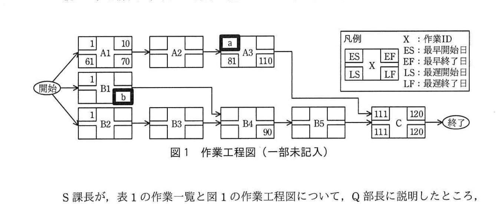

# 2019年春期（平成31年度）応用情報技術者試験 午後 問9（選択）
## プロジェクトマネジメント：システム更改プロジェクトのスケジュールの作成（P社）

---

## 問題文

**問9** システム更改プロジェクトのスケジュールの作成に関する次の記述を読んで、設問1、2に答えよ。

P社は、家電製品の製造・販売を行う中堅企業である。これまでオンプレミスで運用してきた会計システムと人事給与システムが、更改時期を迎えた。P社では、開発コストと運用費用の削減、及び事業継続性の確保を図るために、両システムともクラウドサービスを利用して更改することになった。そこで、情報システム部のQ部長は、クラウドサービスを提供する発注先候補に対して、提案依頼書を発行し、具体的な提案を求めた。

数社から提出された提案書を評価した結果、会計システムはR社が製造業向けに提供しているSaaSを、人事給与システムはR社の提供しているPaaSを、それぞれ利用することにした。R社のクラウドサービスでは、セキュリティが強化された新しいOS（以下、新OSという）と新しいミドルウェア（以下、新MWという）を採用している。

Q部長は、両システムを更改するプロジェクトのプロジェクトマネージャにS課長を指名し、120日以内にシステム更改を完了させることをプロジェクト目標の一つとして、作業内容を整理して、スケジュールを作成するよう指示した。

---

### 〔システム更改の作業内容の整理〕

更改する両システムを利用する部署からの要求は、次のとおりである。

- 会計システムを主に利用する経営企画部と経理部は、各種の財務データを取得、集計、分析するSaaSの機能について、P社向けに一部の改修を要求している。両部は、"この改修を加えれば、十分に業務に適合可能である"と判断している。
- 人事給与システムを主に利用する総務人事部は、"P社特有の人事制度及び職位に基づく給与体系への対応と、プログラムを改修することなく、人事評価区分及び給与区分の追加・削除ができること"を要求している。

これらの要求は、情報システム部の支援の下、要件定義書としてまとめられた。S課長はまず、要件定義書に基づき、システム更改の作業内容を次のとおり整理した。

**(1) 会計システムの更改**
- P社の経理業務に適合させるために、R社のSaaSに対して小規模のカスタマイズを行う。

**(2) 人事給与システムの更改**
- 総務人事部の要求に対応するために、現行の人事給与システムのソフトウェアを改修して、R社のPaaSに配置し、実行できるようにする。
- ソフトウェアの改修は、R社のPaaSを利用し、P社の情報システム部の開発要員だけで、全ての作業を行う。
- ソフトウェアは、人事、給与及び共通の三つのモジュールで構成され、全てのモジュールのプログラムを改修する必要がある。各モジュールとも改修の規模及び改修の難易度は同等である。

---

### 〔システム更改スケジュールの作成〕

次に、S課長は、システム更改スケジュールを明確にするために、プロジェクトで実施すべき作業項目と成果物（文書）を洗い出して、表1の作業一覧を作成した。

### 表1 作業一覧

| 作業ID | 作業区分 | 作業項目 | 所要日数（日） | 先行作業ID | 担当〔（人）〕 | 主な成果物（文書） |
|--------|---------|---------|--------------|-----------|----------------|-------------------|
| A1 | 会計システムの更改 | フィット＆ギャップ分析 | 10 | − | 業務仕様チーム[2]、R社 | フィット＆ギャップ分析報告書 |
| A2 | 会計システムの更改 | カスタマイズ | 10 | A1 | R社 | カスタマイズ完了報告書 |
| A3 | 会計システムの更改 | SaaSの設定・テスト | 30 | A2 | 業務仕様チーム[2]、R社 | SaaS設定完了報告書／SaaSテスト完了報告書 |
| B1 | 人事給与システムの更改 | PaaSの設定・テスト | 10 | − | 環境構築チーム[4]、R社 | PaaS設定完了報告書／PaaSテスト完了報告書 |
| B2 | 人事給与システムの更改 | 外部設計 | 30 | − | 設計チーム[12] | 外部設計書 |
| B3 | 人事給与システムの更改 | ソフトウェア設計 | 24 | B2 | 設計チーム[12] | ソフトウェア設計書 |
| B4 | 人事給与システムの更改 | プログラム製造・単体テスト | 36 | B1、B3 | 製造チーム[12] | プログラム製造・単体テスト完了報告書 |
| B5 | 人事給与システムの更改 | ソフトウェア適格性確認テスト | 20 | B4 | 設計チーム[12] | ソフトウェア適格性確認テスト完了報告書 |
| C | 共通 | システム適格性確認テスト | 10 | A3、B5 | 環境構築チーム[4]、設計チーム[12]、業務仕様チーム[2]、R社 | システム適格性確認テスト完了報告書 |

> 注記：〔　〕内の数値は、P社の開発要員数を表す。

人事給与システムの外部設計からプログラム製造・単体テストまでの各作業項目では、設計チーム及び製造チームは、三つのモジュールに対応して、両チームとも4人ずつの三つのグループに分ける。三つのグループとも、生産性は同じである。三つのグループは、同時に作業を開始し、それぞれ並行して作業を行う。作業が完了した後は、既に計画されている他のプロジェクトの作業を行う。

また、ソフトウェア設計とプログラム製造・単体テストについては、各作業項目とも全グループの作業が完了した時点で、S課長が成果物の品質を判定する。良好と判定されると、各チームは次の作業に着手するルールにする。

続いて、S課長は、表1の作業一覧に基づいて、図1の作業工程図を作成した。

### 図1 作業工程図（一部未記入）

> A1（ES1,EF10,LS61,LF70）→A2→A3(ES `[　a　]`,LS81,LF110)
> B1（ES1,LF `[　b　]`）
> B2（ES1）→B3→B4(EF90)→B5→C（ES111,EF120,LS111,LF120）→終了
> 凡例：X=作業ID、ES=最早開始日、EF=最早終了日、LS=最遅開始日、LF=最遅終了日

S課長が、表1の作業一覧と図1の作業工程図について、Q部長に説明したところ、会計システムの更改においては、**①フィット＆ギャップ分析が完了した時点で、必要に応じて作業一覧と作業工程図を修正する**よう、指示があった。

---

### 〔システム更改スケジュールの見直し〕

会計システムのフィット＆ギャップ分析が完了した時点で、作業一覧と作業工程図の見直しは、不要であると判断された。

一方、人事給与システムの外部設計の途中で、総務人事部から、"人事評価区分及び給与区分の見直し時期を早めるので、開発期間を短縮してほしい"という要請があった。そこで、S課長は、作業IDのB3からB5までの連続する作業の経路が、`[　c　]` の一部となるので、人事給与システムのソフトウェア設計からソフトウェア適格性確認テストまでの作業を対象として、クラッシング及びファストトラッキングの考え方を用いて、開発期間を短縮することにした。開発期間を短縮できた場合には、P社の事業運営において、1日当たり5万円のコストの削減が見込まれる。

開発期間の短縮案として、開発要員を追加して作業計画を見直す案（以下、案1という）と開発要員を追加しないで作業計画を見直す案（以下、案2という）を評価して、採用する案を決定することにした。

S課長は、案1と案2の評価に当たっては、次の前提を置いた。

**(1) 案1**
- 新OSと新MWの環境でのシステム開発経験がある開発要員を設計チーム、製造チームにそれぞれ10人ずつ追加し、設計チーム、製造チームとも22人の体制で、ソフトウェア設計からソフトウェア適格性確認テストまでの作業を行う。
- 追加する開発要員の生産性は、業務要件を理解するのに必要な時間を考慮して、当初計画の80％で見積もる。
- 開発要員を追加した場合の三つのグループの生産性は同じである。
- 開発要員の追加によって増加するコストは、当初の開発要員と同じく、工数1人日当たり5万円とする。

**(2) 案2**
- 開発要員を追加しないで、設計チーム、製造チームとも12人の体制のまま、ソフトウェア設計からソフトウェア適格性確認テストまでの作業を行う。
- 人事給与システムの設計チーム、製造チームの開発要員は、既に計画されている他のプロジェクトの作業に優先して、人事給与システムの作業に参加するように調整する。
- 既に計画されている他のプロジェクトの作業が遅延し、P社の事業運営において増加するコストを150万円と見積もる。
- 当初の予定どおり、人事給与システムのソフトウェア設計の作業は設計チームが担当し、プログラム製造・単体テストの作業は、製造チームが担当する。両チームとも、それぞれ一つのグループで作業を行う。当初の計画では、三つのモジュールについて、同時に作業を開始し、それぞれ並行して作業することにしていたが、この方式をやめて、両チームとも、人事、給与、共通のモジュールの順に作業を行う。一つのグループで行っても作業効率は、当初と変わらない。これによって、ソフトウェア設計の作業が全て完了する予定であった日の16日前から並行して `[　d　]` の作業を開始することができ、開発期間が短縮できる。

S課長は、これらの前提に基づき、案1と案2の評価を表2のように整理した。

### 表2 案1と案2の評価

| 開発期間の短縮案 | 短縮期間（日） | 増加コスト（万円） |
|-----------------|--------------|-------------------|
| 案1 | `[　e　]` | 320 |
| 案2 | 16 | `[　f　]` |

S課長は、この評価を基に、総務人事部と話し合った結果、増加コストを考慮して、案2を採用することにした。そこで、S課長は、開発期間の短縮を確実に実現するために、設計変更が発生した場合には、プロジェクト内で直ちに情報を共有するルールを設定するとともに、ソフトウェア設計及びプログラム製造・単体テストの各作業項目において、**②成果物の品質判定のタイミングを見直す**ことにした。

---

## 設問

### 設問1 〔システム更改スケジュールの作成〕について、(1)、(2)に答えよ。

**(1)** 図1中の `[　a　]`、`[　b　]` に入れる適切な数値を求めよ。

**(2)** 本文中の下線①について、どのような場合に、作業一覧と作業工程図を修正する必要があるか。30字以内で答えよ。

### 設問2 〔システム更改スケジュールの見直し〕について、(1)〜(4)に答えよ。

**(1)** 本文中の `[　c　]` に入れる適切な字句を、10字以内で答えよ。

**(2)** 本文中の `[　d　]` に入れる作業項目を、表1の作業IDから選択して答えよ。

**(3)** 表2中の `[　e　]`、`[　f　]` に入れる適切な数値を求めよ。

**(4)** 本文中の下線②について、品質判定のタイミングをどのように見直すべきか。35字以内で述べよ。

---

## 解答と解説

### 設問1

**(1) a = 21 / b = 54**

- a：A1（ES=1、所要10日、EF=10）→A2（所要10日）→A3の順で連結。A2はA1完了の翌日（ES=11）に開始し、所要10日でEF=20。したがってA3の最早開始日（ES）は **21**。
- b：B4（プログラム製造・単体テスト）はB1とB3の両方が完了しないと開始できない（先行作業ID＝B1、B3）。クリティカルパス側のB3はES=31、所要24日でEF=54となり、B4のES=55が確定する。したがってB1は遅くとも54日目までに終わればよく、B1の最遅終了日（LF）は **54**。

**IPA公式：a = 21、b = 54**

**(2) 正解（30字以内）：カスタマイズの規模が事前の想定とかい離した場合**

フィット＆ギャップ分析は、R社SaaSの標準機能とP社業務要件との差異（ギャップ）を洗い出す工程。分析の結果、想定していたカスタマイズ規模と実際に必要な規模が大きく異なっていた場合には、後続作業（カスタマイズ、設定・テスト等）の見積りが変わるため、作業一覧・作業工程図の修正が必要になる。

**IPA公式：カスタマイズの規模が事前の想定とかい離した場合**

---

### 設問2

**(1) c = クリティカルパス**

B2→B3→B4→B5→Cの経路は、余裕日数（フロート）がゼロで、プロジェクト全体の120日間の完了に直結する経路、すなわち**クリティカルパス**である。

**IPA公式：クリティカルパス**

**(2) d = B4**

案2では、ソフトウェア設計（B3）を人事・給与・共通モジュールの順に1グループで実施する方式に変更。人事モジュールの設計が完了した時点（全体完了予定の16日前）から、そのモジュールについては先行してプログラム製造・単体テスト（B4）に着手できる（ファストトラッキング）。

**IPA公式：B4**

**(3) e = 32 / f = 70**

- e：案1は設計・製造チームをそれぞれ22人（12人＋追加10人）体制にし、追加要員の生産性は80%として計算する。当初計画（12人、3グループ）に対し、要員を追加して短縮できる日数を工数ベースで算出すると、短縮期間は**32日**となる。
- f：案2は開発要員を追加しない代わりに、他プロジェクトの作業遅延によるコスト150万円が発生する一方、モジュール順次実施によるファストトラッキングで16日短縮できる。1日当たり5万円のコスト削減効果（16日×5万円＝80万円）から他プロジェクトへの影響コスト150万円を差し引くと、増加コストは**70万円**（150万円－80万円）となる。

**IPA公式：e = 32、f = 70**

**(4) 正解（35字以内）：各モジュールの各作業が完了したタイミングで品質判定を行う。**

当初は「全グループの作業が完了した時点」でまとめて品質判定していたが、案2ではモジュールを順番に実施するファストトラッキングを行うため、**モジュールごと（各作業が完了したタイミングごと）に品質判定を行う**ように見直す必要がある。これにより、後続作業への早期着手が可能になり、開発期間短縮の効果を確実に得られる。

**IPA公式：各モジュールの各作業が完了したタイミングで品質判定を行う。**

---

## 参考：主要キーワード

| 用語 | 説明 |
|------|------|
| 作業工程図（アローダイアグラム） | 作業の順序関係と所要日数を表すネットワーク図。ES/EF/LS/LFを用いてクリティカルパスを求める |
| クリティカルパス | プロジェクト全体の所要期間を決定する、余裕（フロート）がゼロの作業経路 |
| クラッシング | 追加の資源（要員など）を投入して、作業期間を短縮する技法 |
| ファストトラッキング | 本来順番に行う作業を並行して実施することで、期間を短縮する技法 |
| フィット＆ギャップ分析 | パッケージ・SaaSなどの標準機能と、自社の業務要件との差異（ギャップ）を分析する手法 |
| ES／EF／LS／LF | 最早開始日／最早終了日／最遅開始日／最遅終了日。CPM（クリティカルパス法）で用いる4指標 |
