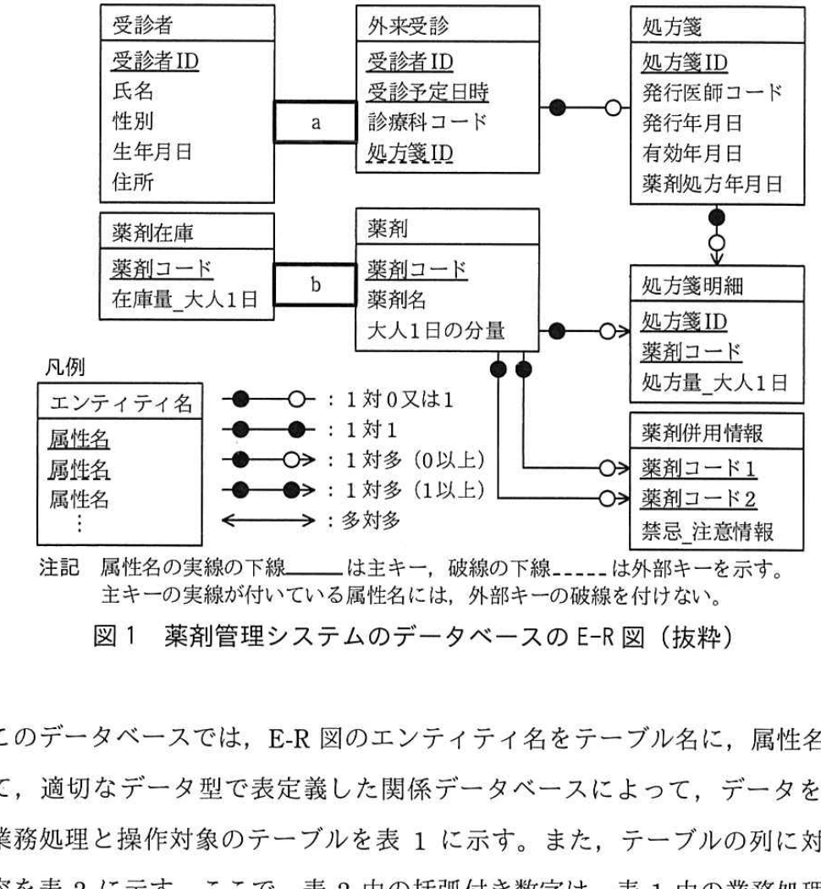

# 2019年春期（平成31年度）応用情報技術者試験 午後 問6（選択）
## データベース：薬剤管理システムの再構築（W病院）

---

## 問題文

**問6** 薬剤管理システムの再構築に関する次の記述を読んで、設問1〜4に答えよ。

W病院は、複数の外来診療科をもっており、症状や病状に応じて処方箋を発行している。W病院には院内薬局があり、受診者の多くは院内薬局で薬剤の処方を受ける。

処方箋には期限があり、発行年月日から有効年月日までを、薬剤の処方を受けることのできる期間としている。

W病院では、受診者への医療サービス向上を目的に、薬剤管理システムの再構築を行うことになった。再構築するシステムには、医師の処方箋作成を支援する次のチェック機能を実装する。

- 処方箋発行の際、処方しようとしている薬剤と過去6か月以内にW病院で発行した処方箋に記載の薬剤との組合せに対し、薬剤併用チェックを行う。薬剤併用チェックでは、併用を禁止する"併用禁忌"となる薬剤の組合せ、及び併用に注意を要する"併用注意"となる薬剤の組合せに該当しないことを確認する。
- 院内薬局で処方することを前提に、処方箋発行時に院内薬局の薬剤に対する在庫チェックを行う。在庫チェックでは、発行した処方箋に記載の薬剤が、院内薬局で有効年月日まで確保されるよう、在庫の保証を行う。

開発に当たり設計した、薬剤管理システムのデータベースのE-R図を図1に示す。なお、"在庫量_大人1日"、"処方量_大人1日"とは、"大人1日の分量"を単位とした在庫量、処方量を示す。

### 図1 薬剤管理システムのデータベースのE-R図（抜粋）



> **エンティティ構成：**
> - 受診者（受診者ID、氏名、性別、生年月日、住所）── `[　a　]` ──外来受診（受診者ID、受診予定日時、診療科コード、処方箋ID）
> - 外来受診 ──（1対0又は1）── 処方箋（処方箋ID、発行医師コード、発行年月日、有効年月日、薬剤処方年月日）
> - 処方箋 ──（1対多、1以上）── 処方箋明細（処方箋ID、薬剤コード、処方量_大人1日）
> - 薬剤在庫（薬剤コード、在庫量_大人1日）── `[　b　]` ──薬剤（薬剤コード、薬剤名、大人1日の分量）
> - 薬剤 ──（1対多、0以上）── 処方箋明細
> - 薬剤 ──（1対多、0以上）×2 ── 薬剤併用情報（薬剤コード1、薬剤コード2、禁忌_注意情報）
>
> 凡例：●─○（1対0又は1）、●─●（1対1）、●─○>（1対多、0以上）、●─●>（1対多、1以上）、<→（多対多）
> 注記：属性名の実線の下線は主キー、破線の下線は外部キーを示す。主キーの実線が付いている属性名には、外部キーの破線を付けない。

このデータベースでは、E-R図のエンティティ名をテーブル名に、属性名を列名にして、適切なデータ型で表定義した関係データベースによって、データを管理する。

業務処理と操作対象のテーブルを表1に示す。また、テーブルの列に対する処理内容を表2に示す。ここで、表2中の括弧付き数字は、表1中の業務処理の括弧付き数字に対応している。

### 表1 業務処理と操作対象のテーブル（抜粋）

| 担当 | 業務処理 | 作成 | 更新 | 削除 |
|------|---------|------|------|------|
| 受付 | (1) 初回の外来受診 | 受診者、外来受診 | − | − |
| 受付 | (2) 2回目以降の外来受診 | 外来受診 | − | − |
| 受付 | (3) 受診者情報変更時の修正 | − | 受診者 | − |
| 医師 | (4) 処方箋の登録（発行前） | 処方箋、処方箋明細 | 外来受診 | − |
| 医師 | (5) 薬剤併用チェック | `[　c　]` | − | `[　c　]` |
| 医師 | (6) 在庫チェック | | `[　c　]` | |
| 医師 | (7) 処方箋（書面）の発行 | − | 処方箋 | − |
| 院内薬局 | (8) 薬剤の処方（薬剤の受渡し） | − | 処方箋、薬剤在庫 | − |
| 院内薬局 | (9) 初回発注の薬剤 | 薬剤、薬剤在庫 | − | − |
| 院内薬局 | (10) 発注実績のある薬剤 | − | − | − |
| 院内薬局 | (11) 薬剤の入庫 | − | `[　d　]` | − |
| 院内薬局 | (12) 薬剤併用情報の定期メンテナンス | 薬剤併用情報 | | |

### 表2 テーブルの列に対する処理内容（抜粋）

| テーブル | 列 | 作成時 | 更新時 |
|---------|-----|--------|--------|
| 受診者 | 住所 | 住所を設定する。(1) | `[　e　]` |
| 外来受診 | `[　f　]` | NULLを設定する。(1)(2) | 値を更新する。(4) |
| 処方箋 | 発行医師コード、発行年月日、有効年月日 | NULLを設定する。(4) | 値を更新する。(7)／値を更新しない。(8) |
| 処方箋 | 薬剤処方年月日 | | 値を更新しない。(7)／値を更新する。(8) |
| 薬剤在庫 | 在庫量_大人1日 | 0を設定する。(9) | 値を減ずる。(8)／値を加える。(11) |

---

### 〔薬剤併用チェック処理〕

薬剤管理システムでは、薬剤併用情報テーブルに"併用禁忌"と"併用注意"となる薬剤の組合せを保持しており、この情報を使い、薬剤併用チェックを行う。

"併用禁忌"と"併用注意"に該当する薬剤の組合せ一覧を出力するSQLを図2に示す。ここで、":受診者ID"、":半年前年月日"、":処方箋ID"は、該当の値を格納する埋込み変数である。また、TO_DATE関数は、指定された文字型の年月日をDATE型に変換するユーザ定義関数である。

薬剤の組合せ一覧には、今回の外来受診では処方しない薬剤や院内薬局で処方を受けなかった薬剤の組合せも含まれており、出力内容を医師が確認し、必要に応じて処方する薬剤を見直す。見直しの結果、処方箋明細が0件になることもあるが、このような場合には、処方箋の発行は行わない運用とし、処方箋レコードは削除しない。

### 図2 "併用禁忌"と"併用注意"に該当する薬剤の組合せ一覧を出力するSQL

```sql
WITH チェック対象薬剤 AS(
  SELECT B1.薬剤コード FROM 処方箋明細 B1,
    (SELECT A1.処方箋ID FROM 外来受診 A1, 処方箋 A2
     WHERE A1.受診者ID = :受診者ID AND A1.処方箋ID = A2.処方箋ID AND
           A2.発行年月日 >= TO_DATE(:半年前年月日)) B2
  WHERE B1.処方箋ID = B2.処方箋ID
  [　g　]
  SELECT C1.薬剤コード FROM 処方箋明細 C1
  WHERE C1.処方箋ID = :処方箋ID)

SELECT * FROM 薬剤併用情報 T1
WHERE [　h　]
  (SELECT T2.薬剤コード1, T2.薬剤コード2 FROM
     (SELECT U1.薬剤コード AS 薬剤コード1, U2.薬剤コード AS 薬剤コード2
      FROM チェック対象薬剤 U1 CROSS JOIN チェック対象薬剤 U2) T2
   WHERE T1.薬剤コード1 = T2.薬剤コード1 AND T1.薬剤コード2 = T2.薬剤コード2)
```

---

### 〔在庫チェック処理〕

在庫チェックでは、"発行した処方箋に記載の薬剤が、院内薬局で有効年月日まで確保されるよう、在庫の保証を行う。"という要件の判定を簡素化するために、処方箋を発行し、有効年月日までに院内薬局で処方する可能性のある薬剤の処方量の合計を、確保量として管理するためのビューを作成することにした。

ビューを作成するSQLを図3に示す。ここで、CURRENT_DATE関数は、参照時の日付をDATE型で返す日時値関数である。

在庫チェックで在庫不足が判明した際は、医師は処方する薬剤の見直しや、長期処方を希望する受診者との処方量の調整を行う。

### 図3 確保量を管理するためのビューを作成するSQL

```sql
CREATE VIEW 処方前確保在庫(薬剤コード, 確保量_大人1日) AS
  SELECT T3.薬剤コード, [　i　]
  FROM
    (SELECT T2.薬剤コード, T2.処方量_大人1日
     FROM 処方箋 T1, 処方箋明細 T2
     WHERE T1.処方箋ID = T2.処方箋ID AND T1.発行年月日 <= CURRENT_DATE AND
           T1.有効年月日 [　j　] AND T1.薬剤処方年月日 [　k　] ) T3
  GROUP BY T3.薬剤コード
```

---

## 設問

### 設問1 図1中の `[　a　]`、`[　b　]` に入れる適切なエンティティ間の関連を解答群の中から選び、記号で答えよ。

**解答群：**
ア ●─○　　イ ○─●　　ウ ●─●
エ ●─○>　　オ <○─●　　カ ●─●>
キ <●─●　　ク <──→

### 設問2 表1と表2について、(1)〜(3)に答えよ。

**(1)** 表1中の `[　c　]`、`[　d　]` に入れる適切なテーブル名を答えよ。

**(2)** 表2中の `[　e　]` に入れる適切な処理内容を、対応する表1中の括弧付き数字を含めて答えよ。

**(3)** 表2中の `[　f　]` に入れる適切な列名を答えよ。

### 設問3 図2中の `[　g　]`、`[　h　]` に入れる適切な字句を答えよ。

### 設問4 図3中の `[　i　]` 〜 `[　k　]` に入れる適切な字句を答えよ。

---

## 解答と解説

### 設問1

**a = カ（●─●>） / b = ウ（●─●）**

- a：受診者1人は複数回の外来受診をもつ（1対多、1以上：受診者が存在しなければ外来受診は存在しないため必ず1以上）→ **カ**
- b：薬剤在庫と薬剤は1対1の関係（薬剤コードごとに在庫情報が1件ずつ対応）→ **ウ**

**IPA公式：a = カ、b = ウ**

---

### 設問2

**(1) c = 処方箋明細 / d = 薬剤在庫**

- c：(5)薬剤併用チェックの作成・削除対象は、チェック結果に応じて処方箋の中身（薬剤の組合せ）を見直す対象である**処方箋明細**。
- d：(11)薬剤の入庫時に更新されるのは**薬剤在庫**（在庫量_大人1日を加算）。

**IPA公式：c = 処方箋明細、d = 薬剤在庫**

**(2) e = 値を更新する。(3)**

受診者テーブルの住所列は、(3)受診者情報変更時の修正で更新される。

**IPA公式：値を更新する。(3)**

**(3) f = 処方箋ID**

外来受診テーブルの列で、作成時にNULLを設定し（処方箋がまだ発行されていないため）、(4)処方箋登録時に値が更新される列＝**処方箋ID**（外部キー）。

**IPA公式：処方箋ID**

---

### 設問3

**g = UNION（又はUNION ALL） / h = EXISTS**

- g：チェック対象薬剤には「過去6か月以内に発行された処方箋の薬剤」と「今回登録する処方箋（:処方箋ID）の薬剤」の両方を含める必要があるため、2つのSELECT結果を**UNION**（または UNION ALL）で結合する。
- h：薬剤併用情報テーブルのうち、チェック対象薬剤の組合せに該当する行だけを抽出する相関副問合せの条件として**EXISTS**を用いる。

**IPA公式：g = UNION又はUNION ALL、h = EXISTS**

---

### 設問4

**i = SUM(T3.処方量_大人1日)**

薬剤コードごとに処方量を合計して確保量とするため、集約関数**SUM**を用いる。

**j = >= CURRENT_DATE**

有効年月日が現在日付以降（まだ有効期限内）の処方箋のみを対象とする。

**k = IS NULL**

薬剤処方年月日がNULL＝まだ薬剤を受け渡していない（未処方）の処方箋明細のみを対象とする（既に処方済みのものは在庫確保の対象外）。

**IPA公式：i = SUM(T3.処方量_大人1日)、j = >= CURRENT_DATE、k = IS NULL**

---

## 参考：主要キーワード

| 用語 | 説明 |
|------|------|
| E-R図 | エンティティ（実体）とその間のリレーションシップを図示したデータモデル表現 |
| 主キー／外部キー | 主キーはレコードを一意に識別する列、外部キーは他テーブルの主キーを参照する列 |
| CROSS JOIN | 2つのテーブルの全組合せ（直積）を生成する結合 |
| WITH句（共通表式） | クエリ内で一時的な名前付き結果セットを定義し、複数箇所で再利用する構文 |
| CURRENT_DATE関数 | 実行時点の日付を返す日時値関数 |
| ビュー（VIEW） | SELECT文の結果を仮想的なテーブルとして扱えるようにするデータベースオブジェクト |
| 併用禁忌／併用注意 | 薬剤の組合せにおいて、同時使用を禁止または注意すべきとされる関係性 |
