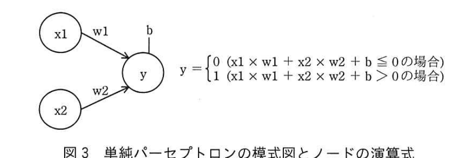
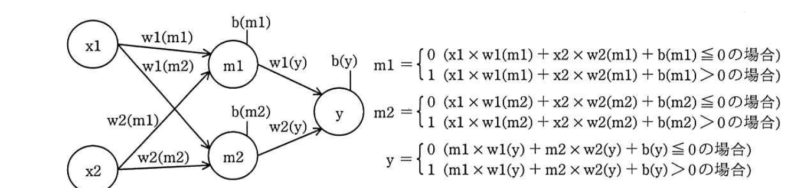

# 2019年秋期（令和元年度）応用情報技術者試験 午後 問3（選択）
## プログラミング：ニューラルネットワーク（パーセプトロン）

---

## 問題文

**問3** ニューラルネットワークに関する次の記述を読んで、設問1〜4に答えよ。

AI技術の進展によって、機械学習に利用されるニューラルネットワークは様々な分野で応用されるようになってきた。ニューラルネットワークが得意とする問題に分類問題がある。例えば、ニューラルネットワークによって手書きの数字を分類（認識）することができる。

分類問題には線形問題と非線形問題がある。図1に線形問題と非線形問題の例を示す。2次元平面上に分布した白丸（○）と黒丸（●）について、線形問題（図1の(a)）では1本の直線で分類できるが、非線形問題（図1の(b)）では1本の直線では分類できない。機械学習において分類問題を解く機構を分類器と呼ぶ。ニューラルネットワークを使うと、線形問題と非線形問題の両方を解く分類器を構成できる。

### 図1 線形問題と非線形問題の例

> (a) 線形問題：2次元平面(x1,x2)上に白丸2個と黒丸3個が分布し、1本の破線（直線）で完全に分離できる。
> (b) 非線形問題：白丸3個と黒丸2個が入り組んで分布し、1本の直線では分離できず、曲線的な境界が必要。

2入力の論理演算を分類器によって解いた例を図2に示す。図2の論理演算の結果（丸数字）は、論理積（AND）、論理和（OR）及び否定論理積（NAND）では1本の直線で分類できるが、排他的論理和（XOR）では1本の直線では分類できない。この性質から、前者は線形問題、後者は非線形問題と考えることができる。

### 図2 2入力の論理演算を分類器によって解いた例

| 論理演算 | x1=0,x2=0 | x1=1,x2=0 | x1=0,x2=1 | x1=1,x2=1 | 分類 |
|---------|---|---|---|---|------|
| 論理積（AND） | 0 | 0 | 0 | 1 | 1本の直線で分類可（線形問題） |
| 論理和（OR） | 0 | 1 | 1 | 1 | 1本の直線で分類可（線形問題） |
| 否定論理積（NAND） | 1 | 1 | 1 | 0 | 1本の直線で分類可（線形問題） |
| 排他的論理和（XOR） | 0 | 1 | 1 | 0 | 1本の直線では分類不可（非線形問題） |

> 注記：横軸(x1)及び縦軸(x2)は論理演算の入力値（0又は1）。丸数字は論理演算の出力値（演算結果）。

---

### 〔単純パーセプトロンを用いた論理演算〕

ここでは、図2に示した四つの論理演算の中から、排他的論理和以外の三つの論理演算を、ニューラルネットワークの一種であるパーセプトロンを用いて、分類問題として解くことを考える。図3に最もシンプルな単純パーセプトロンの模式図とノードの演算式を示す。ここでは、円をノード、矢印をアークと呼ぶ。ノードx1及びノードx2は論理演算の入力値、ノードyは出力値（演算結果）を表す。ノードyの出力値は、アークがもつ重み（w1, w2）とノードyのバイアス（b）を使って、図3中の演算式を用いて計算する。

### 図3 単純パーセプトロンの模式図とノードの演算式



単純パーセプトロンに適切な重みとバイアスを設定することで、論理積、論理和及び否定論理積を含む線形問題を計算する分類器を構成することができる。一般に、重みとバイアスは様々な値を取り得る。表1に単純パーセプトロンで各論理演算を計算するための重みとバイアスの例を示す。

例えば、表1の論理和の重みとバイアスを設定した単純パーセプトロンにx1=1、x2=0を入力すると、図3の演算式から1×0.5+0×0.5−0.2=0.3＞0となり、出力値はy=1となる。

### 表1 単純パーセプトロンで各論理演算を計算するための重みとバイアスの例

| 論理演算 | w1 | w2 | b |
|---------|-----|-----|-----|
| 論理積 | 0.5 | 0.5 | `[　a　]` |
| 論理和 | 0.5 | 0.5 | −0.2 |
| 否定論理積 | −0.5 | −0.5 | 0.7 |

---

### 〔単純パーセプトロンのプログラム〕

単純パーセプトロンの機能を実装するプログラムsimple_perceptronを作成する。プログラムで使用する定数、変数及び配列を表2に、プログラムを図4に示す。simple_perceptronは、論理演算の入力値の全ての組合せXから論理演算の出力値Yを計算する。ここで、関数に配列を引数として渡すときの方式は参照渡しである。また、配列の添え字は0から始まるものとする。

### 表2 プログラムsimple_perceptronで使用する定数、変数及び配列

| 名称 | 種類 | 説明 |
|------|------|------|
| NI | 定数 | 入力ノードの数を表す定数。表1の論理演算では、2入力なので、2となる。 |
| NC | 定数 | 論理演算の入力値の全ての組合せの数を表す定数。表1の論理演算では、4となる。 |
| X | 配列 | 論理演算の入力値の全ての組合せを表す2次元配列。表1の論理演算では、[[0,0],[0,1],[1,0],[1,1]]が設定されている。 |
| Y | 配列 | 論理演算の出力値（演算結果）を格納する1次元配列。表1の論理和では、入力値Xに対応して[0,1,1,1]となる。 |
| WY | 配列 | ノードyのアークがもつ重みの値を表す1次元配列。表1の論理和では、[0.5, 0.5]を与える。 |
| BY | 変数 | ノードyのバイアスの値（b）を表す変数。表1の論理和では、−0.2を与える。 |

### 図4 単純パーセプトロンのプログラム

```
function simple_perceptron(X, Y)
  for( outを0からNC-1まで1ずつ増やす )
    ytemp ← `[　ア　]`
    for( inを0からNI-1まで1ずつ増やす )
      ytemp ← ytemp + `[　イ　]` × `[　ウ　]`
    endfor
    if( ytempが `[　エ　]` )
      Y[out] ← 1
    else
      Y[out] ← 0
    endif
  endfor
endfunction
```

---

### 〔3層パーセプトロンを用いた論理演算〕

パーセプトロンの層を増やすと、単純パーセプトロンでは解くことのできない非線形問題を解くことができるようになる。例えば排他的論理和を計算する分類器は、3層パーセプトロンを用いて構成することができる。

3層パーセプトロンの模式図とノードの演算式を図5に、排他的論理和を計算するための重みとバイアスの例を表3に示す。ノードm1及びノードm2を中間ノードと呼ぶ。

### 図5 3層パーセプトロンの模式図とノードの演算式



### 表3 3層パーセプトロンで排他的論理和を計算するための重みとバイアスの例

| ノード | w1 | w2 | b |
|--------|-----|-----|-----|
| m1 | 0.5 | 0.5 | −0.2 |
| m2 | −0.5 | −0.5 | 0.7 |
| y | 0.5 | 0.5 | −0.6 |

---

### 〔3層パーセプトロンのプログラム〕

3層パーセプトロンの機能を実装するプログラムthree_layer_perceptronを作成する。表2に示したものに加えて、このプログラムで使用する定数及び配列を表4に、プログラムを図6に示す。three_layer_perceptronは、論理演算の入力値の全ての組合せXから論理演算の出力値Yを計算する。

### 表4 プログラムthree_layer_perceptronで使用する定数及び配列

| 名称 | 種類 | 説明 |
|------|------|------|
| NM | 定数 | 中間ノードの数を表す定数。図5では、中間ノードがm1及びm2の二つなので、2となる。 |
| M | 配列 | 中間ノードの演算結果を格納する2次元配列。 |
| WM | 配列 | 中間ノードのアークがもつ重みの値を表す2次元配列。表3の排他的論理和では、[[0.5, 0.5], [−0.5, −0.5]]を与える。 |
| BM | 配列 | 中間ノードのバイアスの値(b)を入れる1次元配列。表3の排他的論理和では、[−0.2, 0.7]を与える。 |

### 図6 3層パーセプトロンのプログラム

```
function three_layer_perceptron(X, Y)
  for( outを0からNC-1まで1ずつ増やす )
    ytemp ← `[　ア　]`
    for( midを0からNM-1まで1ずつ増やす )
      mtemp ← BM[mid]
      for( inを0からNI-1まで1ずつ増やす )
        mtemp ← mtemp + `[　イ　]` × `[　オ　]`
      endfor
      if( mtempが `[　エ　]` )
        M[out][mid] ← 1
      else
        M[out][mid] ← 0
      endif
      ytemp ← ytemp + `[　カ　]` × `[　キ　]`
    endfor
    if( ytempが `[　エ　]` )
      Y[out] ← 1
    else
      Y[out] ← 0
    endif
  endfor
endfunction
```

---

## 設問

### 設問1 表1中の`[　a　]`に入れる適切な数値を解答群の中から選び、記号で答えよ。

**解答群：**
ア −0.7　　イ −0.2　　ウ 0.2　　エ 0.7

### 設問2 表3の値を用いた場合に、図5で入力値x1=1、x2=0に対する中間ノードm2の出力値を答えよ。

### 設問3 図4及び図6中の`[　ア　]`〜`[　キ　]`に入れる適切な字句を答えよ。

### 設問4 2入力の同値（EQ）と否定論理和（NOR）のうち、単純パーセプトロンで解くことができるのはどちらか。論理演算の名称を答え、解くことができる理由を20字以内で述べよ。

なお、同値とは、二つの入力値が等しい場合に1、等しくない場合に0となる論理演算である。

---

## 解答と解説

### 設問1

**正解：ア（−0.7）**

論理積（AND）は、x1=1かつx2=1のときだけy=1となる演算。図3の演算式より、y=1となるのは x1×w1+x2×w2+b＞0 のとき。w1=w2=0.5を用いると、(x1,x2)=(1,1)のとき 1×0.5+1×0.5+b＞0 must hold、かつ(1,0),(0,1),(0,0)では0以下でなければならない。(1,0)のとき 0.5+b≦0 が必要なので b≦−0.5。また(1,1)のとき 1+b＞0 が必要なので b＞−1。選択肢のうち条件（−1＜b≦−0.5）を満たすのは**−0.7**のみ。

**IPA公式：ア**

---

### 設問2

**正解：1**

表3よりm2の重みw1=−0.5、w2=−0.5、b=0.7。x1=1、x2=0を代入すると、
m2 = 1×(−0.5) + 0×(−0.5) + 0.7 = −0.5+0.7 = 0.2 ＞ 0

したがって図3の演算式（0以下なら0、0より大きいなら1）より、m2の出力値は**1**。

**IPA公式：1**

---

### 設問3

**ア = BY / イ = X[out][in] / ウ = WY[in] / エ = 0より大きい / オ = WM[mid][in] / カ = M[out][mid]（カ・キは順不同） / キ = WY[mid]**

- ア：図3の演算式は「x1×w1+x2×w2+**b**」という、バイアスから積算を開始する形。したがって初期値`ytemp`にはバイアスの値**BY**を代入する。
- イ、ウ：内側のforループでは、入力ノードごとに「入力値×重み」を積算していく。入力値の組合せは配列**X[out][in]**（out番目の組合せのin番目の入力値）、対応する重みは**WY[in]**。
- エ：図3の演算式の条件は「0より大きい場合に1」であるため、判定条件は**0より大きい**。
- オ：3層パーセプトロンの中間ノードでも同様に、入力値X[out][in]に対応する中間ノードの重みは**WM[mid][in]**（mid番目の中間ノードのin番目の重み）。
- カ、キ：中間ノードの演算結果M[out][mid]に、中間ノードから出力ノードへの重みWY[mid]を掛けて積算する。したがって`ytemp ← ytemp + M[out][mid] × WY[mid]`となり、**カ=M[out][mid]、キ=WY[mid]**（順不同）。

**IPA公式：ア=BY、イ=X[out][in]、ウ=WY[in]、エ=0より大きい、オ=WM[mid][in]、カ=M[out][mid]、キ=WY[mid]（カ・キ順不同）**

---

### 設問4

**正解：名称＝否定論理和（NOR） / 理由＝否定論理和は線形問題だから（14字）**

同値（EQ）は、(0,0)→1, (0,1)→0, (1,0)→0, (1,1)→1 という真理値になり、これをx1-x2平面にプロットすると対角線上に同じ値が並ぶ配置となり、XOR同様1本の直線では分類できない**非線形問題**である（実際、同値はXORの否定であり、同じく非線形）。

一方、否定論理和（NOR）は、(0,0)→1, それ以外→0となり、原点付近だけが1という配置になるため1本の直線で分類できる**線形問題**である。単純パーセプトロンは線形問題しか解けないため、解くことができるのは**否定論理和（NOR）**であり、その理由は**否定論理和は線形問題だから**。

**IPA公式：名称＝否定論理和、理由＝否定論理和は線形問題だから**

---

## 参考：主要キーワード

| 用語 | 説明 |
|------|------|
| ニューラルネットワーク | 脳の神経回路を模した機械学習モデル。ノード（ニューロン）とアーク（結合）で構成される |
| パーセプトロン | ニューラルネットワークの最も基本的なモデル。入力の重み付き和とバイアスを閾値判定して出力する |
| 線形問題／非線形問題 | 1本の直線で分類できる問題／できない問題。単純パーセプトロン（1層）は線形問題のみ解ける |
| 3層パーセプトロン（多層パーセプトロン） | 入力層・中間層（隠れ層）・出力層をもち、非線形問題（XORなど）も解ける |
| 重み（weight）とバイアス（bias） | 各入力の重要度を表す係数と、出力の閾値を調整する定数。学習により最適化される |
| 論理積・論理和・否定論理積・排他的論理和 | AND、OR、NAND、XORの各論理演算。XORのみ非線形問題で単純パーセプトロンでは解けない |
