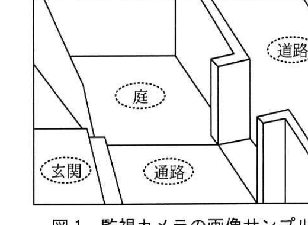

# 2019年秋期（令和元年度）応用情報技術者試験 午後 問4（選択）
## システムアーキテクチャ：ホームセキュリティシステムの実証実験（C社）

---

## 問題文

**問4** ホームセキュリティシステムの実証実験に関する次の記述を読んで、設問1〜3に答えよ。

C社は、関東地区に事業を展開する住宅メーカである。C社の住宅は、最新の住宅機器を採用していることが人気を呼び、販売数を伸ばしている。C社は、近年増大している顧客のセキュリティニーズに応えるために、ホームセキュリティシステム（以下、新システムという）の商品化を検討することにした。この商品化の検討は、C社商品企画部のE君が担当することになった。

---

### 〔新システムの要件〕

E君は、住宅展示場の来場者向けアンケートによって、住居におけるセキュリティニーズの収集を行った。このアンケート結果から、新システムの要件を次のように定義した。

- 玄関上部の側壁に監視カメラを設置し、玄関付近及び敷地内を監視する。
- 監視カメラで撮影した動画データは、後で確認できるように7日間保持する。
- 敷地内に人が侵入した場合には、居住者のスマートフォンに通知する。

---

### 〔実証実験場所の確認〕

E君は、新システムの商品化に向けて、新システムの実証実験をD地区にある住宅展示場で行うことにし、住宅展示場内に設置する監視カメラの設置現場を調査した。図1に、監視カメラの設置予定場所から撮影した画像サンプルを示す。

### 図1 監視カメラの画像サンプル

> 画像内には「玄関」「庭」「通路」「道路」の4つの領域が破線の楕円で示されている。玄関・庭・通路は敷地内、道路は敷地外（公道）。

E君は、実証実験で、図1と同じ画像を撮影できるように監視カメラを設置し、道路を除く玄関、庭、通路で動く物体（以下、動体という）を検知したら通知することにした。通知に当たって、実証実験では、スマートフォン向けアプリケーションソフトウェアの開発は行わず、C社メールサーバが管理する展示場スタッフの電子メール（以下、メールという）アドレス宛てにメールを送信することにした。

---

### 〔新システムの実現方法の検討〕

E君は、新システムには、撮影した動画データを保存する記録機能と動体を検知してメールを送信する動体検知機能が必要であると考えた。また、この二つの機能の設置場所の候補として、監視カメラ、監視サーバ、インターネット上のクラウドサービスの三つを挙げ、表1に示す三つの新システムの方式案を検討した。

### 表1 E君が検討した新システムの方式案

| 方式番号 | 構成概要 | 動体検知の設置場所 | 記録の設置場所 |
|---------|---------|------------------|--------------|
| 方式1 | 住宅の監視カメラ ─ インターネット ─ クラウドサービス（動体検知機能／記録機能）。C社メールサーバはクラウドサービスからの通知を受けてメール送信。 | クラウドサービス | クラウドサービス |
| 方式2 | 住宅の監視カメラ ─ インターネット ─ C社メールサーバ。住宅内の監視サーバに動体検知機能・記録機能を搭載。 | 監視サーバ | 監視サーバ |
| 方式3 | 住宅の監視カメラ（記録機能を内蔵）─ インターネット ─ C社メールサーバ。住宅内の監視サーバに動体検知機能を搭載。 | 監視サーバ | 監視カメラ |

---

### 〔動画データのサイズ確認〕

E君は、監視カメラが撮影した動画データのサイズを確認するために、利用予定の監視カメラを調査した。監視カメラの調査結果（抜粋）を表2に示す。

### 表2 利用予定の監視カメラの調査結果（抜粋）

| 項目 | 説明 |
|------|------|
| カメラ性能 | ・解像度：1280×720 ・フレームレート：30フレーム／秒 ・1ピクセルの表現に必要なビット数：24ビット |
| マイク性能 | ※マイクなし |
| 動画データの圧縮符号化方式 | `[　a　]` |
| インタフェース | ・IEEE 802.3ab（1000BASE-T） ・IEEE 802.11ac |
| 動画記録メディア | ・メモリカード（最大128Gバイトまで） |

この監視カメラで撮影した動画データを監視カメラ以外の機器へ伝送する場合、動画データを圧縮することで、狭いネットワーク帯域でも伝送できる。動画データの圧縮符号化方式の一つである`[　a　]`では、フレーム間の差分を効率よく圧縮する方法などを用いて、高い圧縮率を実現している。

E君は、**①新システムが撮影する動画の特徴**から、動画データの圧縮率は高くなると予想し、無圧縮時と比較して1％に圧縮できると想定した。この結果、必要なネットワーク帯域は`[　b　]`Mビット／秒となり、7日分の圧縮された動画データは`[　c　]`Gバイトとなる。

---

### 〔クラウドサービスと監視サーバの調査〕

E君は、クラウドサービスと監視サーバの調査を行った。E君が調査したクラウドサービスと監視サーバの調査結果（抜粋）を表3に示す。

### 表3 クラウドサービスと監視サーバの調査結果（抜粋）

| 比較項目 | 説明 | クラウドサービス | 監視サーバ |
|---------|------|-----------------|-----------|
| 動体検知の速度 | 監視カメラが撮影した動画から動体を検知する速度 | 遅い | 速い |
| 検知画像範囲の設定機能 | 動体検知を行う画像範囲を設定する機能（例：画像の右上部分は動体検知しない） | なし | あり |
| 検知時間帯の設定機能 | 動体検知を行う時間帯を設定する機能（例：7:00〜18:00は検知する） | あり | あり |
| 検知精度の設定機能 | 動体を検知する精度を設定する機能 | なし | あり |
| 動画記録容量 | 動画データを記録するストレージの容量 | 800Gバイト | 600Gバイト |

E君は、表2と表3の調査結果から、**②新システムの実現方式を選定し**、新システムの構築とテストを行った。

---

### 〔実証実験で検出された不具合〕

住宅展示場で新システムの実証実験が開始され、1か月が経ったとき、展示場スタッフのFさんから"自分だけメールが受信できなくなった。"と連絡があった。E君が新システムのログを確認したところ、**③"容量不足によってメールが受信できない"というメールがC社メールサーバから新システム宛てに返信されていた**。

その後E君は、メールの問題の原因を突き止めた後、実証実験を完了させ、商品化に向けた次のステップに進んだ。

---

## 設問

### 設問1 〔動画データのサイズ確認〕について、(1)〜(4)に答えよ。

**(1)** 表2及び本文中の`[　a　]`に入れる適切な字句を解答群の中から選び、記号で答えよ。

**解答群：**
ア AAC　　イ H.264　　ウ WMA　　エ ZIP

**(2)** 本文中の下線①について、新システムが撮影する動画の特徴とは何か。15字以内で述べよ。

**(3)** 本文中の`[　b　]`に入れる適切な数値を答えよ。答えは小数第2位を四捨五入して、小数第1位まで求めよ。ここで、動画データの伝送に伴うオーバヘッドは無視できるものとし、1Mビットは106ビットとする。

**(4)** 本文中の`[　c　]`に入れる適切な数値を設問1(3)の結果を利用して計算し、答えよ。答えは小数第1位を四捨五入して、整数で求めよ。ここで、1Gバイトは109バイトとする。

### 設問2 本文中の下線②について、(1)、(2)に答えよ。

**(1)** E君が選定した方式は、どの方式か。表1中の方式番号で答えよ。

**(2)** (1)で選定しなかった方式について、方式番号とその方式を選定しなかった理由を、それぞれ30字以内で述べよ。

### 設問3 本文中の下線③について、何の容量が不足したか、表1中の字句を用いて30字以内で述べよ。

---

## 解答と解説

### 設問1

**(1) a = イ（H.264）**

動画データの圧縮符号化方式でフレーム間の差分（動き補償・予測符号化）を利用して高圧縮率を実現する代表的な規格は**H.264**（MPEG-4 AVC）。AACは音声圧縮、WMAは音声圧縮、ZIPは可逆データ圧縮であり動画符号化方式ではない。

**IPA公式：イ**

**(2) 正解（15字以内）：動画に動きが少ない**

住宅の玄関・庭・通路を撮影する監視カメラの映像は、多くの時間帯で人や物の動きがなく静止した背景がほとんどを占める。H.264はフレーム間の差分（動きのある部分）を効率的に圧縮する方式のため、動きが少ない映像ほど圧縮率が高くなる。したがって新システムが撮影する動画の特徴は**動画に動きが少ない**こと。

**IPA公式：動画に動きが少ない**

**(3) b = 6.6（Mビット／秒）**

無圧縮時のビットレートは、解像度×フレームレート×1ピクセルのビット数で求める。
1280×720×30×24 = 663,552,000ビット／秒 ≒ 663.552 Mビット／秒

これを1％に圧縮すると、663.552 × 0.01 ≒ 6.63552 Mビット／秒。小数第2位を四捨五入して小数第1位まで求めると **6.6**。

**IPA公式：6.6**

**(4) c = 499（Gバイト）**

設問1(3)より必要なネットワーク帯域は6.6Mビット／秒。7日分のデータ量（ビット）は、
6.6×106（ビット/秒）× 60×60×24×7（秒）= 6.6×106×604,800 = 3,991,680,000,000ビット

バイトに変換（÷8）：3,991,680,000,000 ÷ 8 = 498,960,000,000バイト

Gバイトに変換（÷109）：498,960,000,000 ÷ 109 = 498.96 Gバイト

小数第1位を四捨五入して整数で求めると **499**。

**IPA公式：499**

---

### 設問2

**(1) 正解：方式2**

**IPA公式：方式2**

**(2) 方式1：動体検知範囲の設定ができないから（16字） / 方式3：メモリカードに7日分の動画データを記録できないから（24字）**

- 方式1（クラウドサービスに動体検知・記録機能）を選定しなかった理由：表3よりクラウドサービスには検知画像範囲の設定機能が「なし」であり、道路を除いて敷地内だけを検知対象とする新システムの要件を満たせない。理由は**動体検知範囲の設定ができないから**。
- 方式3（監視カメラに記録機能）を選定しなかった理由：表2より監視カメラの動画記録メディアはメモリカード（最大128Gバイトまで）だが、設問1(4)より7日分の動画データは約499Gバイト必要であり、128Gバイトでは足りない。理由は**メモリカードに7日分の動画データを記録できないから**。

**IPA公式：方式1＝動体検知範囲の設定ができないから、方式3＝メモリカードに7日分の動画データを記録できないから**

---

### 設問3

**正解（30字以内）：C社メールサーバのFさんのメールボックスの空き容量**

方式2（E君が選定した方式）では、監視サーバが動体検知時にC社メールサーバ経由でスタッフの電子メールアドレスへ通知メールを送信する。Fさんだけがメールを受信できなくなり、C社メールサーバから「容量不足によってメールが受信できない」という返信があったことから、不足していたのはFさん個人のメールボックスの空き容量である。したがって答えは**C社メールサーバのFさんのメールボックスの空き容量**。

**IPA公式：C社メールサーバのFさんのメールボックスの空き容量**

---

## 参考：主要キーワード

| 用語 | 説明 |
|------|------|
| H.264（MPEG-4 AVC） | フレーム間の差分・動き補償を用いて高い圧縮率を実現する動画圧縮符号化方式 |
| 動体検知 | 撮影した映像の中で動きのある物体を検出する機能。検知範囲・時間帯・精度の設定が可能なものもある |
| エッジ処理／クラウド処理 | 処理を機器側（エッジ、ここでは監視カメラ・監視サーバ）で行うか、インターネット上のクラウドサービスで行うかの設計選択 |
| メールボックスの容量不足 | メールサーバでの受信者ごとの保存領域が上限に達すると、新着メールが受信できずエラー応答が返る現象 |
| ビットレート計算 | 解像度×フレームレート×1ピクセルあたりのビット数で無圧縮時のデータ量（ビット/秒）を算出する |
