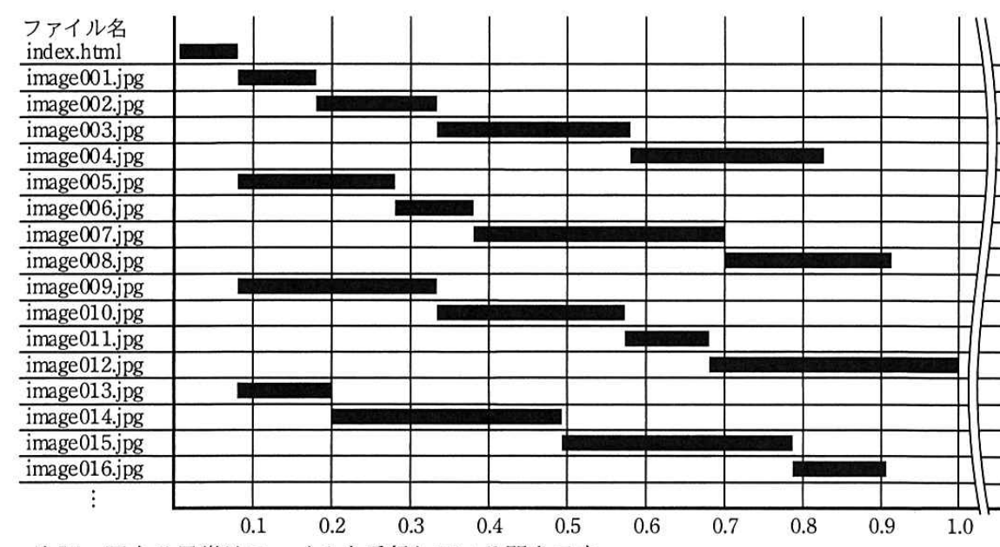
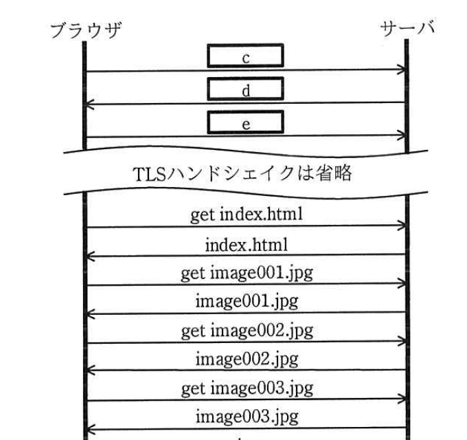

# 2019年秋期（令和元年度）応用情報技術者試験 午後 問5（選択）
## ネットワーク：HTTP/2（E社の写真インターネット販売システム）

---

## 問題文

**問5** HTTP/2に関する次の記述を読んで、設問1〜4に答えよ。

E社は、地域密着型の写真店であり、小学校の運動会や遠足などの行事にカメラマンを派遣し、子供の写真を撮影して販売している。今までは、写真を販売するために、小学校の廊下などに写真のサンプルを掲示し、保護者に購入する写真を選んでもらっていた。しかし、保護者から"インターネットで写真を選びたい"、"写真の電子データを購入したい"との要望が多く寄せられるようになり、インターネット販売用のシステム（以下、新システムという）を開発することにした。新システムの開発は、SIベンダのF社が担当することになった。

新システムの開発は、要件定義、設計、実装と順調に進み、テスト工程における性能テストをF社のG君が担当することになった。

---

### 〔新システムの性能要件〕

G君は新システムの性能テストを行うに当たり、要件定義書に記載の性能要件を確認した。図1に新システムの性能要件（抜粋）を示す。

### 図1 新システムの性能要件（抜粋）

```
<平常時の業務処理量>
・同時アクセス数：40ユーザ
<ピーク時の業務処理量>
・同時アクセス数：平常時の3.0倍
<性能目標値>
・レスポンスタイム：2.0秒以内
```

---

### 〔性能テストの結果〕

G君は、多数のWebブラウザ（以下、ブラウザという）からのアクセスをシミュレートする負荷テストツールを用いて、開発した新システムの性能テストを行った。

性能テストの結果、同時アクセス数が、32ユーザを超えるとアクセスエラーが発生した。ただし、エラー発生時のサーバのCPU、メモリ、ネットワーク回線の使用率は全て10%以下、ディスクのI/O負荷率は20%以下であった。また、レスポンスタイムは、写真を一覧表示するページ（以下、一覧ページという）の表示が最も長く3.0秒だったが、一枚の写真を拡大表示するページなどの他のページの表示は1.0秒であった。

---

### 〔同時アクセス数改善に向けた調査〕

G君は、同時アクセス数の要件を満たせない原因を確認するために、ブラウザの開発者用ツールを用いて、ブラウザが一覧ページの表示に必要なファイルをどのように受信しているか調査した。G君が調査したファイルの受信状況（抜粋）を図2に示す。なお、ブラウザとサーバはHTTP/1.1 over TLS（HTTPS）で通信していた。

### 図2 ファイルの受信状況（抜粋）



> index.html、image001.jpg〜image016.jpg等の各ファイルについて、0〜1.0秒（以降3.0秒まで続く）の間、複数のファイルが時間的に重なりながら（並行して）受信されている様子を示す帯グラフ。1本のTCPコネクション内で最大6本程度のファイルが同時並行的に受信されている。

次に、G君がサーバのログを調査したところ、TCPコネクションを確立できないという内容のログが多く残っていた。この結果からG君は、TCP/IPでサーバとブラウザが通信を行うために必要なサーバの`[　a　]`が枯渇し、新たなTCPコネクションを確立できなくなったと考えた。また、サーバの`[　a　]`の最大数は128に設定されていた。

この二つの調査結果から、**①ブラウザが採用する複数のファイルを並行して受信するための手法**によって、同時アクセス数が制限されてしまっていることが分かった。

---

### 〔レスポンスタイム改善に向けた調査〕

G君は、一つのTCPコネクション内における、ブラウザとサーバの間の通信を調査した。HTTP/1.1 over TLSを用いてブラウザとサーバが通信するとき、ブラウザからサーバの`[　b　]`番ポートに対して`[　c　]`を送信し、サーバから`[　d　]`を返信する、最後にブラウザから`[　e　]`を送信することでTCPコネクションが確立する。その後TLSハンドシェイクを行い、ブラウザはHTMLファイルや画像ファイルなどをサーバへ要求し、サーバは要求に応じてブラウザへファイルを送信している（図3）。また、G君が利用したブラウザでは、HTTPパイプライン機能はオフになっていた。

### 図3 G君が調査したブラウザとサーバ間の通信（抜粋）



> ブラウザ→サーバ：`[c]`／サーバ→ブラウザ：`[d]`／ブラウザ→サーバ：`[e]`（TCP3ウェイハンドシェイク）。以降TLSハンドシェイクを省略し、get index.html→index.html、get image001.jpg→image001.jpg、get image002.jpg→image002.jpg…と、1つずつ順番にリクエスト・レスポンスが繰り返される。

G君は、この結果から、**②TCPコネクション内での画像ファイルの取得に掛かる時間が長くなり**、多くの画像データを含む一覧ページではレスポンスタイムが長くなると考えた。

---

### 〔HTTP/2を用いた新システムの開発〕

G君が調査結果を上司のH課長に報告したところ"HTTP/2の利用を検討すること"とのアドバイスを得た。HTTP/2では、**③一つのTCPコネクションを用いて、複数のファイルを並行して受信するストリーム**という仕組みなど、多くの新しい仕組みが追加されていることが分かった。

そこで、G君は新システムのWebサーバにHTTP/2の設定を行い、再度性能テストを実施した。その結果、新システムが図1の性能要件を満たしていることが確認できた。

その後、新システムの開発は完了し、E社は写真のインターネット販売を開始した。

---

## 設問

### 設問1 〔同時アクセス数改善に向けた調査〕について、(1)、(2)に答えよ。

**(1)** 本文中の`[　a　]`に入れる適切な字句を解答群の中から選び、記号で答えよ。

**解答群：**
ア IPアドレス　　イ ソケット　　ウ プロセス　　エ ポート

**(2)** 本文中の下線①について、図2の調査で分かった、複数のファイルを並行して受信するための手法とは、どのような手法か。25字以内で述べよ。

### 設問2 本文及び図3中の`[　b　]`〜`[　e　]`に入れる適切な字句を解答群の中から選び、記号で答えよ。

**解答群：**
ア 25　　イ 110　　ウ 443
エ ACK　　オ ACK/FIN　　カ FIN
キ SYN　　ク SYN/ACK　　ケ TCP

### 設問3 本文中の下線②について、TCPコネクション内での画像ファイルの取得に時間が掛かる要因は何か。解答群の中から選び、記号で答えよ。

**解答群：**
ア 画像ファイルの取得ごとにTCPコネクションを確立している。
イ 画像ファイルを圧縮せずに取得している。
ウ 画像ファイルを一つずつ順番にサーバに要求し取得している。
エ 複数の画像ファイルをまとめて取得している。

### 設問4 本文中の下線③について、(1)、(2)に答えよ。

**(1)** 複数のファイルを並行して受信可能となることで、ブラウザのどのような待ち時間がなくなるか。20字以内で答えよ。

**(2)** HTTP/2の採用によって、新システムが許容できる最大の同時アクセス数は幾つになるか答えよ。ここで、新システムにアクセスする全てのブラウザがHTTP/2を利用し、一つのTCPコネクションを用いてアクセスするものとする。

---

## 解答と解説

### 設問1

**(1) a = イ（ソケット）**

TCP/IPで通信を行う際、OS上でTCPコネクションごとに割り当てられる通信端点（IPアドレスとポート番号の組を管理する仕組み）は**ソケット**。サーバのソケット数（正確にはソケットとして確保できるリソース）が最大128に制限されており、それを超える新規TCPコネクションを確立できなくなった。IPアドレスやポートは通信の宛先情報であり、プロセスはOS上の実行単位で、いずれも本文の文脈（枯渇する通信リソース）には合わない。

**IPA公式：イ**

**(2) 正解（25字以内）：同時に複数のTCPコネクションを確立する手法**

図2より、一覧ページの表示のために複数のファイル（image001.jpg〜image016.jpg等）が時間的に重なりながら受信されている。HTTP/1.1では1つのTCPコネクションで一度に1つのリクエストしか処理できないため、ブラウザは複数のファイルを並行して取得するために、**同時に複数のTCPコネクションを確立する手法**を採用している。

**IPA公式：同時に複数のTCPコネクションを確立する手法**

---

### 設問2

**b = ウ（443） / c = キ（SYN） / d = ク（SYN/ACK） / e = エ（ACK）**

- b：HTTP over TLS（HTTPS）の標準ポート番号は**443**。
- c、d、e：TCPコネクション確立はTCPの3ウェイハンドシェイクで行われる。ブラウザ→サーバに**SYN**、サーバ→ブラウザに**SYN/ACK**、ブラウザ→サーバに**ACK**を送信することで確立する。

**IPA公式：b = ウ、c = キ、d = ク、e = エ**

---

### 設問3

**正解：ウ（画像ファイルを一つずつ順番にサーバに要求し取得している。）**

図3より、1つのTCPコネクション内では、"get image001.jpg"→"image001.jpg"→"get image002.jpg"→"image002.jpg"のように、1つのファイルの応答を受け取ってから次のファイルを要求するという逐次的（直列）なやり取りが行われている（HTTPパイプラインもオフ）。これにより1つのTCPコネクション内での複数ファイルの取得には時間が掛かる。したがって要因は**画像ファイルを一つずつ順番にサーバに要求し取得している**こと。

**IPA公式：ウ**

---

### 設問4

**(1) 正解（20字以内）：前の画像ファイルの受信完了待ち**

HTTP/1.1（1コネクション内）では、設問3のとおり1つのファイルの受信が完了するまで次のファイルを要求できない「待ち」が発生する。HTTP/2のストリームによって1つのTCPコネクション内で複数ファイルを並行して受信できるようになれば、この**前の画像ファイルの受信完了待ち**がなくなる。

**IPA公式：前の画像ファイルの受信完了待ち**

**(2) 正解：128**

HTTP/2では1ブラウザにつき1つのTCPコネクションで複数ファイルを並行して受信できる（ストリームを利用するため、HTTP/1.1のように複数のTCPコネクションを確立する必要がない）。したがって1ユーザ（1ブラウザ）あたり必要なTCPコネクション（サーバのソケット）は1つで済み、サーバのソケットの最大数128がそのまま同時アクセス数の上限になる。よって新システムが許容できる最大の同時アクセス数は**128**。

**IPA公式：128**

---

## 参考：主要キーワード

| 用語 | 説明 |
|------|------|
| HTTP/1.1とTCPコネクション | 1つのTCPコネクションでは1度に1つのリクエスト/レスポンスしか処理できず、ブラウザは複数コネクションを並行確立してファイルを並列取得する |
| ソケット | OSがTCP/IP通信のためにIPアドレスとポート番号の組を管理する通信端点。数には上限があり、枯渇すると新規接続不可 |
| TCPの3ウェイハンドシェイク | SYN→SYN/ACK→ACKの3回のやり取りでTCPコネクションを確立する手順 |
| HTTPS（HTTP over TLS）の標準ポート | 443番ポート |
| HTTP/2のストリーム | 1つのTCPコネクション内で複数のリクエスト/レスポンスを並行して多重化して送受信できる仕組み（HTTP/1.1の複数コネクション問題を解消） |
| HTTPパイプライン | HTTP/1.1で複数のリクエストをレスポンスを待たずに送信する仕組みだが、応答順序の制約（Head-of-Line Blocking）などから普及しなかった |
