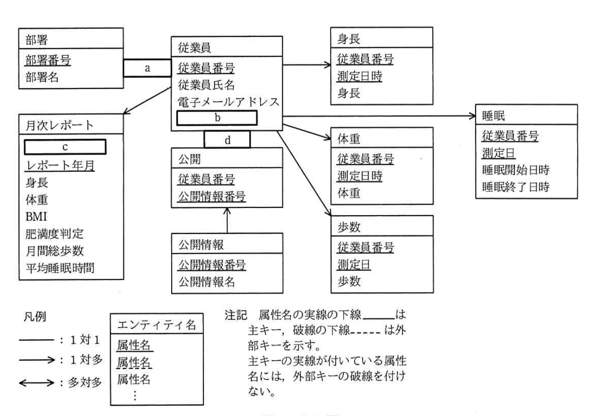

# 2019年秋期（令和元年度）応用情報技術者試験 午後 問6（選択）
## データベース：健康応援システムの構築（W社）

---

## 問題文

**問6** 健康応援システムの構築に関する次の記述を読んで、設問1〜3に答えよ。

W社は、ソフトウェアパッケージの開発を行う企業である。デスクワークが多いことから、従業員が生活習慣病に陥る比率が高く問題となっていた。そこでW社の人事部では、従業員の健康増進のために、通信機能をもつ体重計と、歩数や睡眠時間を記録するリストバンド型活動量計（以下、リストバンドという）を配布し、そのデータを活用する健康応援システム（以下、本システムという）を構築することになった。

---

### 〔本システムのシステム構成〕

本システムは、次の二つのサブシステムから構成される。

- **健康応援データサービス**：本システムのデータを管理するプログラム。各データを登録・更新・削除するためのインタフェースと定期的にデータを集計する機能をもつ。
- **健康応援スマホアプリ**：スマートフォン用のアプリケーションプログラム。体重計やリストバンドとデータ通信を行い、健康応援データサービスとデータ連携させる機能をもつ。

---

### 〔本システムの機能概要〕

本システムでは、従業員の日々の体重や歩数、睡眠時間などを記録して、その推移を可視化する。さらに、従業員間で記録を競わせるイベントを開催することで、従業員の積極的な利用を狙う。その機能概要は次のとおりである。

- **手動データ登録機能**：電子メールアドレスや身長をスマートフォンの画面から登録する。
- **データ連携機能**：体重計やリストバンドから取得したデータを登録する。
- **データ公開機能**：身長や体重などのそれぞれの情報について、自分以外の従業員にも閲覧を許可する場合、公開情報として設定する。
- **月次レポート作成機能**：毎月、従業員ごとのBMI（肥満度を表す体格指数）と肥満度判定、月間総歩数、平均睡眠時間を集計する。
- **歩数対抗戦イベント**：部署ごとの従業員一人当たり平均の月間総歩数を競う。

検討した健康応援データサービスで用いるデータベースのE-R図を図1に示す。このデータベースでは、E-R図のエンティティ名を表名にし、属性名を列名にして、適切なデータ型で表定義した関係データベースによって、データを管理する。

### 図1 E-R図



> エンティティ：部署（部署番号, 部署名）／従業員（従業員番号, 従業員氏名, 電子メールアドレス, `[b]`）／身長（従業員番号, 測定日時, 身長）／体重（従業員番号, 測定日時, 体重）／睡眠（従業員番号, 測定日, 睡眠開始日時, 睡眠終了日時）／歩数（従業員番号, 測定日, 歩数）／公開（従業員番号, 公開情報番号）／公開情報（公開情報番号, 公開情報名）／月次レポート（`[c]`, レポート年月, 身長, 体重, BMI, 肥満度判定, 月間総歩数, 平均睡眠時間）。
> 関連：部署`[a]`従業員（部署１対従業員多）、従業員→身長、従業員→体重、従業員→睡眠、従業員→歩数（いずれも1対多）、従業員`[d]`公開（1対多）、公開情報→公開（1対多）、従業員→月次レポート（1対多、破線矢印から）。
> 注記：属性名の実線の下線は主キー、破線の下線は外部キーを示す。主キーの実線が付いている属性名には、外部キーの破線を付けない。

---

### 〔月次レポート作成機能の実装〕

月次レポートを作成する処理手順を次に示す。

**(1)** 月次レポート表に従業員番号と集計する対象年月だけがセットされたレコードを挿入する。

**(2)** (1)で挿入したレコードについて、次の処理を行う。

① 身長と体重を、最新の測定値で更新する。
② BMIを算出して更新する。
③ BMIから肥満度を判定してその結果を更新する。
④ 対象年月の月間総歩数を集計して更新する。
⑤ 対象年月の睡眠時間を集計して1日当たりの平均睡眠時間を求め、その値で更新する。

処理手順(1)及び(2)④で用いるSQL文を、図2及び図3にそれぞれ示す。ここで、":レポート年月"は、集計する対象年月を格納する埋込み変数である。

なお、関数COALESCE(A, B)は、AがNULLでないときはAを、AがNULLのときはBを返す。関数TOYMは、年月日を年月に変換する関数である。

### 図2 処理手順(1)で用いるSQL文

```sql
INSERT INTO 月次レポート (従業員番号, レポート年月)
`[　e　]`
FROM 従業員
```

### 図3 処理手順(2)④で用いるSQL文

```sql
UPDATE 月次レポート
SET 月間総歩数 =
  (SELECT COALESCE( `[　f　]` , 0)
   FROM 歩数
   WHERE `[　g　]`
     AND TOYM(歩数.測定日) = :レポート年月 )
WHERE レポート年月 = :レポート年月
```

---

### 〔データ連携機能の不具合〕

リストバンドに記録された睡眠データを用いてデータ連携機能のテストを行ったところ、睡眠データの登録処理でエラーが発生した。その際に用いたデータを図4に示す。

なお、この睡眠データはCSV形式で、先頭行はヘッダである。

### 図4 睡眠データの登録処理で用いたデータ

```
"従業員番号","測定日","睡眠開始日時","睡眠終了日時"
EMP00001, 2019-10-02, 2019-10-02 22:30:00, 2019-10-03 06:30:00
EMP00001, 2019-10-03, 2019-10-03 23:15:00, 2019-10-04 03:45:00
EMP00001, 2019-10-04, 2019-10-04 04:30:00, 2019-10-04 07:00:00
EMP00001, 2019-10-04, 2019-10-04 23:45:00, 2019-10-05 06:45:00
EMP00001, 2019-10-05, 2019-10-05 23:30:00,
EMP00001, 2019-10-06, 2019-10-06 22:30:00, 2019-10-07 05:45:00
```

まず、睡眠データの登録処理を確認したところ、その処理では、睡眠データの各行を順次取り出して、ヘッダと同名の睡眠表の各列に値をセットし、1行ずつ睡眠表に挿入していた。

次に、睡眠データを調査したところ、二つの想定外のパターンが判明した。

一つ目は、今回のエラーの原因ではなかったが、就寝中にリストバンドが外れてしまい睡眠終了日時が取得できないパターンで、このパターンに対応するために月次レポート作成機能を修正した。

二つ目が**①今回のエラーを引き起こしたパターン**で、このエラーを回避して全ての睡眠データを登録するために、**②ある表に列の追加以外の変更を加え**、月次レポート作成機能を修正することで、今回のエラーを解消することができた。

---

## 設問

### 設問1 図1中の`[　a　]`〜`[　d　]`に入れる適切なエンティティ間の関連及び属性名を答え、E-R図を完成させよ。

なお、エンティティ間の関連及び属性名の表記は、図1の凡例に倣うこと。

### 設問2 〔月次レポート作成機能の実装〕について、(1)、(2)に答えよ。

**(1)** 図2中の`[　e　]`に入れる適切な字句又は式を答えよ。

**(2)** 図3中の`[　f　]`、`[　g　]`に入れる適切な字句又は式を答えよ。

### 設問3 〔データ連携機能の不具合〕について、(1)、(2)に答えよ。

**(1)** 本文中の下線①のパターンとは、どのような睡眠データのパターンか。30字以内で述べよ。

**(2)** 本文中の下線②にある変更を加えた表の表名と、変更内容を答えよ。

なお、変更内容は、30字以内で述べよ。

---

## 解答と解説

### 設問1

**a = →（1対多） / b = 部署番号 / c = 従業員番号 / d = →（1対多）**

- a：1つの部署に複数の従業員が所属する関係なので、部署から従業員への**1対多（→）**。
- b：従業員エンティティは部署に所属するため、部署番号を外部キーとしてもつ。属性名は**部署番号**（破線の下線で外部キーを表す）。
- c：月次レポートは従業員ごとに作成されるレポートであり、主キーの一部として従業員番号（レポート年月と合わせた複合主キー）をもつ。属性名は**従業員番号**。
- d：1人の従業員が複数の公開情報を公開設定できる（従業員：公開＝1対多）ため、従業員から公開への**1対多（→）**。

**IPA公式：a = →、b = 部署番号、c = 従業員番号、d = →**

---

### 設問2

**(1) e = SELECT 従業員番号, :レポート年月**

月次レポート表に「従業員番号とレポート年月だけがセットされたレコード」を、全従業員分挿入する処理。INSERT INTO ... SELECT文の形式で、従業員表から従業員番号を取得し、レポート年月には埋込み変数`:レポート年月`を設定する。したがって`[e]`は**SELECT 従業員番号, :レポート年月**。

**IPA公式：SELECT 従業員番号, :レポート年月**

**(2) f = SUM(歩数.歩数) / g = 歩数.従業員番号 = 月次レポート.従業員番号**

- f：月間総歩数は対象年月の歩数を合計した値。歩数表の歩数列を**SUM(歩数.歩数)**で合計する。
- g：相関副問合せとして、更新対象の月次レポートの行に対応する従業員の歩数データだけを集計する必要があるため、歩数表と月次レポート表を従業員番号で対応付ける条件**歩数.従業員番号 = 月次レポート.従業員番号**が必要。

**IPA公式：f = SUM(歩数.歩数)、g = 歩数.従業員番号 = 月次レポート.従業員番号**

---

### 設問3

**(1) 正解（30字以内）：1日に2回以上睡眠を取得するパターン**

図4のデータをみると、EMP00001は2019-10-04に「04:30:00〜07:00:00」（早朝の仮眠等）と「23:45:00〜」の2件の睡眠データをもつ。つまり同一の従業員番号・同一の測定日の組合せが2回登場している。睡眠表の主キーが「従業員番号，測定日」であった場合、これは主キー重複によるエラーとなる。したがってエラーを引き起こしたパターンは**1日に2回以上睡眠を取得するパターン**。

**IPA公式：1日に2回以上睡眠を取得するパターン**

**(2) 表名＝睡眠 / 変更内容＝主キーを"従業員番号，睡眠開始日時"に変更する。**

当初の睡眠表の主キーは「従業員番号，測定日」であったと考えられるが、これでは1日に複数回睡眠を取ったデータを登録できない（主キー重複エラー）。この問題を解消するには、1日に複数回発生しても組合せが重複しない属性を主キーに含める必要がある。睡眠開始日時であれば同一測定日内でも時刻が異なるため一意になる。したがって、**睡眠**表の主キーを**"従業員番号，睡眠開始日時"に変更する**。（列の追加ではなく、既存列の主キー構成の変更のみで対応）

**IPA公式：表名＝睡眠、変更内容＝主キーを"従業員番号，睡眠開始日時"に変更する。**

---

## 参考：主要キーワード

| 用語 | 説明 |
|------|------|
| E-R図（実体関連図） | エンティティ（実体）とその間の関連を図示したデータモデル。1対1、1対多、多対多の関連を矢印で表現する |
| 主キー／外部キー | 主キーは表の各行を一意に識別する属性（実線の下線）。外部キーは他表の主キーを参照する属性（破線の下線） |
| 相関副問合せ | 外側のクエリの各行に対応する値を条件として使う副問合せ。UPDATE文のSETやWHERE内でよく使われる |
| COALESCE関数 | 第1引数がNULLでなければその値を、NULLであれば第2引数の値を返す関数。集計結果がない場合のデフォルト値設定に使う |
| 複合主キー設計の見直し | 業務データの実際の発生パターン（1日に複数回など）に応じて、主キーの構成列を見直す必要がある |
