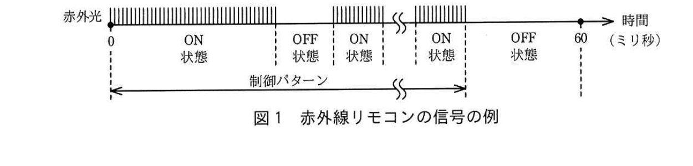
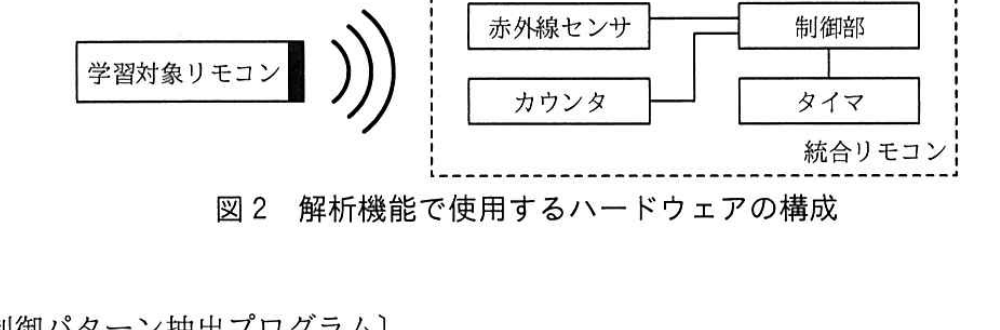
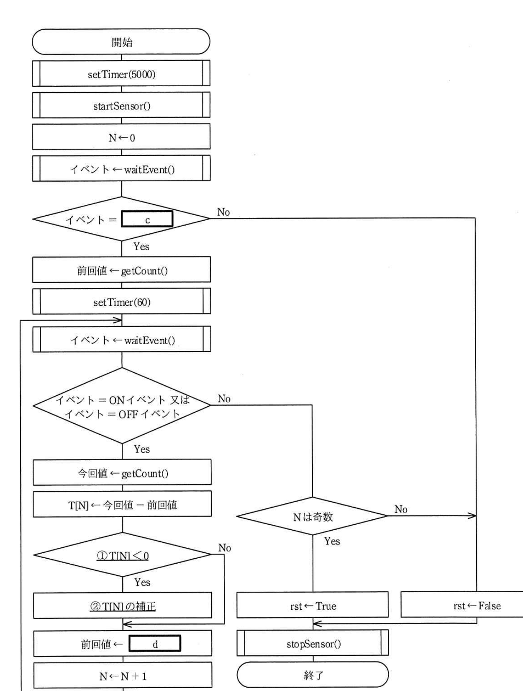

# 2019年秋期（令和元年度）応用情報技術者試験 午後 問7（選択）
## 組込みシステム開発：学習機能付き赤外線リモートコントローラの設計（G社）

---

## 問題文

**問7** 学習機能付き赤外線リモートコントローラの設計に関する次の記述を読んで、設問1〜3に答えよ。

G社は、赤外線リモートコントローラ（以下、赤外線リモコンという）を製造している会社である。今回、複数の異なる機器を1台で操作できる統合型の赤外線リモコン（以下、統合リモコンという）を開発することになった。

統合リモコンには、各種のボタンがあり、このボタンを押して機器を操作する。統合リモコンには、主要メーカの赤外線リモコン及び操作対象の機器の情報があらかじめ登録されており、登録された機器を選択すると、その機器の赤外線リモコンとして使用できる。一方、登録されていない機器については、その機器の赤外線リモコンの信号を解析してボタンごとに登録することによって、その機器の赤外線リモコンとして使用できる。この解析機能・登録機能を学習機能という。

---

### 〔赤外線リモコンの信号〕

赤外線リモコンを使用する環境には、蛍光灯、LED照明などからの人工光と、太陽などからの自然光があり、これらの光を外部光という。外部光には、赤外光が含まれていることがある。

赤外線リモコンは、38〜40kHzで点滅を繰り返す赤外光を使用する。赤外線リモコンの信号には、連続して点滅を繰り返す状態（以下、ON状態という）と、消灯している状態（以下、OFF状態という）がある。

ON状態とOFF状態それぞれの長さの組合せには、ボタンごとに固有のパターンがある。最初のON状態から最後のON状態までの各状態の長さの組合せを制御パターンという。制御パターンは最大60ミリ秒で完了する。一つの制御パターンの中で、ON状態及びOFF状態の最短時間はそれぞれ350マイクロ秒である。

赤外線リモコンの信号の例を図1に示す。

### 図1 赤外線リモコンの信号の例

> 時間軸（0〜60ミリ秒）上に、ON状態（点滅する赤外光）とOFF状態（消灯）が交互に繰り返される様子を示す。0ミリ秒から最初のON状態が始まり、ON→OFF→ON→(中略)→ON状態と続き、最後のON状態の終了後にOFF状態となる。最初のON状態の開始から最後のON状態の終了までが「制御パターン」である。

赤外線リモコンによって操作される機器は、制御パターンを読み取り、その制御パターンに対応した処理を行う。

---

### 〔統合リモコンの学習機能における操作〕

学習機能によって一つのボタンを学習させるときの操作は、次のとおりである。

**(1)** 利用者は、統合リモコンの"特定のボタン"を2秒以上押し続ける。

**(2)** 利用者は、学習対象の赤外線リモコン（以下、学習対象リモコンという）を操作して、統合リモコンに赤外光を送る。統合リモコンは、解析機能によって赤外光から抽出した制御パターンを登録する。

---

### 〔解析機能で使用するハードウェア〕

解析機能では、制御部、赤外線センサ、タイマ及びカウンタを使用する。解析機能で使用するハードウェアの構成を図2に示す。

- 赤外線センサは、赤外光から38〜40kHzの信号を取り出し、ON状態からOFF状態、又はOFF状態からON状態に遷移したことを制御部に通知する。
- タイマは設定した時間になると、制御部に通知する。
- カウンタは16ビットで1マイクロ秒ごとにカウント値が1加算され、カウント値が65,535に達すると、次のカウントで0に戻る。統合リモコンの解析機能が動作している間は、常にカウントしている。

### 図2 解析機能で使用するハードウェアの構成

> 学習対象リモコンから赤外光（波線で表現）が統合リモコンへ送信される。統合リモコン内部は、赤外線センサ・カウンタ・制御部・タイマの4つのハードウェアで構成され、赤外線センサとカウンタはそれぞれ制御部と接続され、制御部はタイマとも接続されている。

---

### 〔制御パターン抽出プログラム〕

制御パターン抽出プログラムは、学習対象リモコンの赤外光を解析して制御パターンを抽出するプログラムで、ON状態の長さ及びOFF状態の長さを、添字が0から始まる配列T[ ]に格納する。配列T[ ]に格納された要素の個数を変数Nに格納する。配列T[ ]及び変数Nは32ビットの符号付き整数型である。

制御パターン抽出プログラムは、イベントを待ち、イベントを受けると、そのイベントに応じた処理を行う。イベントには、OFF状態に遷移したときに赤外線センサから通知されるOFFイベント、ON状態に遷移したときに赤外線センサから通知されるONイベント、及びタイマから通知されるタイマイベントがある。これらのイベントは、FIFO動作するキューに格納される。

ON イベント及びOFFイベントは、同じイベントが連続して通知されることはない。

制御パターン抽出プログラムは、次のように処理する。

- 制御パターンの抽出に成功したときは変数rstにTrueを、失敗したときは変数rstにFalseを設定する。
- 学習対象リモコンの赤外光が一定時間検出されないときは、変数rstにFalseを設定する。
- 最初に通知されたイベントがOFFイベントのときは、変数rstにFalseを設定する。
- 最初に通知されたONイベントから一定時間が経過すると、プログラムを終了する。このとき、最後に赤外線センサから通知されたイベントがONイベントの場合は、変数rstにFalseを設定する。
- 制御パターンの抽出が成功し、kを0から始まる整数としたとき、T[2×k]には、`[　a　]`状態の長さが、T[2×k+1]には、`[　b　]`状態の長さが格納される。

制御パターン抽出プログラムは、表1に示す関数を使用する。

### 表1 使用する関数の仕様

| 関数 | 機能など |
|------|---------|
| startSensor() | 赤外線センサを有効にする。以降、赤外線センサは、ONイベント又はOFFイベントを通知する。 |
| stopSensor() | 赤外線センサを無効にし、タイマを止める。次にFIFO動作するキューを空にする。以降、赤外線センサからのイベント通知は行われない。 |
| waitEvent() | タイマイベント、ONイベント、及びOFFイベントを待つ。通知されたイベントを戻り値として返す。 |
| setTimer(time) | time（ミリ秒）で指定された時間後、タイマイベントを通知するようにタイマに設定する。既に設定されているときに再度設定すると、新しい設定に置き換わる。 |
| getCount() | カウンタのカウント値を32ビットの符号付き整数型の戻り値として返す。カウンタのカウント値は16ビットであり、上位16ビットは常に0である。 |

制御パターン抽出プログラムのフローを図3に示す。

### 図3 制御パターン抽出プログラムのフロー

> 処理概要：
> 開始→setTimer(5000)→startSensor()→N←0→イベント←waitEvent()→〈イベント＝`[c]`？〉
> Yes：前回値←getCount()→setTimer(60)→(ループ開始)イベント←waitEvent()→〈イベント＝ONイベント又はイベント＝OFFイベント？〉
>   Yes：今回値←getCount()→T[N]←今回値−前回値→〈①T[N]＜0？〉Yes：②T[N]の補正→前回値←`[d]`→N←N+1→(ループ先頭へ戻る)　　No：前回値←`[d]`→N←N+1→(ループ先頭へ戻る)
>   No（タイマイベント）：〈Nは奇数？〉Yes：rst←True→stopSensor()→終了　　No：rst←False→stopSensor()→終了
> No（最初のイベント判定でNo）：rst←False→stopSensor()→終了

---

## 設問

### 設問1 〔赤外線リモコンの信号〕、〔解析機能で使用するハードウェア〕について、(1)、(2)に答えよ。

**(1)** 一つの制御パターンにおいて、ON状態の数とOFF状態の数の合計は最大何個となるか。整数で答えよ。

**(2)** 自然光などの外部光を含む光を受けた赤外線センサにおいて、38〜40kHzの信号成分を取り出すものはどれか。適切な字句を解答群の中から選び、記号で答えよ。

**解答群：**
ア UVフィルタ　　イ ハイパスフィルタ　　ウ バンドパスフィルタ　　エ ローパスフィルタ

### 設問2 〔制御パターン抽出プログラム〕について、(1)、(2)に答えよ。ここで、イベント待ち以外の処理時間は無視できるものとし、タイマは指定された時間に正確に機能するものとする。

**(1)** 学習対象リモコンで何も操作が行われないとき、制御パターン抽出プログラムを開始してから終了するまでの時間は何秒か。整数で答えよ。

**(2)** 本文中の`[　a　]`、`[　b　]`に入れる適切な状態名を答えよ。

### 設問3 図3の制御パターン抽出プログラムのフローについて、(1)〜(3)に答えよ。

**(1)** 図3中の`[　c　]`に入れる適切なイベント名、及び`[　d　]`に入れる適切な字句を答えよ。ここで、配列T[ ]の要素の個数は十分に大きいものとする。

**(2)** 図3中の下線①について、T[N]＜0となるのは、どのような事象が発生したときか。20字以内で答えよ。

**(3)** 図3中の下線②について、T[N]の補正方法を、20字以内で答えよ。

---

## 解答と解説

### 設問1

**(1) 正解：171（個）**

制御パターンは最大60ミリ秒（=60,000マイクロ秒）で完了し、ON状態・OFF状態それぞれの最短時間は350マイクロ秒。最初と最後はON状態で終わる構成のため、状態の数を最大化するには、各状態をできる限り最短（350マイクロ秒）にする。

60,000 ÷ 350 = 171.4... なので、350マイクロ秒の状態を171個並べると 350×171 = 59,850マイクロ秒となり60,000マイクロ秒以内に収まる（172個では350×172=60,200マイクロ秒で超過）。したがって最大**171**個。

**IPA公式：171**

**(2) 正解：ウ（バンドパスフィルタ）**

赤外線リモコンの信号は38〜40kHzという特定の周波数帯域の信号。自然光などの外部光にはこの帯域以外の周波数成分（直流光や様々な周波数のノイズ）も含まれるため、特定の周波数帯域だけを通過させる**バンドパスフィルタ**を用いて38〜40kHzの信号成分を取り出す。ハイパスフィルタ・ローパスフィルタは高域・低域どちらか片側を通すフィルタであり、特定の帯域だけを抽出する用途には適さない。UVフィルタは紫外線カット用であり無関係。

**IPA公式：ウ**

---

### 設問2

**(1) 正解：5（秒）**

図3のフローより、開始直後にsetTimer(5000)（5000ミリ秒＝5秒のタイマ）とstartSensor()が実行され、イベント待ちに入る。学習対象リモコンで何も操作が行われない場合、赤外線センサからON/OFFイベントは通知されず、5秒後にタイマイベントが発生する。この時点で「イベント＝`[c]`（ONイベント）」の判定はNoとなり、そのままrst←False→stopSensor()→終了へと進む。したがって、開始から終了までの時間は**5秒**。

**IPA公式：5**

**(2) a = ON / b = OFF**

制御パターン抽出プログラムのフロー（図3）は、最初にONイベントを検出してから（c=ONイベント）、それ以降ON/OFFの遷移ごとにT[N]へ経過時間を記録していく。最初の区間はON状態（c判定がYesになった直後から次のイベントまで）であり、T[0]（k=0のときのT[2×k]）にはON状態の長さが、T[1]（T[2×k+1]）にはOFF状態の長さが格納される。したがって、**a = ON、b = OFF**。

**IPA公式：a = ON、b = OFF**

---

### 設問3

**(1) c = ONイベント / d = 今回値**

- c：フロー最初の分岐「イベント＝`[c]`」でYesの場合に「前回値←getCount()」を行い、以降のT[N]算出処理へ進む。制御パターンはONイベントから始まるため、最初に待つべきイベントは**ONイベント**。
- d：ループ内で「今回値←getCount()」の後、次回のループのために基準時刻を更新する必要がある。次のT[N+1]算出時には、今回のイベント時刻を新たな基準（前回値）とするため、「前回値←**今回値**」となる。

**IPA公式：c = ONイベント、d = 今回値**

**(2) 正解（20字以内）：カウント値が0に戻ったとき**

カウンタは16ビットで、カウント値が65,535に達すると次のカウントで0に戻る（オーバフロー、周回する）。今回値がこの周回によって前回値より小さい値になった場合、「今回値－前回値」がマイナスになってしまう。したがってT[N]＜0となるのは**カウント値が0に戻ったとき**（オーバフローが発生したとき）。

**IPA公式：カウント値が0に戻ったとき**

**(3) 正解（20字以内）：T[N]に65,536を加算する。**

カウンタが16ビット（0〜65,535の周期）でオーバフローした場合、実際の経過時間は「今回値－前回値＋65,536」で正しく求められる。したがって補正方法は**T[N]に65,536を加算する**こと。

**IPA公式：T[N]に65,536を加算する。**

---

## 参考：主要キーワード

| 用語 | 説明 |
|------|------|
| 赤外線リモコンの制御パターン | ON状態・OFF状態の長さの組合せでボタンごとに固有の信号を表現する方式 |
| 学習機能（赤外線リモコン） | 未登録の機器のリモコン信号を解析し、制御パターンとして登録することで操作可能にする機能 |
| バンドパスフィルタ | 特定の周波数帯域だけを通過させるフィルタ。外部光から38〜40kHzの赤外線信号成分を抽出するのに用いる |
| カウンタのオーバフロー（周回）補正 | Nビットカウンタが最大値から0に戻る（周回する）場合、経過時間の計算では周期（2のN乗）を加算して補正する |
| FIFOキューによるイベント処理 | センサやタイマからの通知を到着順にキューへ格納し、順次取り出して処理するイベント駆動方式 |
