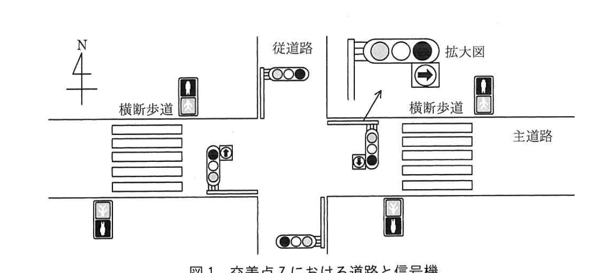
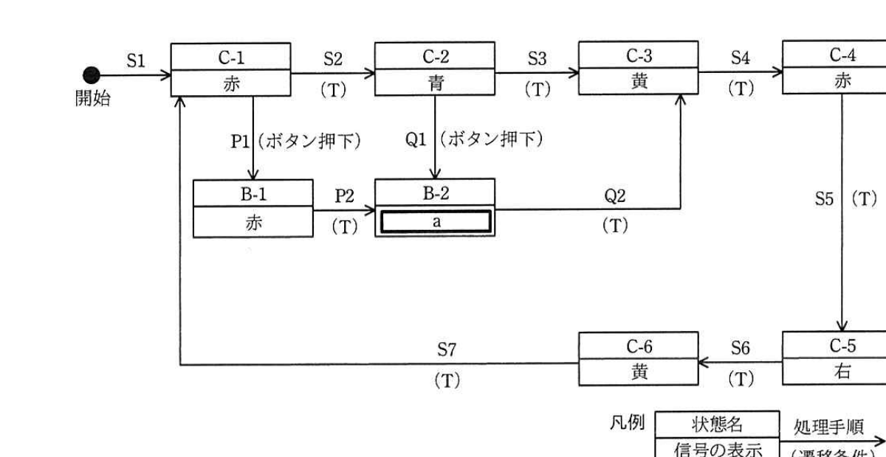
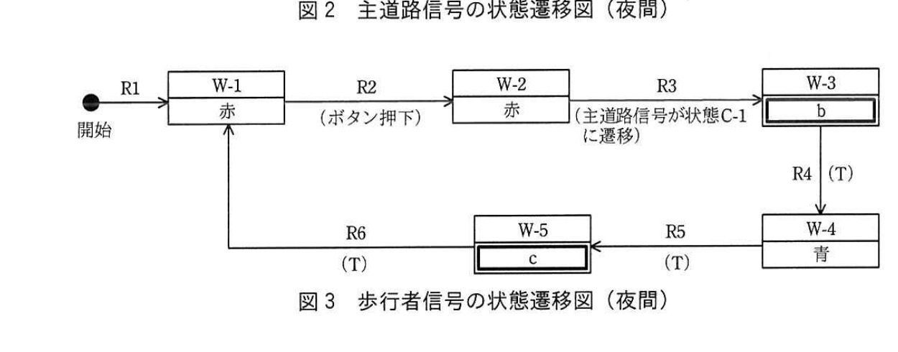

# 2019年秋期（令和元年度）応用情報技術者試験 午後 問8（選択）
## 情報システム開発：道路交通信号機の状態遷移設計（L社）

---

## 問題文

**問8** 道路交通信号機の状態遷移設計に関する次の記述を読んで、設問1〜3に答えよ。

L社は道路交通信号機（以下、信号機という）のシステム開発を行っている会社である。このたび、交差点Zの信号機制御システムを受注した。

交差点Zでは東西方向の主道路と南北方向の従道路が交差しており（図1）、主道路、従道路、及び主道路にかかる横断歩道の信号機をそれぞれ、主道路信号、従道路信号、及び歩行者信号という。従道路信号は主道路信号と連動して制御される。

歩行者信号の表示は"青"、"青点滅"、"赤"の3種類、主道路信号の表示は"青"、"黄"、"赤"、"右"の4種類である。"右"は右折だけ可能な状態であり、このときは、"赤"も同時に点灯する。

歩行者信号は、昼間は主道路信号と同期するが、夜間は常時"赤"となり、歩行者用押しボタンを押した場合（以下、ボタン押下という）だけ"青"になる。ボタン押下は各信号に通知される。ボタン押下された場合、主道路信号の"青"を短くすることで、歩行者の待ち時間を短くするよう考慮する。

L社の担当者M君は、各信号の状態遷移の仕様を表で整理した後、状態遷移図で示し、信号機の制御ソフトウェアを作成することにした。

### 図1 交差点Zにおける道路と信号機

> 東西方向の主道路と南北方向の従道路が交差する交差点Z。主道路信号機（拡大図：青・黄・赤の3灯＋右折矢印の灯器）、従道路信号機、及び主道路にかかる横断歩道の歩行者信号機が設置されている。

---

### 〔信号機の仕様と状態遷移図〕

各信号は、所定の秒数を格納したタイマを使って、状態を変化させる。タイマはセットされた直後からカウントダウンして0になった時点で終了し、次の処理手順へ移行する。また、複数のタイマを同時に処理することができる。

M君は各信号の状態遷移に関する仕様を表で整理した。そして、L社内で設計レビューに臨み、そこでの指摘事項を反映させて仕様を完成させた。主道路信号（夜間）の通常時とボタン押下時の状態遷移に関する仕様を表1と表2に、歩行者信号（夜間）の状態遷移に関する仕様を表3に、それぞれ示す。

### 表1 主道路信号の状態遷移に関する仕様（夜間　通常時）

| 処理手順 | 遷移条件 | 処理前状態 | 処理後状態 | 処理内容 |
|---------|---------|-----------|-----------|---------|
| S1 | − | 開始 | C-1 | 信号を赤にし、タイマ1（15秒）をセット。 |
| S2 | タイマ1終了 | C-1 | C-2 | 信号を青にし、タイマ2（60秒）をセット。 |
| S3 | タイマ2終了 | C-2 | C-3 | 信号を黄にし、タイマ3（3秒）をセット。 |
| S4 | タイマ3終了 | C-3 | C-4 | 信号を赤にし、タイマ4（1秒）をセット。 |
| S5 | タイマ4終了 | C-4 | C-5 | 信号を右にし、タイマ5（10秒）をセット。 |
| S6 | タイマ5終了 | C-5 | C-6 | 信号を黄にし、タイマ3（3秒）をセット。 |
| S7 | タイマ3終了 | C-6 | C-1 | 信号を赤にし、タイマ1（15秒）をセット。 |

### 表2 主道路信号の状態遷移に関する仕様（夜間　ボタン押下時）

| 処理手順 | 遷移条件 | 処理前状態 | 処理後状態 | 処理内容 |
|---------|---------|-----------|-----------|---------|
| P1 | ボタン押下 | C-1 | B-1 | 何もしない。 |
| P2 | タイマ1終了 | B-1 | B-2 | 信号を青にし、タイマ6（10秒）をセット。 |
| Q1 | ボタン押下 | C-2 | B-2 | タイマ6（10秒）をセット。 |
| Q2 | タイマ2とタイマ6のいずれかが終了 | B-2 | C-3 | 終了していないタイマを0にする。信号を黄にし、タイマ3（3秒）をセット。 |

### 表3 歩行者信号の状態遷移に関する仕様（夜間）

| 処理手順 | 遷移条件 | 処理前状態 | 処理後状態 | 処理内容 |
|---------|---------|-----------|-----------|---------|
| R1 | − | 開始 | W-1 | 信号を赤にする。 |
| R2 | ボタン押下 | W-1 | W-2 | 主道路信号の状態監視を開始する。 |
| R3 | 主道路信号が状態C-1に遷移 | W-2 | W-3 | 主道路信号の状態監視を終了して、タイマ7（3秒）をセット。 |
| R4 | タイマ7終了 | W-3 | W-4 | 信号を青にし、タイマ8（8秒）をセット。 |
| R5 | タイマ8終了 | W-4 | W-5 | 信号を青点滅にし、タイマ9（3秒）をセット。 |
| R6 | タイマ9終了 | W-5 | W-1 | 信号を赤にする。 |

> 注記：歩行者信号ではW-1以外の状態でボタン押下があっても処理は発生しない。

表1、表2、及び表3を基に、M君が作成した各信号の状態遷移図を図2、図3に示す。図2、図3中の（T）は表1〜3の遷移条件に示されたタイマの終了を示す。

### 図2 主道路信号の状態遷移図（夜間）

> 開始→S1→C-1（赤）─S2(T)→C-2（青）─S3(T)→C-3（黄）─S4(T)→C-4（赤）─S5(T)→C-5（右）─S6(T)→C-6（黄）─S7(T)→C-1（に戻る）
> C-1からP1（ボタン押下）でB-1（赤）へ、B-1─P2(T)→B-2（`[a]`）、C-2からQ1（ボタン押下）でB-2へ、B-2─Q2(T)→C-3へ合流。

### 図3 歩行者信号の状態遷移図（夜間）

> 開始→R1→W-1（赤）─R2（ボタン押下）→W-2（赤）─R3（主道路信号が状態C-1に遷移）→W-3（`[b]`）─R4(T)→W-4（青）─R5(T)→W-5（`[c]`）─R6(T)→W-1（に戻る）

図2、図3から、主道路信号の状態がC-6（黄）になった直後にボタン押下があったとき、歩行者信号が最初に青になるのは`[　d　]`秒後であることが確認できる。

---

### 〔設計のレビュー〕

M君は当初、表3のR3の遷移条件を"主道路信号が赤"と記載していた。しかし、L社内でのレビューにおいて、その遷移条件では事故につながりかねない重大な**①不具合が発生する**という指摘を受け、この遷移条件を"主道路信号が状態C-1に遷移"と修正した。また、図2の処理手順P1（状態C-1から状態B-1に遷移）がなかった場合に**②生じる現象**についてレビューで説明を行った。

---

### 〔信号機の信頼性設計〕

信号機の制御システムの故障は、人命に関わる事故を引き起こすおそれがあり、M君には十分な信頼性設計を行うように指示が出た。それを受けてM君は、信号機の信頼性設計を完成させた。その設計の中に、次の二つの仕様を含めた。

**(1)** 主道路信号と従道路信号の連動機構が故障した場合、主道路信号を"黄点滅"（注意して進む）に、従道路信号を"赤点滅"（一時停止し、確認後発進）にして、どちらも"青"にはしない。

**(2)** 歩行者用押しボタンが故障した場合、その機能を切り離した縮退運転とし、夜間でも昼間と同様に歩行者信号を主道路信号に同期させる。

---

## 設問

### 設問1 〔信号機の仕様と状態遷移図〕について、(1)、(2)に答えよ。

**(1)** 図2及び図3中の`[　a　]`〜`[　c　]`に入れる適切な字句を答えよ。

**(2)** 本文中の`[　d　]`に入れる適切な数字を答えよ。

### 設問2 〔設計のレビュー〕について、(1)、(2)に答えよ。

**(1)** 本文中の下線①について、どの状態において、どのような不具合につながるのか。具体的に40字以内で述べよ。

**(2)** 本文中の下線②に関する適切な説明を解答群の中から選び、記号で答えよ。

**解答群：**
ア C-1が60秒でC-2に遷移する。
イ C-1でボタン押下されても、主道路信号の青が短くならない。
ウ ボタン押下されていないのに、主道路信号の青が短くなる。
エ 短い時間に繰り返してボタン押下されると、歩行者信号がすぐに青になる。

### 設問3 〔信号機の信頼性設計〕について、本文中の(1)と(2)の信頼性設計の対応策を表す最も適切な字句を、それぞれ解答群の中から選び、記号で答えよ。

**解答群：**
ア フールプルーフ　　イ フェールセーフ　　ウ フェールソフト　　エ フォールトアボイダンス　　オ フォールトトレランス

---

## 解答と解説

### 設問1

**(1) a = 青 / b = 赤 / c = 青点滅**

- a：状態B-2は、表2のP2「タイマ1終了：B-1→B-2、処理内容＝信号を青にし、タイマ6（10秒）をセット」で遷移する状態であり、その信号表示は**青**。
- b：状態W-3は、表3のR3「主道路信号が状態C-1に遷移：W-2→W-3、処理内容＝主道路信号の状態監視を終了して、タイマ7（3秒）をセット」であり、この処理内容には信号表示の変更が含まれていない（W-2の"赤"のまま）。したがって**赤**。
- c：状態W-5は、表3のR5「タイマ8終了：W-4→W-5、処理内容＝信号を青点滅にし、タイマ9（3秒）をセット」であり、その信号表示は**青点滅**。

**IPA公式：a = 青、b = 赤、c = 青点滅**

**(2) d = 6（秒後）**

主道路信号がC-6（黄）になった直後にボタン押下があった場合を考える。表1のS6より、C-6はタイマ3（3秒）がセットされた状態であり、S7によりタイマ3終了（3秒後）でC-1へ遷移する。歩行者信号側では、W-2からR3（主道路信号が状態C-1に遷移）の条件が3秒後に成立し、W-3へ遷移してタイマ7（3秒）がセットされる。さらにR4（タイマ7終了）でW-4（青）へ遷移するのは、その3秒後。

したがって、ボタン押下（C-6突入と同時）から歩行者信号が青になるまでの時間は、3秒（C-6→C-1）＋3秒（タイマ7）＝**6**秒後。

**IPA公式：6**

---

### 設問2

**(1) 正解（40字以内）：状態C-5のときに、主道路信号が右折可能で、歩行者信号が青になる。**

当初の遷移条件"主道路信号が赤"では、状態C-4もC-5（右）も"赤"を同時に点灯しているため（本文に"「右」は右折だけ可能な状態であり、このときは、"赤"も同時に点灯する"とある）、C-5（右折可、かつ赤点灯）の状態でも「主道路信号が赤」という条件を満たしてしまう。この場合、歩行者信号がW-3以降へ進み青信号になり得るが、C-5は右折車両が交差点内を通行中の状態であるため、歩行者信号を青にすると、右折車と横断中の歩行者が交錯する重大な事故につながるおそれがある。したがって不具合は**状態C-5のときに、主道路信号が右折可能で、歩行者信号が青になる**こと。

**IPA公式：状態C-5のときに、主道路信号が右折可能で、歩行者信号が青になる。**（別解：状態C-4でR3の遷移が可能となり主道路信号が右折可能で、歩行者信号が青になる。）

**(2) 正解：イ（C-1でボタン押下されても、主道路信号の青が短くならない。）**

処理手順P1（C-1→B-1、ボタン押下時）がなければ、C-1状態でボタン押下されても状態がC-1のまま変化せず、そのままタイマ1終了でS2によりC-2（通常の青、60秒）へ遷移してしまう。つまりボタン押下による青時間短縮の仕組み（B-1→B-2→Q2経由でタイマ6の10秒に短縮する）が働かず、**C-1でボタン押下されても、主道路信号の青が短くならない**という現象が生じる。

**IPA公式：イ**

---

### 設問3

**(1) 正解：イ（フェールセーフ）**

連動機構が故障した際に、両方向を"青"にせず、主道路を黄点滅・従道路を赤点滅という安全側の状態に制御することは、故障時にシステムを安全な状態に導く**フェールセーフ**の考え方である。

**IPA公式：イ**

**(2) 正解：ウ（フェールソフト）**

歩行者用押しボタンが故障した場合、その機能だけを切り離し、他の基本機能（信号制御）は継続して稼働させる縮退運転を行うことは、故障した機能を切り離しつつシステム全体の運転を継続させる**フェールソフト**の考え方である。

**IPA公式：ウ**

---

## 参考：主要キーワード

| 用語 | 説明 |
|------|------|
| 状態遷移図／状態遷移表 | システムの状態と、状態間を遷移させるイベント（条件）・処理内容を図・表で表現する設計手法 |
| フェールセーフ | 故障時にシステムを安全な状態（人的被害が生じない状態）に導く設計思想 |
| フェールソフト | 故障した部分の機能を切り離し、他の機能を維持して縮退運転を続ける設計思想 |
| フールプルーフ | 誤操作をしても危険な状態にならないようにする設計思想 |
| フォールトトレランス／フォールトアボイダンス | 故障が起きても機能を維持し続ける設計（トレランス）／故障の発生自体を防ぐ設計（アボイダンス） |
| 縮退運転 | 一部機能を制限・停止しつつ、システム全体としては稼働を継続する運転方式 |
