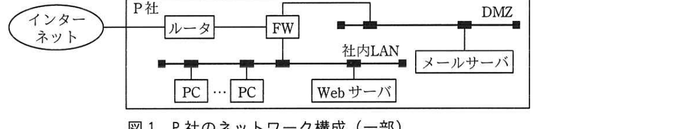

# 2019年秋期（令和元年度）応用情報技術者試験 午後 問1（必須）
## 情報セキュリティ：標的型サイバー攻撃（P社）

---

## 問題文

**問1** 標的型サイバー攻撃に関する次の記述を読んで、設問1、2に答えよ。

P社は、工場などで使用する制御機器の設計・開発・製造・販売を手掛ける、従業員数約50人の製造業である。P社では、顧客との連絡やファイルのやり取りに電子メール（以下、メールという）を利用している。従業員は一人1台のPCを貸与されており、メールの送受信にはPC上のメールクライアントソフトを使っている。メールの受信にはPOP3、メールの送信にはSMTPを使い、メールの受信だけに利用者IDとパスワードによる認証を行っている。PCはケーブル配線で社内LANに接続され、インターネットへのアクセスはファイアウォール（以下、FWという）でHTTP及びHTTPSによるアクセスだけを許可している。また、社内情報共有のためのポータルサイト用に、社内LAN上のWebサーバを利用している。P社のネットワーク構成の一部を図1に示す。社内LAN及びDMZ上の各機器には、固定のIPアドレスを割り当てている。

### 図1 P社のネットワーク構成（一部）



> インターネット ─ ルータ ─ FW ─（社内LAN：PC…PC、Webサーバ）／（DMZ：メールサーバ）という構成。P社内でFWが社内LANとインターネットの境界となっており、DMZにメールサーバが設置されている。

---

### 〔P社に届いた不審なメール〕

ある日、"添付ファイルがある不審な内容のメールを受信したがどうしたらよいか"との問合せが、複数の従業員から総務部の情報システム担当に寄せられた。P社に届いた不審なメール（以下、P社に届いた当該メールを、不審メールという）の文面を図2に示す。

### 図2 不審メールの文面（抜粋）

```
P社従業員の皆様
総務部長のXです。
　通達でお知らせしたとおり、PCで利用しているアプリケーションソフトウェアの調査を依頼し
ます。このメールに情報収集ツールを添付しましたので、圧縮された添付ファイルを次に示すパ
スワードを使ってPC上で展開の上、情報収集ツールを実行して、画面の指示に従ってください。
```

情報システム担当のYさんが不審メールのヘッダを確認したところ、送信元メールアドレスのドメインはP社以外となっていた。また、総務部のX部長に確認したところ、そのようなメールは送信していないとのことであった。X部長は、不審メールの添付ファイルを実行しないように、全従業員に社内のポータルサイト、館内放送及び緊急連絡網で周知するとともに、Yさんに不審メールの調査を指示した。

Yさんが社内の各部署で聞き取り調査を行ったところ、設計部のZさんも不審メールを受信しており、添付ファイルを展開して実行してしまっていたことが分かった。Yさんは、Zさんが使用していたPC（以下、被疑PCという）のケーブルを**①ネットワークから切り離し**、P社のネットワーク運用を委託しているQ社に調査を依頼した。

Q社で被疑PCを調査した結果、不審なプロセスが稼働しており、インターネット上の特定のサーバと不審な通信を試みていたことが判明した。不審な通信はSSHを使っていたので、**②特定のサーバとの通信には失敗していた**。また、Q社は`[　a　]`のログを分析して、不審な通信が被疑PC以外には観測されていないので、被害はないと判断した。

Q社は、今回のインシデントはP社に対する標的型サイバー攻撃であったと判断し、調査の内容を取りまとめた調査レポートをYさんに提出した。

---

### 〔標的型サイバー攻撃対策の検討〕

Yさんからの報告とQ社の調査レポートを確認したX部長は、今回のインシデントの教訓を生かして、情報セキュリティ対策として、図1のP社の社内LANのネットワーク構成を変更せずに実施できる技術的対策の検討をQ社に依頼するよう、Yさんに指示した。Q社のW氏はYさんとともに、P社で実施済みの情報セキュリティ対策のうち、標的型サイバー攻撃に有効な技術的対策を確認し、表1にまとめた。

### 表1 標的型サイバー攻撃に有効なP社で実施済みの情報セキュリティ対策（一部）

| 対策の名称 | 対策の内容 |
|-----------|-----------|
| FWによる遮断 | ・PCからインターネットへのアクセスには、FWでHTTP及びHTTPSだけを許可し、それ以外は遮断する。 |
| PCへのマルウェア対策ソフトの導入 | ・PCにマルウェア対策ソフトを導入し、定期的にパターンファイルの更新とPC上の全ファイルのチェックを行う。<br>・リアルタイムスキャンを有効化する。 |

W氏は、表1の実施済みの情報セキュリティ対策を踏まえて、図1のP社の社内LANのネットワーク構成を変更せずに実施できる技術的対策の検討を進め、表2に示す標的型サイバー攻撃に有効な新たな情報セキュリティ対策案をYさんに示した。

### 表2 標的型サイバー攻撃に有効な新たな情報セキュリティ対策案

| 対策の名称 | 対策の内容 |
|-----------|-----------|
| メールサーバにおけるメール受信対策 | ・メールサーバ向けマルウェア対策ソフトを導入して、届いたメールの本文や添付ファイルのチェックを行い、不審なメールは隔離する。<br>・`[　b　]`などの送信ドメイン認証を導入する。 |
| メールサーバにおけるメール送信対策 | ・PCからメールを送信する際にも、利用者認証を行う。 |
| インターネットアクセス対策 | ・PCから直接インターネットにアクセスすることを禁止（FWで遮断）し、DMZに新たに設置するプロキシサーバ経由でアクセスさせる。<br>・プロキシサーバでは、利用者IDとパスワードによる利用者認証を導入する。<br>・プロキシサーバでは、不正サイトや改ざんなどで侵害されたサイトを遮断する機能を含むURLフィルタリング機能を導入する。 |
| ログ監視対策 | ・Q社のログ監視サービスを利用して、FW及びプロキシサーバのログ監視を行い、不審な通信を検知する。 |

W氏は、新たな情報セキュリティ対策案について、Yさんに次のように説明した。

Yさん：メールサーバに導入する送信ドメイン認証は、標的型サイバー攻撃にどのような効果がありますか。

W氏：送信ドメイン認証は、メールの`[　c　]`を検知することができます。導入すれば、今回の不審メールは検知できたと思います。

Yさん：メールサーバで送信する際に利用者認証を行う理由を教えてください。

W氏：標的型サイバー攻撃の目的が情報窃取だった場合、メール経由で情報が外部に漏えいするおそれがあります。利用者認証を行うことでそのようなリスクを低減できます。

Yさん：インターネットアクセス対策は、今回の不審な通信に対してどのような効果がありますか。

W氏：今回の不審な通信は特定のサーバとの通信に失敗していましたが、マルウェアが使用する通信プロトコルが`[　d　]`だった場合、サイバー攻撃の被害が拡大していたおそれがありました。その場合でも、表2に示したインターネットアクセス対策を導入することで防げる可能性が高まります。

Yさん：URLフィルタリング機能は、どのようなリスクへの対策ですか。

W氏：標的型サイバー攻撃はメール経由とは限りません。例えば、**③水飲み場攻撃によってマルウェアをダウンロードさせられる**ことがあります。URLフィルタリング機能を用いると、そのような被害を軽減できます。

Yさん：ログ監視対策の目的も教えてください。

W氏：表2に示したインターネットアクセス対策を導入した場合でも、高度な標的型サイバー攻撃が行われると、**④こちらが講じた対策を回避してC&C（Command and Control）サーバと通信されてしまうおそれがあります**。その場合に行われる不審な通信を検知するためにログ監視を行います。

W氏から説明を受けたYさんは、Q社から提案された新たな情報セキュリティ対策案をX部長に報告した。報告を受けたX部長は、各対策を導入する計画を立てるとともに、**⑤不審なメールの適切な取扱いについて従業員に周知するように**、Yさんに指示した。

---

## 設問

### 設問1 〔P社に届いた不審なメール〕について、(1)〜(3)に答えよ。

**(1)** 本文中の下線①で、YさんがPCをネットワークから切り離した目的を20字以内で述べよ。

**(2)** 本文中の下線②で、不審なプロセスが特定のサーバとの通信に失敗した理由を20字以内で述べよ。

**(3)** 本文中の`[　a　]`に入れる適切な字句を、図1中の構成機器の名称で答えよ。

### 設問2 〔標的型サイバー攻撃対策の検討〕について、(1)〜(5)に答えよ。

**(1)** 表2中の`[　b　]`に入れる適切な字句を解答群の中から選び、記号で答えよ。

**解答群：**
ア OP25B　　イ PGP　　ウ S/MIME　　エ SPF

**(2)** 本文中の`[　c　]`、`[　d　]`に入れる適切な字句を、それぞれ20字以内で答えよ。

**(3)** 本文中の下線③の水飲み場攻撃では、どこかにあらかじめ仕込んでおいたマルウェアをダウンロードするように仕向ける。マルウェアはどこに仕込まれる可能性が高いか、適切な内容を解答群の中から選び、記号で答えよ。

**解答群：**
ア P社従業員がよく利用するサイト
イ P社従業員の利用が少ないサイト
ウ P社のプロキシサーバ
エ P社のメールサーバ

**(4)** 本文中の下線④で、C&CサーバがURLフィルタリング機能でアクセスが遮断されないサイトに設置された場合、マルウェアがどのような機能を備えていると対策を回避されてしまうか、適切な内容を解答群の中から選び、記号で答えよ。

**解答群：**
ア PC上のファイルを暗号化する機能
イ 感染後にしばらく潜伏してから攻撃を開始する機能
ウ 自身の亜種を作成する機能
エ プロキシサーバの利用者認証情報を窃取する機能

**(5)** 本文中の下線⑤で、P社従業員が不審なメールに気付いた場合、不審なメールに添付されているファイルを展開したり実行したりすることなくとるべき行動として、適切な内容を解答群の中から選び、記号で答えよ。

**解答群：**
ア PCのメールクライアントソフトを再インストールする。
イ 不審なメールが届いたことをP社の情報システム担当に連絡する。
ウ 不審なメールの本文と添付ファイルをPCに保存する。
エ 不審なメールの本文に書かれているURLにアクセスして真偽を確認する。

---

## 解答と解説

### 設問1

**(1) 正解：社内の他の機器と通信させないため（16字）**

不審なプロセスがマルウェアに感染したPC（被疑PC）で稼働しており、外部と不審な通信を行っていた。これ以上被害を拡大させないため、また被疑PCが社内の他の機器（他のPCやサーバ）と通信して感染を広げることを防ぐため、ネットワークから物理的に切り離した。

**IPA公式：社内の他の機器と通信させないため**

**(2) 正解：FWでアクセスが許可されていないから（18字）**

図1・本文より、FWはHTTP及びHTTPSによるアクセスだけを許可しており、それ以外（SSHなど）は遮断される設定になっている。不審なプロセスが使用していた通信はSSHであったため、FWで許可されていないプロトコルとして遮断され、通信に失敗した。

**IPA公式：FWでアクセスが許可されていないから**

**(3) a = FW**

インターネットとの境界にあり、全ての通信のログを一元的に確認できる機器はFWである。Q社はFWのログを分析し、不審な通信が被疑PC以外で観測されていないことを確認した。

**IPA公式：FW**

---

### 設問2

**(1) b = エ（SPF）**

送信ドメイン認証の代表的な技術はSPF（Sender Policy Framework）とDKIM。選択肢中でメールの送信ドメイン認証に該当するのはSPF。OP25Bは動的IPアドレスからの直接のメール送信を制限する対策、PGP・S/MIMEはメール本文の暗号化・署名の方式であり、送信ドメイン認証ではない。

**IPA公式：エ**

**(2) c = 送信元メールアドレスのなりすまし（15字） / d = HTTP又はHTTPS（8字）**

- c：送信ドメイン認証（SPF等）は、送信元メールサーバのIPアドレスとドメインの正当性を検証する仕組みであり、**送信元メールアドレスのなりすまし**を検知できる。今回の不審メールは送信元ドメインがP社以外であったため、導入していれば検知できたと考えられる。
- d：本文よりFWはHTTP及びHTTPSによるアクセスのみ許可している。不審な通信がSSHであったため遮断されたが、もしマルウェアの通信プロトコルが**HTTP又はHTTPS**であれば、FWで許可されている通信として通ってしまい、被害が拡大していたおそれがある。

**IPA公式：c = 送信元メールアドレスのなりすまし、d = HTTP又はHTTPS**

**(3) 正解：ア（P社従業員がよく利用するサイト）**

水飲み場攻撃は、標的とする組織の従業員がよく利用するWebサイトをあらかじめ改ざんし、そこにマルウェアを仕込んでおくことで、被害者が普段どおりアクセスした際に感染させる攻撃手法である。動物が集まる水飲み場で待ち伏せする様子に例えられる。したがって、マルウェアが仕込まれるのは**P社従業員がよく利用するサイト**。

**IPA公式：ア**

**(4) 正解：エ（プロキシサーバの利用者認証情報を窃取する機能）**

表2のインターネットアクセス対策では、PCから直接インターネットへの通信を禁止し、利用者認証を要求するプロキシサーバ経由でのみアクセスを許可している。マルウェアがこの対策を回避してC&Cサーバと通信するには、プロキシサーバの認証を突破する必要があり、そのためには**プロキシサーバの利用者認証情報を窃取する機能**を備えている必要がある。他の選択肢（暗号化、潜伏、亜種作成）はプロキシ認証の回避とは直接関係しない。

**IPA公式：エ**

**(5) 正解：イ（不審なメールが届いたことをP社の情報システム担当に連絡する。）**

添付ファイルを展開・実行せずにとるべき適切な行動は、被害を広げず速やかに組織的な対応につなげることである。選択肢アは無関係な対処、ウは証拠保存に見えるがPCへの保存自体がリスクを伴い適切な初動ではない、エはURLへのアクセス自体が新たな感染経路になり得るため不適切。適切なのは**不審なメールが届いたことを情報システム担当に連絡する**こと。

**IPA公式：イ**

---

## 参考：主要キーワード

| 用語 | 説明 |
|------|------|
| 標的型サイバー攻撃 | 特定の組織を標的に、メールなどを使って侵入しマルウェア感染や情報窃取を狙う攻撃 |
| 水飲み場攻撃（Watering Hole Attack） | 標的組織の従業員がよく利用するWebサイトを改ざんし、アクセスした際にマルウェアに感染させる攻撃手法 |
| C&C（Command and Control）サーバ | 感染したマルウェアに対して外部から遠隔操作の指令を送信するサーバ |
| 送信ドメイン認証（SPF/DKIM） | 送信元メールアドレスやドメインの正当性を検証し、なりすましメールを検知する技術 |
| OP25B（Outbound Port 25 Blocking） | ISPが動的IPアドレスからのポート25番（SMTP）への直接接続を遮断し、スパムメール送信を防ぐ対策 |
| プロキシサーバ／URLフィルタリング | インターネットアクセスを中継し、不正サイトなどへの通信を利用者認証やURLで制御する仕組み |
| ログ監視 | FWやプロキシなどの通信ログを継続的に分析し、不審な通信（C&C通信など）を検知する対策 |
