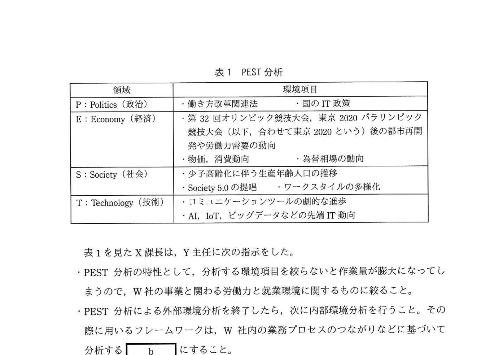
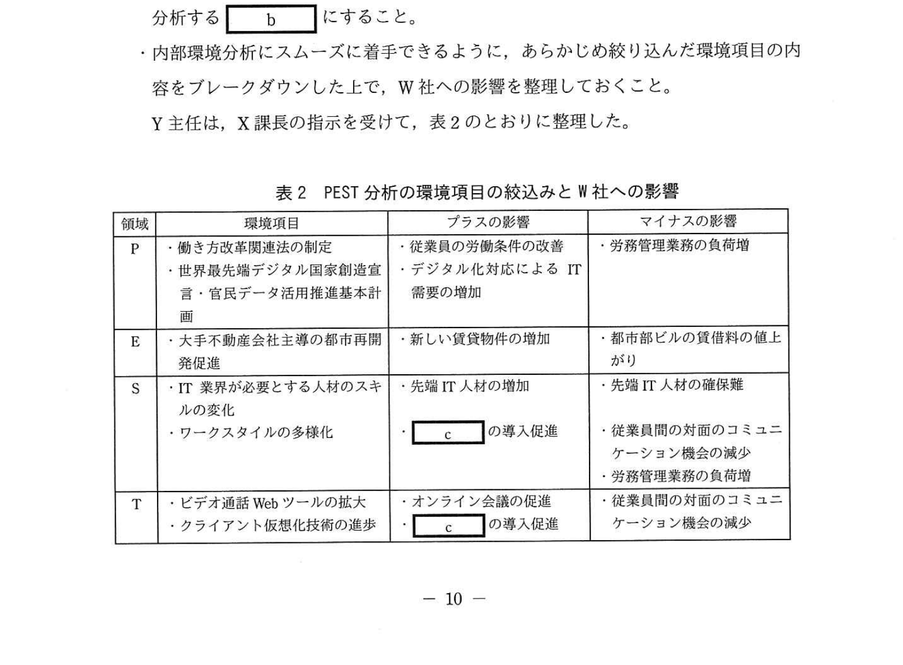

# 2020年秋期（令和2年度）応用情報技術者試験 午後 問2（選択）
## 経営戦略：新事業の創出を目的とする事業戦略の策定（W社ITサービス会社）

---

## 問題文

**問2** 新事業の創出を目的とする事業戦略の策定に関する次の記述を読んで、設問1〜3に答えよ。

W社は、首都圏にあるIT企業である。5年前に設立され、現在の従業員数は約80名である。顧客からは企画提案力と技術力の高さを評価され、業績は好調である。現在はWeb系システムの受託開発が主体であるが、先端ITを活用した付加価値の高いソフトウェアパッケージの販売事業やASP（Application Service Provider）事業を、W社内の先端IT人材の割合を増やすことで新事業として創出するという新たな事業方針を決定している。

この事業方針の実現を図るために、2019年6月に経営企画部のX課長をリーダーとする事業戦略策定チームを立ち上げ、半年間で事業戦略を策定することにした。先端IT人材の確保・育成・定着のためには、多様なワークスタイルの整備が必要である。ワークスタイルとは、業務内容、就業場所、雇用形態、勤務時間など、従業員が働く上での様々な要素を指す。

---

### 〔W社の事業の概要、就業環境及び課題〕

W社の事業の概要、就業環境及び課題は、次のとおりである。

**(1) 事業の概要**

- 顧客は法人企業であり、顧客の主な業種は、小売業、不動産業、飲食サービス業である。顧客の業種ごとに組織された三つの事業部がある。
- 事業部の主な業務内容は、企画、営業、システムの開発及びシステムの保守である。
- WebポータルやECサイトのシステムの受託開発が中心だが、AIやビッグデータなどを活用したカスタマサポートシステムの受託開発の割合が増えている。
- 開発案件の事例として、"AIが、蓄積された膨大なカスタマコンタクト履歴情報からカスタマの行動パターンを分析・学習し、当該カスタマに適したサポートを助言する。"、"AIが、カスタマサポートチームのメンバ間の交流状況を分析・学習し、高パフォーマンスを引き出すようにチームに助言する。"がある。

**(2) 就業環境**

- 各事業部は、顧客のオフィスの所在地などを勘案して、それぞれ別の賃貸ビルを拠点にしている。
- 小売業の顧客を担当している事業部は、独自の通販サイトを用いて急成長している顧客からECサイトのシステム開発・保守を受託して、顧客のオフィスがあるZ駅周辺のビルを賃借している。Z駅には、様々な業種のベンチャー企業が集まり、それらの企業が協業して新しいビジネスモデルを立ち上げる事例がマスコミに幾度も取り上げられ、ベンチャー企業のブランド価値の向上につながっている。

**(3) 課題**

**(i) 人材の確保**

- 過去3年間の従業員の平均採用数は、年間20名程度である。半面、ワークスタイルへの不満を理由に毎年5名程度退職している。
- 3年後には従業員数を150名に増やす事業方針があるが、W社の知名度が低く、現在の売り手市場の状況も加わって、採用者の確保に苦労している。
- **①現状の就業環境下では、拠点間の交流機会が少なく、事業部横断的な活動や発想による斬新なアイデアが生み出しづらくなっている。**

**(ii) 就業環境の改善**

- 各拠点とも手狭で、会議室数が不足している。さらに、3年後を見据えた十分な規模の就業スペースの確保が必要である。
- 先端IT人材は、拠点内に自席を固定して活動するのではなく、オープンな環境での活動を好む傾向にあるので、対応が必要である。

---

### 〔PEST分析とW社への影響の検討〕

X課長は、W社の事業戦略を策定するための準備作業として、IT業界を取り巻く外部環境が、中長期的にW社にどのような影響を与えるかを把握するために、部下のY主任にPEST分析を行うように指示した。PEST分析は、外部環境分析のうち `[　a　]` 環境分析に用いるフレームワークである。Y主任は、新聞、専門書籍、インターネットなどから各領域に関する情報を入手して、表1を作成した。

### 表1 PEST分析

> | 領域 | 環境項目 |
> |------|---------|
> | P: Politics（政治） | ・働き方改革関連法　・国のIT政策 |
> | E: Economy（経済） | ・第32回オリンピック競技大会、東京2020パラリンピック競技大会（以下、合わせて東京2020という）後の都市再開発や労働力需要の動向 ・物価、消費動向　・為替相場の動向 |
> | S: Society（社会） | ・少子高齢化に伴う生産年齢人口の推移 ・Society 5.0の提唱　・ワークスタイルの多様化 |
> | T: Technology（技術） | ・コミュニケーションツールの劇的な進歩 ・AI, IoT, ビッグデータなどの先端IT動向 |

表1を見たX課長は、Y主任に次の指示をした。

- PEST分析の特性として、分析する環境項目を絞らないと作業量が膨大になってしまうので、W社の事業と関わる労働力と就業環境に関するものに絞ること。
- PEST分析による外部環境分析を終了したら、次に内部環境分析を行うこと。その際に用いるフレームワークは、W社内の業務プロセスのつながりなどに基づいて分析する `[　b　]` にすること。
- 内部環境分析にスムーズに着手できるように、あらかじめ絞り込んだ環境項目の内容をブレークダウンした上で、W社への影響を整理しておくこと。

Y主任は、X課長の指示を受けて、表2のとおりに整理した。

### 表2 PEST分析の環境項目の絞込みとW社への影響

> | 領域 | 環境項目 | プラスの影響 | マイナスの影響 |
> |------|---------|------------|--------------|
> | P | ・働き方改革関連法の制定 ・世界最先端デジタル国家創造宣言・官民データ活用推進基本計画 | ・従業員の労働条件の改善 ・デジタル化対応によるIT需要の増加 | ・労務管理業務の負荷増 |
> | E | ・大手不動産会社主導の都市再開発促進 | ・新しい賃貸物件の増加 | ・都市部ビルの賃借料の値上がり |
> | S | ・IT業界が必要とする人材のスキルの変化 ・ワークスタイルの多様化 | ・先端IT人材の増加 ・ `[　c　]` の導入促進 | ・先端IT人材の確保難 ・従業員間の対面のコミュニケーション機会の減少 ・労務管理業務の負荷増 |
> | T | ・ビデオ通話Webツールの拡大 ・クライアント仮想化技術の進歩 | ・オンライン会議の促進 ・ `[　c　]` の導入促進 | ・従業員間の対面のコミュニケーション機会の減少 |

---

### 〔事業戦略の策定と施策への展開〕

まず、X課長とY主任は、課題への対応に関して、次の方針を立てた。

- ワークスタイルの多様化に対応すること、及び先端IT企業というブランド価値を向上させることによって、優秀な先端IT人材の確保・定着を促進する。
- 多様なワークスタイルを整備することによって、従業員個人のモチベーションを向上させ、業務のパフォーマンスを改善する。さらに、就業スペースの拡大とともに事業部を越えた従業員間のインフォーマルなコミュニケーションを活性化して、斬新なアイディアを生み出す就業環境を作り、新事業の創出につなげる。

次に、環境分析の結果と課題への対応方針に基づき、先端IT人材を増やして付加価値の高い製品を開発することで事業拡大を図るという事業戦略を策定した。先端IT人材を増やすためには、従業員同士が対面のコミュニケーションを図れる就業環境とITを活用したコミュニケーション環境を両立させることが有効であると考えた。また、多様なワークスタイルを整備することも重要だと考えて、次の施策をまとめた。

**(1) 新しい拠点への集結**

Z駅から徒歩圏内の賃貸ビルに入居し、全従業員を集結する。これによって、Z駅周辺を拠点とする異業種のベンチャー企業と交流を深め、それらの企業と協業して新事業の創出を目指す。この施策には、**②新事業の創出以外の狙い**もある。

**(2) 新しい就業環境の整備**

- 従業員が自席を固定しないフリーアドレス制を採用する。
- 様々な形のテーブルや椅子、PC、コーヒーサーバなどを設置し、社内の打合せに自由に利用できるコミュニケーションスペースを設ける。
- メール機能、スケジュール機能、オンライン会議機能を統合した企業内コミュニケーションツールを導入し、社外でも社内と同じように働ける就業環境を作る。
- インフォーマルなコミュニケーションツールとして、社内SNSを導入する。
- これらによって、多様なワークスタイルを支援する就業環境が整備された後、従業員個人の業務への取組み状況及び**③従業員間の交流状況などの情報を、企業内コミュニケーションツールや社内SNSの利用履歴からモニタリングする**。

**(3) 多様なワークスタイルの整備に対応した社内制度の見直し**

- 将来的に、テレワークの勤務制度の導入を検討する。本社業務部門は、関連する社内規程の改定や人事評価方法の見直しを行う。
- **④テレワークの勤務制度の導入によって、本社業務部門の担当である一部の業務の負荷が増える懸念があるので、対策を検討する。**

---

## 設問

### 設問1 本文中の下線①の状態のままでは危惧される、W社の事業に関する機会損失リスクを、25字以内で述べよ。

### 設問2 〔PEST分析とW社への影響の検討〕について、(1)〜(4)に答えよ。

**(1)** 本文中の `[　a　]` に入れる適切な字句を解答群の中から選び、記号で答えよ。

**解答群：** ア 市場　イ 内部　ウ マクロ　エ ミクロ

**(2)** 本文中の `[　b　]` に入れる適切な字句を解答群の中から選び、記号で答えよ。

**解答群：** ア 3C分析　イ SWOT分析　ウ バリューチェーン分析　エ ファイブフォース分析

**(3)** 表1で挙げた東京2020後の労働力需要の動向を表2の作成時に除外している。その理由として適切なものを解答群の中から選び、記号で答えよ。

**解答群：**
- ア IT業界に直接的な影響を及ぼす変化だから
- イ 一時的な変化だから
- ウ スピードが遅い変化だから
- エ 中長期の構造的な変化だから

**(4)** 表2中の `[　c　]` に入れる適切な字句を、本文中の用語を使って15字以内で答えよ。

### 設問3 〔事業戦略の策定と施策への展開〕について、(1)〜(3)に答えよ。

**(1)** 本文中の下線②について、新事業の創出以外の狙いを、15字以内で答えよ。

**(2)** 本文中の下線③について、モニタリングにとどまらず、W社が開発案件で習得した先端ITを応用してできる施策を、40字以内で述べよ。

**(3)** 本文中の下線④について、負荷が増える懸念のある業務の名称を、5字以内で答えよ。

---

## 解答と解説

### 設問1

**正解：新事業の創出につながる機会が失われる（19字）**

下線①: 「現状の就業環境下では、拠点間の交流機会が少なく、事業部横断的な活動や発想による斬新なアイデアが生み出しづらくなっている」

この状態のままでは:
- 事業部間の横断的な協業ができない
- Z駅のベンチャー企業との協業を通じた新事業創出の機会を逃す
- 斬新なアイデアが生まれず、新しいビジネスチャンスを掴めない

**IPA公式：新事業の創出につながる機会が失われる**

---

### 設問2

**(1) 正解：ウ（マクロ）**

PEST分析は、**マクロ環境**（大きな外部環境）を分析するフレームワーク。
- Politics（政治）・Economy（経済）・Society（社会）・Technology（技術）の4要素
- ミクロ環境（市場・競合）とは区別される

**IPA公式：ウ（マクロ）**

**(2) 正解：ウ（バリューチェーン分析）**

「W社内の業務プロセスのつながりなどに基づいて分析する」= **バリューチェーン分析**

- バリューチェーン（価値連鎖）分析: 企業内の主活動（製造・販売等）と支援活動（人事・調達等）のつながりを分析し、競争優位の源泉を特定する内部環境分析手法
- 3C分析: 市場・顧客・競合・自社を分析（外部+内部）
- SWOT分析: 強み・弱み・機会・脅威の整理（外部+内部）
- ファイブフォース分析: 業界構造の5つの競争要因を分析（外部）

**IPA公式：ウ（バリューチェーン分析）**

**(3) 正解：イ（一時的な変化だから）**

「東京2020後の労働力需要の動向」= オリンピック・パラリンピック後の一時的な需要変動

PEST分析で除外した理由: オリンピック開催による特需は**一時的な変化**であり、中長期の事業戦略に影響する持続的な変化ではない。

**IPA公式：イ（一時的な変化だから）**

**(4) 正解：テレワークの勤務制度（12字）**

表2のS（社会）とT（技術）両方に共通する「プラスの影響」の `[c]`：
- S: ワークスタイルの多様化 → テレワーク促進
- T: ビデオ通話Webツール・クライアント仮想化技術の進歩 → テレワーク推進

本文中の「将来的に、**テレワークの勤務制度**の導入を検討する」という用語を使用。

**IPA公式：テレワークの勤務制度**

---

### 設問3

**(1) 正解：企業のブランド価値の向上（13字）**

「Z駅近辺を拠点として異業種のベンチャー企業と交流を深め、それらの企業と協業して新事業の創出を目指す。この施策には、②新事業の創出以外の狙いもある。」

Z駅では: 「ベンチャー企業が協業して新しいビジネスモデルを立ち上げる事例がマスコミに幾度も取り上げられ、**ベンチャー企業のブランド価値の向上**につながっている」

→ W社がZ駅拠点のベンチャー企業と協業することで、新事業創出と同時にW社のブランド価値（知名度・認知度）も向上する → 採用難の課題解決にも寄与

**IPA公式：企業のブランド価値の向上**

**(2) 正解：AIを、情報を分析・学習し、高パフォーマンスを引き出すように助言する施策（40字以内）**

下線③: 「従業員間の交流状況などの情報を、企業内コミュニケーションツールや社内SNSの利用履歴からモニタリングする」

W社の開発実績（本文記載）:
- 「AIが、カスタマサポートチームのメンバ間の交流状況を分析・学習し、高パフォーマンスを引き出すようにチームに助言する」

→ この技術をW社内部に応用: **AIを、情報を分析・学習し、高パフォーマンスを引き出すように助言する**

**IPA公式：AIを、情報を分析・学習し、高パフォーマンスを引き出すように助言する。**

**(3) 正解：労務管理（4字）**

下線④: 「テレワークの勤務制度の導入によって、本社業務部門の担当である一部の業務の負荷が増える」

- テレワーク導入 → 勤怠管理・在宅勤務の労働時間管理が複雑化
- 表2のマイナスの影響にも「労務管理業務の負荷増」と記載
- 本社業務部門が担当する業務 = **労務管理**

**IPA公式：労務管理**

---

## 参考：主要キーワード

| 用語 | 説明 |
|------|------|
| PEST分析 | 外部マクロ環境分析のフレームワーク。政治(P)・経済(E)・社会(S)・技術(T)の4要素で分析 |
| マクロ環境分析 | 業界や自社に関わらず広く社会全体に影響する外部環境の分析（PEST・STEEP等） |
| バリューチェーン分析 | M.ポーターが提唱。企業の主活動・支援活動のつながりを分析し競争優位の源泉を特定する内部分析 |
| フリーアドレス制 | 従業員が固定の座席を持たず、空いている席を自由に使用できる就業環境スタイル |
| テレワーク | ICTを活用し、時間・場所を柔軟に活用できる働き方。在宅勤務・モバイルワーク等を含む |
| ベンチャー企業との協業 | 異業種ベンチャーと組むことで、新技術・新ビジネスモデル・ブランド価値の獲得を図る戦略 |
| 先端IT人材 | AI・IoT・ビッグデータ・クラウド等の先進技術を扱える高度な技術人材 |
| 機会損失リスク | 適切な行動をとらないことで、本来得られたはずのビジネス機会・利益を失うリスク |
| Society 5.0 | 政府が提唱するサイバー空間と現実空間を高度に融合させた超スマート社会の実現 |
