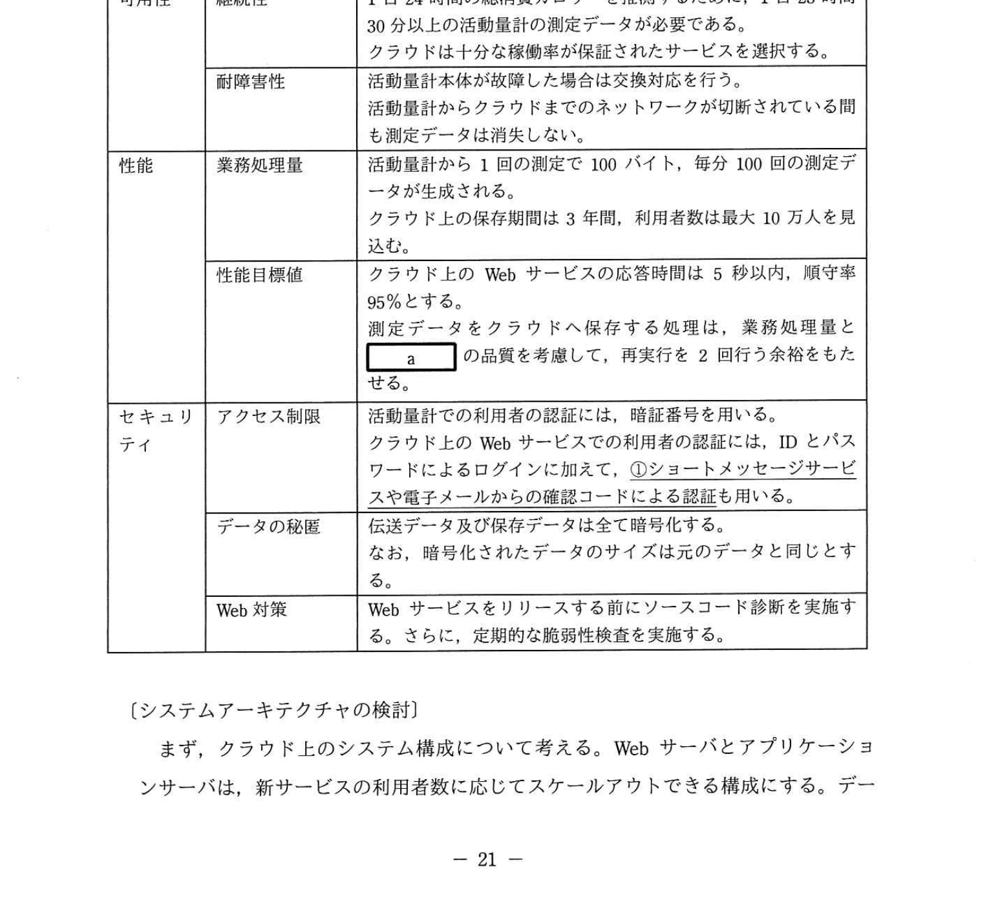
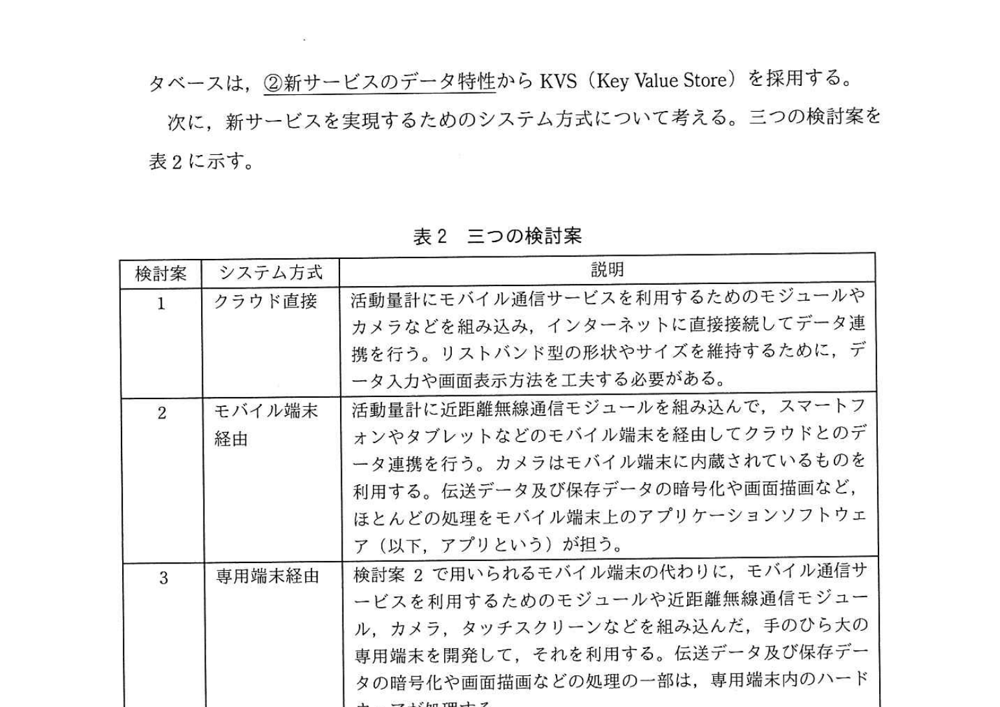
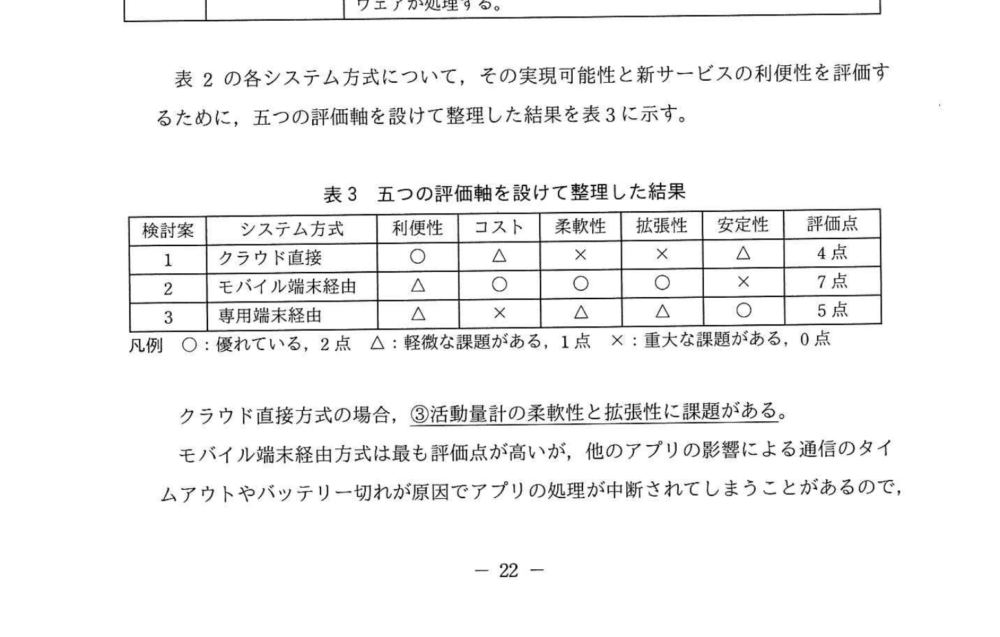

# 2020年秋期（令和2年度）応用情報技術者試験 午後 問4（選択）
## システムアーキテクチャ：ヘルスケア機器とクラウドとの連携のためのシステム方式設計（C社活動量計）

---

## 問題文

**問4** ヘルスケア機器とクラウドとの連携のためのシステム方式設計に関する次の記述を読んで、設問1〜3に答えよ。

C社は、ヘルスケア機器の製造販売を手掛ける中堅企業である。このたび、従来の製品である、歩数や心拍数などを測定する活動量計を改良して、クラウドを利用した新しいサービス（以下、新サービスという）を開発することになった。

---

### 〔従来の活動量計の概要〕

- リストバンド型で生活防水に対応する。
- 24時間装着して、歩数や心拍数、睡眠時間を記録する。
- 横10文字、縦2文字のモノクロ液晶画面に、現在時刻や測定中のデータ、記録されたデータを表示できる。
- 四つのボタンを備えており、表示切替えや数値入力など簡単な操作ができる。
- 測定データ記録用のメモリ容量は64Mバイトあり、使用中のメモリが一杯になったときには、データの古いものから順に新しいデータに上書きされる。

---

### 〔新サービスの概要〕

従来の活動量計を基に、通信機能などを追加した新しい活動量計を開発する。測定データや手元で入力したデータをクラウド上に保存し、分析するWebサービスを開発する。そして、Webサービスの分析結果を手元の活動量計で確認できるようにする。具体的に、次の機能を提供する。

- **1日24時間の総消費カロリーを推測する機能**: 歩数や心拍数などの測定データを長期間保存して、消費カロリーと基礎代謝を推測し、利用者の日々の総消費カロリーをグラフで示す。
- **歩行やジョギングなど運動についてアドバイスする機能**: 事前登録した身長や体重、目標体重などの情報から、利用者に適切な運動種目と時間を提案する。
- **献立など食生活についてアドバイスする機能**: 飲食した内容を文字や写真で記録することで、利用者に栄養バランスの良い献立を提案する。

---

### 〔非機能要件の整理〕

新サービスでは、利用者の日常生活に密着してデータを24時間収集し続ける必要がある。個人のヘルスケアデータという機微な情報を取り扱うので、情報の漏えいや盗聴を防ぐ対策も重要である。新サービスの非機能要件を表1に整理した。

### 表1 新サービスの非機能要件

> | 大項目 | 小項目 | メトリクス（指標） |
> |--------|--------|------------------|
> | 可用性 | 継続性 | 1日24時間の総消費カロリーを推測するために、1日23時間30分以上の活動量計の測定データが必要である。クラウドは十分な稼働率が保証されたサービスを選択する。 |
> | | 耐障害性 | 活動量計本体が故障した場合は交換対応を行う。活動量計からクラウドまでのネットワークが切断されている間も測定データは消失しない。 |
> | 性能 | 業務処理量 | 活動量計から1回の測定で100バイト、毎分100回の測定データが生成される。クラウド上の保存期間は3年間、利用者数は最大10万人を見込む。 |
> | | 性能目標値 | クラウド上のWebサービスの応答時間は5秒以内、順守率95%とする。測定データをクラウドへ保存する処理は、業務処理量と `[　a　]` の品質を考慮して、再実行を2回行う余裕をもたせる。 |
> | セキュリティ | アクセス制限 | 活動量計での利用者の認証には、暗証番号を用いる。クラウド上のWebサービスでの利用者の認証には、IDとパスワードによるログインに加えて、**①ショートメッセージサービスや電子メールからの確認コードによる認証も用いる**。 |
> | | データの秘匿 | 伝送データ及び保存データは全て暗号化する。なお、暗号化されたデータのサイズは元のデータと同じとする。 |
> | | Web対策 | Webサービスをリリースする前にソースコード診断を実施する。さらに、定期的な脆弱性検査を実施する。 |

---

### 〔システムアーキテクチャの検討〕

まず、クラウド上のシステム構成について考える。Webサーバとアプリケーションサーバは、新サービスの利用者数に応じてスケールアウトできる構成にする。データベースは、**②新サービスのデータ特性**からKVS（Key Value Store）を採用する。

次に、新サービスを実現するためのシステム方式について考える。三つの検討案を表2に示す。

### 表2 三つの検討案

> | 検討案 | システム方式 | 説明 |
> |--------|------------|------|
> | 1 | クラウド直接 | 活動量計にモバイル通信サービスを利用するためのモジュールやカメラなどを組み込み、インターネットに直接接続してデータ連携を行う。リストバンド型の形状やサイズを維持するために、データ入力や画面表示方法を工夫する必要がある。 |
> | 2 | モバイル端末経由 | 活動量計に近距離無線通信モジュールを組み込んで、スマートフォンやタブレットなどのモバイル端末を経由してクラウドとのデータ連携を行う。カメラはモバイル端末に内蔵されているものを利用する。伝送データ及び保存データの暗号化や画面描画など、ほとんどの処理をモバイル端末上のアプリケーションソフトウェア（以下、アプリという）が担う。 |
> | 3 | 専用端末経由 | 検討案2で用いられるモバイル端末の代わりに、モバイル通信サービスを利用するためのモジュールや近距離無線通信モジュール、カメラ、タッチスクリーンなどを組み込んだ、手のひら大の専用端末を開発して、それを利用する。伝送データ及び保存データの暗号化や画面描画などの処理の一部は、専用端末内のハードウェアが処理する。 |

表2の各システム方式について、その実現可能性と新サービスの利便性を評価するために、五つの評価軸を設けて整理した結果を表3に示す。

### 表3 五つの評価軸を設けて整理した結果

> | 検討案 | システム方式 | 利便性 | コスト | 柔軟性 | 拡張性 | 安定性 | 評価点 |
> |--------|------------|--------|--------|--------|--------|--------|--------|
> | 1 | クラウド直接 | ○ | △ | × | × | △ | 4点 |
> | 2 | モバイル端末経由 | △ | ○ | ○ | ○ | × | 7点 |
> | 3 | 専用端末経由 | △ | × | △ | △ | ○ | 5点 |
>
> 凡例: ○: 優れている 2点、△: 軽微な課題がある 1点、×: 重大な課題がある 0点

クラウド直接方式の場合、**③活動量計の柔軟性と拡張性に課題がある**。

モバイル端末経由方式は最も評価点が高いが、他のアプリの影響による通信のタイムアウトやバッテリー切れが原因でアプリの処理が中断されてしまうことがあるので、安定性に課題がある。この課題が解決できれば、本方式を採用できる。

専用端末経由方式の場合、安定性は優れているが、モバイル端末に匹敵する柔軟性や拡張性を備えた端末を独自に開発することは難しく、コストが高くなってしまう課題がある。

---

### 〔モバイル端末経由のシステム方式設計〕

三つのシステム方式の中で、評価点の高いモバイル端末経由方式を採用するために、安定性に関する対策を検討する。

モバイル端末において、通信のタイムアウトやバッテリー切れによってアプリの処理が中断されてしまった場合でも、測定データが消失せずに保存できるように、次の機能をアプリとして実装する。

- 活動量計に保存されている測定データを、モバイル端末内のストレージに保存する機能
- モバイル端末内に保存されている測定データを、インターネット接続時にクラウド上のストレージに保存する機能

活動量計とモバイル端末が通信できない最大許容日数を7日間としてシミュレーションしたところ、**④ある問題が判明した**。そのために、**⑤活動量計に一部変更を加える**ことで、その問題を回避した。

---

## 設問

### 設問1 〔非機能要件の整理〕について、(1)〜(4)に答えよ。

**(1)** 活動量計の測定データが無い時間をサービス中断時間とすると、新サービスに求められる稼働率は何%以上か。答えは小数第2位を四捨五入して小数第1位まで求めよ。

**(2)** サービス中断時間が無いものとすると、1日に生成される活動量計の測定データは何Mバイトか。小数第1位まで答えよ。ここで、1Mバイト = 1,000,000バイトとする。

**(3)** 表1中の `[　a　]` に入れる適切な字句を、表1中の字句を用いて答えよ。

**(4)** 表1中の下線①にある認証を加える目的は何か。新サービスの特徴に着目し、20字以内で述べよ。

### 設問2 〔システムアーキテクチャの検討〕について、(1)、(2)に答えよ。

**(1)** 本文中の下線②のデータ特性について、適切な記述を解答群の中から選び、記号で答えよ。

**解答群：**
- ア 新サービスの利用者間のデータを収集、分析する特性
- イ 新サービスの利用者単位でデータを収集、分析する特性
- ウ 測定データを自由な構造のデータのまま収集、分析する特性
- エ 測定データをリアルタイムで収集、分析する特性

**(2)** 本文中の下線③にある課題の内容について、最も適切な記述を解答群の中から選び、記号で答えよ。

**解答群：**
- ア グラフや写真の画面表示や文章データの入力は実現が難しい。
- イ 事前登録した情報とクラウド上に保存した測定データから、利用者の適切な運動種目と時間を推測することは難しい。
- ウ 歩数や心拍数などの測定データから総消費カロリーの推測は難しい。
- エ リストバンド型の形状やサイズを維持しつつ、USBなどの入出力ポートを備えることは難しい。

### 設問3 〔モバイル端末経由のシステム方式設計〕について、(1)、(2)に答えよ。

**(1)** 本文中の下線④にある判明した問題とはどのような問題か。35字以内で述べよ。

**(2)** 本文中の下線⑤にある加えた変更について、30字以内で述べよ。ただし、クラウド上のデータ及びWebサービスには変更を加えないこと。

---

## 解答と解説

### 設問1

**(1) 正解：97.9%**

稼働率の計算：
- 「1日24時間の総消費カロリーを推測するために、1日**23時間30分以上**の測定データが必要」
- サービス中断時間（測定データが無い時間）の最大 = 24時間 − 23時間30分 = **30分/日**

稼働率 = (1日 − 最大中断時間) / 1日
= (24×60 − 30) / (24×60)
= 1,410 / 1,440
= 0.97916... ≈ **97.9%**

**IPA公式：97.9**

**(2) 正解：14.4Mバイト**

1日のデータ量：
- 1回の測定: 100バイト
- 測定頻度: 毎分100回
- 1日: 60分 × 24時間 = 1,440分

総データ量 = 100バイト × 100回/分 × 1,440分
= 14,400,000バイト
= 14.4Mバイト（1Mバイト = 1,000,000バイト）

**IPA公式：14.4**

**(3) 正解：a = ネットワーク**

「測定データをクラウドへ保存する処理は、業務処理量と `[a]` の品質を考慮して、再実行を2回行う余裕をもたせる」

→ データをクラウドへ送信する際に失敗する原因として最も考えられるのは**ネットワーク**の品質（通信障害・遅延等）。表1のセキュリティ「データの秘匿」にある「伝送データ」の観点でも通信（ネットワーク）が重要。

**IPA公式：a = ネットワーク**

**(4) 正解：機微な情報の漏えいを防ぐため（15字）**

下線①: 「ショートメッセージサービスや電子メールからの確認コードによる認証も用いる」= 多要素認証（MFA）

→ ヘルスケアデータは個人の**機微な情報**（health data）を含む。IDとパスワードだけでは不正ログインのリスクがあるため、追加の認証で**情報漏えいを防ぐ**。

**IPA公式：機微な情報の漏えいを防ぐため**

---

### 設問2

**(1) 正解：イ（新サービスの利用者単位でデータを収集、分析する特性）**

KVS（Key Value Store）の特性: キー（利用者ID等）に対する値の格納・取得が高速。利用者ごとにデータを管理するのに適している。

新サービスのデータ特性: 各利用者の測定データ・健康データを**利用者単位**で蓄積・分析する。

**IPA公式：イ**

**(2) 正解：ア（グラフや写真の画面表示や文章データの入力は実現が難しい）**

下線③: 「クラウド直接方式の活動量計の柔軟性と拡張性に課題がある」

クラウド直接方式: 「リストバンド型の形状やサイズを維持するために、データ入力や画面表示方法を工夫する必要がある」

→ リストバンド型の小さい画面では、グラフや写真の表示は困難。文章データの入力（食事記録など）も難しい。これが柔軟性・拡張性の課題。

**IPA公式：ア**

---

### 設問3

**(1) 正解：クラウド上に保存していない測定データが消失してしまう問題（31字）**

シミュレーションの条件:
- 活動量計とモバイル端末が通信できない最大許容日数 = 7日間
- 活動量計のメモリ = 64Mバイト（上書き式）
- 1日の測定データ = 14.4Mバイト

7日分のデータ量 = 14.4 × 7 = **100.8Mバイト** > 64Mバイト（メモリ容量）

→ 7日間通信できない間に活動量計のメモリがいっぱいになり、古いデータが上書きされる。その結果、**クラウド上に保存していない測定データが消失**してしまう。

**IPA公式：クラウド上に保存していない測定データが消失してしまう問題**

**(2) 正解：活動量計本体のメモリ量を7日分以上に増やす（24字）**

問題: 64MBのメモリでは7日分（100.8MB）を保存できない。

対策: クラウドにアクセスできなくなる最大7日間分のデータを保存できるように、**活動量計本体のメモリ量を7日分以上（≥100.8MB）に増やす**。

※ クラウド上のデータ・Webサービスへの変更は不可（制約条件より）

**IPA公式：活動量計本体のメモリ量を7日分以上に増やす。**

---

## 参考：主要キーワード

| 用語 | 説明 |
|------|------|
| KVS（Key Value Store） | キーと値のペアを格納するNoSQLデータベース。利用者単位での大量データの高速アクセスに適する |
| スケールアウト | サーバ台数を増やすことでシステムの処理能力を向上させる方法（横方向の拡張） |
| 多要素認証（MFA） | ID/パスワードに加え、SMS確認コード等の複数要素を組み合わせた認証方式 |
| 機微な情報 | 個人のヘルスケアデータ・医療情報など、漏洩すると重大な問題となる情報 |
| クラウド直接方式 | 機器がクラウドに直接接続してデータ連携する方式（SIMカード組み込み等） |
| モバイル端末経由方式 | Bluetooth等でスマートフォンに接続し、スマートフォン経由でクラウドと連携する方式 |
| 耐障害性 | システムの一部が故障しても、サービス継続できる性質 |
| 稼働率 | システムがサービスを提供できる時間の割合。(1 - 停止率) で計算 |
| バッファリング | データを一時的にローカルに保存しておき、通信回復時に送信する手法 |
