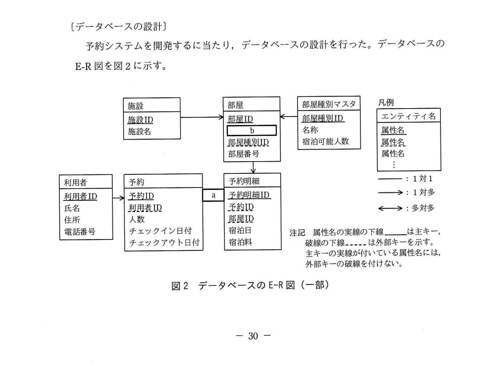
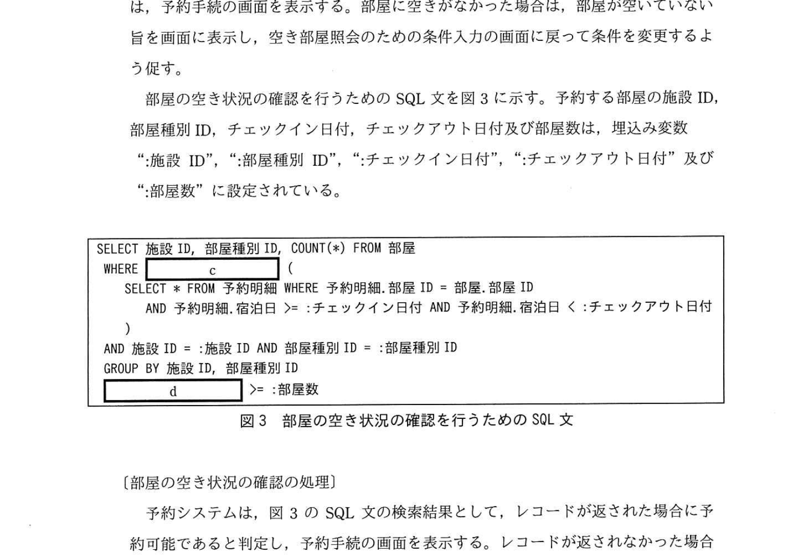
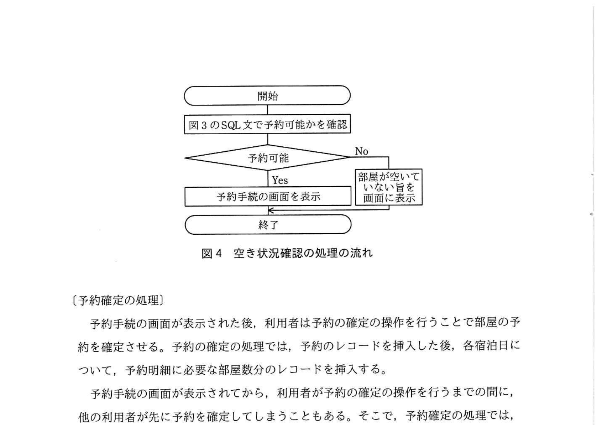
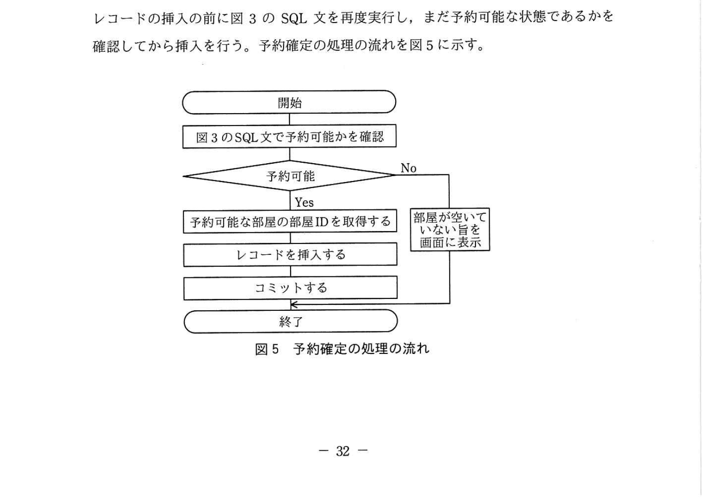
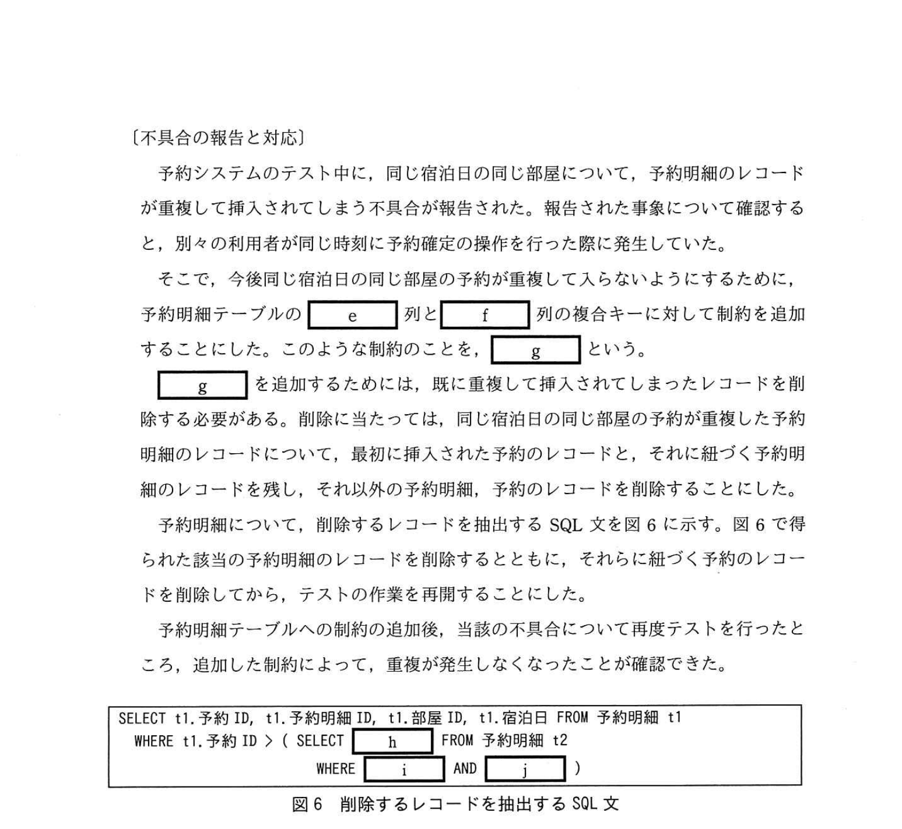

# 2020年秋期（令和2年度）応用情報技術者試験 午後 問6（選択）
## データベース：宿泊施設の予約を行うシステム（E-R設計・SQL・不具合対応）

---

## 問題文

**問6** 宿泊施設の予約を行うシステムに関する次の記述を読んで、設問1〜3に答えよ。

U社は、旅館や民宿などの宿泊施設の宿泊予約を行うWebシステム（以下、予約システムという）を開発している。予約システムの主な要件を図1に示す。

### 図1 予約システムの主な要件

> - 利用者が予約システムを最初に利用する際には、氏名、住所、電話番号を入力し、利用者登録を行う。
> - 利用者は空き部屋照会のための条件入力の画面上で、希望する施設に対し、チェックインとチェックアウトの日付、予約したい部屋の種別及び部屋数を指定して空き状況を照会する。
> - 予約は部屋の種別ごとに行う。種別の違う部屋を予約したい場合は、部屋の種別ごとに分けて予約を行う。
> - 空き状況の照会を行った時点で、希望した種別の部屋に、希望した部屋数の空きがなかった場合は、部屋が空いていない旨を画面に表示する。
> - 空き状況の照会を行った時点で希望した部屋数の空きがあった場合は、予約手続の画面に遷移する。利用者は、宿泊人数を入力し、部屋の予約を確定する。
> - 部屋の予約を確定するまでの間に他の利用者が予約を入れてしまい、必要な部屋数を確保できなくなってしまった場合には、その旨を画面に表示して予約の処理を中断する。

---

### 〔データベースの設計〕

予約システムを開発するにあたり、データベースの設計を行った。データベースのE-R図を図2に示す。

### 図2 データベースのE-R図（一部）



> **エンティティと関係:**
>
> 施設（施設ID, 施設名）—→（1対多）— 部屋
> 部屋（部屋ID, `[　b　]`, 部屋種別ID, 部屋番号）←（1対多）— 部屋種別マスタ（部屋種別ID, 名称, 宿泊可能人数）
> 利用者（利用者ID, 氏名, 住所, 電話番号）—→（1対多）— 予約
> 予約（予約ID, 利用者ID, 人数, チェックイン日付, チェックアウト日付）— `[　a　]` — 予約明細
> 予約明細（予約明細ID, 予約ID, 部屋ID, 宿泊日, 宿泊料）
>
> 凡例: エンティティ名／属性名の実線の下線＝主キー、破線の下線＝外部キー（主キーの実線が付いている属性名には外部キーの破線を付けない）。関連は「——：1対1」「—→：1対多」「←→：多対多」。

このデータベースでは、E-R図のエンティティ名を表名にし、属性名を列名にして、適切なデータ型で表定義した関係データベースによって、データを管理する。部屋IDは、全施設を通して一意な値である。また、予約ID、予約明細IDは、レコードを挿入した順に値が大きくなる。

---

### 〔部屋の予約の流れ〕

部屋の予約は、部屋の空き状況の確認と、予約確定の二つの処理から成る。部屋を予約する際には、希望した施設、部屋の種別、チェックイン日付、チェックアウト日付、部屋数について、空き状況の照会を行う。照会の結果、部屋に空きがあった場合は、予約手続きの画面を表示する。部屋に空きがなかった場合は、部屋が空いていない旨を画面に表示し、空き部屋照会のための条件入力の画面に戻って条件を変更するよう促す。

部屋の空き状況の確認を行うためのSQL文を図3に示す。予約する部屋の施設ID、部屋種別ID、チェックイン日付、チェックアウト日付及び部屋数は、埋め込み変数":施設ID"、":部屋種別ID"、":チェックイン日付"、":チェックアウト日付"、":部屋数"に設定されている。

### 図3 部屋の空き状況の確認を行うためのSQL文



```sql
SELECT 施設ID, 部屋種別ID, COUNT(*) FROM 部屋
WHERE     c     (
    SELECT * FROM 予約明細 WHERE 予約明細.部屋ID = 部屋.部屋ID
    AND 予約明細.宿泊日 >= :チェックイン日付 AND 予約明細.宿泊日 < :チェックアウト日付
    )
AND 施設ID = :施設ID AND 部屋種別ID = :部屋種別ID
GROUP BY 施設ID, 部屋種別ID
     d     >= :部屋数
```

### 〔部屋の空き状況確認の処理〕

### 図4 空き状況確認の処理の流れ



> 開始 → 図3のSQL文で予約可能かを確認 → 予約可能? [Yes→予約手続きの画面を表示] [No→部屋が空いていない旨を画面に表示] → 終了

---

### 〔予約確定の処理〕

予約手続きの画面が表示された後、利用者は予約の確定の操作を行うことで部屋の予約を確定させる。予約の確定の処理では、予約のレコードを挿入した後、各宿泊日について、予約明細に必要な部屋数分のレコードを挿入する。

予約手続きの画面が表示されてから、利用者が予約の確定の操作を行うまでの間に、他の利用者が先に予約を確定してしまうこともある。そこで、予約確定の処理では、レコードの挿入の前に図3のSQL文を再度実行し、まだ予約可能な状態であるかを確認してから挿入を行う。予約確定の処理の流れを図5に示す。

### 図5 予約確定の処理の流れ



> 開始 → 図3のSQL文で予約可能かを確認 → 予約可能? [Yes→予約可能な部屋の部屋IDを取得する → レコードを挿入する → コミットする] [No→部屋が空いていない旨を画面に表示] → 終了

---

### 〔不具合の報告と対応〕

予約システムのテスト中に、同じ宿泊日の同じ部屋について、予約明細のレコードが重複して挿入されてしまう不具合が報告された。報告された事象について確認すると、別々の利用者が同じ時刻に予約確定の操作を行った際に発生していた。

そこで、今後同じ宿泊日の同じ部屋の予約が重複して入らないようにするために、予約明細テーブルの `[　e　]` 列と `[　f　]` 列の複合キーに対して制約を追加することにした。このような制約のことを、`[　g　]` という。

`[　g　]` を追加するためには、既に重複して挿入されてしまったレコードを削除する必要がある。削除に当たっては、同じ宿泊日の同じ部屋の予約が重複した予約明細のレコードについて、最初に挿入された予約のレコードと、それに紐づく予約明細のレコードを残し、それ以外の予約明細、予約のレコードを削除することにした。

予約明細について、削除するレコードを抽出するSQL文を図6に示す。図6で得られた該当の予約明細のレコードを削除するとともに、それらに紐づく予約のレコードを削除してから、テストの作業を再開することにした。

予約明細テーブルへの制約の追加後、当該の不具合について再度テストを行ったところ、追加した制約によって、重複が発生しなくなったことが確認できた。

### 図6 削除するレコードを抽出するSQL文



```sql
SELECT t1.予約ID, t1.予約明細ID, t1.部屋ID, t1.宿泊日 FROM 予約明細 t1
WHERE t1.予約ID > ( SELECT     h     FROM 予約明細 t2
    WHERE     i     AND     j     )
```

---

## 設問

### 設問1 図2中の `[　a　]`、`[　b　]` に入れる適切なエンティティ間の関係及び属性名を答え、E-R図を完成させよ。なお、エンティティ間の関係及び属性名の表記は、図2の凡例及び注記に倣うこと。

### 設問2 図3中の `[　c　]`、`[　d　]` に入れる適切な字句を答えよ。

### 設問3 〔不具合の報告と対応〕について、(1)〜(3)に答えよ。

**(1)** 本文中の `[　e　]`、`[　f　]` に入れる適切な列名を答えよ。

**(2)** 本文中の `[　g　]` に入れる適切な字句を答えよ。

**(3)** 図6中の `[　h　]` 〜 `[　j　]` に入れる適切な字句を答えよ。

---

## 解答と解説

### 設問1

**a = →（1対多の矢印）**

E-R図のリレーションシップ: 施設 と 部屋 の関係は「1対多」（1つの施設に複数の部屋がある）。
凡例に従い、多側に矢印「→」を書く。

**b = 施設ID**

部屋テーブルには、どの施設に属するかを示す外部キーが必要。
施設テーブルの主キー「施設ID」が部屋テーブルの外部キー（破線下線付き）として追加される。

**IPA公式：a = →（1対多）/ b = 施設ID**

---

### 設問2

**c = NOT EXISTS**

「予約明細テーブルに該当する宿泊日のレコードが**存在しない**部屋を選ぶ」= NOT EXISTS

サブクエリ: 指定期間内（チェックイン日〜チェックアウト日前日）に同じ部屋IDの予約明細レコードが存在するか確認
→ **存在しない** (NOT EXISTS) → 空き部屋として取り扱う

**d = HAVING COUNT(\*)**

GROUP BY 施設ID, 部屋種別ID でグループ化した後:
- COUNT(*) = 空き部屋の数（NOT EXISTSで絞られた部屋の数）
- HAVING COUNT(*) >= :部屋数 → 希望する部屋数以上空きがある場合に返す

**IPA公式：c = NOT EXISTS / d = HAVING COUNT(\*)**

---

### 設問3

**(1) 正解：e = 宿泊日、f = 部屋ID（順不同）**

重複防止のための制約対象: 「同じ部屋IDの同じ宿泊日にレコードが重複して挿入されることを防ぐ」

→ 予約明細テーブルの **（部屋ID, 宿泊日）** の組み合わせに一意制約を設ける

**IPA公式：e = 宿泊日 / f = 部屋ID（順不同）**

**(2) 正解：UNIQUE制約**

同じ（部屋ID, 宿泊日）の組み合わせのレコードが重複して挿入されないようにするための制約 = **UNIQUE制約**

CREATE TABLE文で: `UNIQUE(部屋ID, 宿泊日)` と指定

**IPA公式：UNIQUE制約**

**(3) 正解：h = MIN(t2.予約ID)、i = t1.部屋ID = t2.部屋ID、j = t1.宿泊日 = t2.宿泊日（i, jは順不同）**

```sql
SELECT t1.予約ID, t1.予約明細ID, t1.部屋ID, t1.宿泊日 FROM 予約明細 t1
WHERE t1.予約ID > ( SELECT MIN(t2.予約ID) FROM 予約明細 t2
    WHERE t1.部屋ID = t2.部屋ID AND t1.宿泊日 = t2.宿泊日 )
```

**解説:**
- **h = MIN(t2.予約ID)**: 同じ（部屋ID, 宿泊日）の組の中で最も古い（最小の）予約IDを求める。予約IDはレコード挿入順に大きくなるので、最初に正当に予約されたレコードのIDが最小値。
- **i = t1.部屋ID = t2.部屋ID**: 同じ部屋IDのレコード同士を比較
- **j = t1.宿泊日 = t2.宿泊日**: 同じ宿泊日のレコード同士を比較

**WHERE句の意味**: t1の予約IDが、同じ（部屋ID, 宿泊日）グループの中の最小予約IDより大きい場合 → 後から重複して挿入された不正なレコードとして抽出する。

**IPA公式：h = MIN(t2.予約ID) / i = t1.部屋ID = t2.部屋ID / j = t1.宿泊日 = t2.宿泊日（i, jは順不同）**

---

## 参考：主要キーワード

| 用語 | 説明 |
|------|------|
| E-R図（エンティティ関係図） | エンティティ（実体）とその関係（リレーションシップ）を図式化したDB設計ツール |
| 主キー（Primary Key） | テーブル内のレコードを一意に識別するための列（または列の組み合わせ） |
| 外部キー（Foreign Key） | 他テーブルの主キーを参照する列。参照整合性を保証する |
| UNIQUE制約 | 列（または列の組み合わせ）に重複した値が挿入されないことを保証する制約 |
| NOT EXISTS | サブクエリの結果が存在しないことを条件とするSQL演算子。空き確認に有効 |
| HAVING句 | GROUP BY でグループ化した結果に対して条件を指定するSQL句。集計後フィルタリング |
| トランザクション | 一連のDB操作を1つの単位として管理する仕組み。COMMIT/ROLLBACKで制御 |
| 競合状態（Race Condition） | 複数のトランザクションが同じリソースにほぼ同時にアクセスして問題が生じる状態 |
| 排他制御 | 複数のトランザクションが同じデータに同時アクセスするときに整合性を保つ仕組み |
| 自己結合 | 同じテーブルを別名（別名：t1, t2）で2回参照して比較する結合手法 |
