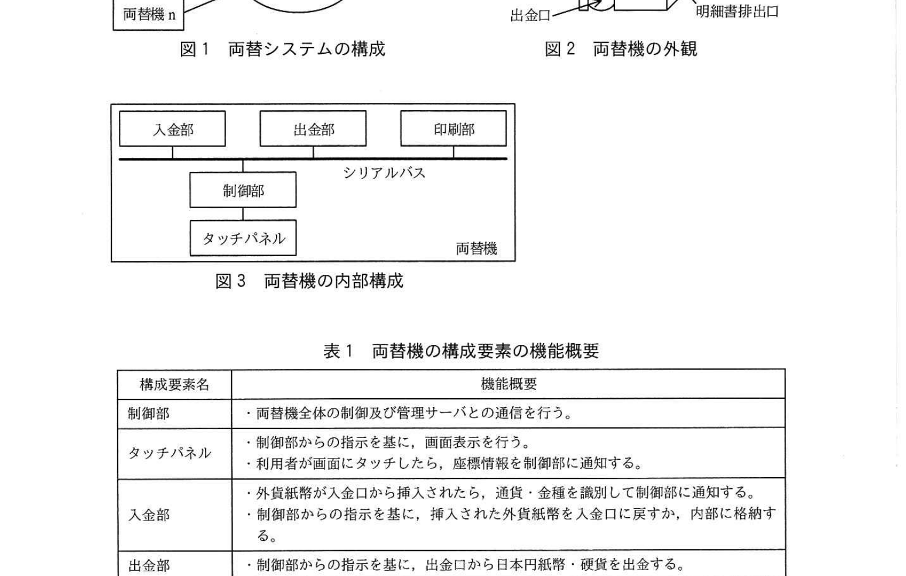
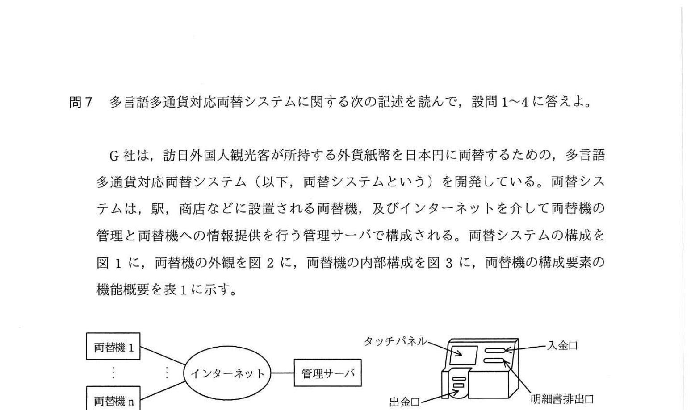
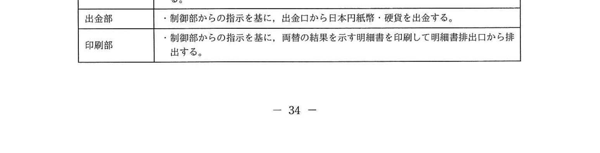
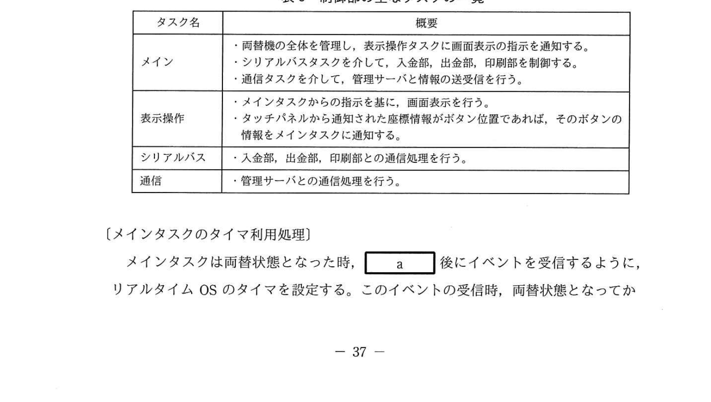
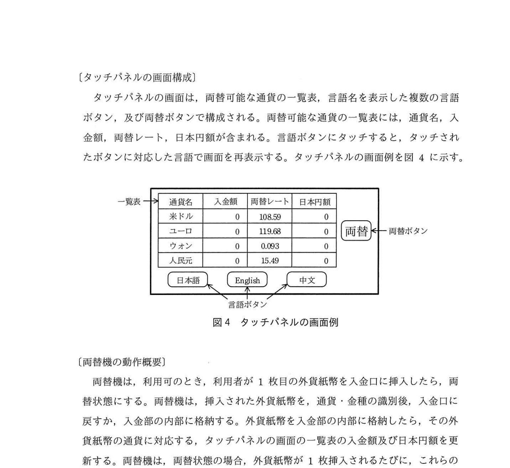
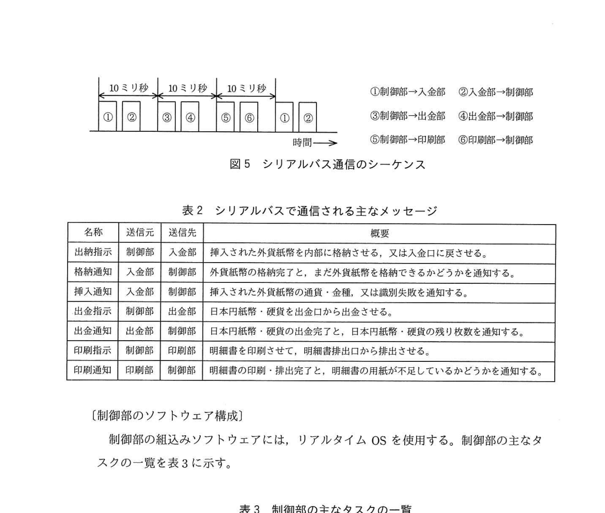

# 2020年秋期（令和2年度）応用情報技術者試験 午後 問7（選択）
## 組込みシステム開発：多言語多通貨対応両替システム（G社）

---

## 問題文

**問7** 多言語多通貨対応両替システムに関する次の記述を読んで、設問1〜4に答えよ。

G社は、訪日外国人観光客が所持する外貨紙幣を日本円に両替するための、多言語多通貨対応両替システム（以下、両替システムという）を開発している。両替システムは、駅、商店などに設置される両替機、及びインターネットを介して両替機の管理と両替機への情報提供を行う管理サーバで構成される。

### 図1 両替システムの構成

> 両替機1〜n ←→ インターネット ←→ 管理サーバ

### 図2 両替機の外観

> タッチパネル、入金口、出金口、明細書排出口

### 図3 両替機の内部構成

> 入金部 / 出金部 / 印刷部 → [シリアルバス] → 制御部 → タッチパネル

### 表1 両替機の構成要素の機能概要

> | 構成要素名 | 機能概要 |
> |----------|---------|
> | 制御部 | ・両替機全体の制御及び管理サーバとの通信を行う。 |
> | タッチパネル | ・制御部からの指示を基に、画面表示を行う。 ・利用者が画面にタッチしたら、座標情報を制御部に通知する。 |
> | 入金部 | ・外貨紙幣が入金口から挿入されたら、通貨・金種を識別して制御部に通知する。 ・制御部からの指示を基に、挿入された外貨紙幣を入金口に戻すか、内部に格納する。 |
> | 出金部 | ・制御部からの指示を基に、出金口から日本円紙幣・硬貨を出金する。 |
> | 印刷部 | ・制御部からの指示を基に、両替の結果を示す明細書を印刷して明細書排出口から排出する。 |

---

### 〔タッチパネルの画面構成〕

タッチパネルの画面は、両替可能な通貨の一覧表、言語名を表示した複数の言語ボタン、及び両替ボタンで構成される。両替可能な通貨の一覧表には、通貨名、入金額、両替レート、日本円額が含まれる。言語ボタンにタッチすると、タッチされたボタンに対応した言語で画面を再表示する。タッチパネルの画面例を図4に示す。

### 図4 タッチパネルの画面例

> | 通貨名 | 入金額 | 両替レート | 日本円額 |
> |-------|--------|----------|---------|
> | 米ドル | 0 | 108.59 | 0 |
> | ユーロ | 0 | 119.68 | 0 |
> | ウォン | 0 | 0.093 | 0 |
> | 人民元 | 0 | 15.49 | 0 |
>
> [日本語] [English] [中文] ← 言語ボタン / [両替] ← 両替ボタン

---

### 〔両替機の動作概要〕

両替機は、利用可能のとき、利用者が1枚目の外貨紙幣を入金口に挿入したら、両替状態にする。両替機は、挿入された外貨紙幣を、通貨・金種の識別後、入金口に戻すか、入金部の内部に格納する。外貨紙幣を入金部の内部に格納したら、その外貨紙幣の通貨に対応する、タッチパネルの画面の一覧表の入金額及び日本円額を更新する。両替状態の場合、外貨紙幣が1枚挿入されるたびに、これらの動作を繰り返す。

利用者が両替ボタンにタッチすると、両替機は、明細書の印刷・排出及び日本円紙幣・硬貨の出金を行い、印刷・排出と出金が全て完了したら、両替状態を解除して、1回の両替動作を完了する。

---

### 〔両替機の仕様〕

両替機の仕様は、次のとおりである。

- 1回の両替動作で出金できる日本円額の合計は、**1円以上10万円以下**である。
- 次のいずれかの場合は、挿入された外貨紙幣を入金部の内部に格納せずに、**入金口に戻してエラーメッセージを表示する**。
  - 挿入された外貨紙幣を入金部の内部に格納できない状態である。
  - 入金部の内部に格納した外貨紙幣を入金部の内部に格納できない状態である。
  - 入金部がもっている日本円の合計金額が10万円未満である。
  - 印刷部に格納されている明細書の用紙が不足している。
- 印刷・排出と出金が全て完了した時、管理サーバに利用可・利用不可のいずれかを報告する。
- 保守作業によって事象が全て解決されると、利用可にする。

---

### 〔シリアルバス通信の概要〕

シリアルバス通信はポーリング方式とする。制御部から入金部、出金部、印刷部の順に10ミリ秒周期でデータを送信し、入金部、出金部、印刷部は、自分宛のデータを受信したら、制御部にデータを送信する。データは、宛先コード、データ長、通知又は指示で構成される。シリアルバス通信のシーケンスを図5に、シリアルバスで通信される主なメッセージを表2に示す。

### 図5 シリアルバス通信のシーケンス

> 10ミリ秒 × 3セット（①〜⑥でループ）
> ①制御部→入金部 / ②入金部→制御部 / ③制御部→出金部 / ④出金部→制御部 / ⑤制御部→印刷部 / ⑥印刷部→制御部

### 表2 シリアルバスで通信される主なメッセージ

> | 名称 | 送信元 | 送信先 | 概要 |
> |-----|--------|--------|------|
> | 出納指示 | 制御部 | 入金部 | 挿入された外貨紙幣を内部に格納させる、又は入金口に戻させる。 |
> | 格納通知 | 入金部 | 制御部 | 外貨紙幣の格納完了と、また外貨紙幣を格納できるかどうかを通知する。 |
> | 挿入通知 | 入金部 | 制御部 | 挿入された外貨紙幣の通貨・金種、又は識別失敗を通知する。 |
> | 出金指示 | 制御部 | 出金部 | 日本円紙幣・硬貨を出金口から出金させる。 |
> | 出金通知 | 出金部 | 制御部 | 日本円紙幣・硬貨の出金完了と、また日本円紙幣・硬貨の残り枚数を通知する。 |
> | 印刷指示 | 制御部 | 印刷部 | 明細書を印刷させて、明細書排出口から排出させる。 |
> | 印刷通知 | 印刷部 | 制御部 | 明細書の印刷・排出完了と、明細書の用紙が不足しているかどうかを通知する。 |

---

### 〔制御部のソフトウェア構成〕

制御部の組込みソフトウェアには、リアルタイムOSを使用する。制御部の主なタスクの一覧を表3に示す。

### 表3 制御部の主なタスクの一覧

> | タスク名 | 概要 |
> |---------|------|
> | メイン | ・両替機の全体を管理し、表示操作タスクに画面表示の指示を通知する。 ・シリアルバスタスクを介して、入金部、出金部、印刷部を制御する。 ・通信タスクを介して、管理サーバと情報の送受信を行う。 |
> | 表示操作 | ・メインタスクからの指示を基に、画面表示を行う。 ・タッチパネルを通知された座標情報がボタン位置であれば、そのボタンの情報をメインタスクに通知する。 |
> | シリアルバス | ・入金部、出金部、印刷部との通信処理を行う。 |
> | 通信 | ・管理サーバとの通信処理を行う。 |

---

### 〔メインタスクのタイマ利用処理〕

メインタスクは両替状態となった時、`[　a　]` 後にイベントを受信するように、リアルタイムOSのタイマを設定する。このイベントの受信時、両替状態となってから、**①ある条件を満たしたら**、`[　b　]` して、`[　c　]` を行う。

---

## 設問

### 設問1 両替機について、(1)、(2)に答えよ。

**(1)** 制御部が両替状態と判断するのは、どの構成要素から通知を受けたときか。表1中の構成要素名で答えよ。

**(2)** 制御部が管理サーバに利用不可のいずれかを報告するのは、二つのメッセージを受信した後である。その二つのメッセージ名を、表2中の名称で答えよ。

### 設問2 シリアルバスの最適な通信速度を検討するために、通信データ量が最も多く、処理時間が最も長くなるケースを調査した結果、当該ケースは次のとおりであった。

**(i)** 制御部は、894バイトのデータを印刷部に送信する。  
**(ii)** 印刷部はデータを受信し終えたら、750マイクロ秒の処理を行った後、6バイトのデータを制御部に送信する。  
**(iii)** 制御部はデータを受信し終えたら、250マイクロ秒の処理を行った後、入金部へのデータ送信を開始する。

当該ケースにおいて、シリアルバスの通信速度は最低何ビット/秒必要か。答えは小数第1位を切り上げて、整数で求めよ。ここで、1バイトはスタートビット、ストップビットを含めて10ビットで送信されるものとする。

### 設問3 〔メインタスクのタイマ利用処理〕について、(1)、(2)に答えよ。

**(1)** 本文中の `[　a　]` 〜 `[　c　]` に入れる適切な字句を答えよ。

**(2)** 本文中の下線①の条件とは何か。30字以内で述べよ。

### 設問4 ある両替機において、両替状態となってから、日本円額91,000円分の外貨紙幣を入金部の内部に格納したところ、利用者が100米ドル紙幣1枚を挿入したら、格納されずに入金口に戻された原因を25字以内で述べよ。

ここで、両替機が故障していない状態で、入金部は100米ドル紙幣が両替可能な通貨・金種と認識し、外貨紙幣を内部に格納できる状態であるものとする。また、両替レートは1米ドル100円とし、出金部は全ての金種の日本円紙幣・硬貨をそれぞれ10枚以上もっているものとする。

---

## 解答と解説

### 設問1

**(1) 正解：入金部**

「両替機は、利用可能のとき、利用者が1枚目の外貨紙幣を入金口に挿入したら、両替状態にする」

1枚目の外貨紙幣が挿入されると:
- **入金部**が外貨紙幣の通貨・金種を識別し、制御部に**挿入通知**を送信する
- 制御部は入金部からの挿入通知を受けて「両替状態」と判断する

**IPA公式：入金部**

**(2) 正解：出金通知、印刷通知（順不同）**

「印刷・排出と出金が全て完了した時、管理サーバに利用可・利用不可のいずれかを報告する」

完了の確認:
- **出金通知**: 出金部 → 制御部へ「日本円紙幣・硬貨の出金完了と残り枚数」を通知
- **印刷通知**: 印刷部 → 制御部へ「明細書の印刷・排出完了と用紙残量」を通知

両方を受信した後に「利用可・利用不可」を判断して管理サーバへ報告。

**IPA公式：①出金通知 / ②印刷通知（順不同）**

---

### 設問2

**正解：1,000,000（ビット/秒）**

処理の時系列:
- (i) 制御部 → 印刷部: 894バイト送信
- (ii) 印刷部処理: 750マイクロ秒（μs）
- (ii) 印刷部 → 制御部: 6バイト送信
- (iii) 制御部処理: 250マイクロ秒

シリアルバスの周期: 10ミリ秒 = 10,000μs（1サイクル）

通信に使える時間:
10,000μs − 750μs（印刷部処理）− 250μs（制御部処理）= **9,000μs**

送受信データ量:
- 送信: 894バイト
- 受信: 6バイ ト
- 合計: 900バイト = 900 × 10ビット = **9,000ビット**

最低通信速度 = 9,000ビット ÷ 9,000μs × 10^6 = **1,000,000ビット/秒**

**IPA公式：1,000,000（ビット/秒）**

---

### 設問3

**(1) 正解：a = 3分（3分間） / b = 両替状態を解除 / c = 両替レートの更新**

文脈: 「メインタスクは両替状態となった時、`[a]` 後にイベントを受信するように、リアルタイムOSのタイマを設定する。このイベントの受信時、①ある条件を満たしたら、`[b]` して、`[c]` を行う。」

- **a = 3分**: 両替状態になってから一定時間（3分間）誰もお金を入れない場合のタイムアウト
- **b = 両替状態を解除**: タイムアウト時に操作待ち状態に戻す
- **c = 両替レートの更新**: 管理サーバから最新の両替レートを取得して更新する

**IPA公式：a = 3分 / b = 両替状態を解除 / c = 両替レートの更新**

**(2) 正解：入金部の内部に外貨紙幣を1枚も格納していないこと（25字）**

タイマイベント受信時の条件①:
- タイムアウト時に「入金部の内部に1枚も格納されていない」= 利用者が紙幣を1枚も入れずにやめた場合
- この場合、両替状態を解除して（誰も使っていない）、両替レートを更新する

※ 入金部に紙幣が1枚以上ある場合は、利用者が途中で放棄した可能性があるので、別の処理が必要

**IPA公式：入金部の内部に外貨紙幣を1枚も格納していないこと**

---

### 設問4

**正解：日本円額の合計が10万円を超えるから（18字）**

状況: 既に91,000円分の外貨紙幣を格納済み。100米ドル（= 100円 × 100 = 10,000円）を追加挿入。

合計: 91,000円 + 10,000円 = **101,000円 > 100,000円（10万円）**

仕様: 「1回の両替動作で出金できる日本円額の合計は1円以上**10万円以下**である」

→ 10万円を超えるため、入金口に戻してエラーメッセージを表示した。

**IPA公式：日本円額の合計が10万円を超えるから**

---

## 参考：主要キーワード

| 用語 | 説明 |
|------|------|
| 組込みシステム | 特定の機能実現のためにコンピュータを機器内に組み込んだシステム |
| リアルタイムOS（RTOS） | タスクスケジューリング・タイマ・割込み管理を行う組込み向けOS。処理の時間的制約を満たす |
| ポーリング方式 | マスタデバイス（制御部）が一定周期で各スレーブデバイスに順番に問い合わせる通信方式 |
| シリアルバス | データをビット単位で順番に送受信する通信バス。実装コストが低い |
| タスク | リアルタイムOS上で並行実行される処理単位。優先度に基づきスケジューリングされる |
| タイムアウト | 一定時間内に期待する処理・応答が来ない場合に例外処理を行う仕組み |
| 両替レート | 外貨と日本円の交換比率（例: 1米ドル = 108.59円）。管理サーバから取得・更新 |
| 多言語対応 | 複数の言語でユーザインタフェースを表示する機能。言語ボタンで切替 |
