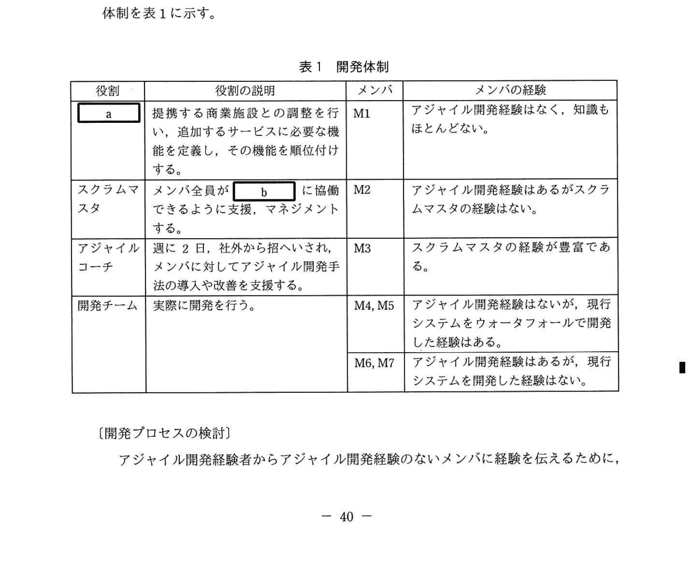
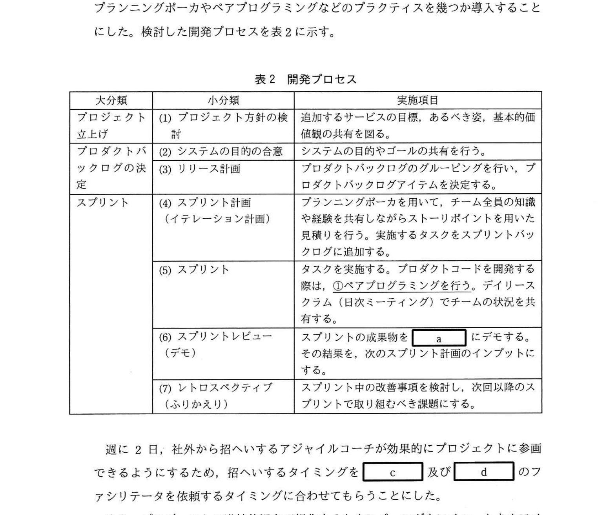
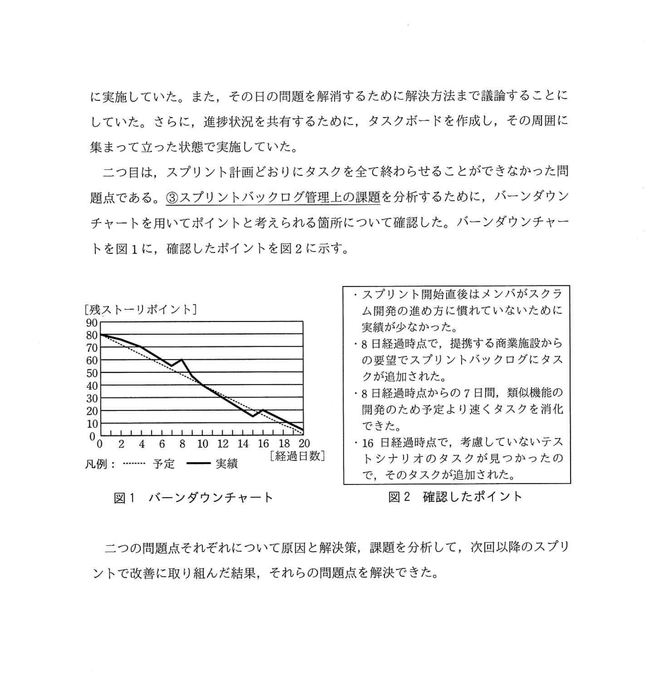

# 2020年秋期（令和2年度）応用情報技術者試験 午後 問8（選択）
## 情報システム開発：アジャイルソフトウェア開発手法（スクラム）の導入（H社）

---

## 問題文

**問8** アジャイルソフトウェア開発手法の導入に関する次の記述を読んで、設問1〜3に答えよ。

H社は、電車や飛行機などの移動手段と宿泊施設をセットにしたパッケージツアーをインターネットで販売している。このサービスを提供している現行システムに、移動途中や宿泊先近辺の商業施設と提携して、観光地の情報提供やクーポン配布を行うサービスを追加することになった。その開発手法として、アジャイルソフトウェア開発（以下、アジャイル開発という）手法の一つであるスクラムを採用する。

---

### 〔開発体制の検討〕

本開発を通してH社でアジャイル開発経験者を育成するために、プロジェクトメンバに求められる役割と割り当てるメンバ（M1〜M7）について検討した。その開発体制を表1に示す。

### 表1 開発体制

> | 役割 | 役割の説明 | メンバ | メンバの経験 |
> |-----|---------|-------|------------|
> | `[　a　]` | 提携する商業施設との調整を行い、追加するサービスに必要な機能を定義し、その機能を順位付けする。 | M1 | アジャイル開発経験はなく、知識もほとんどない。 |
> | スクラムマスタ | メンバ全員が `[　b　]` に協働できるように支援、マネジメントする。 | M2 | アジャイル開発経験はあるがスクラムマスタの経験はない。 |
> | アジャイルコーチ | 週に2日、社外から招へいされ、メンバに対してアジャイル開発手法の導入や改善を支援する。 | M3 | スクラムマスタの経験が豊富である。 |
> | 開発チーム | 実際に開発を行う。 | M4, M5 | アジャイル開発経験はないが、現行システムをウォーターフォールで開発した経験はある。 |
> |  |  | M6, M7 | アジャイル開発経験はあるが、現行システムを開発した経験はない。 |

---

### 〔開発プロセスの検討〕

アジャイル開発経験者からアジャイル開発経験のないメンバに経験を伝えるために、プランニングポーカーやペアプログラミングなどのプラクティスを幾つか導入することにした。検討した開発プロセスを表2に示す。

### 表2 開発プロセス

> | 大分類 | 小分類 | 実施項目 |
> |-------|--------|---------|
> | プロジェクト立上げ | (1) プロジェクト方針の検討 | 追加するサービスの目標、あるべき姿、基本的価値観の共有を図る。 |
> | プロダクトバックログの決定 | (2) システムの目的の合意 | システムの目的やゴールの共有を行う。 |
> |  | (3) リリース計画 | プロダクトバックログのグルーピングを行い、プロダクトバックログアイテムを決定する。 |
> | スプリント | (4) スプリント計画（イテレーション計画） | プランニングポーカーを用いて、チーム全員の知識や経験を共有しながらストーリーポイントを用いた見積りを行う。実施するタスクをスプリントバックログに追加する。 |
> |  | (5) スプリント | タスクを実施する。プロダクトコードを開発する際は、**①ペアプログラミングを行う**。デイリースクラム（日次ミーティング）でチームの状況を共有する。 |
> |  | (6) スプリントレビュー（デモ） | スプリントの成果物を `[　a　]` にデモする。その結果を、次のスプリント計画のインプットにする。 |
> |  | (7) レトロスペクティブ（ふりかえり） | スプリント中の改善事項を検討し、次回以降のスプリントで取り組むべき課題にする。 |

週に2日、社外から招へいするアジャイルコーチが効果的にプロジェクトに参画できるようにするため、招へいするタイミングを `[　c　]` 及び `[　d　]` のファシリテータを依頼するタイミングに合わせてもらうことにした。

また、プロジェクトの進捗状況を可視化するためにバーンダウンチャートをホワイトボードに書き、`[　e　]` ためにスプリントごとのベロシティを計測することにした。

---

### 〔レトロスペクティブの実施〕

初回のスプリントのレトロスペクティブにおいて、二つの問題点が取り上げられた。

一つ目は、**②デイリースクラムに目安の倍以上の時間を掛けてしまう問題点**である。状況を確認したところ、このミーティングはメンバの出社時間がバラバラなので夕方に実施していた。また、その日の問題を解消するために解決方法まで議論することにしていた。さらに、進捗状況を共有するために、タスクボードを作成し、その周囲に集まって立った状態で実施していた。

二つ目は、スプリント計画どおりにタスクを全て終わらせることができなかった問題点である。**③スプリントバックログ管理上の課題**を分析するために、バーンダウンチャートを用いてポイントと考えられる箇所について確認した。バーンダウンチャートを図1に、確認したポイントを図2に示す。

### 図1 バーンダウンチャート / 図2 確認したポイント

> **図1 バーンダウンチャート:**
> - 縦軸: 残ストーリポイント（0〜90）
> - 横軸: 経過日数（0〜20）
> - 点線 = 予定ライン（右下がりで0に収束）
> - 実線 = 実績ライン（途中で上昇あり）
>
> **図2 確認したポイント:**
> - スプリント開始直後はメンバがスクラム開発の進め方に慣れていないために実績が少なかった。
> - 8日経過時点で、提携する商業施設からの要望でスプリントバックログにタスクが追加された。
> - 8日経過時点から7日間、類似機能の開発のため予定より速くタスクを消化できた。
> - 16日経過時点で、考慮していないテストシナリオのタスクが見つかったので、そのタスクが追加された。

二つの問題点それぞれについて原因と解決策、課題を分析して、次回以降のスプリントで改善に取り組んだ結果、それらの問題点を解決できた。

---

## 設問

### 設問1 表1及び表2中の `[　a　]` に入れる適切な字句を答えよ。また、表1中の `[　b　]` に入れる最も適切な字句を解答群の中から選び、記号で答えよ。

**b に関する解答群：**
ア 具体的　　イ 自律的　　ウ 組織的　　エ 段階的

### 設問2 〔開発プロセスの検討〕について、(1)、(2)に答えよ。

**(1)** 表2中の下線①を行う際のメンバの割当の例として最も適切なものを解答群の中から選び、記号で答えよ。

**解答群：**
ア M4がドライバ、M5がナビゲータを担う。  
イ M4がドライバ、M6がナビゲータを担う。  
ウ M4がナビゲータ、M6がドライバを担う。  
エ M4とM5がドライバとナビゲータを交代で担う。  
オ M4とM6がドライバとナビゲータを交代で担う。

**(2)** 本文中の `[　c　]`、`[　d　]` には、表2中の小分類のいずれかが入る。(1)〜(7)から選び、その番号で答えよ。また、本文中の `[　e　]` に入れる適切な字句を解答群の中から選び、記号で答えよ。

**e に関する解答群：**
ア 開発チームが現在1スプリントで開発できるタスク量を測定する  
イ 開発チームがこれまでのスプリントで完了させたストーリポイントを測定する  
ウ 各プロジェクトメンバのアジャイルスキル習得度合いを測定する  
エ 各プロジェクトメンバの生産性を測定する

### 設問3 〔レトロスペクティブの実施〕について、(1)、(2)に答えよ。

**(1)** 本文中の下線②の問題点の原因と解決策を、それぞれ25字以内で述べよ。

**(2)** 本文中の下線③にある、スプリント内におけるスプリントバックログ管理上の課題について、35字以内で述べよ。

---

## 解答と解説

### 設問1

**a = プロダクトオーナ（プロダクトオーナー）**

「提携する商業施設との調整を行い、追加するサービスに必要な機能を定義し、その機能を**優先順位付け**する」= スクラムの**プロダクトオーナー**の役割

また、スプリントレビューで「スプリントの成果物を `[a]` にデモする」= プロダクトオーナーが受け入れ判定を行う

**b = イ（自律的）**

スクラムマスタの役割: 「メンバ全員が `[b]` に協働できるように支援、マネジメントする」

スクラムでは、開発チームが「**自律的**（Self-organized）」に作業できることが重視される。スクラムマスタはその自律的な協働を支援する役割を担う。

**IPA公式：a = プロダクトオーナ / b = イ（自律的）**

---

### 設問2

**(1) 正解：オ（M4とM6がドライバとナビゲータを交代で担う）**

**ペアプログラミング**は2人が「ドライバ（実際にコードを書く人）」と「ナビゲータ（確認・指示する人）」の役割を交代しながらコードを書くプラクティス。

今回の目的: 「アジャイル開発経験者からアジャイル開発経験のないメンバに経験を伝えるため」

- M4（アジャイル開発経験なし、現行システム開発経験あり）
- M6（アジャイル開発経験あり、現行システム開発経験なし）

→ 経験のある**M6**と経験のない**M4**がペアを組み、交代でドライバ/ナビゲータを担うことで、互いの経験（M6はアジャイル、M4は現行システム）を伝え合える。

**IPA公式：オ（M4とM6がドライバとナビゲータを交代で担う）**

**(2) 正解：c = (4)、d = (7)（順不同）/ e = ア**

**c, d = (4) スプリント計画 と (7) レトロスペクティブ（順不同）**

アジャイルコーチは週2日参加。最も効果的なタイミング:
- **(4) スプリント計画**: プランニングポーカーのファシリテーションが必要
- **(7) レトロスペクティブ**: ふりかえりのファシリテーションが必要

この2つのイベントに合わせてコーチの参加日を設定するのが最も合理的。

**e = ア（開発チームが現在1スプリントで開発できるタスク量を測定する）**

ベロシティ（Velocity）= 1スプリントで完了したストーリーポイントの合計。これにより「**現在のチームが1スプリントでこなせる作業量**」を把握できる（将来のスプリント計画に活用）。

**IPA公式：c = (4) / d = (7)（順不同）/ e = ア**

---

### 設問3

**(1) 正解：**
- **原因：問題の解決方法まで議論してしまった点（19字）**
- **解決策：問題解決のための会議体を別途設ける。（20字）**

デイリースクラム（スタンドアップミーティング）の目的は「状況の**共有**」であり、1日の予定と昨日の成果、障害を報告するだけで15分以内に収める。問題の「解決方法まで議論する」のは本来の目的を逸脱している。

解決策: デイリースクラムは状況共有のみとし、問題解決は別途「問題解決のための会議体（ミーティング）」を設けて行う。

**IPA公式：原因 = 問題の解決方法まで議論してしまった点 / 解決策 = 問題解決のための会議体を別途設ける。**

**(2) 正解：スプリント期間中に外部からの変更要求を受け入れてしまった点（30字）**

図2の確認ポイントより:
- **8日経過時点**: 「提携する商業施設からの要望で**スプリントバックログにタスクが追加された**」

→ スクラムでは、スプリント期間中はバックログのスコープを固定し、外部からの変更要求はスプリント終了後に次のスプリントに組み込む。スプリント中にタスクを追加することは計画どおりに完了できなかった主要因。

**IPA公式：スプリント期間中に外部からの変更要求を受け入れてしまった点**

---

## 参考：主要キーワード

| 用語 | 説明 |
|------|------|
| スクラム | アジャイル開発の代表的なフレームワーク。スプリント（1〜4週間）を繰り返してインクリメンタルに開発 |
| プロダクトオーナー | ビジネス価値を最大化するためにプロダクトバックログを定義・優先順位付けする役割 |
| スクラムマスタ | チームのスクラム実践を支援し、障害を取り除く役割。チームをコーチ・ファシリテートする |
| ペアプログラミング | 2人がドライバ（コード記述）とナビゲータ（確認）の役割を交代しながら開発するプラクティス |
| プランニングポーカー | チーム全員がカードを使って見積もりを行う見積もり手法。知識・経験の共有も兼ねる |
| プロダクトバックログ | 実装すべき機能・要件のリスト。プロダクトオーナーが優先順位を管理する |
| スプリントバックログ | スプリントで実施するタスクのリスト。スプリント計画で決定し、スプリント中は変更しない |
| バーンダウンチャート | 残作業量の推移を可視化したグラフ。縦軸=残ストーリーポイント、横軸=日数 |
| ベロシティ | チームが1スプリントで完了させるストーリーポイントの合計。チームのキャパシティ指標 |
| デイリースクラム | 毎日15分以内で行う進捗共有ミーティング。昨日の成果・今日の予定・障害を共有。解決策の議論はしない |
| レトロスペクティブ | スプリント終了後のふりかえり。プロセス改善点を洗い出し次スプリントに活かす |
| スプリントレビュー | スプリントの成果物をプロダクトオーナーにデモして受け入れ確認を行うイベント |
