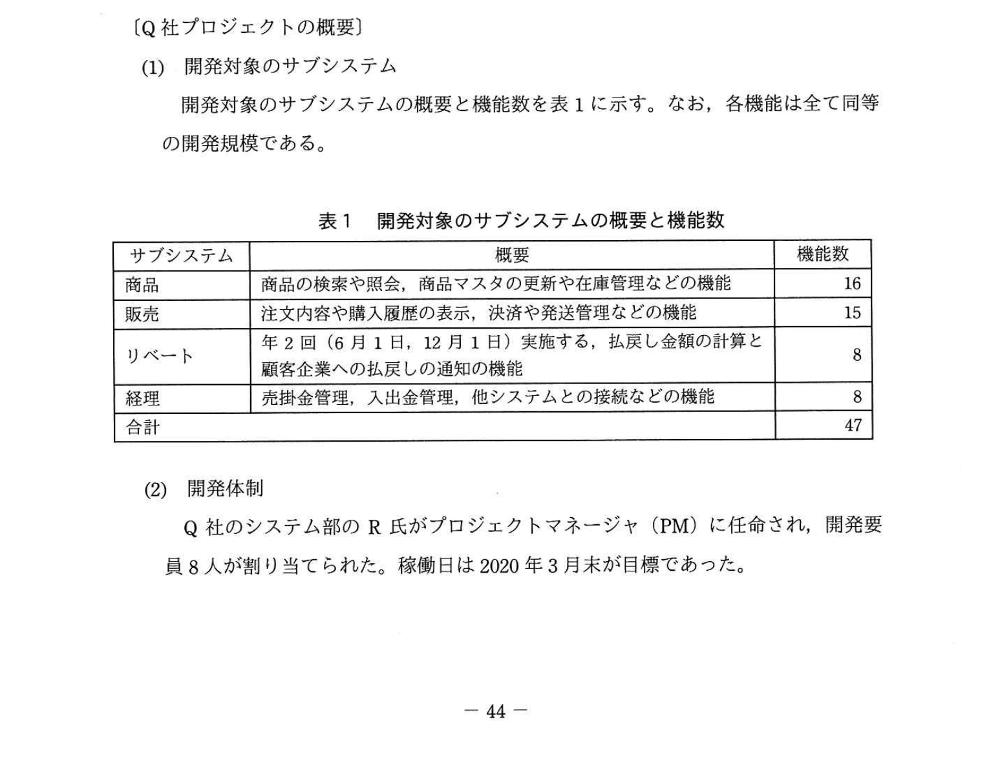
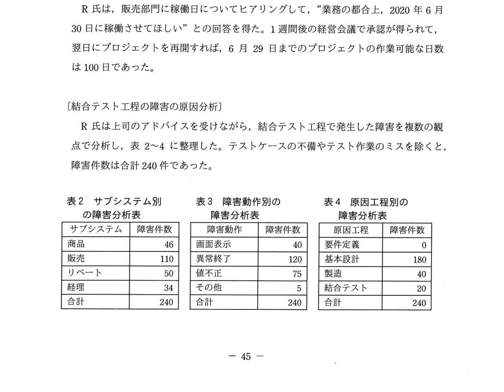
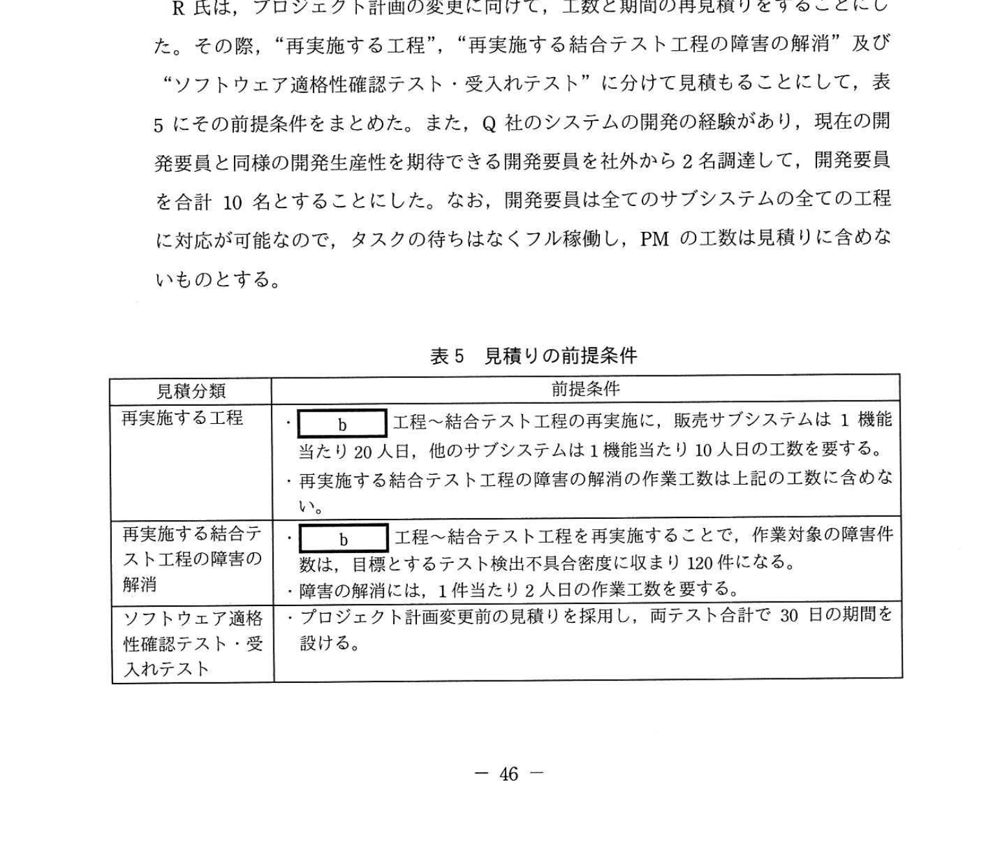
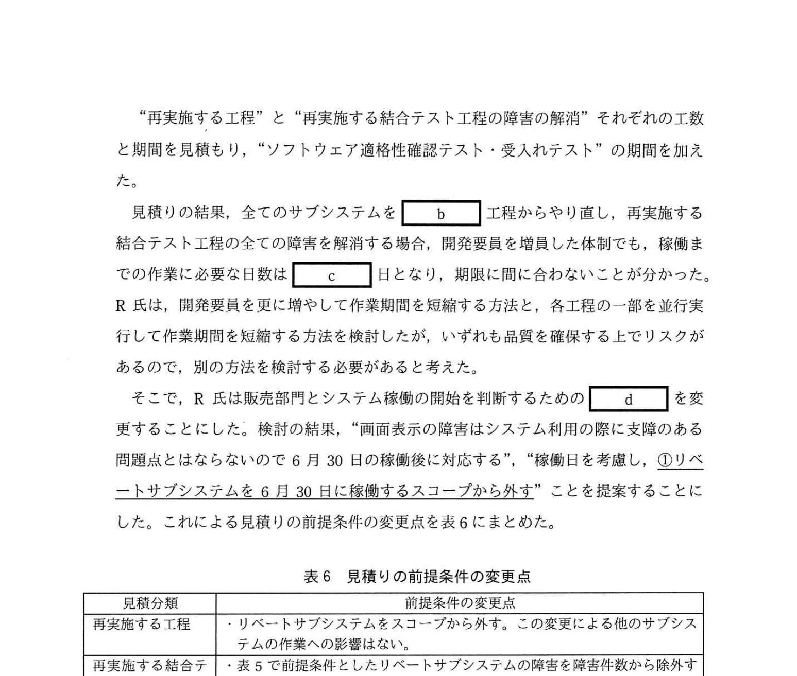

# 2020年秋期（令和2年度）応用情報技術者試験 午後 問9（選択）
## プロジェクトマネジメント：稼働延期に伴うプロジェクト計画の変更（Q社飲料メーカー）

---

## 問題文

**問9** 稼働延期に伴うプロジェクト計画の変更に関する次の記述を読んで、設問1〜4に答えよ。

Q社は中堅の飲料メーカーであり、卸や小売の顧客企業に酒類を販売している。一定規模以上の顧客企業からはEDIで注文を受けているが、小規模な顧客企業からはQ社の販売部門がファックスや電話で注文を受けていた。小規模な顧客企業は約150社存在し、販売部門の業務負荷が高かった。そこで業務効率向上を目的にWeb受注システムを開発することを経営会議で決定した。さらに顧客企業への受注金額に応じた支払代金の一部の定期的な払戻しや売掛金管理や入出金管理などの業務を手作業で実施しているので、これらの業務も併せてシステム化することにした。販売部門からシステム部に開発を依頼し、プロジェクト（以下、Q社プロジェクトという）を立ち上げた。

---

### 〔Q社プロジェクトの概要〕

**(1) 開発対象のサブシステム**

開発対象のサブシステムの概要と機能数を表1に示す。なお、各機能は全て同等の開発規模である。

### 表1 開発対象のサブシステムの概要と機能数

> | サブシステム | 概要 | 機能数 |
> |-----------|------|--------|
> | 商品 | 商品の検索や照会、商品マスタの更新や在庫管理などの機能 | 16 |
> | 販売 | 注文内容や購入履歴の表示、決済や発送管理などの機能 | 15 |
> | リベート | 年2回（6月1日、12月1日）実施する、払戻し金額の計算と顧客企業への払戻しの通知などの機能 | 8 |
> | 経理 | 売掛金管理、入出金管理、他システムとの接続などの機能 | 8 |
> | 合計 |  | 47 |

**(2) 開発体制**

Q社のシステム部のR氏がプロジェクトマネージャ（PM）に任命され、開発要員8名が割り当てられた。稼働日は2020年3月末が目標であった。

---

### 〔プロジェクト計画の変更〕

Q社プロジェクトはソフトウェア要件定義（以下、要件定義という）、ソフトウェア方式設計（以下、基本設計という）、ソフトウェアコード作成及びテスト（以下、製造という）の工程が終了し、テスト密度やテスト検出不具合密度などの品質管理の指標値に問題がないことを確認した。しかし、ソフトウェア結合テスト（以下、結合テストという）のテスト項目の消化が終了した時点で、全てのサブシステムで目標とするテスト検出不具合密度を大幅に超過する障害が発生していた。R氏は、システム部の部長に状況を説明し、次週の経営会議に報告するよう指示を受けた。

経営会議では、品質に問題があって注文が正しく処理されないと顧客企業に迷惑が掛かるので、品質の確保を最優先にすること、社内の業務効率向上が目的であり稼働日には調整の余地があるので販売部門に確認すること、予算を超過するコストの追加が必要な場合は経営会議の承認を得ること、が指示された。この指示を受けてR氏は、一旦プロジェクトを中断してプロジェクト計画変更の検討を開始した。

R氏は、販売部門に稼働日についてヒアリングして、"業務の都合上、2020年6月30日に稼働させてほしい"との回答を得た。1週間後の経営会議で承認が得られて、翌日にプロジェクトを再開すれば、6月29日までのプロジェクトの作業可能な日数は**100日**であった。

---

### 〔結合テスト工程の障害の原因分析〕

R氏は上司のアドバイスを受けながら、結合テスト工程で発生した障害を複数の観点から分析し、表2〜4に整理した。テストケースの不備やテスト作業のミスを除くと、障害件数は合計**240件**であった。

### 表2・表3・表4 障害分析

> **表2 サブシステム別の障害分析表:**
> | サブシステム | 障害件数 |
> |------------|---------|
> | 商品 | 46 |
> | 販売 | 110 |
> | リベート | 50 |
> | 経理 | 34 |
> | 合計 | 240 |
>
> **表3 障害動作別の障害分析表:**
> | 障害動作 | 障害件数 |
> |---------|---------|
> | 画面表示 | 40 |
> | 異常終了 | 120 |
> | 値不正 | 75 |
> | その他 | 5 |
> | 合計 | 240 |
>
> **表4 原因工程別の障害分析表:**
> | 原因工程 | 障害件数 |
> |---------|---------|
> | 要件定義 | 0 |
> | 基本設計 | 180 |
> | 製造 | 40 |
> | 結合テスト | 20 |
> | 合計 | 240 |

なお、表3の画面表示の障害とは、画面に表示する項目の位置がずれる障害で、商品サブシステム及び販売サブシステムで発生している。また、表4の原因工程とは障害の原因が作り込まれた工程を意味する。

R氏は品質の状態をサブシステム別の観点の分析から見た結果、特に販売サブシステムの品質を強化することにした。さらに `[　a　]` 別の観点の分析から、成果物を確認したところ、機能をまたがる整合性の確認が不十分であったことが分かった。これによって、障害件数が目標とするテスト検出不具合密度を大幅に超過した根本原因を特定した。そこで、R氏はこれまでに発生した障害の状況を踏まえて是正処置を講じた上で、`[　b　]` 工程から作業を再実施する方針とした。

---

### 〔販売部門との調整〕

R氏は、プロジェクト計画の変更に向けて、工数と期間の再見積りをすることにした。その際、"再実施する工程"、"再実施する結合テスト工程の障害の解消"及び"ソフトウェア適格性確認テスト・受入れテスト"に分けて見積もることにして、表5にその前提条件をまとめた。また、Q社のシステムの開発の経験があり、現在の開発要員と同様の開発生産性を期待できる開発要員を社外から**2名調達**して、開発要員を合計**10名**とすることにした。なお、開発要員は全てのサブシステムの全ての工程に対応が可能なので、タスクの待ちはなくフル稼働し、PMの工数は見積りに含めないものとする。

### 表5 見積もりの前提条件

> | 見積分類 | 前提条件 |
> |---------|---------|
> | 再実施する工程 | ・`[　b　]` 工程〜結合テスト工程の再実施に、販売サブシステムは1機能当たり20人日、他のサブシステムは1機能当たり10人日の工数を要する。 ・再実施する結合テスト工程の障害の解消の作業工数は上記の工数に含めない。 |
> | 再実施する結合テスト工程の障害の解消 | ・`[　b　]` 工程〜結合テスト工程を再実施することで、作業対象の障害件数は、目標とするテスト検出不具合密度に収まり**120件**になる。 ・障害の解消には、1件当たり2人日の作業工数を要する。 |
> | ソフトウェア適格性確認テスト・受入れテスト | ・プロジェクト計画変更前の見積りを採用し、両テスト合計で**30日**の期間を設ける。 |

---

"再実施する工程"と"再実施する結合テスト工程の障害の解消"それぞれの工数と期間を見積もり、"ソフトウェア適格性確認テスト・受入れテスト"の期間を加えた。

見積りの結果、全てのサブシステムを `[　b　]` 工程からやり直し、再実施する結合テスト工程の全ての障害を解消する場合、開発要員を増員した体制でも、稼働までの作業に必要な日数は `[　c　]` 日となり、期限に間に合わないことが分かった。R氏は、開発要員を更に増やして作業期間を短縮する方法と、各工程の一部を並行実行して作業期間を短縮する方法を検討したが、いずれも品質を確保する上でリスクがあるので、別の方法を検討する必要があると考えた。

そこで、R氏は販売部門とシステム稼働の開始を判断するための `[　d　]` を変更することにした。検討の結果、「画面表示の障害はシステム利用の際に支障のある問題点とはならないので6月30日の稼働後に対応する」、「稼働日を考慮し、**①リベートサブシステムを6月30日に稼働するスコープから外す**」ことを提案することにした。これによる見積りの前提条件の変更点を表6にまとめた。

### 表6 見積もりの前提条件の変更点

> | 見積分類 | 前提条件の変更点 |
> |---------|--------------|
> | 再実施する工程 | ・リベートサブシステムをスコープから外す。この変更による他のサブシステムの作業への影響はない。 |
> | 再実施する結合テスト工程の障害の解消 | ・表5で前提条件としたリベートサブシステムの障害を障害件数から除外する。 ・画面表示の障害を作業対象から除外する。 ・作業対象の障害件数は**75件**とする。 |
> | ソフトウェア適格性確認テスト・受入れテスト | ・リベートサブシステムをスコープから外すので、期間は**4日短縮**でき、**26日間**となる。 |

調整の結果、6月30日の稼働後に追加開発を行うことを条件に販売部門と `[　d　]` の変更の合意が取れた。作業が必要な日数は `[　e　]` 日となり、期限に間に合う計画になった。

---

### 〔経理の処理のパターンへの対応〕

販売部門からシステム部に、経理サブシステムで算出する金額の誤りは業務への影響が大きいので、全ての経理の処理のパターンにおいて現行業務で算出している金額と経理サブシステムで算出する金額に差異がないように、特に注意して検証するよう要請があった。R氏は、経理の処理に関する条件は多岐にわたるので、販売部門にデータの提供を依頼し、**②結合テストで予定していたテストの他に別のテストを追加した**。このテストを追加しても期限に間に合うことも確認した。

---

### 〔プロジェクトの監視〕

R氏は、これまでの検討結果を反映して、プロジェクト計画を変更し、予定していた経営会議での承認を得たので、プロジェクトを再開した。R氏は、プロジェクトを再開するに当たって、進捗管理に加えて、計画どおりの工数で完了できるかどうかを見極めるため、検証と監視を強化した。再実施する工程については、一部機能で先行作業を行って、見積りどおりの工数に収まることを検証した。さらに再実施する結合テスト工程の障害の解消については、表5及び表6の前提条件に基づいて、**③再実施する結合テスト工程で二つの指標の実績値を監視することにした**。

---

## 設問

### 設問1 本文中の `[　a　]`、`[　b　]` に入れる適切な字句を8字以内で答えよ。

### 設問2 〔販売部門との調整〕について、(1)〜(3)に答えよ。

**(1)** 本文中の `[　d　]` に入れる適切な字句を解答群の中から選び、記号で答えよ。

**解答群：**  
ア コミュニケーション計画　　イ 導入可否判断基準  
ウ マスタスケジュール　　　　エ リスク管理表

**(2)** 本文中の下線①について、R氏がリベートサブシステムを6月30日の稼働のスコープから外せると考えた理由を40字以内で述べよ。

**(3)** 本文中の `[　c　]`、`[　e　]` に入れる適切な数値を答えよ。ここで、〔経理の処理のパターンへの対応〕に記載のある追加テストは見積りに含めない。

### 設問3 本文中の下線②について、どのようなことを確認するテストを追加したのか。30字以内で述べよ。

### 設問4 本文中の下線③について、何の実績値を監視することにしたのか。25字以内で述べよ。

---

## 解答と解説

### 設問1

**a = 原因工程**

R氏が障害を「複数の観点から分析」した際に整理した表2〜4の中で、表4のタイトルは「**原因工程別**の障害分析表」。本文中の[a]はこの分析の観点を示す「**原因工程**」。

**b = 基本設計**

表5の「再実施する工程」で「`[b]` 工程〜結合テスト工程の再実施」。表4より障害の最多原因は**基本設計**工程（180件）なので、基本設計からやり直す。

**IPA公式：a = 原因工程 / b = 基本設計**

---

### 設問2

**(1) 正解：イ（導入可否判断基準）**

「販売部門にシステム稼働の開始を判断するための `[d]` を変更する」= 「システムを稼働（Go-Live）させるかどうかの判断基準」= **導入可否判断基準**

「画面表示の障害はシステム利用の際に支障のある問題点とはならない」として、導入可否判断基準から画面表示障害を除外することで、残りの障害を減らして稼働可能な状態にする。

**IPA公式：イ（導入可否判断基準）**

**(2) 正解（40字以内）：稼働日からリベートサブシステムの機能を実施する日まで期間に余裕があるから（38字）**

「リベート: 年2回（6月1日、12月1日）実施する、払戻し金額の計算と顧客企業への払戻しの通知などの機能」

→ 6月30日稼働後、次のリベート実施日は12月1日（約5か月後）。6月30日〜12月1日の間に追加開発できる余裕があるため、スコープ外にできる。

**IPA公式：稼働日からリベートサブシステムの機能を実施する日まで期間に余裕があるから**

**(3) c と e の計算**

**c = 116日（スコープ変更なし・10人での所要日数）**

全サブシステム（47機能）の再実施工数:
- 販売(15機能) × 20人日 = 300人日
- その他(商品16 + リベート8 + 経理8 = 32機能) × 10人日 = 320人日
- 再実施小計: 620人日

障害解消工数:
- 120件 × 2人日 = 240人日

合計工数: 620 + 240 = **860人日**  
開発期間: 860 ÷ 10人 = **86日**  
ソフトウェア適格性確認・受入れテスト: **30日**  
**合計: 86 + 30 = 116日** > 100日（期限に間に合わない）

**e = 95日（表6スコープ変更後・10人での所要日数）**

スコープ変更後（リベート除外）の再実施工数:
- 販売(15機能) × 20人日 = 300人日
- 商品(16機能) × 10人日 = 160人日
- 経理(8機能) × 10人日 = 80人日
- 再実施小計: 540人日

障害解消工数（表6: 75件）:
- 75件 × 2人日 = 150人日

合計工数: 540 + 150 = **690人日**  
開発期間: 690 ÷ 10人 = **69日**  
ソフトウェア適格性確認・受入れテスト（表6: リベート除外で4日短縮）: **26日**  
**合計: 69 + 26 = 95日** ≤ 100日（期限に間に合う）

**IPA公式：c = 116 / e = 95**  
※ 注記: IPAの公式解答は解答用紙から計算して確認してください。

---

### 設問3

**正解：現行業務と経理サブシステムで算出する金額が一致するかを確認するテスト（30字）**

「全ての経理の処理のパターンにおいて現行業務で算出している金額と経理サブシステムで算出する金額に差異がないように、特に注意して検証するよう要請があった」

→ 現行業務の多岐にわたる処理パターンのデータを販売部門から入手し、現行業務と新システムの計算結果が一致するかを検証するテストを追加。

**IPA公式：現行業務と経理サブシステムで算出する金額の一致（を確認するテスト）**

---

### 設問4

**正解：障害の発生件数と1件当たりの解消の作業工数（23字）**

表5・表6の前提条件に基づく2つの指標:
- **障害件数**: 計画では75件。実績が計画を超えているかどうかを監視
- **1件当たりの解消の作業工数**: 計画では2人日/件。実績が乖離していないかを監視

この2つを監視することで、「障害解消」フェーズが計画どおり（75件 × 2人日 = 150人日）に収まるかを判断できる。

**IPA公式：障害の発生件数と1件当たりの解消の作業工数**

---

## 参考：主要キーワード

| 用語 | 説明 |
|------|------|
| プロジェクト計画変更 | スコープ・スケジュール・コストなどの変更に伴うプロジェクト計画の見直しと再承認 |
| テスト検出不良合致度 | テストで検出すべき欠陥のうち実際に検出できた割合。品質指標として使用 |
| スコープ外し | プロジェクトの成果物の一部を今回のリリースから除外し、後続リリースに移す手法 |
| 導入可否判断基準（Go/No-Go基準） | システムを本稼働させるかどうかの判断に使用する定量的・定性的な基準 |
| 人日（にんにち） | 1人が1日かける工数の単位。10人日 = 1人が10日 or 10人が1日 |
| 障害原因工程 | 障害が作り込まれた工程。基本設計の障害が多い = 基本設計からやり直しが必要 |
| リベート | 販売実績に応じて顧客に払い戻す報奨金。年2回など定期的に支払われる |
| ソフトウェア適格性確認テスト | ソフトウェアが要件を満たしているかを確認する最終テスト |
| 受入れテスト | ユーザーがシステムを実際に使用して要件を満たすか確認するテスト |
