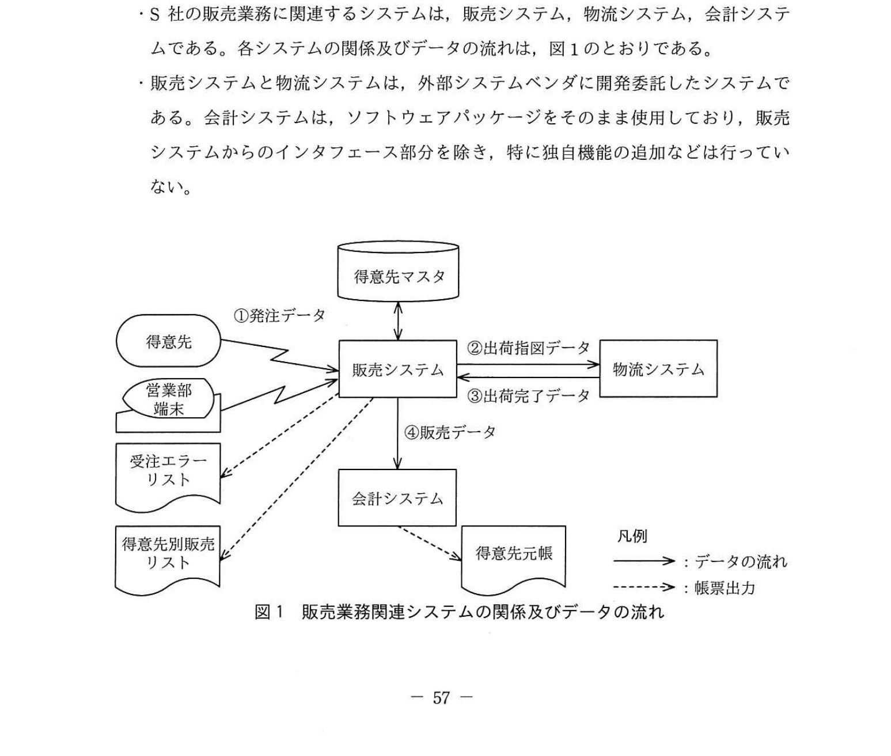
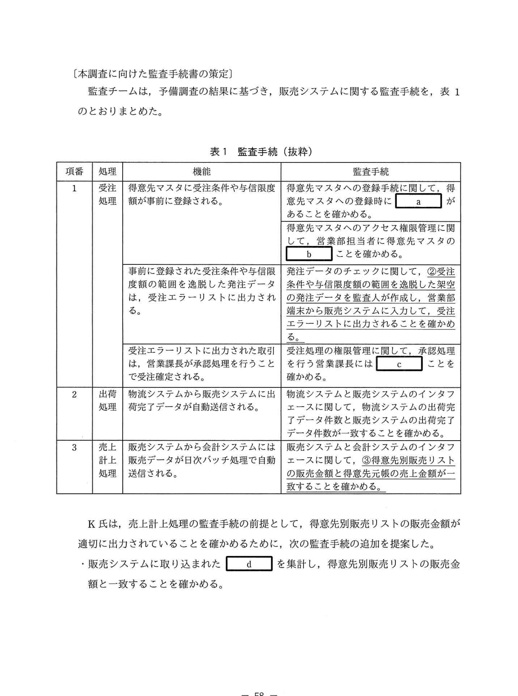

# 2020年秋期（令和2年度）応用情報技術者試験 午後 問11（選択）
## システム監査：販売システムの監査（S社電子部品メーカー）

---

## 問題文

**問11** 販売システムの監査に関する次の記述を読んで、設問1〜5に答えよ。

S社は中堅の電子部品メーカーである。電子機器メーカーなどの得意先に対して、電子部品を製造し、販売している。

S社監査部では、定期的に業務監査を行っているが、これまでITに精通した要員がおらず、業務で利用されている情報システムの監査が十分にはできていなかった。そこで、情報システム部における開発経験が豊富なK氏を監査部に異動させることで、システム監査体制を強化した。今年度、監査部が販売システムの監査を実施するに当たり、監査部長は、**①K氏を監査人に任命することに関して、独立性の観点から確認し**、監査チームのメンバとして参加させることにした。

監査チームは予備調査を行い、その結果、次のことが分かった。

---

### 〔販売業務の概要〕

**(1) 受注処理**

- 得意先からの発注データはEDIによって販売システムに取り込まれる。EDIを利用していない得意先からの発注情報は、ファックスや電話で営業部に送られてくるので、営業部担当者が得意先からの発注内容を販売システムに入力し、受注エラーリストから販売システムに取り込まれる。
- 得意先ごとに品名、今期最低品目ごとの受注条件や与信限度額が事前に登録されている。管理部マスタに登録されている受注条件や与信限度額の範囲を超過した場合は、営業部端末から販売システムに入力し、受注エラーリストに出力される。
- 得意先マスタに登録されている受注条件や与信限度額の範囲を逸脱した発注データは、受注エラーリストに出力される。受注エラーリストに出力された取引は、受注処理の確認として、承認処理を経て受注確定される。

**(2) 出荷処理**

- 物流システムから販売システムには出荷完了データが自動送信される。
- 物流システムからの出荷完了データに基づき、販売システムで販売データが作成される。

**(3) 売上計上処理**

- 販売データは、会計システムに日次バッチ処理で自動送信され、出荷基準に基づいて売上計上される。会計システムからは、得意先別の売上金額などが記載された得意先元帳を出力することができる。
- 営業部担当者は、販売システムから得意先別販売リストを毎月出力し、内容を確認した後、営業課長に報告を行っている。

---

### 〔システムの概要〕

- S社の販売業務に関連するシステムは、販売システム、物流システム、会計システムである。各システムの関係及びデータの流れは、図1のとおりである。
- 販売システムと物流システムは、外部システムベンダに開発委託したシステムである。会計システムは、ソフトウェアパッケージをそのまま使用しており、販売システムからのインタフェース部分を除き、特に独自機能の追加などは行っていない。

### 図1 販売業務関連システムの関係及びデータの流れ

> **データフロー:**
> - 得意先マスタ → 販売システム ←①発注データ← 得意先 / 営業部端末
> - 販売システム →②出荷指図データ→ 物流システム →③出荷完了データ→ 販売システム
> - 販売システム →④販売データ→ 会計システム → 得意先元帳
> - 受注エラーリスト（販売システムから出力）
> - 得意先別販売リスト（販売システムから出力）
>
> 凡例: 実線矢印 = データの流れ / 破線矢印 = 帳票出力

---

### 〔本調査に向けた監査手続書の策定〕

監査チームは、予備調査の結果に基づき、販売システムに関する監査手続を、表1のとおりまとめた。

### 表1 監査手続（抜粋）

> | 項番 | 処理 | 機能 | 監査手続 |
> |-----|------|------|---------|
> | 1 | 受注処理 | 得意先マスタに受注条件や与信限度額が事前に登録される。 | 得意先マスタへの登録手続に関して、得意先マスタへの登録に `[　a　]` があることを確かめる。 得意先マスタへのアクセス権限管理に関して、営業部担当者に得意先マスタの `[　b　]` ことを確かめる。 |
> |  |  | 事前に登録された受注条件や与信限度額の範囲を逸脱した発注データは、受注エラーリストに出力される。 | 発注データのチェックに関して、**②受注条件や与信限度額の範囲を逸脱した架空の発注データを監査人が作成し、営業部端末から販売システムに入力して、受注エラーリストに出力されることを確かめる。** |
> |  |  | 受注エラーリストに出力された取引は、受注処理の確認として、承認処理を経て受注確定される。 | 受注処理の権限管理に関して、承認処理を行う営業課長に `[　c　]` ことを確かめる。 |
> | 2 | 出荷処理 | 物流システムから販売システムには出荷完了データが自動送信される。 | 販売システムと物流システムのインタフェースに関して、物流システムの出荷完了データ件数と販売システムの出荷完了データ件数が一致することを確かめる。 |
> | 3 | 売上計上処理 | 販売システムから会計システムには販売データが日次バッチ処理で自動送信される。 | 販売システムと会計システムのインタフェースに関して、**③得意先別販売リストの販売金額と得意先元帳の売上金額が一致することを確かめる。** |

K氏は、売上計上処理の監査手続の前提として、得意先別販売リストの販売金額が適切に出力されていることを確かめるために、次の監査手続の追加を提案した。

- 販売システムに取り込まれた `[　d　]` を集計し、得意先別販売リストの販売金額と一致することを確かめる。

---

## 設問

### 設問1 本文中の下線①について、監査部長が確認したと考えられる事項を、30字以内で具体的に述べよ。

### 設問2 受注処理における監査対象の機能に関する監査手続について、表1中の `[　a　]`、`[　b　]`、`[　c　]` に入れる適切な字句を、それぞれ10字以内で答えよ。

### 設問3 表1中の下線②について、この監査手続を実施する場合、監査人は業務への影響について、どのような点に留意しなければならないか。35字以内で述べよ。

### 設問4 表1中の下線③について、このような監査手続を何というか。最も適切な字句を、解答群の中から選び、記号で答えよ。

**解答群：**  
ア インタビュー法　　イ チェックリスト法  
ウ 突合・照合法　　　エ ペネトレーションテスト法

### 設問5 本文中の `[　d　]` に入れる適切な字句は何か。本文中から選び、10字以内で答えよ。

---

## 解答と解説

### 設問1

**正解（30字以内）：**
- **販売システムの担当から離れて一定期間経過していること（26字）**
- **販売システムの開発・保守業務に対する関与度合い（23字）**

「K氏を監査人に任命することに関して、独立性の観点から確認した」

システム監査における「独立性」とは、監査人が監査対象に対して業務上・精神上の独立を保っていることが必要。

K氏は情報システム部から異動してきた開発経験者。もしK氏が販売システムの**開発・保守業務に関与**していた場合、自身が開発したシステムを監査することになり、独立性を保てない。

確認事項:
- 販売システムの開発・保守に関与していた期間（一定期間が経過しているか）
- 現在も販売システムに関する業務上の関係があるか

**IPA公式：**
- **販売システムの担当から離れて一定期間経過していること**
- **販売システムの開発・保守業務に対する関与度合い**

---

### 設問2

**a = 管理部長の承認記録（10字）**

「得意先マスタへの登録手続に関して、得意先マスタへの登録に `[a]` があることを確かめる」

得意先マスタへの登録は重要なマスタ管理業務であり、適切な承認プロセスが必要。承認者（管理部長）の承認が記録（ログや承認印など）として残っていることを確認する。

**IPA公式：a = 管理部長の承認記録**

**b = 登録権限がない（6字）/ 更新権限がない（6字）（どちらでも可）**

「営業部担当者に得意先マスタの `[b]` ことを確かめる」

得意先マスタへのアクセス権限管理: 営業部担当者は受注入力が業務であり、得意先マスタの**登録・変更権限（登録権限・更新権限）を持つべきでない**。権限の分離（職務分掌）を確認する。

**IPA公式：b = 登録権限がない（または更新権限がない）**

**c = 受注入力権限がない（9字）**

「承認処理を行う営業課長に `[c]` ことを確かめる」

受注エラーリストの承認者（営業課長）が、承認対象の受注入力もできてしまうと、自作自演（不正な受注→自己承認）が可能になる。職務分掌として営業課長は**受注入力権限を持つべきでない**。

**IPA公式：c = 受注入力権限がない**

---

### 設問3

**正解（35字以内）：監査人が作成した発注データが受注確定されてしまわないこと（29字）**

下線②「受注条件や与信限度額の範囲を逸脱した架空の発注データを監査人が作成し、営業部端末から販売システムに入力する」

テストデータ（架空の発注データ）を本番システムに入力するので:
- 入力したテストデータが実際に**受注確定**されてしまうリスク
- → 架空の注文が実際の業務処理（出荷指図など）に流れてしまう恐れ

留意点: テストデータが確実に**受注エラーリストに出力されるだけで、受注確定されない**ことを確認し、万一確定されてしまった場合のロールバック手順を準備しておく。

**IPA公式：監査人が作成した発注データが受注確定されてしまわないこと**

---

### 設問4

**正解：ウ（突合・照合法）**

下線③「得意先別販売リストの販売金額と得意先元帳の売上金額が**一致する**ことを確かめる」

= 2つの異なる資料・データを照らし合わせて整合性を確認する手法 = **突合・照合法**

- ア（インタビュー法）: 関係者に口頭で質問して情報収集する手法
- イ（チェックリスト法）: 確認すべき事項をリスト化して確認する手法
- ウ（突合・照合法）: 2つ以上の資料を照合して一致を確認する ✓
- エ（ペネトレーションテスト法）: 不正アクセスを試みてセキュリティの脆弱性を発見する手法

**IPA公式：ウ（突合・照合法）**

---

### 設問5

**正解：出荷完了データ（8字）**

「販売システムに取り込まれた `[d]` を集計し、得意先別販売リストの販売金額と一致することを確かめる」

売上計上の仕組み（図1より）:
- 物流システムから → 販売システムへ「**③出荷完了データ**」が自動送信される
- 販売システムが出荷完了データを基に「販売データ」を作成
- 販売データが → 会計システムへ送信されて売上計上

得意先別販売リストの販売金額の基礎となるのは、物流システムから取り込まれた**出荷完了データ**。これを集計して販売リストの金額と突合することで、データの完全性・正確性を確認できる。

**IPA公式：d = 出荷完了データ**

---

## 参考：主要キーワード

| 用語 | 説明 |
|------|------|
| システム監査 | 情報システムのリスクを評価し、適切な統制が機能しているかを独立した立場で検証する活動 |
| 独立性（監査の） | 監査人が監査対象から精神的・業務的に独立していること。ISACA・IIA・JISAの基準で要求される |
| 職務分掌 | 不正・誤謬を防ぐために、相互牽制が働くように職務・権限を分離すること |
| アクセス権限管理 | 各利用者が業務遂行に必要な最小限の権限のみ持つように制御すること（最小権限の原則） |
| 得意先マスタ | 受注条件・与信限度額・住所などの得意先情報を管理するマスタファイル |
| 受注エラーリスト | 受注条件や与信限度額の範囲を超えた発注データを出力するリスト。例外処理の管理に使用 |
| 突合・照合法 | 2つ以上の資料・データを照らし合わせて整合性・完全性を確認するシステム監査手法 |
| テストデータ法 | 架空のデータをシステムに入力して、処理結果が期待どおりかを確認する監査手法（下線②はこれ） |
| 承認記録 | 変更・処理の承認者・承認日時を記録したもの。内部統制の証拠として重要 |
| 与信限度額 | 取引先に対して信用供与できる最大金額。超過した場合は特別承認が必要 |
| EDI（電子データ交換） | Electronic Data Interchange。企業間の取引データを電子的に交換する仕組み |
