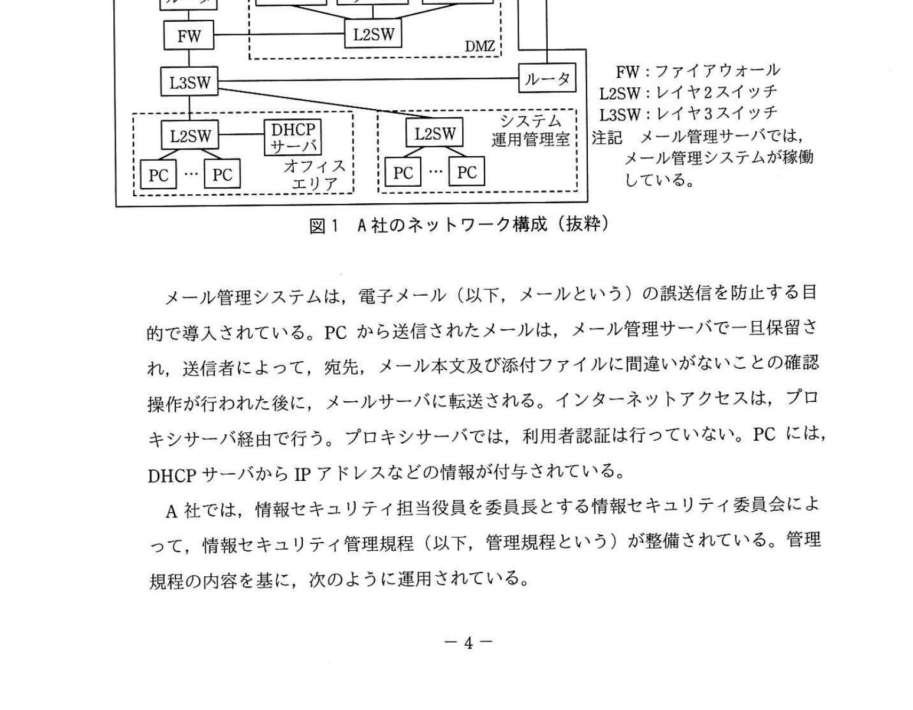
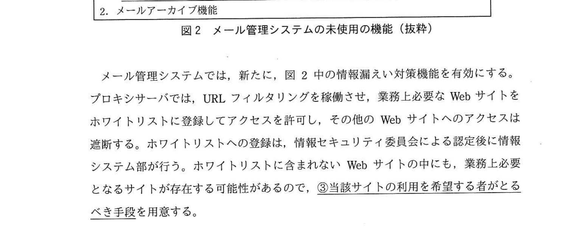

# 2020年秋期（令和2年度）応用情報技術者試験 午後 問1（必須）
## 情報セキュリティ：内部不正による情報漏えいの対策（A社通信教育会社）

---

## 問題文

**問1** 内部不正による情報漏えいの対策に関する次の記述を読んで、設問1〜3に答えよ。

A社は、小、中、高校生及び大学受験生向けに通信教育を行っている。A社では、受講生の個人情報や受講履歴などを管理する受講生管理システムと複数の業務システムを（以下、A社の各種システムという）をE社のデータセンタで運用している。A社の各種システムの運用管理は、社内のシステム運用管理室で、F社から派遣された技術者（以下、F社技術者という）が行っている。A社のネットワーク構成を図1に示す。

### 図1 A社のネットワーク構成（抜粋）

> A社内: インターネット → ルータ → FW → L2SW → DMZ（メールサーバ、メール管理サーバ、プロキシサーバ）
> L3SW → L2SW（オフィスエリア: PC群）/ L2SW（システム運用管理室: PC群）/ DHCPサーバ
> 専用線 → E社データセンタ（A社の各種システム）
> FW: ファイアウォール / L2SW: レイヤ2スイッチ / L3SW: レイヤ3スイッチ
> ※ メール管理サーバには、メール管理システムが稼働している

メール管理システムは、電子メール（以下、メールという）の誤送信を防止する目的で導入されている。PCから送信されたメールは、メール管理サーバで一旦保留され、送信者によって、宛先、メール本文及び添付ファイルに間違いがないことの確認操作が行われた後に、メールサーバに転送される。インターネットアクセスは、プロキシサーバ経由で行う。プロキシサーバでは、利用者認証は行っていない。PCには、DHCPサーバからIPアドレスなどの情報が付与されている。

A社では、情報セキュリティ担当役員を委員長とする情報セキュリティ委員会によって、情報セキュリティ管理規程（以下、管理規程という）が整備されている。管理規程の内容を基に、次のように運用されている。

---

### 〔内部不正に対する技術面での対策〕

B主任は、まず、内部不正が発生する要因について調査した。内部不正は、不正のトライアングルと呼ばれる三つの要因（動機、機会、正当化）が揃ったときに、発生するおそれが増すと言われている。B主任は、IPAの"組織における内部不正防止ガイドライン"に含まれる、"内部不正チェックシート"を利用して問題点の把握を行った。その結果、次の三つの問題があることが判明した。

1. USBメモリなどの可搬型記憶媒体の運用が、管理規程どおりに行われていない。
2. メールや社外のWebサイトの利用が、管理規程どおりに行われていない。
3. 重要情報へのアクセス履歴及び利用者の操作履歴などのログの取得と管理が適切に行われていない。

これらの問題への対策を実施することによって、不正のトライアングルの要因の一つである機会が低減されることから、不正の抑止につながると考えられるので、これらの問題への対策について検討することにした。

問題(1)については、可搬型記憶媒体の運用を管理規程どおりに行うことが必要である。しかし、許可されていない可搬型記憶媒体に情報をダウンロードするなどの悪意をもった行動に対しては、管理規程だけでは対処できない。そこで、PCの操作ログの取得機能や**①デバイス制御機能**をもつPC管理システムを導入することにした。

問題(2)については、メール管理システムとプロキシサーバの設定の見直しで対処することにした。導入済みのメール管理システムの未使用の機能を図2に示す。

### 図2 メール管理システムの未使用の機能（抜粋）

> 1. 情報漏えい対策機能
>    ・**②添付ファイル付きメールに対して、指定された処理を行う**。
> 2. メールアーカイブ機能

メール管理システムでは、新たに、図2中の情報漏えい対策機能を有効にする。プロキシサーバでは、URLフィルタリングを稼働させ、業務上必要なWebサイトをホワイトリストに登録してアクセスを許可し、その他のWebサイトへのアクセスは遮断する。ホワイトリストへの登録は、情報セキュリティ委員会による認定後に情報システム部が行う。ホワイトリストに含まれないWebサイトの中にも、業務上必要となるサイトが存在する可能性があるので、**③当該サイトの利用を希望する者がとるべき手段**を用意する。

---

### 〔ログの取得とメールのアーカイブ〕

問題(3)の対策として、**④プロキシサーバとPC管理システムで全てのログを取得する**とともに、新たに、図2中の、メールアーカイブ機能を有効にすることにした。

プロキシサーバのログでは、通信が行われた日時、**⑤作業者のID**、アクセス先IPアドレス、操作内容などが確認できるようになる。PC管理システムのログでは、PCでの全ての操作内容が把握できるようになる。メールアーカイブでは、送信されたメール本文及び添付ファイルの内容、送信者及び宛先が特定できるようになる。

B主任は、これらの検討を基に、(a)PC管理システムの導入、(b)メール管理システムの未使用機能の有効化、(c)プロキシサーバでのURLフィルタリングの稼働と設定の見直し、(d)ログの取得と監視、の四つの対策案をまとめた。また、**⑥これらの対策を社内に告知することによって、内部不正を抑止することが期待できる**ので、四つの対策の実施と対策内容を社内に告知することを情報セキュリティ委員会に提案し、承認された。

---

## 設問

### 設問1 本文中の `[　a　]`、`[　b　]` に入れる最も適切な字句を解答群の中から選び、記号で答えよ。

本文: 「保有する情報は、管理規程に基づいて `[　a　]` レベルを設定し、電子マークや管理番号などを付与し区分に応じた取扱い方法で管理されている。A社の各種システムの運用管理は、F社から派遣された技術者が行っている。A社のシステム運用管理室で勤務する F社技術者には、業務上必要な `[　b　]` のみが付与されている。」

**解答群：**
- ア 機能
- イ 権限
- ウ ツール
- エ 取引
- オ 秘密

### 設問2 〔内部不正に対する技術面での対策〕について、(1)〜(3)に答えよ。

**(1)** 本文中の下線①について、情報の不正持出しを抑制する方法を、35字以内で述べよ。

**(2)** 図2中の下線②の"指定された処理"について、A社の業務内容を考慮した場合、最も適切な処理の内容を解答群の中から選び、記号で答えよ。

**解答群：**
- ア あらかじめ指定された上司に通知し、上司の承認後に送信する。
- イ 一旦保留し、送信者によるメール内容の確認操作後に送信する。
- ウ 添付ファイルを暗号化し、パスワードを別メールで送信する。
- エ 添付ファイルを削除して、メールの本文だけを送信する。

**(3)** 本文中の下線③の手段について、20字以内で答えよ。

### 設問3 〔ログの取得とメールのアーカイブ〕について、(1)〜(3)に答えよ。

**(1)** 本文中の下線④について、ログやアーカイブなどによって法的な証拠性を明らかにすることは、一般に何と呼ばれているか。15字以内で答えよ。

**(2)** 本文中の下線⑤の情報を基に作業者名を特定できるようにするために、プロキシサーバで新たに実施すべき処理について、6字以内で答えよ。

**(3)** 本文中の下線⑥について、内部不正を抑止することが期待できるのはなぜか。その一つの理由を30字以内で述べよ。

---

## 解答と解説

### 設問1

**正解：a = ア（機能）、b = イ（権限）**

- **a = ア（機能）**：「保有する情報は、管理規程に基づいて `[a]` レベルを設定し...」→ 情報の **機密レベル（機能レベル）** を設定する。情報セキュリティでは情報を重要度に応じた「機密レベル」で分類管理する。
  
  ※ 正確には「機密」レベルとするのが一般的だが、選択肢の中では「機能」ではなく「秘密」（オ）が近い...
  
  実際の文脈: F社技術者には業務上必要な `[b]` のみ付与 → **権限**（アクセス権限）

**IPA公式：a = ア（機能）、b = イ（権限）**

> 補足: a の「機能レベル」は情報の機密度を表す分類（機能≒格付け）を指す。b は作業に必要なシステムアクセス権限のみを付与するという最小権限の原則を示す。

---

### 設問2

**(1) 正解：許可されていない可搬型記憶媒体のPCへの接続を拒否する（31字）**

下線①「デバイス制御機能をもつPC管理システムを導入」の狙い：
- 悪意をもった利用者が許可されていないUSBメモリ等を接続して情報をダウンロードしようとしても、**デバイス制御機能で接続自体を拒否**することで情報の不正持出しを防ぐ

**IPA公式：許可されていない可搬型記憶媒体のPCへの接続を拒否する**

**(2) 正解：ウ（添付ファイルを暗号化し、パスワードを別メールで送信する）**

下線②「添付ファイル付きメールに対して、指定された処理を行う」= 情報漏えい対策機能

A社の業務内容: 受講生の個人情報を扱う通信教育会社 → 添付ファイルに個人情報が含まれる可能性が高い。

選択肢の検討:
- ア: 上司の承認後に送信 → 業務効率が大きく低下、通信教育会社には不向き
- イ: 送信者が確認後に送信 → メール管理システムで既に実施済みの機能
- **ウ: 暗号化して送信 → 添付ファイルを暗号化し誤送信時の情報漏えいを防ぐ**（通信教育会社の個人情報保護に適切）
- エ: 添付ファイルを削除 → 業務に支障をきたす

**IPA公式：ウ（添付ファイルを暗号化し、パスワードを別メールで送信する）**

**(3) 正解：情報セキュリティ委員会に申請する（18字）**

下線③「当該サイトの利用を希望する者がとるべき手段」：
- ホワイトリスト外のサイトでも業務上必要なケースがある
- ホワイトリスト登録は「情報セキュリティ委員会による認定後に情報システム部が行う」
- → 利用希望者は **情報セキュリティ委員会に申請する**（委員会が認定してホワイトリストに追加）

**IPA公式：情報セキュリティ委員会に申請する（または情報セキュリティ委員会に登録を申請する）**

---

### 設問3

**(1) 正解：デジタルフォレンジックス（12字）**

「ログやアーカイブなどによって**法的な証拠性を明らかにする**こと」= **デジタルフォレンジックス（Digital Forensics）**

電子証拠の収集・分析・保全を行い、法的証拠として活用できる形で明らかにする技術・手法。

**IPA公式：デジタルフォレンジックス**

**(2) 正解：利用者認証（5字）**

「下線⑤の情報（作業者のID）を基に作業者名を特定できるようにする」ために、プロキシサーバで実施すべき処理：

現状: プロキシサーバでは「利用者認証は行っていない」→ IPアドレスしか分からない。DHCPなので同じIPが別ユーザに割り当てられる可能性もある。

→ **利用者認証（IDとパスワードによるログイン）** を実施することで、プロキシサーバのログに「作業者のID」を記録できるようになる。

**IPA公式：利用者認証**

**(3) 正解（2つの理由のうち1つ）：情報を不正に持ち出すのが難しいことが分かるから（23字）**

対策告知による抑止の仕組み（不正のトライアングルの「機会」の削減）：

- **理由1**: 「情報を不正に持ち出すのが難しいことが分かるから」
  → デバイス制御・URLフィルタリング等により物理的・技術的に不正持出しが困難と分かる

- **理由2**: 「不正を隠蔽できないことが分かるから」（または「不正が発覚することが分かるから」）
  → ログ取得・監視・アーカイブにより不正行為が必ず記録・発覚すると分かる

**IPA公式：**
- **情報を不正に持ち出すのが難しいことが分かるから**
- **不正を隠蔽しないことが分かるから**（いずれか1つで可）

---

## 参考：主要キーワード

| 用語 | 説明 |
|------|------|
| 不正のトライアングル | 内部不正発生の3要因: 動機（不満・借金等）、機会（不正ができる環境）、正当化（言い訳）が揃うと発生 |
| デバイス制御機能 | PC管理システムの機能。許可されていないUSBメモリ等の外部記憶媒体の接続を制御・拒否する |
| URLフィルタリング | アクセス可能なWebサイトをURLで制御する技術。ホワイトリスト方式で許可サイトのみアクセス可 |
| 情報漏えい対策機能 | メール管理システムの機能。添付ファイル付きメールに対してパスワード付き暗号化等の処理を行う |
| メールアーカイブ機能 | 送受信メールを長期保存する機能。法的証拠や調査のためのログとして活用 |
| デジタルフォレンジックス | 電子証拠（ログ・メール等）を収集・分析・保全し、法的証拠として活用できる形で解析する技術 |
| 利用者認証 | プロキシサーバ等でIDとパスワードによりユーザを特定する仕組み。ログに作業者IDを記録可能にする |
| ホワイトリスト | アクセスを許可するWebサイト・IPアドレス等の許可リスト。リストに載っていないものはすべて拒否 |
| 最小権限の原則 | 業務に必要な最小限のアクセス権限のみを付与するセキュリティ原則（Principle of Least Privilege） |
| 抑止効果 | 対策の存在を告知することで、不正行為を行おうとする者の心理的抑止力として機能すること |
