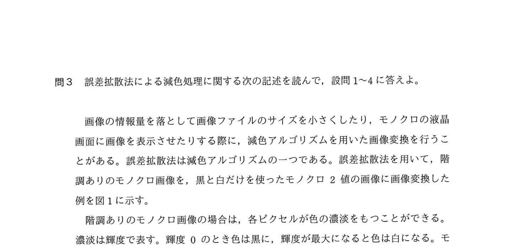
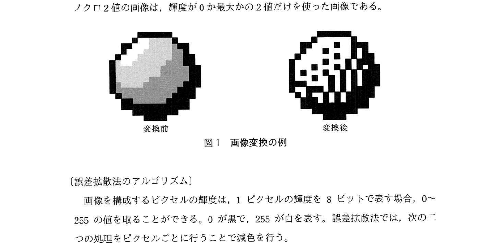
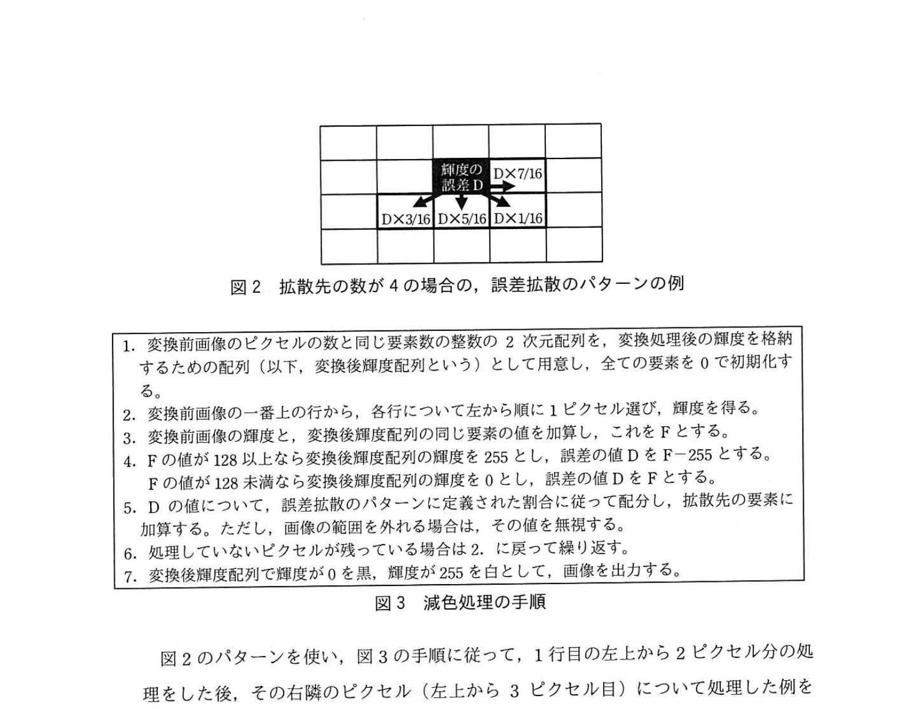
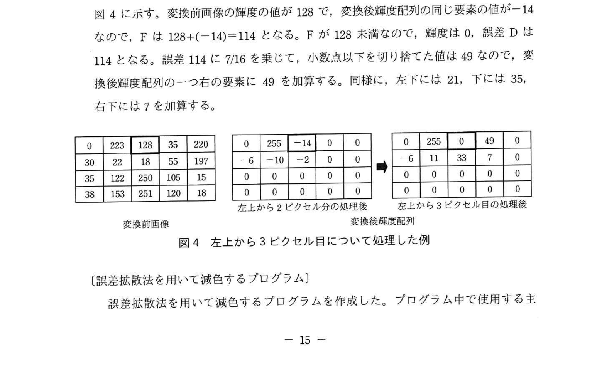
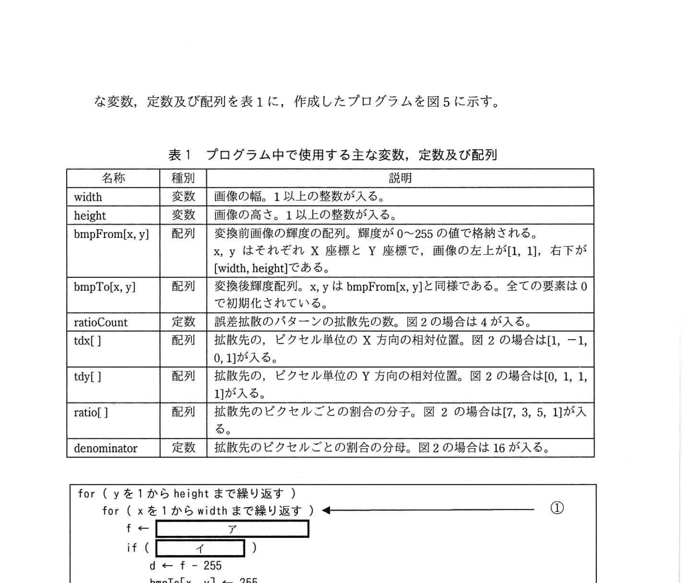
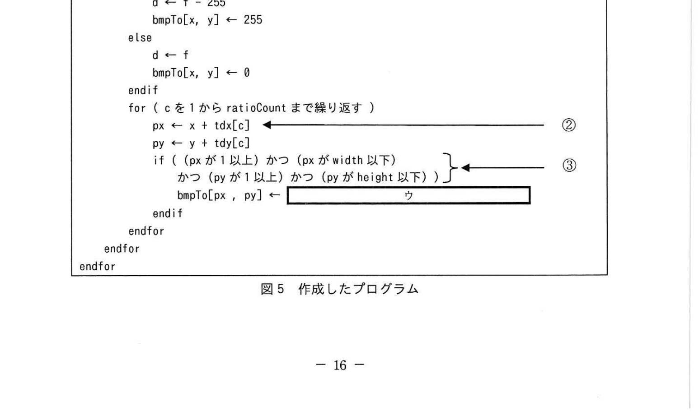
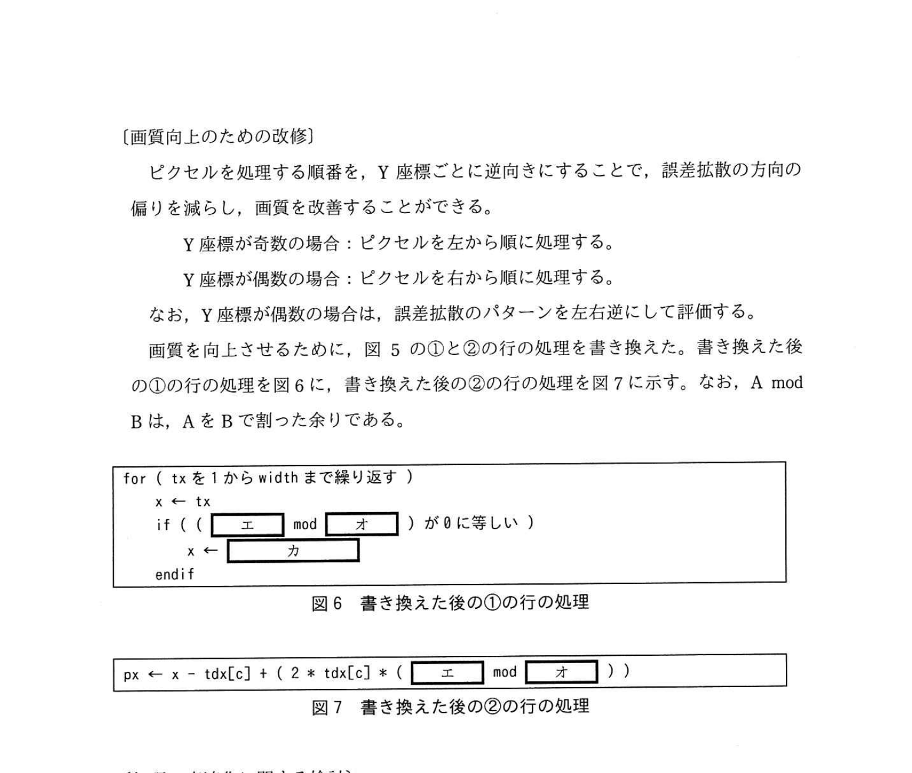

# 2020年秋期（令和2年度）応用情報技術者試験 午後 問3（選択）
## プログラミング：誤差拡散法による減色処理

---

## 問題文

**問3** 誤差拡散法による減色処理に関する次の記述を読んで、設問1〜4に答えよ。

画像の情報量を落として画像ファイルのサイズを小さくしたり、モノクロの液晶画面に画像を表示させたりする際に、減色アルゴリズムを用いた画像変換を行うことがある。誤差拡散法は減色アルゴリズムの一つである。誤差拡散法を用いて、階調ありのモノクロ画像を、黒と白だけを使ったモノクロ2値の画像に画像変換した例を図1に示す。

### 図1 画像変換の例



> 左: 階調ありのモノクロ画像（グレースケール球）→ 右: モノクロ2値画像（黒白ドット）

階調ありのモノクロ画像の場合、各ピクセルが色の濃淡をもつことができる。濃淡は輝度で表す。輝度0のとき色は黒に、輝度が最大になると色は白になる。モノクロ2値の画像は、輝度が0か最大かの2値だけを使った画像である。

---

### 〔誤差拡散法のアルゴリズム〕

画像を構成するピクセルの輝度は、1ピクセルの輝度を8ビットで表す場合、0〜255の値を取ることができる。0が黒で、255が白を表す。誤差拡散法では、次の二つの処理をピクセルごとに行うことで減色を行う。

**① 変換前のピクセルについて**、白に近い場合は輝度を255、黒に近い場合は輝度を0としてモノクロ2値化し、その際の輝度の差分を評価し、輝度の誤差Dとする。

例えば、変換前のピクセルの輝度が223の場合、変換後の輝度を255とし、輝度の誤差Dは、223−255から、−32である。

**② 事前に定義した誤差拡散のパターンに従って**、評価した誤差Dを周囲のピクセル（以下、拡散先という）に拡散させる。

拡散先の数が4の場合の、誤差拡散のパターンの例を図2に、減色処理の手順を図3に示す。なお、拡散する誤差の値は整数とし、小数点以下は切り捨てる。

### 図2 拡散先の数が4の場合の、誤差拡散のパターンの例



> | | | |
> |---|---|---|
> | | 輝度の誤差D | D×7/16 |
> | D×3/16 | D×5/16 | D×1/16 |
>
> 現在処理中のピクセルを基準に、右・左下・下・右下の4方向に誤差を拡散

### 図3 減色処理の手順



> 1. 変換前画像のピクセルの数と同じ要素数の整数の2次元配列を、変換処理後の輝度を格納するための配列（以下、変換後輝度配列という）として用意し、全ての要素を0で初期化する。
> 2. 変換前画像の一番上の行から、各行について左から順に1ピクセル選び、輝度を得る。
> 3. 変換前画像の輝度と、変換後輝度配列の同じ要素の値を加算し、これをFとする。
> 4. Fの値が128以上なら変換後輝度配列の輝度を255とし、誤差の値をF−255とする。Fの値が128未満なら変換後輝度配列の一つの要素の輝度を0とし、誤差の値をFとする。
> 5. Dの値について、誤差拡散のパターンに定義された割合に従って配分し、拡散先の要素に加算する。ただし、画像の範囲の外に出る場合は、その値を無視する。
> 6. 処理していないピクセルが残っている場合は2. に戻って繰り返す。
> 7. 変換後輝度配列で輝度が0を黒、輝度が255を白として、画像を出力する。

### 図4 左上から3ピクセル目について処理した例



> **変換前画像（5×4）:**
> | 0 | 223 | 128 | 35 | 220 |
> |---|-----|-----|----|----|
> | 30 | 22 | 18 | 85 | 197 |
> | 22 | 12 | 250 | 105 | 15 |
> | 38 | 153 | 251 | 120 | 18 |
>
> **左上から2ピクセル処理後（変換後輝度配列）:**
> | 0 | 255 | -14 | 0 | 0 |
> |---|-----|-----|---|---|
> | -6 | -10 | -2 | 0 | 0 |
> | 0 | 0 | 0 | 0 | 0 |
>
> **左上から3ピクセル目処理後（変換後輝度配列）:**
> | 0 | 255 | 0 | 49 | 0 |
> |---|-----|---|---|---|
> | -6 | 11 | 33 | **7** | 0 |
> | 0 | 0 | 0 | 0 | 0 |
>
> ※ 太枠のピクセル(上1行目, 左4列目)のbmpTo = 49
>
> 3ピクセル目(x=3,y=1): F = 128 + (−14) = 114 → 0（黒）, D=114
> 誤差分配: 右(4,1)→49, 左下(2,2)→21, 下(3,2)→35, 右下(4,2)→7

---

### 〔誤差拡散法を用いて減色するプログラム〕

誤差拡散法を用いて減色するプログラムを作成した。プログラム中で使用する主な変数、定数及び配列を表1に示す。

### 表1 プログラム中で使用する主な変数、定数及び配列



> | 名称 | 種別 | 説明 |
> |------|------|------|
> | width | 変数 | 画像の幅。1以上の整数が入る。 |
> | height | 変数 | 画像の高さ。1以上の整数が入る。 |
> | bmpFrom[x, y] | 配列 | 変換前画像の輝度の配列。輝度が0〜255の値で格納される。x, yはそれぞれX座標とY座標で、画像の左上が[1, 1]、右下が[width, height]である。 |
> | bmpTo[x, y] | 配列 | 変換後輝度配列。x, yはbmpFrom[x, y]と同様である。全ての要素は0で初期化されている。 |
> | ratioCount | 定数 | 誤差拡散のパターンの拡散先の数。図2の場合は4が入る。 |
> | tdx[ ] | 配列 | 拡散先の、ピクセル単位のX方向の相対位置。図2の場合は[1, -1, 0, 1]が入る。 |
> | tdy[ ] | 配列 | 拡散先の、ピクセル単位のY方向の相対位置。図2の場合は[0, 1, 1, 1]が入る。 |
> | ratio[ ] | 配列 | 拡散先のピクセルごとの割合の分子。図2の場合は[7, 3, 5, 1]が入る。 |
> | denominator | 定数 | 拡散先のピクセルごとの割合の分母。図2の場合は16が入る。 |

### 図5 作成したプログラム



```
for ( y を 1 から height まで繰り返す )
    for ( x を 1 から width まで繰り返す )  ← ①
        f ← [　ア　]
        if ( [　イ　] )
            d ← f - 255
            bmpTo[x, y] ← 255
        else
            d ← f
            bmpTo[x, y] ← 0
        endif
        for ( c を 1 から ratioCount まで繰り返す )
            px ← x + tdx[c]              ← ②
            py ← y + tdy[c]
            if ( (px が 1 以上) かつ (px が width 以下)
                 かつ (py が 1 以上) かつ (py が height 以下) )  ← ③
                bmpTo[px , py] ← [　ウ　]
            endif
        endfor
    endfor
endfor
```

---

### 〔画質向上のための改修〕

ピクセルを処理する順番を、Y座標ごとに逆向きにすることで、誤差拡散の方向の偏りを減らし、画質を改善することができる。

- Y座標が奇数の場合：ピクセルを左から順に処理する。
- Y座標が偶数の場合：ピクセルを右から順に処理する。

なお、Y座標が偶数の場合は、誤差拡散のパターンを左右逆にして評価する。

画質を向上させるために、図5の①と②の行の処理を書き換えた。書き換えた後の①の行の処理を図6に、書き換えた後の②の行の処理を図7に示す。なお、A mod BはAをBで割った余りである。

### 図6 書き換えた後の①の行の処理



```
for ( tx を 1 から width まで繰り返す )
    x ← tx
    if ( ( [　エ　] mod [　オ　] ) が 0 に等しい )
        x ← [　カ　]
    endif
```

### 図7 書き換えた後の②の行の処理

```
px ← x - tdx[c] + ( 2 * tdx[c] * ( [　エ　] mod [　オ　] ) )
```

---

### 〔処理の高速化に関する検討〕

図5中の③の箇所では、誤差を拡散させる先のピクセルが画像の範囲の外側にならないように制御している。このような処理をクリッピングという。

③のif文は、プログラムの終了までに `[　キ　]` 回呼び出され、その度に、条件判定における比較演算と論理演算の評価が、合わせて最大で `[　ク　]` 回行われる。

ここでの計算量が少なくなるようにプログラムを修正することで、処理速度を向上させることができる可能性がある。

---

## 設問

### 設問1 図4の左上から3ピクセル目について処理した後の状態から処理を進め、太枠で示されたピクセルの一つ右隣のピクセルを処理した後の変換後輝度配列について、(1)、(2)に答えよ。

**(1)** 減色処理の結果のピクセル（上から1行目、左から4列目の要素）の色を、白か黒で答えよ。

**(2)** (1)のピクセルの処理後に、そのピクセルの下のピクセル（上から2行目、左から4列目の要素）に入る輝度の値を整数で答えよ。

### 設問2 図5中の `[　ア　]` 〜 `[　ウ　]` に入れる適切な字句を答えよ。

### 設問3 図6、図7中の `[　エ　]` 〜 `[　カ　]` に入れる適切な字句を答えよ。

### 設問4 本文中の `[　キ　]`、`[　ク　]` に入れる適切な字句を答えよ。

---

## 解答と解説

### 設問1

**計算過程（太枠ピクセルの右隣 = 左上から4ピクセル目(x=4, y=1)を処理）：**

図4の右行列の状態（3ピクセル目処理後）：
- bmpFrom[4,1] = 35 （元の輝度）
- bmpTo[4,1] = 49 （累積誤差）
- F = 35 + 49 = **84**

F=84 < 128 → 輝度0（**黒**）、D=84

誤差の分配（D=84を拡散）：
- 右 (5,1): 7/16 × 84 = 36.75 → **36**
- 左下 (3,2): 3/16 × 84 = 15.75 → **15**
- 下 (4,2): 5/16 × 84 = 26.25 → **26**
- 右下 (5,2): 1/16 × 84 = 5.25 → **5**

bmpTo[4,2]（上2行目・左4列目）の更新：
- 処理前: bmpTo[4,2] = 7 （図4右行列より）
- 加算: 7 + 26 = **33**

**(1) 正解：黒**

**(2) 正解：33**

**IPA公式：(1) 黒 / (2) 33**

---

### 設問2

**(ア) 正解：bmpFrom[x, y] + bmpTo[x, y]**

図3手順3: 「変換前画像の輝度と、変換後輝度配列の同じ要素の値を加算し、これをFとする」
→ f = bmpFrom[x, y] + bmpTo[x, y]

**(イ) 正解：f が 128 以上**

図3手順4: 「Fの値が128以上なら変換後輝度配列の輝度を255とし...」
→ if (f が 128 以上) → 白(255)、else → 黒(0)

**(ウ) 正解：bmpTo[px, py] + (d × ratio[c] / denominator)**

図3手順5: 「誤差拡散のパターンに定義された割合に従って配分し、拡散先の要素に加算する」
→ bmpTo[px, py] = bmpTo[px, py] + d × ratio[c] / denominator

**IPA公式：ア = bmpFrom[x, y] + bmpTo[x, y] / イ = f が128以上 / ウ = bmpTo[px, py] + (d × ratio[c] / denominator)**

---

### 設問3

**(エ) 正解：y**

Y座標（y）の偶奇を判定することでピクセルの処理順序（左→右 or 右→左）を切り替える。

**(オ) 正解：2**

y mod 2 で偶奇判定。y mod 2 = 0 なら偶数（右から左へ処理）。

**(カ) 正解：width - tx + 1**

Y座標が偶数（右から左）の場合、tx=1のとき x=width、tx=2のとき x=width-1...と右から処理するので:
x = width - tx + 1

**IPA公式：エ = y / オ = 2 / カ = width - tx + 1**

---

### 設問4

**(キ) 正解：height × width × ratioCount**

③のif文は、内側のfor文（c=1 to ratioCount）の中にある。
- 各ピクセル(x,y)につき ratioCount 回呼ばれる
- ピクセル数 = height × width

合計: **height × width × ratioCount 回**

**(ク) 正解：7**

③の条件式: `(px ≥ 1) かつ (px ≤ width) かつ (py ≥ 1) かつ (py ≤ height)`

最大の評価回数（全条件が真の場合）：
- 比較演算 4回（≥1, ≤width, ≥1, ≤height）
- 論理演算（かつ）3回

合計最大 **7回**

**IPA公式：キ = height × width × ratioCount / ク = 7**

---

## 参考：主要キーワード

| 用語 | 説明 |
|------|------|
| 誤差拡散法 | 減色時の輝度誤差を周囲のピクセルに分散させることで視覚的な品質を保つアルゴリズム |
| モノクロ2値化 | 各ピクセルの輝度を0（黒）または255（白）の2値に変換する処理 |
| 輝度 | ピクセルの明るさを表す値（0〜255。0=黒、255=白） |
| 誤差D | モノクロ2値化の際に生じる輝度の差分。周囲のピクセルに拡散させる |
| クリッピング | 処理範囲を画像境界内に制限する処理。範囲外への書き込みを防ぐ |
| 短絡評価（ショートサーキット） | AND/OR論理演算で先の条件が確定した場合に後続条件の評価を省略する最適化 |
| フリーアドレス/蛇行スキャン | Y座標ごとにスキャン方向を交互に切り替えることで誤差拡散の偏りを均等化する手法 |
