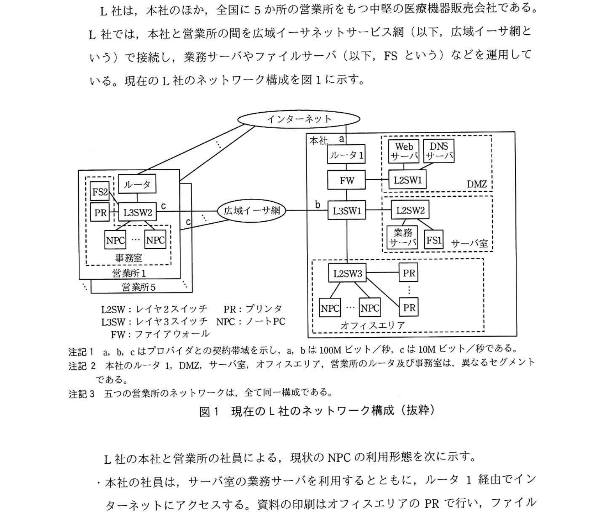
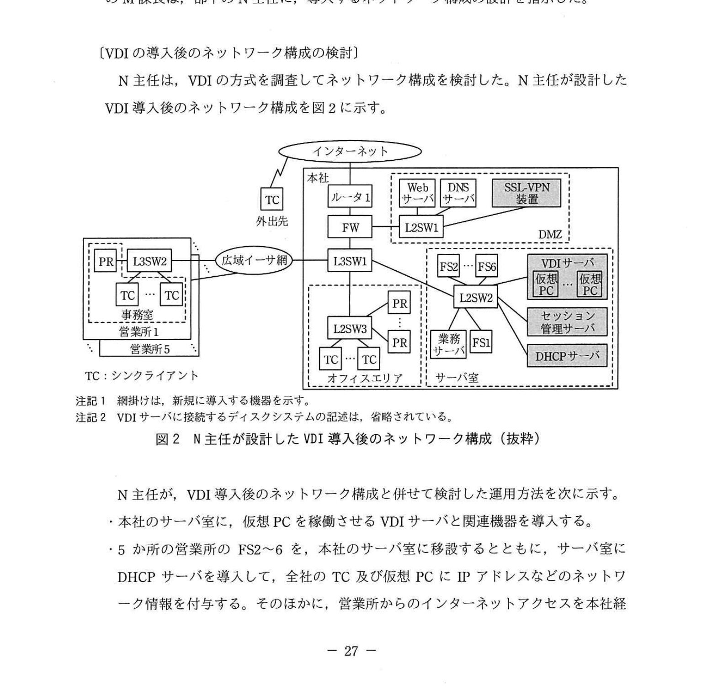
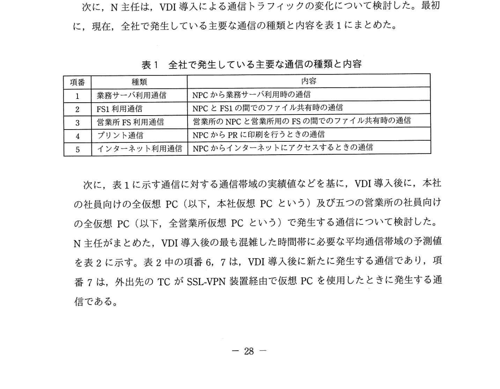
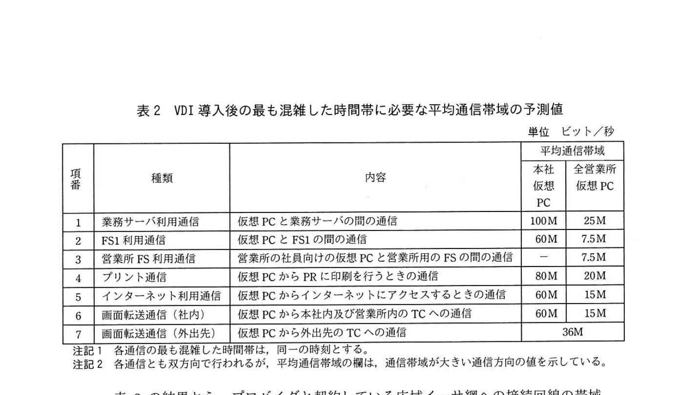

# 2020年秋期（令和2年度）応用情報技術者試験 午後 問5（選択）
## ネットワーク：仮想デスクトップ基盤の導入（L社医療機器販売会社）

---

## 問題文

**問5** 仮想デスクトップ基盤の導入に関する次の記述を読んで、設問1〜3に答えよ。

L社は、本社のほか、全国に5か所の営業所をもつ中堅の医療機器販売会社である。L社では、本社と営業所の間を広域イーサネットサービス網（以下、広域イーサ網という）で接続し、業務サーバやファイルサーバ（以下、FSという）などを運用している。現在のL社のネットワーク構成を図1に示す。

### 図1 現在のL社のネットワーク構成（抜粋）

> **本社側（インターネット接続）:**
> - インターネット → ルータ1 → FW → L2SW1 → DMZ（WebサーバDNSサーバ）
> - L3SW1 → L2SW2（業務サーバ、FS1、サーバ室）
> - L3SW1 → オフィスエリア（NPC群、PR）
> - a: 100Mビット/秒, b: 100Mビット/秒, c: 10Mビット/秒
>
> **営業所1〜5（本社との接続）:**
> - 本社 ←広域イーサ網→ 営業所1
> - 営業所1: ルータ → L2SW（事務室, オフィスエリア）→ NPC群、PR
> - FS2〜FS6（各営業所）
>
> L2SW: レイヤ2スイッチ / L3SW: レイヤ3スイッチ / NPC: ノートPC / PR: プリンタ / FW: ファイアウォール
> 注記1: a, b, cはプロバイダとの契約帯域を示し、a, bは100Mビット/秒、cは10Mビット/秒である
> 注記2: 本社のルータ1、DMZ、サーバ室、オフィスエリア、営業所のルータ及び事務室は、全て同一機種である
> 注記3: 五つの営業所のネットワークは、全て同一機構である

L社の本社と営業所の社員による、現状のNPCの利用形態を次に示す。

- **本社の社員は**、サーバ室の業務サーバを利用するとともに、ルータ1経由でインターネットにアクセスする。資料の印刷はオフィスエリアのPRで行い、ファイル共有はサーバ室のFS1で行う。
- **営業所の社員は**、広域イーサ網経由で本社の業務サーバを利用するとともに、自営業所のルータ経由でインターネットにアクセスする。資料の印刷は自営業所のPRで行い、ファイル共有は自営業所のFS（FS2〜6）と本社のFS1の両方で行う。
- **本社と営業所の営業員は**、出社時に各自のNPCを携帯し、NPC に保存したファイルを使って、顧客先でプレゼンテーションや製品の説明などを行う。

---

### 〔現状の問題点と改善策の実施〕

L社では、営業員が外出時にNPCを持ち出すので、NPCの紛失などによる秘密情報の漏えいリスクがあり、改善策が求められていた。一方、営業員からは、外出先でも社内と同じように作業を行いたいという要望が挙がっていた。また、情報システム部では、営業所のシステム運用負荷を軽減したいという課題をもっていた。

そこで、L社では、仮想デスクトップ基盤（以下、VDIという）の導入を決め、VDI導入プロジェクトを立ち上げた。このプロジェクトの責任者となった情報システム部のM課長は、部下のN主任に、導入するネットワーク構成の設計を指示した。

---

### 〔VDI導入後のネットワーク構成の検討〕

N主任は、VDIの方式を調査してネットワーク構成を検討した。N主任が設計したVDI導入後のネットワーク構成を図2に示す。

### 図2 N主任が設計したVDI導入後のネットワーク構成（抜粋）

> **本社側（変更点）:**
> - インターネット → ルータ1 → FW → L2SW1 → DMZ（Webサーバ、DNSサーバ、SSL-VPN装置）
> - L3SW1 → L2SW2（業務サーバ、VDIサーバ、DHCP、FS1、サーバ室）
> - L3SW1 → オフィスエリア（TC群、PR）
>
> **営業所1（変更点）:**
> - 本社 ←広域イーサ網→ 営業所1（ルータ → L2SW）→ TC群
> ※ FS2〜6, NPCは撤去、TC（シンクライアント）に変更
>
> TC: シンクライアント
> 注記: VDIサーバに接続するディスクシステムを新たに追加する

N主任がVDI導入後のネットワーク構成を検討した際の考え方を次に示す。

- VDIの導入時に、NPCの内蔵ディスクに保存されているファイルをVDIサーバに接続するディスクシステムに移した後、NPCから消去してNPCをTCに化する。
- 社内からは、TCでセッション管理サーバに接続して認証を受けた後、当該利用者向けの仮想PCが使用できる。仮想PCからTCに、画面の情報が転送される。
- 外出先からは、DMZに導入するSSL-VPN装置経由で仮想PCを使用する。TCでSSL-VPN装置に接続すると、TCに保存されたクライアント証明書と、利用者ID、パスワードという異なった利用者認証方式を組み合わせた `[　a　]` 認証を受ける。SSL-VPN装置は、`[　b　]` と認証連携して、SSL-VPN装置での認証だけで仮想PCを使用できるようにする。
- TCで仮想PCに接続すると、社内と同じ作業が外出先でも行える。

---

### 〔通信トラフィックの変化内容の検討〕

次に、N主任は、VDI導入による通信トラフィックの変化について検討した。最初に、現在、全社で発生している主要な通信の種類と内容を表1にまとめた。

### 表1 全社で発生している主要な通信の種類と内容

> | 項番 | 種類 | 内容 |
> |-----|------|------|
> | 1 | 業務サーバ利用通信 | NPCから業務サーバを利用時の通信 |
> | 2 | FS1利用通信 | NPCとFS1の間でのファイル共有時の通信 |
> | 3 | 営業所FS利用通信 | 営業所のNPCと営業所用のFSの間でのファイル共有時の通信 |
> | 4 | プリント通信 | NPCからPR（印刷）を行うときの通信 |
> | 5 | インターネット利用通信 | NPCからインターネットにアクセスするときの通信 |

次に、表1に示す通信に対する通信帯域の実績値などを基に、VDI導入後に、本社の社員向けの全仮想PC（以下、本社仮想PC という）及び五つの営業所の社員向けの全仮想PC（以下、営業所仮想PC という）で発生する通信について検討した。N主任がまとめた、VDI導入後の最も混雑した時間帯に必要な平均通信帯域の予測値を表2に示す。表2中の項番6、7は、VDI導入後に新たに発生する通信であり、項番7は、外出先のTCがSSL-VPN装置経由で仮想PCを使用したときに発生する通信である。

### 表2 VDI導入後の最も混雑した時間帯に必要な平均通信帯域の予測値

> | 項番 | 種類 | 本社仮想PC | 営業所仮想PC | 備考 |
> |-----|------|-----------|------------|------|
> | 1 | 業務サーバ利用通信 | 40Mビット/秒 | 40Mビット/秒 | |
> | 2 | FS1利用通信 | 10Mビット/秒 | 10Mビット/秒 | |
> | 3 | 営業所FS利用通信 | - | - | VDI導入後は営業所FSを廃止 |
> | 4 | プリント通信 | 5Mビット/秒 | 5Mビット/秒 | |
> | 5 | インターネット利用通信 | 75Mビット/秒 | 75Mビット/秒 | |
> | 6 | 仮想PC画面転送通信 | - | 30Mビット/秒 | VDI新規通信 |
> | 7 | SSL-VPN通信 | - | - | 外出先TCから |

N主任は、表1と表2を基に、プロジェクトリーダを兼任しているM課長に報告した。M課長からのインターネットの通信に対しては広域イーサ網への影響の分析が不足していることの指摘を受け、N主任は分析を追加した。

---

## 設問

### 設問1 本文中の `[　a　]`、`[　b　]` に入れる適切な字句を答えよ。

### 設問2 図1及び図2について、(1)、(2)に答えよ。

**(1)** 図2の構成で、営業所1内のTCに向けにDHCPリレーエージェントを稼働させる機器を、それぞれ図1中の名称で答えよ。また、DHCPリレーエージェントが必要になる理由を、40字以内で述べよ。

**(2)** 図2の構成で、営業所1内のTCに向けにDHCPリレーエージェントを稼働させる機器を、図2中の名称で答えよ。また、DHCPリレーエージェントが必要になる理由を、40字以内で述べよ。

### 設問3 〔通信トラフィックの変化内容の検討〕について、(1)、(2)に答えよ。

**(1)** VDI導入後に、広域イーサ網を経由しなくなる通信の種類を表1の項番で、新たに広域イーサ網を経由する通信の種類を表2の項番で、それぞれ全て答えよ。また、VDI導入後の図2中のL3SW1から広域イーサ網に向けた通信について、最も混雑した時間帯の平均通信帯域を、Mビット/秒で答えよ。

**(2)** 表2中の項番5と7の通信は、本社のルータ1を経由して行われるが、項番7の通信の平均通信帯域（36Mビット/秒）は、項番5の通信の平均通信帯域（75Mビット/秒）に含まれない。その理由を30字以内で述べよ。

---

## 解答と解説

### 設問1

**a = 2要素（又は 多要素 又は 2段階）**

「TCに保存されたクライアント証明書と、利用者ID、パスワードという**異なった利用者認証方式を組み合わせた** `[a]` 認証を受ける」

→ 複数の異なる認証方式（クライアント証明書 + ID/パスワード）を組み合わせる = **2要素認証（多要素認証 / 二段階認証）**

**b = セッション管理サーバ**

「SSL-VPN装置は、`[b]` と認証連携して、SSL-VPN装置での認証だけで仮想PCを使用できるようにする」

→ VDI環境で仮想PCのセッションを管理するのは「**セッション管理サーバ**」。SSL-VPN認証とセッション管理サーバをSSOで連携させることで、一度の認証で仮想PCも使用可能になる。

**IPA公式：a = 2要素（又は多要素、又は2段階）/ b = セッション管理サーバ**

---

### 設問2

**(1) 機器名: L3SW1（本社のL3スイッチ）**

VDI導入後、営業所のNPCはTCに変更され、NPCのIPアドレス（DHCPサーバからの割当）が不要になる... 

**実際の設問は「本社のNPC及び営業所1のNPCに設定されているデフォルトゲートウェイの機器を、図1中の名称で答えよ」**

- **本社のNPC**: L3SW1（本社の内部ルーティングを担うレイヤ3スイッチ）
- **営業所1のNPC**: L2SW2（営業所1のスイッチ、ルータがGW）

  ※ 営業所ではルータがデフォルトゲートウェイ → ただし図1中の名称はルータの型名...

**IPA公式：本社のNPC = L3SW1 / 営業所1のNPC = L2SW2**

**(2) 機器名: L3SW2 / 理由：DHCPサーバは、営業所1のTCと異なったセグメントに設置されるから（37字）**

VDI導入後、営業所のFSやNPCは廃止、TCに変更。DHCPサーバは本社のサーバ室（L3SW1配下）に設置される。

- 営業所のTCと本社のDHCPサーバは**異なるセグメント（サブネット）**にいる
- DHCPリクエストは通常ブロードキャストなので、ルータを越えられない
- → **DHCPリレーエージェント**が必要（ユニキャストに変換してDHCPサーバに転送する）
- 営業所1のどの機器に設定するか = 営業所1のL3SW（L3SW2）

**IPA公式：機器名 = L3SW2 / 理由 = DHCPサーバは、営業所1のTCと異なったセグメントに設置されるから**

---

### 設問3

**(1)**

**広域イーサ網を経由しなくなる通信（表1の項番）：1, 2**

現状（VDI導入前）:
- 項番1（業務サーバ利用通信）: 営業所NPCから本社業務サーバ → 広域イーサ網経由
- 項番2（FS1利用通信）: 営業所NPCから本社FS1 → 広域イーサ網経由
- 項番3（営業所FS利用通信）: 営業所内部でFS利用 → 広域イーサ網不使用
- 項番4（プリント通信）: 自営業所PR使用 → 広域イーサ網不使用
- 項番5（インターネット通信）: 各営業所ルータから直接 → 広域イーサ網不使用

VDI導入後: 営業所TCはVDIサーバ（本社）に接続して仮想PCを使用 → TC上の操作は全て仮想PC上で実行 → 従来の直接通信（項番1・2）は不要になる

**新たに広域イーサ網を経由する通信（表2の項番）：4, 6**

VDI導入後:
- 項番4（プリント通信）: 仮想PCからPRへ。本社VDIサーバから営業所PRへ → 広域イーサ網経由に変わる
- 項番5（インターネット通信）: 仮想PCからインターネット → 本社ルータ経由（広域イーサ網経由）に変わる → しかし...設問(2)との整合から項番5は含まない可能性
- 項番6（仮想PC画面転送通信）: 本社VDIサーバから営業所TC → **広域イーサ網経由の新規通信**

実際の答え: **4, 6**（項番5はインターネット通信を本社経由にする変更だが本設問の「新たに」の範囲外）

**平均通信帯域（L3SW1から広域イーサ網向け）：35Mビット/秒**

営業所仮想PC向けの通信（L3SW1から広域イーサ網へ出るもの）：
- 項番4（プリント）: 5Mビット/秒
- 項番6（画面転送）: 30Mビット/秒
- 合計: **35Mビット/秒**

（項番1, 2は仮想PC内での処理になりL3SW1-広域イーサ網間には流れない）

**IPA公式：経由しなくなる = 1, 2 / 新たに経由 = 4, 6 / 帯域 = 35Mビット/秒**

**(2) 正解：インターネット利用通信と逆方向のトラフィックだから（27字）**

- 項番5（インターネット利用通信）: TCからルータ1を通ってインターネットへ **出て行く**方向のトラフィック（上り）
- 項番7（SSL-VPN通信）: 外出先TCからSSL-VPN装置に接続して仮想PCを使用 → インターネットから社内へ**入ってくる**方向のトラフィック（下り）

同じルータ1を経由するが、**通信方向が逆**（インターネット→社内）なので、項番5（社内→インターネット）の帯域には含まれない。

**IPA公式：インターネット利用通信と逆方向のトラフィックだから**

---

## 参考：主要キーワード

| 用語 | 説明 |
|------|------|
| VDI（仮想デスクトップ基盤） | サーバ上で仮想PCを動作させ、ネットワーク経由で画面を表示する仕組み。端末のデータレス化が可能 |
| TC（シンクライアント） | 最低限の処理機能のみを持つ端末。データをローカルに持たず、サーバ上の仮想PCを利用 |
| SSL-VPN | SSLプロトコルを使ったVPN。Webブラウザから接続可能で、ファイアウォールを越えやすい |
| 2要素認証 | 「知識（パスワード）」「所持（証明書・トークン）」「生体」のうち2つ以上を組み合わせた認証 |
| クライアント証明書 | PKIを使いクライアントPCを認証するデジタル証明書。なりすまし防止に有効 |
| DHCPリレーエージェント | DHCPのブロードキャストをユニキャストに変換し、別セグメントのDHCPサーバへ転送する機能 |
| セッション管理サーバ | VDI環境で仮想PCセッションの認証・割当・管理を行うサーバ。SSOで他認証基盤と連携可能 |
| 広域イーサネット | 通信事業者が提供する企業向けのWAN接続サービス。レイヤ2またはレイヤ3で拠点間を接続 |
| シングルサインオン（SSO） | 一度の認証で複数のシステムにアクセスできる仕組み |
