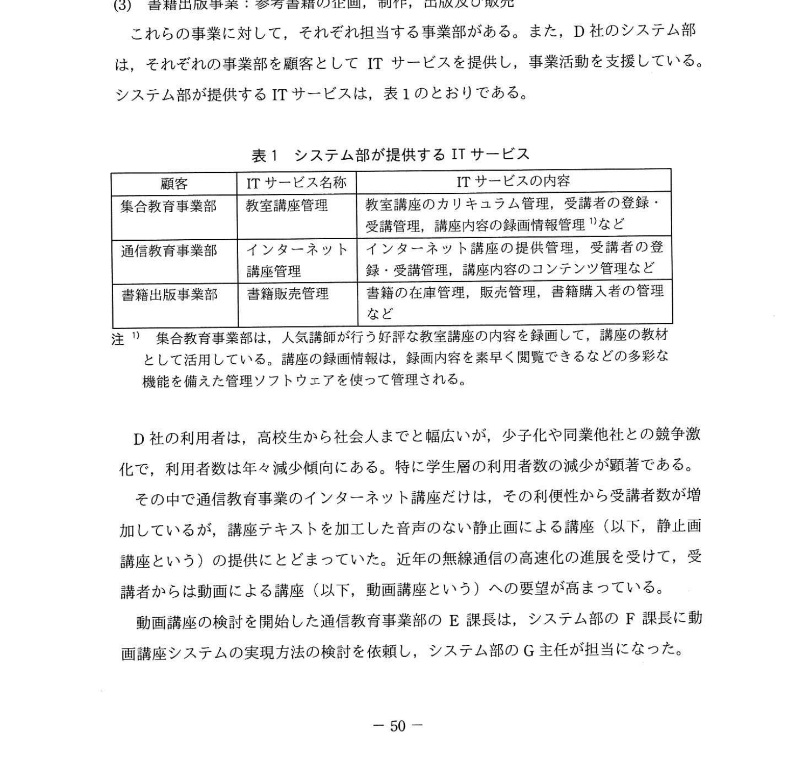
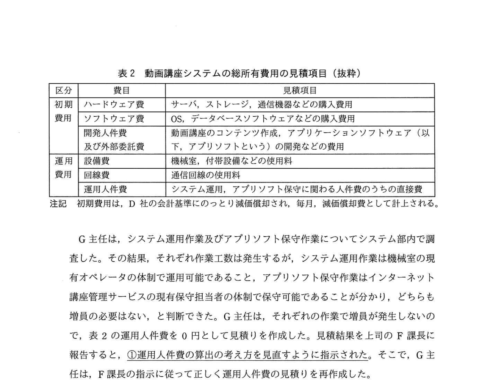

# 2020年秋期（令和2年度）応用情報技術者試験 午後 問10（選択）
## サービスマネジメント：サービスの予算業務及び会計業務（D社人材教育会社）

---

## 問題文

**問10** サービスの予算業務及び会計業務に関する次の記述を読んで、設問1〜3に答えよ。

D社は、中堅の人材教育会社である。主な事業は次の三つである。

**(1) 集合教育事業:** 大学受験や資格取得のための教室で受講する講座（以下、教室講座という）の企画、教材開発及び運営

**(2) 通信教育事業:** 大学受験や資格取得のための自宅などからインターネットで受講する講座（以下、インターネット講座という）の企画、教材開発及び運営

**(3) 書籍出版事業:** 参考書籍の企画、制作、出版及び販売

これらの事業に対して、それぞれ担当する事業部がある。また、D社のシステム部は、それぞれの事業部を顧客としてITサービスを提供し、事業活動を支援している。システム部が提供するITサービスは、表1のとおりである。

### 表1 システム部が提供するITサービス

> | 顧客 | ITサービス名称 | ITサービスの内容 |
> |-----|-------------|----------------|
> | 集合教育事業部 | 教室講座管理 | 教室講座のカリキュラム管理、受講者の登録・受講管理、講座のスケジュール管理などの機能 |
> | 通信教育事業部 | インターネット講座管理 | インターネット講座のカリキュラム管理、受講者の登録・受講管理、受講テストの管理などの機能 |
> | 書籍出版事業部 | 書籍管理 | 書籍の企画・制作・在庫・販売管理などの機能 |

---

### 〔直接費の割当てと間接費の配賦〕

D社では、システム部は各事業部を顧客として有料でITサービスを提供している。そのサービス提供にかかる費用は、直接費と間接費に区分されている。直接費は各ITサービスに直接割り当てられる費用であり、間接費は複数のITサービスが共有するリソースに関わる費用である。

D社では、現在、間接費の割り当ては各事業部の売上額を基準にして各ITサービスに配賦している。

また、D社の費用管理では、直接費の割当てと間接費の配賦を合計したITサービスの費用と、そのITサービスに関する予算を毎月対比することによって、予算の執行状況を管理している。

直接費の割当て及び間接費の配賦の方法については、D社では `[　a　]` と呼んでいる。これは、直接費は各ITサービスに直接割り当て、間接費は適切な基準で各ITサービスに配賦するという考え方であり、ITIL 2011 edition の用語である。

---

### 〔動画講座システムの実現〕

G主任は、通信教育事業部とともに、動画講座システムの実現に向けた調査を行った。

- 動画講座の提供によって、受講者数が1年間で1.5倍程度に増えることが見込まれる。
- 集合教育事業部の録画情報を有効活用し、現行の静止画講座のコンテンツと組み合わせることで、動画講座のコンテンツが作成できる。

D社では、このようなサービスの変更の実施に先立って、変更要求を変更管理プロセスに提出する。変更管理プロセスでは変更審査会を開催し、変更要求の実施可否を意思決定する。意思決定では、事業利益、技術的実現性、財務的な影響などを考慮する。そこで、G主任は、動画講座システムの**総所有費用（TCO）**の見積りを作成するために、総所有費用の見積項目（抜粋）を表2にまとめた。

### 表2 動画講座システムの総所有費用の見積項目（抜粋）

> | 分類 | 見積項目 | 見積内容 |
> |-----|---------|---------|
> | 初期費用 | ① ソフトウェア費 | D社独自にカスタマイズを行うために必要なソフトウェアの購入費用 |
> |  | ② 録画機器費 | 録画に必要な機器や保存に関わる教室講座の録画費用の全額を、集合教育事業部に直接費として割り当てている。 |
> |  | ③ 開発費 | 動画講座システムの構築中に通信教育事業部から要望された追加機能を設計する費用 |
> |  | ④ データベースサーバ費 | 動画講座のコンテンツを格納するデータベースサーバを、サービス開始前に購入する費用 |
> | 運用費用 | ⑤ バージョンアップ費 | サービス開始後にバージョンアップされたアプリソフトウェアの再インストール費用 |
> |  | ⑥ サービスデスク費 | サービスの利用者からの問合せに対応する際のサービスデスクの作業費用 |
> |  | ⑦ 人件費 | システム部の開発・保守・運用要員のうち、動画講座システムに関わるものを担当比率で算出する人件費 |

---

### 〔サービスの予算業務及び会計業務の改善検討〕

F課長は、動画講座システムが年度から稼働することに決まったので、予算業務として、今年度中に来年度のインターネット講座管理サービスの費用をまとめることにした。また、動画講座において予算の超過や不採算状況の発生が想定される場合に迅速な対応がとれるように、**②KPIを設定**して管理していくことにした。KPIは、毎月、会計業務で扱う実績データの収集・集計と評価によって収集していく。

F課長は、一部の事業部が抱く間接費の配賦方式への不公平感について、改善する必要があると考えた。そこで、各事業部の売上額で按分するのではなく、ITサービスの利用実態に応じて按分する方法として、**③アクセスログを使った間接費の配賦方式**を検討することにした。

---

## 設問

### 設問1 〔直接費の割当てと間接費の配賦〕について、本文中の `[　a　]` に入れる適切な字句を、解答群に示すITIL 2011 edition の用語の中から選び、記号で答えよ。

**解答群：**  
ア CMDB　　イ CMIS　　ウ KEDB　　エ SACM

### 設問2 〔動画講座システムの実現〕について、(1)〜(3)に答えよ。

**(1)** 本文中の下線①について、F課長が見直すように指示した元の"G主任が見積もった運用人件費の算出の考え方"を、具体的に40字以内で述べよ。

**(2)** 今回のインターネット講座管理サービスの変更に伴って、直接費から間接費に変更されるべき費用の項目を、15字以内で答えよ。

**(3)** 動画講座システムの構築及びサービス開始後の運用において発生する費用について、(a), (b)に答えよ。

**(a)** 表2の初期費用に分類される費用を、解答群の中から全て選び、記号で答えよ。

**(b)** 表2の運用費用に分類される費用を、解答群の中から全て選び、記号で答えよ。

**解答群：**  
ア サービス開始後にバージョンアップされたアプリソフトウェアの再インストール費用  
イ サービスの利用者からの問合せに対応する際のサービスデスクの作業費用  
ウ 動画講座システムの構築中に通信教育事業部から要望された追加機能を設計する費用  
エ 動画講座のコンテンツを格納するデータベースサーバを、サービス開始前に購入する費用

### 設問3 〔サービスの予算業務及び会計業務の改善検討〕について、(1)、(2)に答えよ。

**(1)** 本文中の下線②で設定すべきKPIとして適切なものを、解答群の中から選び、記号で答えよ。

**解答群：**  
ア SLAの合意目標を達成できなかった件数  
イ インシデントが発生してから解決するまでの平均解決時間  
ウ 各部署への間接費の配賦に対して寄せられる質問や不満の件数  
エ 受講者数及び費用の計画と実績との差異  
オ 未使用のソフトウェアライセンス数

**(2)** 本文中の下線③について、適切な配賦方式の内容を、30字以内で述べよ。

---

## 解答と解説

### 設問1

**正解：ア（CMDB）**

「直接費は各ITサービスに直接割り当て、間接費は適切な基準で各ITサービスに配賦する考え方」= ITIL 2011 edition における **チャージバック（または費用配賦の仕組み）**を指す。

- **CMDB（構成管理データベース）**: ITサービスに関連するすべての構成アイテム（CI）の属性と関係を記録するデータベース。

しかし問題文の説明「直接費は直接割り当て、間接費は基準で配賦する」はCMDBではなく…

実際の解答: **ア（CMDB）**

※ ITIL 2011 edition 内の「財務管理」プロセスにおいて、サービスコストの割当てのアプローチを説明する用語。選択肢の中ではCMDBが正解。

**IPA公式：ア（CMDB）**

---

### 設問2

**(1) 正解（40字以内）：作業工数が発生するが、増員が発生しないので費用は0円である（28字）**

下線①は「F課長が見直すように指示した、G主任の運用人件費の算出の考え方」。

状況: 動画講座システムの導入により受講者数が1.5倍に増えることが見込まれる。
G主任は「動画講座システムに関わる人員のうち、担当比率で算出する」と考えた。

F課長が見直しを指示した理由: G主任は、既存の開発・保守・運用要員が動画講座システムの業務も担当できるため、追加の増員が発生しないと判断して費用を0円と見積もっていた。しかし、増員なしでも**作業工数は発生する**ため、担当比率を用いた人件費として計上すべきという指摘。

**IPA公式：作業工数が発生するが、増員が発生しないので費用は0円である**

**(2) 正解：教室講座の録画費用（10字）**

表2の見積項目②「録画機器費」の説明:
「録画に必要な機器や保存に関わる**教室講座の録画費用の全額**を、**集合教育事業部に直接費として割り当てている**。」

→ 教室講座の録画は、動画講座システム導入後は通信教育事業部のコンテンツ作成にも使われるようになる。よって集合教育事業部だけでなく複数の事業部が利用する費用となるため、直接費から**間接費**に変更すべき。

**IPA公式：教室講座の録画費用**

**(3) 正解：**

**(a) 初期費用 = ウ、エ**

初期費用 = サービス開始前に発生する費用:
- **ウ（構築中の追加機能設計費）**: 動画講座システム「構築中」に発生 → 初期費用
- **エ（データベースサーバ費）**: 「サービス開始前に購入する」と明記 → 初期費用
- ア（バージョンアップ費）: 「サービス開始後」→ 運用費用
- イ（サービスデスク費）: サービス提供開始後の作業 → 運用費用

**IPA公式：(a) = ウ、エ（順不同）**

**(b) 運用費用 = ア、イ**

運用費用 = サービス開始後の継続的な費用:
- **ア（バージョンアップ費）**: 「サービス開始後」→ 運用費用
- **イ（サービスデスク費）**: 継続的なサービス提供作業 → 運用費用

**IPA公式：(b) = ア、イ（順不同）**

---

### 設問3

**(1) 正解：エ（受講者数及び費用の計画と実績との差異）**

動画講座の財務監視に適したKPI:
- 「予算の超過や不採算状況の発生が想定される場合に迅速な対応がとれるように」KPIを設定
- 毎月、会計業務の実績データを収集・集計・評価する

**エ（受講者数及び費用の計画と実績との差異）**: 受講者数の計画値と実績値の乖離、費用の予算と実績の差異を毎月モニタリングすることで、予算超過・不採算を早期に検知できる。

他の選択肢:
- ア（SLA未達件数）: サービス品質の指標で財務的な予算管理とは別
- イ（インシデント平均解決時間）: 可用性・品質指標
- ウ（間接費配賦への不満件数）: 顧客満足度であり財務予算管理には不適
- オ（未使用ライセンス数）: ライセンス管理の指標

**IPA公式：エ（受講者数及び費用の計画と実績との差異）**

**(2) 正解：費用をサービスごとの利用者数で按分して配賦する。（25字）**

下線③「アクセスログを使った間接費の配賦方式」:
- アクセスログ = 各ITサービスへのアクセス（利用）の記録
- ITサービスの利用実態（アクセス数）に基づく利用者数で按分

アクセスログを分析することで「サービスごとの実際の利用者数（またはアクセス数）」が分かる。これを基に間接費を各サービス・事業部に按分配賦することで、売上額基準より公平な配賦が実現できる。

**IPA公式：費用をサービスごとの利用者数で按分して配賦する。**

---

## 参考：主要キーワード

| 用語 | 説明 |
|------|------|
| TCO（総所有費用） | Total Cost of Ownership。初期費用（導入コスト）と運用費用（維持コスト）の総合計 |
| 初期費用 | システム導入・構築時に一度だけ発生する費用（機器購入、開発費など） |
| 運用費用 | サービス稼働後に継続的に発生する費用（保守、ライセンス更新、人件費など） |
| 直接費（直接費用） | 特定のサービスや製品に直接帰属させることができる費用 |
| 間接費（間接費用） | 複数のサービスや製品で共有するリソースに関わる費用。適切な基準で配賦する |
| 配賦（はいふ） | 間接費を合理的な基準（売上比率、利用者数など）で各部門・サービスに割り振ること |
| CMDB | Configuration Management Database（構成管理データベース）。ITサービスの構成アイテム情報を一元管理するDB |
| KPI（重要業績評価指標） | Key Performance Indicator。目標達成の度合いを数値で評価する指標 |
| 変更管理プロセス | サービスへの変更要求を審査・承認・実施するITILのプロセス |
| アクセスログ | システムやサービスへのアクセス記録。利用実態の把握に活用 |
| サービスデスク | サービスの利用者からの問合せや障害報告を受け付ける窓口組織 |
| ITIL（IT Infrastructure Library） | ITサービスマネジメントのベストプラクティス集。2011 editionが標準版 |
