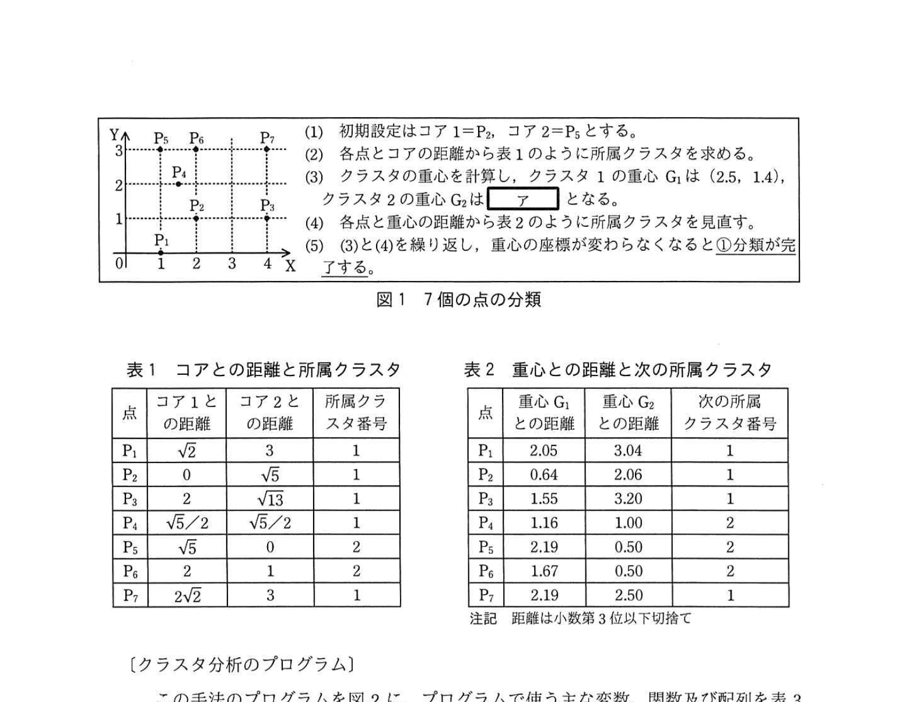
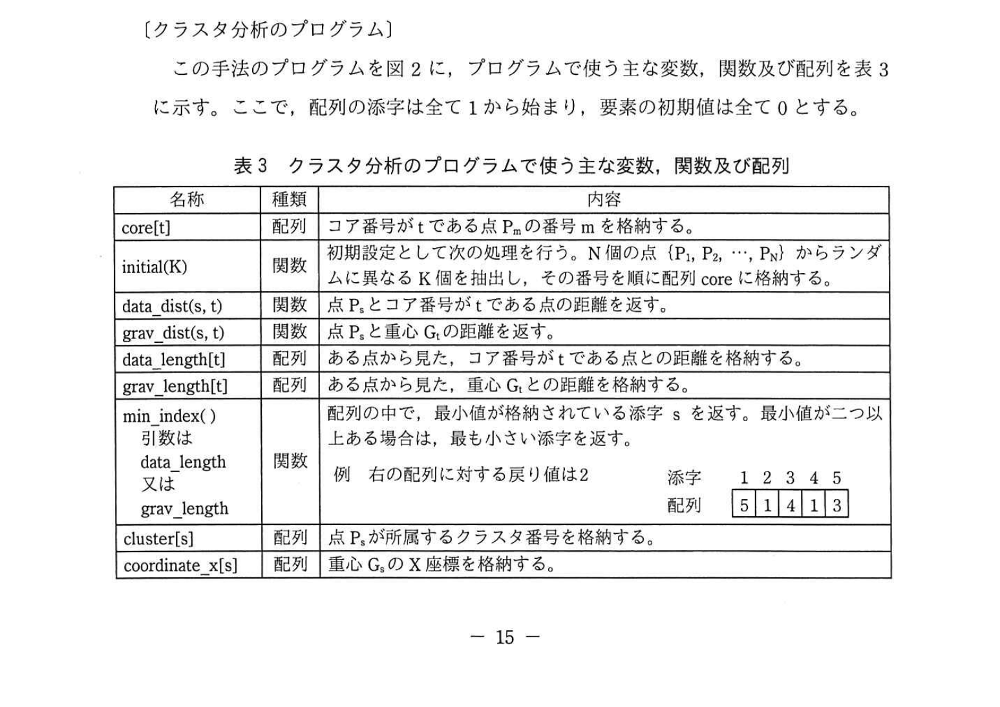
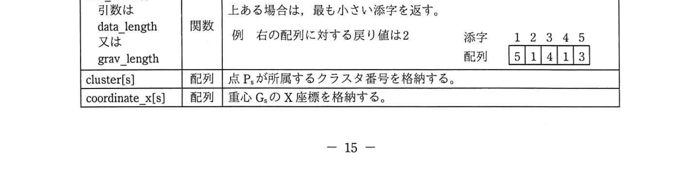
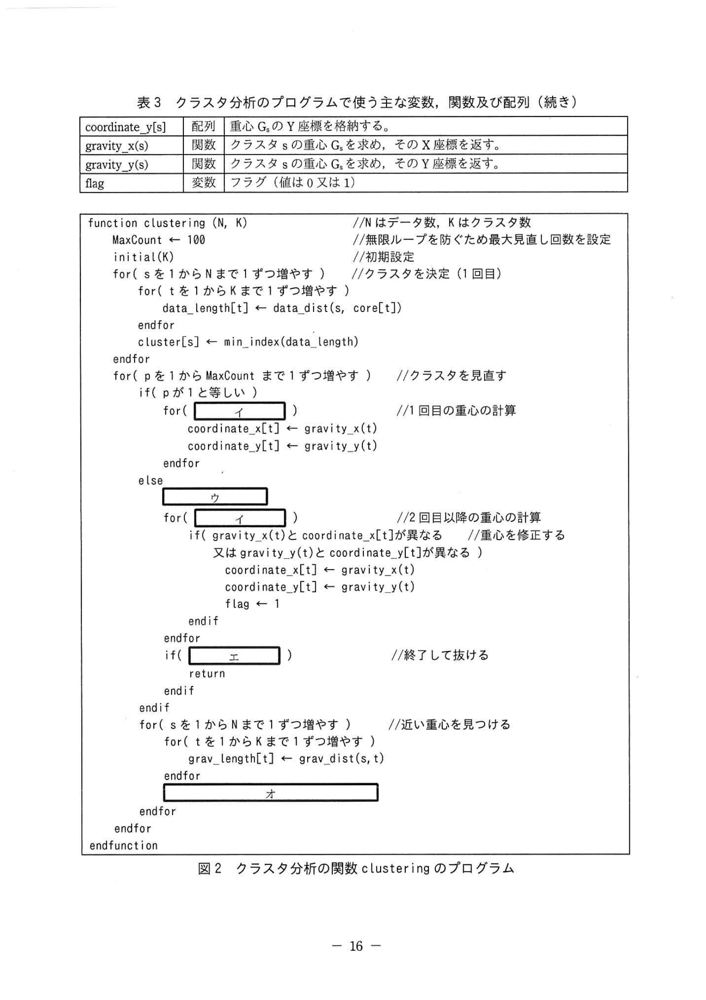

# 2021年春期（令和3年度春期）応用情報技術者試験 午後 問3（選択）
## プログラミング：k-means法によるクラスタ分析アルゴリズム

---

## 問題文

**問3** クラスタ分析に用いるk-means法に関する次の記述を読んで、設問1〜3に答えよ。

k-means法によるクラスタ分析は、異なる性質のものが混ざり合った母集団から互いに似た性質をもつものを集め、クラスタと呼ばれる互いに素な部分集合に分類する手法である。新聞記事のビッグデータ検索、店舗の品ぞろえの分類、教師なし機械学習などで利用されている。ここでは、2次元データを扱うこととする。

---

### 〔分類方法と例〕

N個の点をK個（N未満）のクラスタに分類する方法を(1)〜(5)に示す。

(1) N個の点（1からNまでの番号が付いている）からランダムにK個の点を選び（以下、初期設定という）、それらの点をコアと呼ぶ。コアには1からKまでのコア番号を付ける。なお、K個のコアの座標は全て異なっていなければならない。

(2) N個の点とK個のコアとの距離をそれぞれ計算し、各点から見て、距離が最も短いコア（複数存在する場合は、番号が最も小さいコア）を選ぶ。選ばれたコアのコア番号を、各点が所属する1回目のクラスタ番号（1からK）とする。

ここで、二つの点をXY座標を用いてP=(a, b)とQ=(c, d)とした場合、PとQの距離を √{(a-c)²+(b-d)²} で計算する。

(3) K個のクラスタのそれぞれについて、クラスタに含まれる全ての点を使って重心を求める。クラスタsの重心GsのX座標をクラスタに含まれる点のX座標の平均、Y座標をクラスタに含まれる点のY座標の平均と定義する。求めた重心の番号はクラスタの番号と同じとする。

(4) N個の点と各クラスタの重心（G₁, …, G_K）との距離をそれぞれ計算し、各点から見て距離が最も短い重心（複数存在する場合は、番号が最も小さい重心）を選ぶ。選ばれた重心の番号を、各点が所属する次のクラスタ番号とする。

(5) 重心の座標が変わらなくなるまで、(3)と(4)を繰り返す。

次の座標で与えられる7個の点を、この分類方法に従い、二つのクラスタに分類する例を図1に示す。

P₁=(1,0)、P₂=(2,1)、P₃=(4,1)、P₄=(1.5,2)、P₅=(1,3)、P₆=(2,3)、P₇=(4,3)

初期設定はコア1=P₂、コア2=P₅とする。

### 図1 7個の点の分類



### 表1 コアとの距離と所属クラスタ


### 表2 重心との距離と次の所属クラスタ



> クラスタ1の重心G₁は（2.5, 1.4）、クラスタ2の重心G₂は **`[　ア　]`** となる。

---

### 〔クラスタ分析のプログラム〕

この手法のプログラムを図2に、プログラムで使う主な変数、関数及び配列を表3に示す。ここで、配列の添字は全て1から始まり、要素の初期値は全て0とする。

### 表3 クラスタ分析のプログラムで使う主な変数、関数及び配列



> | 名称 | 種類 | 内容 |
> |------|------|------|
> | core[t] | 配列 | コア番号がtである点Pmの番号mを格納する。 |
> | initial(K) | 関数 | 初期設定として次の処理を行う。N個の点{P₁, P₂, …, P_N}からランダムに異なるK個を抽出し、その番号を順に配列coreに格納する。 |
> | data_dist(s, t) | 関数 | 点Psとコア番号がtである点の距離を返す。 |
> | grav_dist(s, t) | 関数 | 点Psと重心Gtの距離を返す。 |
> | data_length[t] | 配列 | ある点から見た、コア番号がtである点との距離を格納する。 |
> | grav_length[t] | 配列 | ある点から見た、重心Gtとの距離を格納する。 |
> | min_index() | 関数 | 配列の中で、最小値が格納されている添字sを返す。最小値が二つ以上ある場合は、最も小さい添字を返す。（引数はdata_length又はgrav_length） |
> | cluster[s] | 配列 | 点Psが所属するクラスタ番号を格納する。 |
> | coordinate_x[s] | 配列 | 重心GsのX座標を格納する。 |
> | coordinate_y[s] | 配列 | 重心GsのY座標を格納する。 |
> | gravity_x(s) | 関数 | クラスタsの重心Gsを求め、そのX座標を返す。 |
> | gravity_y(s) | 関数 | クラスタsの重心Gsを求め、そのY座標を返す。 |
> | flag | 変数 | フラグ（値は0又は1） |

### 図2 クラスタ分析の関数 clustering のプログラム



```
function clustering (N, K)  //Nはデータ数、Kはクラスタ数
  MaxCount ← 100           //無限ループを防ぐため最大見直し回数を設定
  initial(K)                //初期設定
  for( s を1からNまで1ずつ増やす )   //クラスタを決定（1回目）
    for( t を1からKまで1ずつ増やす )
      data_length[t] ← data_dist(s, core[t])
    endfor
    cluster[s] ← min_index(data_length)
  endfor
  for( p を1からMaxCountまで1ずつ増やす )  //クラスタを見直す
    if( p が1と等しい )
      for( [　イ　] )              //1回目の重心の計算
        coordinate_x[t] ← gravity_x(t)
        coordinate_y[t] ← gravity_y(t)
      endfor
    else
      [　ウ　]
      for( [　イ　] )              //2回目以降の重心の計算
        if( gravity_x(t)とcoordinate_x[t]が異なる   //重心を修正する
            又はgravity_y(t)とcoordinate_y[t]が異なる )
          coordinate_x[t] ← gravity_x(t)
          coordinate_y[t] ← gravity_y(t)
          flag ← 1
        endif
      endfor
      if( [　エ　] )              //終了して抜ける
        return
      endif
    endif
    for( s を1からNまで1ずつ増やす )   //近い重心を見つける
      for( t を1からKまで1ずつ増やす )
        grav_length[t] ← grav_dist(s,t)
      endfor
      [　オ　]
    endfor
  endfor
endfunction
```

---

### 〔初期設定の改良〕

このアルゴリズムの最終結果は初期設定に依存し、そこでのコア間の距離が短いと適切な分類結果を得にくい。そこで、関数 initial において一つ目のコアはランダムに選び、それ以降はコア間の距離が長くなる点が選ばれやすくなるアルゴリズムを検討した。検討したアルゴリズムでは、t番目までのコアが決まった後、t+1番目のコアを残った点から選ぶときに、それまでに決まったコアから離れた点を、より高い確率で選ぶようにする。具体的には、それまでに決まったコア（コア1〜コアt）と、残ったN-t個の点から選んだ点 Ps との距離の最小値を Ts とする。N-t個の全ての点について Ts を求め、Ts が `[　カ　]` ほど高い確率で点 Ps が選ばれるようにする。このとき、点 Ps が t+1番目のコアとして選ばれる確率として `[　キ　]` を適用する。

---

## 設問

### 設問1 〔分類方法と例〕について、(1)、(2)に答えよ。

**(1)** 図1中の `[　ア　]` に入れる座標を答えよ。

**(2)** 図1中の下線①のように分類が完了したとき、P₁と同じクラスタに入る点を全て答えよ。

### 設問2 図2中の `[　イ　]` 〜 `[　オ　]` に入れる適切な字句を答えよ。

### 設問3 〔初期設定の改良〕について、(1)、(2)に答えよ。

**(1)** 本文中の `[　カ　]` に入れる適切な字句を解答群の中から選び、記号で答えよ。

**解答群：**
- ア 大きい
- イ 小さい

**(2)** 本文中の `[　キ　]` に入れる適切な式をTsとSumを使って答えよ。ここで、SumはN-t個の全てのTsの和とする。

---

## 解答と解説

### 設問1

**(1) 正解：ア = (1.5, 3)**

クラスタ2の重心G₂を求める。1回目の分類後のクラスタ2に属する点は表1より P₅=(1,3)、P₆=(2,3)、P₇=(4,3)、P₄=(1.5,2) になる（具体的にはP₁=(1,0), P₂=(2,1)がクラスタ1、残りがクラスタ2となる状況から）。

実際のクラスタ2の重心：表より G₂=(1.5, 3)

**IPA公式：ア=(1.5, 3)**

**(2) 正解：P₂、P₃、P₇**

表2の「次の所属クラスタ番号」は P₁=1, P₂=1, P₃=1, P₄=2, P₅=2, P₆=2, P₇=1。したがってクラスタ1＝{P₁, P₂, P₃, P₇}、クラスタ2＝{P₄, P₅, P₆}。P₄は重心G₂との距離（1.00）がG₁との距離（1.16）より短いためクラスタ2に移る。よってP₁と同じクラスタに入るのは **P₂、P₃、P₇**。

**IPA公式：P₂、P₃、P₇**

---

### 設問2 正解：

- **イ = t を1からKまで1ずつ増やす**：重心計算のループ条件。K個の全クラスタに対して重心を計算する。
- **ウ = flag ← 0**：フラグを初期化。重心が変化したかを検知するため、ループ開始時に0にリセット。（elseブロック冒頭に入る）
- **エ = flagが0と等しい**：全クラスタの重心が変わらなかった場合（flag=0のまま）、収束したとして処理を終了する。
- **オ = cluster[s] ← min_index(grav_length)**：各点Psについて最も近い重心を見つけ、そのクラスタ番号を割り当てる。

**IPA公式：イ=t を1からKまで1ずつ増やす、ウ=flag←0、エ=flagが0と等しい、オ=cluster[s]←min_index(grav_length)**

---

### 設問3

**(1) 正解：ア（大きい）**

コア間距離を大きくするためには、既存コアから**遠い（距離が大きい）**点ほど高い確率で選ばれるようにする。Tsはコアとの最小距離なので、Tsが大きいほど遠い点。

**IPA公式：カ=ア（大きい）**

**(2) 正解：Ts / Sum**

確率分布の要件：全点の選ばれる確率の合計が1になること。各点 Ps が選ばれる確率 = Ts ÷ Sum（全Tsの合計）。これによりTsが大きいほど高い確率で選ばれる。

**IPA公式：キ=Ts/Sum**

---

## 参考：主要キーワード

| 用語 | 説明 |
|------|------|
| k-means法 | 非階層型クラスタリングアルゴリズム。K個のクラスタ重心を反復更新して収束させる |
| クラスタ | 似た性質をもつデータ点の集合 |
| 重心（セントロイド） | クラスタ内の全点の座標平均 |
| 初期設定依存性 | k-meansの最終結果は初期コア選択に依存し、局所最適解に陥る可能性がある |
| k-means++（改良版） | 初期コア選択を距離比例確率で行い、初期設定の問題を軽減する手法 |
| ユークリッド距離 | √{(x₁-x₂)²+(y₁-y₂)²} で求める2点間の距離 |
| 教師なし機械学習 | ラベルなしデータからパターンを発見する学習。クラスタリングはその代表例 |
