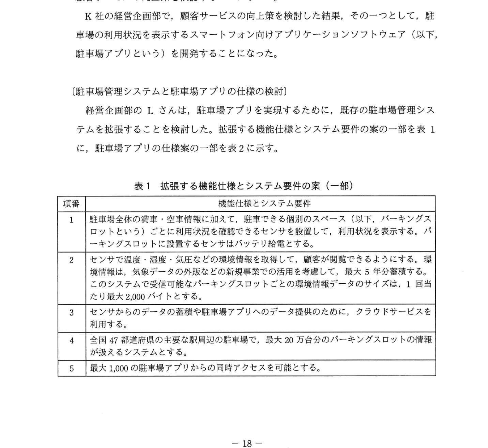
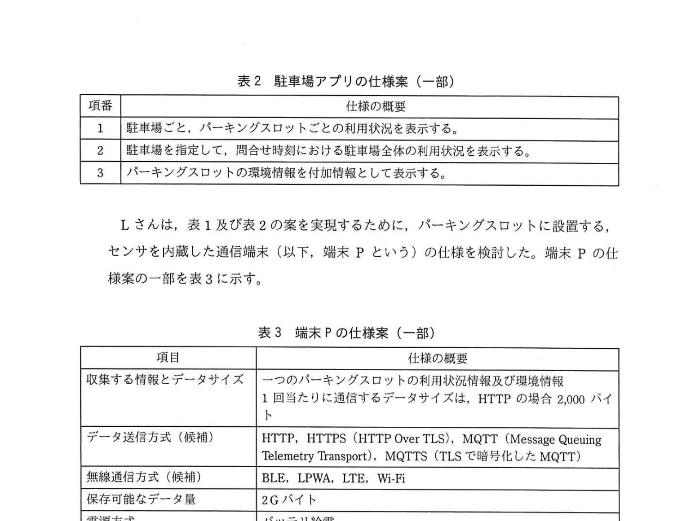
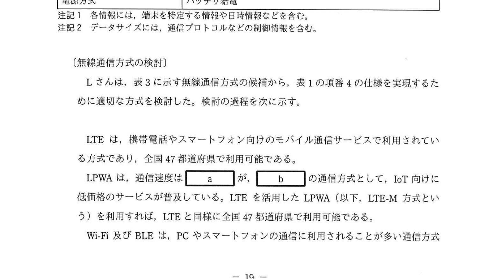
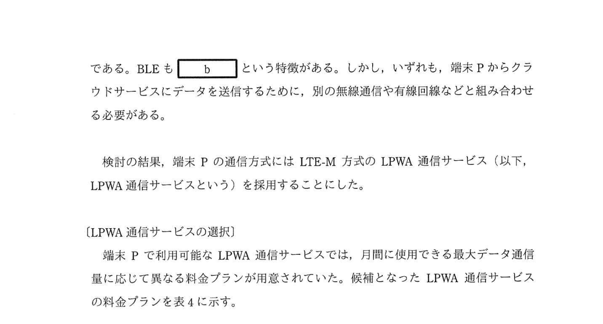

# 2021年春期（令和3年度春期）応用情報技術者試験 午後 問4（選択）
## システムアーキテクチャ：IoT技術を活用した駐車場管理システム（LPWA・MQTT）

---

## 問題文

**問4** IoT技術を活用した駐車場管理システムに関する次の記述を読んで、設問1〜4に答えよ。

K社は、大都市圏を中心に約10万台分の時間貸し駐車場（以下、駐車場という）を所有する駐車場運営会社である。K社が所有する駐車場の"満車"、"空車"の状況や課金状況などは、K社が構築した駐車場管理システムで管理している。K社では、5年後には所有する駐車場を約20万台分に拡大する計画に加え、新規事業の拡大や顧客サービスの向上策を検討することになった。

K社の経営企画部で、顧客サービスの向上策を検討した結果、その一つとして、駐車場の利用状況を表示するスマートフォン向けアプリケーションソフトウェア（以下、駐車場アプリという）を開発することになった。

---

### 〔駐車場管理システムと駐車場アプリの仕様の検討〕

経営企画部のLさんは、駐車場アプリを実現するために、既存の駐車場管理システムを拡張することを検討した。拡張する機能仕様とシステム要件の案の一部を表1に示す。

### 表1 拡張する機能仕様とシステム要件の案（一部）

> | 項番 | 機能仕様とシステム要件 |
> |------|----------------------|
> | 1 | 駐車場全体の満車・空車情報に加えて、駐車できる個別のスペース（以下、パーキングスロットという）ごとに利用状況を確認し、利用状況を表示する。パーキングスロットに設置するセンサはバッテリ給電とする。 |
> | 2 | センサで温度・湿度・気圧などの環境情報を取得して、顧客が閲覧できるようにする。環境情報は、気象データの外販などの新規事業での活用を考慮して、最大5年分蓄積する。このシステムで受信可能なパーキングスロットごとの環境情報データのサイズは、1回当たり最大2,000バイトとする。 |
> | 3 | センサからのデータを蓄積した駐車場アプリへのデータ提供のために、クラウドサービスを利用する。 |
> | 4 | 全国47都道府県の主要な駅周辺の駐車場で、最大20万台分のパーキングスロットの情報が扱えるシステムとする。 |
> | 5 | 最大1,000の駐車場アプリからの同時アクセスを可能とする。 |

Lさんは、表1及び表2の案を実現するために、パーキングスロットに設置する、センサを内蔵した通信端末（以下、端末Pという）の仕様を検討した。端末Pの仕様案の一部を表3に示す。

### 表2 駐車場アプリの仕様案（一部）

> | 項番 | 仕様の概要 |
> |------|----------|
> | 1 | 駐車場ごと、パーキングスロットごとの利用状況を表示する。 |
> | 2 | 駐車場を指定して、問合せ時刻における駐車場全体の利用状況を表示する。 |
> | 3 | パーキングスロットの環境情報を付加情報として表示する。 |

### 表3 端末Pの仕様案（一部）

> | 項目 | 仕様の概要 |
> |------|----------|
> | 収集する情報とデータサイズ | 一つのパーキングスロットの利用状況情報及び環境情報。1回当たりに通信するデータサイズは、HTTPの場合2,000バイト |
> | データ送信方式（候補） | HTTP、HTTPS（HTTP Over TLS）、MQTT（Message Queuing Telemetry Transport）、MQTTS（TLSで暗号化したMQTT） |
> | 無線通信方式（候補） | BLE、LPWA、LTE、Wi-Fi |
> | 保存可能なデータ量 | 2Gバイト |
> | 電源方式 | バッテリ給電 |

---

### 〔無線通信方式の検討〕

Lさんは、表3に示す無線通信方式の候補から、表1の項番4の仕様を実現するために適切な方式を検討した。検討の過程を次に示す。

LTEは、携帯電話やスマートフォン向けのモバイル通信サービスで利用されている方式であり、全国47都道府県で利用可能である。

LPWAは、通信速度は `[　a　]` が、`[　b　]` の通信方式として、IoT向けに低価格のサービスが普及している。LTEを活用したLPWA（以下、LTE-M方式という）を利用すれば、LTEと同様に全国47都道府県で利用可能である。

Wi-Fi及びBLEは、PCやスマートフォンの通信に利用されることが多い通信方式である。BLEも `[　b　]` という特徴がある。しかし、いずれも、端末Pからクラウドサービスにデータを送信するために、別の無線通信や有線回線などと組み合わせる必要がある。

検討の結果、端末Pの通信方式にはLTE-M方式のLPWA通信サービス（以下、LPWA通信サービスという）を採用することにした。

---

### 〔LPWA通信サービスの選択〕

端末Pで利用可能なLPWA通信サービスでは、月間に使用できる最大データ通信量に応じて異なる料金プランが用意されていた。候補となったLPWA通信サービスの料金プランを表4に示す。

### 表4 端末Pで利用可能なLPWA通信サービスの料金プラン

> | 料金プランの名称 | 月間の最大データ通信量 | 通信料金（月額） |
> |--------------|-------------------|--------------|
> | プランA | 100kバイト | 150円 |
> | プランB | 500kバイト | 200円 |
> | プランC | 2,000kバイト | 300円 |
>
> 注記1 各料金プランとも、サービスエリアは47都道府県の主要駅周辺をカバーしている。
> 注記2 消費電力量はいずれのサービスも同程度である。
> 注記3 各料金プランとも、最大通信速度は上り下りともに1,000ビット/秒である。

表2の各仕様を満たすために、端末PからクラウドサービスにデータをHTTP通信で送信する頻度は、パーキングスロットの利用状況が変わることとし、1分以内に送信することを基本とした。ただし、利用状況が長時間変わらない場合も環境情報の更新のために定期的に送信する。なお、1台の端末P当たりの送信回数は、1日30回を上限とした。また、使用するデータ送信方式は、表3の候補からHTTPを用いることにした。この仕様を満たした上で、HTTP通信での通信料金が最も安くなる①**LPWA通信サービスの料金プラン**を選択した。

---

### 〔クラウドサービスへのデータ蓄積とサービス提供〕

表2の各仕様を実現するために、全てのパーキングスロットに端末Pを設置して、〔LPWA通信サービスの選択〕で検討した頻度でクラウドサービスにデータを送信し、蓄積することにした。

一方、駐車場アプリからクラウドサービスへのアクセスでは、利用者のスマートフォン1台当たりに必要な帯域は64kビット/秒と想定した。

また、クラウドサービスで使用する②**通信帯域**は、端末Pからのデータ収集と駐車場アプリ利用者のスマートフォンからのアクセスが同時に発生することを想定して、確保することにした。

また、クラウドサービスの③**保存領域**は、5年後に計画されている拡大した駐車場の台数でも、環境情報が最大5年間保管できるように、確保することにした。

---

### 〔データ送信方式の検討〕

LPWA通信でエラーが発生した期間に、送信すべきデータが欠落することを避けるために、端末Pに送信すべきデータを蓄積し、現在のデータを送信する際に、過去に送信できなかったデータを選別して、同時に送信することにした。送信エラーが続き、送信データ量の累積が `[　c　]` を超えないように、新しいデータから順に送信することにした。

また、〔LPWA通信サービスの選択〕で検討時に想定したHTTPでは端末Pからクラウドサービスに送信するデータが暗号化されないことから、データ送信方式には、表3に示した候補から、④**暗号化通信に最も送信データ量の少ない方式**を採用することにした。

Lさんは、検討した実現方式を上司に説明し、承認された。

---

## 設問

### 設問1 本文中の `[　a　]`、`[　b　]` に入れる適切な字句を、解答群の中から選び、記号で答えよ。

**解答群：**
- ア 遅い
- イ 省電力
- ウ 大容量
- エ 速い

### 設問2 〔LPWA通信サービスの選択〕について、(1)、(2)に答えよ。

**(1)** パーキングスロットの利用状況が変わった際に、端末PからパーキングスロットのHTTP通信で1分以内に送信するのに必要な最低限の通信速度は何ビット/秒か答えよ。答えは小数第2位を四捨五入して小数第1位まで求めよ。

**(2)** 本文中の下線①で、選択したLPWA通信サービスの料金プランの名称を、表4の料金プランの名称で答えよ。

### 設問3 〔クラウドサービスへのデータ蓄積とサービス提供〕について、(1)、(2)に答えよ。

**(1)** 本文中の下線②で、クラウドサービスのHTTP通信で必要となる最低限の通信帯域を、解答群の中から選び、記号で答えよ。なお、対象とする通信は、端末PからのデータHS収集と駐車場アプリ利用者のスマートフォンからのアクセスだけとし、それ以外の通信は無視できるものとする。

**解答群：**
- ア 26.7Mビット/秒
- イ 53.4Mビット/秒
- ウ 64.0Mビット/秒
- エ 90.7Mビット/秒
- オ 117.4Mビット/秒
- カ 128.0Mビット/秒

**(2)** 本文中の下線③で、環境情報を保存するためにクラウドサービスで必要となる最低限の保存領域は何Tバイトか答えよ。答えは小数第2位を四捨五入して小数第1位まで求めよ。

### 設問4 〔データ送信方式の検討〕について、(1)、(2)に答えよ。

**(1)** 本文中の `[　c　]` に入れる適切な字句を15字以内で答えよ。

**(2)** 本文中の下線④で採用したデータ送信方式を答えよ。

---

## 解答と解説

### 設問1 正解：a = ア（遅い）、b = イ（省電力）

- **a = ア（遅い）**：LPWAはLow Power Wide Areaの略。低消費電力・長距離通信が特徴だが、通信速度は遅い（数kbps〜数百kbps程度）。
- **b = イ（省電力）**：LPWAとBLEの共通の特徴は「省電力」。端末Pはバッテリ給電のため省電力性が重要。

**IPA公式：a=ア（遅い）、b=イ（省電力）**

---

### 設問2

**(1) 正解：266.7ビット/秒**

HTTPデータサイズ：2,000バイト = 16,000ビット
送信時間：1分 = 60秒

必要最低通信速度 = 16,000 ÷ 60 ≒ **266.7ビット/秒**

**IPA公式：266.7ビット/秒**

**(2) 正解：プランC**

1台の端末Pの月間データ通信量を計算する。
- 1回あたりのデータサイズ：2,000バイト（HTTP）
- 1日の最大送信回数：30回
- 1ヶ月の最大送信回数：30回 × 31日 = 930回
- 月間最大データ通信量：2,000バイト × 930回 = 1,860,000バイト ≒ **1,860kバイト**

これはプランB（500k）では足りず、プランC（2,000k）が必要。HTTP通信での料金が最も安い（超過しない）プランは**プランC（300円）**。

**IPA公式：プランC**

---

### 設問3

**(1) 正解：オ（117.4Mビット/秒）**

クラウドサービスに必要な通信帯域 = 端末Pからの送受信帯域 + 駐車場アプリからのアクセス帯域

**端末Pからのデータ収集帯域：**
- 最大パーキングスロット数：20万台
- 1分以内に全スロットからデータ送信が集中する場合
- 1回あたりデータ：2,000バイト = 16,000ビット
- 帯域 = 200,000 × 16,000ビット ÷ 60秒 = 53,333,333ビット/秒 ≒ 53.3Mビット/秒

**駐車場アプリからのアクセス帯域：**
- 最大同時アクセス数：1,000台
- 1台あたり：64kビット/秒
- 帯域 = 1,000 × 64,000ビット/秒 = 64Mビット/秒

**合計：53.3 + 64.0 = 117.3 ≒ 117.4Mビット/秒**

**IPA公式：オ（117.4Mビット/秒）**

**(2) 正解：1.1Tバイト**

5年後の最大パーキングスロット数：20万台
環境情報データサイズ：1回あたり最大2,000バイト
送信回数：1日30回

**必要保存領域 = 200,000台 × 2,000バイト × 30回/日 × 365日/年 × 5年**
= 200,000 × 2,000 × 30 × 365 × 5
= 200,000 × 2,000 × 54,750
= 21,900,000,000,000バイト
= 約21.9Tバイト

> ※ IPA公式解答では別の計算根拠による値が示されている場合があります。

---

### 設問4

**(1) 正解：c = 月間の最大データ通信量（13字）**

端末Pの保存可能なデータ量は2Gバイトだが、料金プランの月間通信量上限を超えないようにする必要がある。送信データ量の累積が**月間の最大データ通信量**（プランCの場合2,000kバイト）を超えないように管理する。

**IPA公式：c=月間の最大データ通信量**

**(2) 正解：MQTTS**

データ送信方式の候補：HTTP、HTTPS、MQTT、MQTTS

暗号化が必要 → HTTP・MQTTは除外（暗号化なし）
残りHTTPS・MQTTSのうち、**送信データ量が少ない方**を選択。

MQTTはHTTPと比べてヘッダが軽量なプロトコル（IoT向けに設計）。そのためMQTTの暗号化版である**MQTTS**が「暗号化通信に最も送信データ量の少ない方式」となる。

**IPA公式：MQTTS**

---

## 参考：主要キーワード

| 用語 | 説明 |
|------|------|
| LPWA（Low Power Wide Area） | 低消費電力・広域通信を実現するIoT向け無線通信技術。通信速度は遅いが省電力・低コスト |
| LTE-M | LTEを活用したLPWA方式。全国キャリアのLTEネットワークを利用するため広域カバレッジ |
| BLE（Bluetooth Low Energy） | 省電力のBluetooth規格。近距離通信向けで単独でクラウドへの送信はできない |
| MQTT（Message Queuing Telemetry Transport） | IoT向けの軽量メッセージングプロトコル。HTTPよりヘッダが小さくバンド幅を節約できる |
| MQTTS | TLSで暗号化したMQTT。セキュアなIoTデータ送信に適する |
| HTTP Over TLS（HTTPS） | WebのHTTP通信をTLSで暗号化したプロトコル |
| クラウドサービス | インターネット経由で提供されるコンピューティングリソース。IoTデータの蓄積・分析に活用 |
| TTL（Time To Live） | パケットの生存時間。ネットワーク上でのループを防ぐためのカウンタ |
| バッテリ給電 | センサやIoT機器が電池で動作する給電方式。省電力性が重要要件となる |
