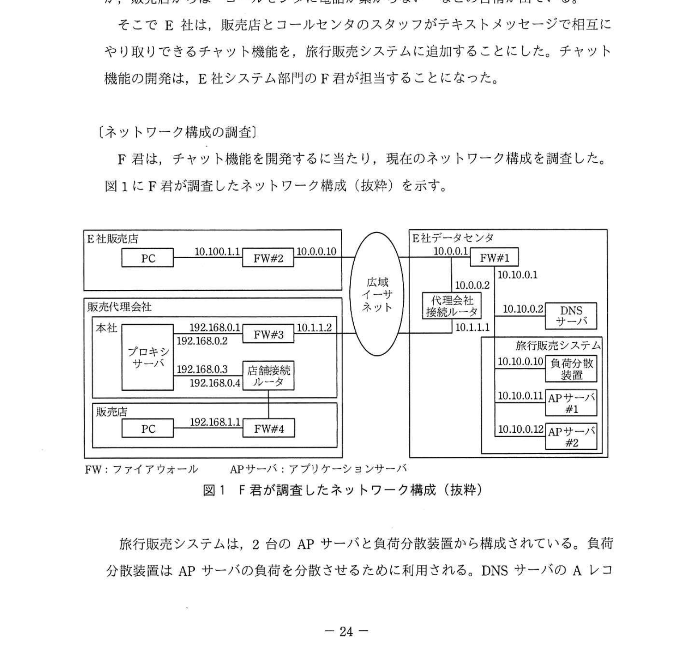
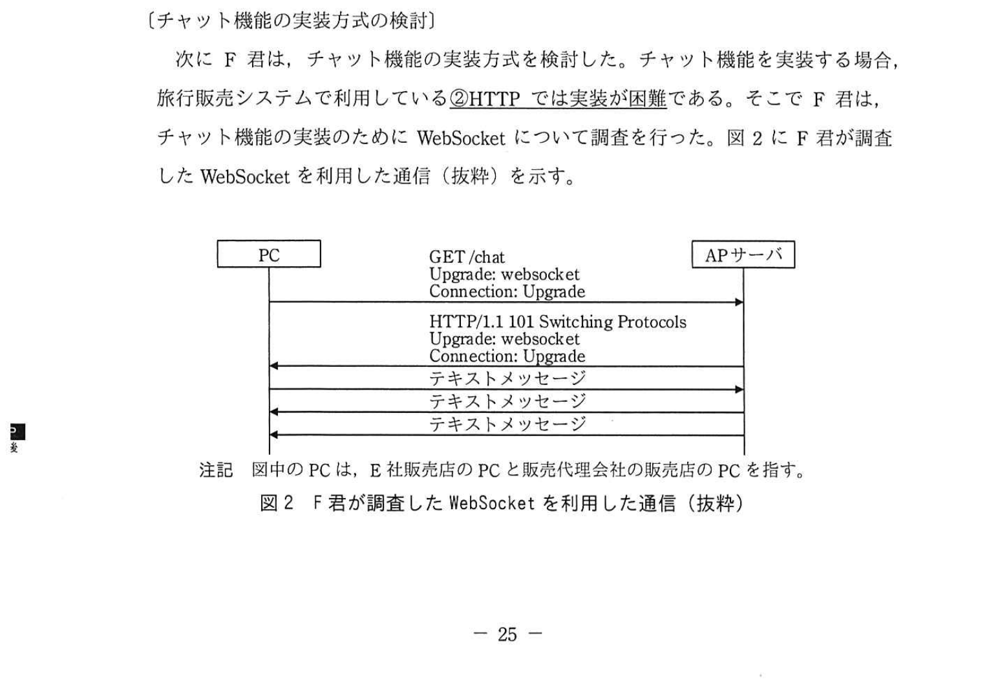

# 2021年春期（令和3年度春期）応用情報技術者試験 午後 問5（選択）
## ネットワーク：チャット機能の開発（WebSocket・NAPT・プロキシサーバ）

---

## 問題文

**問5** チャット機能の開発に関する次の記述を読んで、設問1〜3に答えよ。

E社は、旅行商品の企画、運営、販売を行う旅行会社である。E社の旅行商品は、自社の販売店と販売代理会社の販売店を通じて販売している。販売店に顧客が来ると、販売スタッフがE社の旅行販売システムを利用して、顧客の要望に合う旅行商品を検索し、顧客に提案している。また、顧客からの旅行商品に関する質問の回答が分からない場合、E社の販売店向けコールセンタに電話で問い合わせることになっているが、販売店からは"コールセンタに電話が繋がらない"などの苦情が出ている。

そこでE社は、販売店とコールセンタのスタッフがテキストメッセージで相互にやり取りできるチャット機能を、旅行販売システムに追加することにした。チャット機能の開発は、E社システム部門のF君が担当することになった。

---

### 〔ネットワーク構成の調査〕

F君は、チャット機能を開発するに当たり、現在のネットワーク構成を調査した。図1にF君が調査したネットワーク構成（抜粋）を示す。

### 図1 F君が調査したネットワーク構成（抜粋）

旅行販売システムは、2台のAPサーバと負荷分散装置から構成されている。負荷分散装置はAPサーバの負荷を分散させるために利用される。DNSサーバのAレコードには、旅行販売システムのIPアドレスとして `[　a　]` が登録されている。

販売代理会社の販売店のPCから旅行販売システムへの通信は、FW、ルータ、プロキシサーバを経由している。FW#3では、NAPTを行い、宛先ポートが53番ポート、80番ポート又は443番ポートで宛先ネットワークアドレスが10.10.0.0のIPパケットとその返信IPパケットだけを通信許可する設定となっている。

販売代理会社の販売店のPCがHTTPを利用して旅行販売システムにアクセスする場合、プロキシサーバはPCから受信したGETメソッドを参照して、APサーバへHTTPリクエストを送信する。一方、HTTP Over TLSを利用する場合は、プロキシサーバは旅行販売システムの機器とTCPコネクションを確立し、①**PCから受信したデータをそのまま送信する**。

また、販売代理会社の販売店のPCから旅行販売システムへアクセスする場合、PCからFW#4に送信されるIPパケットの宛先IPアドレスは `[　b　]` となり、代理会社接続ルータからFW#1に送信されるIPパケットの送信元IPアドレスは `[　c　]` となる。

---

### 〔チャット機能の実装方式の検討〕

次にF君は、チャット機能の実装方式を検討した。チャット機能を実装する場合、旅行販売システムで利用している②**HTTPでは実装が困難**である。そこでF君は、チャット機能の実装のためにWebSocketについて調査を行った。図2にF君が調査したWebSocketを利用した通信（抜粋）を示す。

### 図2 F君が調査したWebSocketを利用した通信（抜粋）

> PC → APサーバ：GET /chat  
> （ヘッダ: Upgrade: websocket / Connection: Upgrade）  
> APサーバ → PC：HTTP/1.1 101 Switching Protocols  
> （ヘッダ: Upgrade: websocket / Connection: Upgrade）  
> PC ↔ APサーバ：テキストメッセージ（双方向）

WebSocketを利用すると、PCとAPサーバの間のHTTPを用いた通信を拡張し、任意フォーマットのデータの双方向通信ができる。WebSocketを利用するためには、PCからAPサーバにHTTPと同様のGETメソッドを送信する。このGETメソッドのHTTPヘッダに"Upgrade: websocket"と"Connection: Upgrade"を含めることで、PCとAPサーバの間でWebSocketの接続が確立される。接続が確立したら、PCとAPサーバのどちらからでも、テキストメッセージを送信できる。

この調査結果からF君は、IRC（Internet Relay Chat）プロトコルや新たにチャット機能専用のプロトコルを利用する場合と比較して、③**WebSocketを利用することで販売代理会社のFWやルータの設定変更を少なくできる**と考えた。

---

### 〔チャット機能の設計レビュー〕

F君は、APサーバにチャット機能を追加するための設計を行い、上司のG課長のレビューを受けた。レビューの結果、G課長から次の2点の指摘があった。

**指摘1.** WebSocketはTCPコネクションを確立したままにするので、負荷分散装置を経由してチャット機能へアクセスすると、旅行販売システムの既存機能へのアクセスに影響がある。

**指摘2.** チャット機能をWebSocket Over TLSに対応させないと、販売代理会社からプロキシサーバを経由してチャット機能にアクセスできない。

F君は指摘1について、チャット機能では負荷分散装置を使わないことにし、E社データセンタ内にある機器を利用した④**ほかの負荷分散方式**に変更した。

次に指摘2について、WebSocketを利用した通信ではTCPコネクションを確立したままにする必要があるので、プロキシサーバのHTTP Over TLSのデータをそのまま送信することで、プロキシサーバ経由でチャット機能が利用できる。そこで、F君はTLS証明書を `[　d　]` にインストールし、チャット機能の通信をHTTP Over TLSに対応させた。

その後F君が、チャット機能を旅行販売システムに追加したことで、販売店でのチャット機能の利用が開始された。

---

## 設問

### 設問1 〔ネットワーク構成の調査〕について、(1)〜(3)に答えよ。

**(1)** 本文中の `[　a　]` 〜 `[　c　]` に入れる適切なIPアドレスを図1中の字句を用いて答えよ。

**(2)** E社販売店のPC及び販売代理会社の販売店のPCが旅行販売システムにアクセスするためには、どの機器のDNS設定にE社のDNSサーバのIPアドレスを設定する必要があるか、解答群の中から全て選び、記号で答えよ。

**解答群：**
- ア E社販売店のPC
- イ FW#1
- ウ FW#2
- エ FW#3
- オ FW#4
- カ 店舗接続ルータ
- キ 販売代理会社の販売店のPC
- ク 負荷分散装置
- ケ プロキシサーバ

**(3)** 本文中の下線①について、プロキシサーバがPCから送信されたデータをそのまま送信するのはなぜか、30字以内で述べよ。

### 設問2 〔チャット機能の実装方式の検討〕について、(1)、(2)に答えよ。

**(1)** 本文中の下線②について、チャット機能をHTTPで実装するのはなぜ困難か、解答群の中から選び、記号で答えよ。

**解答群：**
- ア PCはAPサーバ上のファイルを取得することしかできないから
- イ PCへのメッセージ送信はAPサーバ側で発生したイベントを契機として行うことができないから
- ウ TCPコネクションを確立したままにできないから
- エ どのPCから送られたメッセージか、APサーバが判別できないから

**(2)** 本文中の下線③について、FWやルータへの設定変更を少なくできるのはなぜか、WebSocketとHTTPの共通点に着目して、20字以内で述べよ。

### 設問3 〔チャット機能の設計レビュー〕について、(1)、(2)に答えよ。

**(1)** 本文中の下線④について、どのような負荷分散方式に変更したか、20字以内で答えよ。

**(2)** 本文中の `[　d　]` に入れる適切な機器名を、図1中の字句を用いて全て答えよ。

---

## 解答と解説

### 設問1

**(1)**
図1のネットワーク構成より：
- **a = 10.10.0.10**：DNSサーバのAレコードには旅行販売システム（負荷分散装置）のIPアドレスが登録される。負荷分散装置のIPアドレスは10.10.0.10。
- **b = 192.168.0.3**：販売代理会社の販売店のPCがFW#4に送信するIPパケットの宛先はプロキシサーバの販売店側インタフェースのIPアドレス（192.168.0.3）。
- **c = 10.1.1.2**：NAPTによりFW#3でIPアドレスが変換され、代理会社接続ルータからFW#1へ送信されるパケットの送信元IPはFW#3の外側アドレス（10.1.1.2）。

**IPA公式：a=10.10.0.10、b=192.168.0.3、c=10.1.1.2**

**(2) 正解：ア、ケ**

旅行販売システムのIPアドレスを名前解決するためにDNSサーバのIPアドレスが必要な機器：
- **ア（E社販売店のPC）**：PCが旅行販売システムのIPアドレスをDNSで直接解決する
- **ケ（プロキシサーバ）**：プロキシサーバがAPサーバにアクセスする際にDNS解決が必要
- なお、販売代理会社の販売店のPC（キ）は**プロキシサーバ経由**でアクセスするため、名前解決はプロキシサーバが行う。当該PC自身にDNSサーバのIPを設定する必要はなく、キは不正解。

**IPA公式：ア、ケ**

**(3) 正解：TLSで暗号化されており内容を復号できないから（24字）**

HTTP Over TLS（HTTPS）の場合、データはTLSで暗号化されている。プロキシサーバはHTTPのGETメソッドを参照してAPサーバを選択するが、暗号化されているためHTTPの内容が読めない。そのため、暗号化されたデータをそのまま透過（トンネリング）して転送するしかない。

---

### 設問2

**(1) 正解：イ**

チャット機能では、APサーバがクライアント（PC）からのリクエストを待つだけでなく、コールセンタからメッセージが来たときに**APサーバ側から販売店のPCへプッシュ送信**する必要がある。しかしHTTPはクライアント→サーバのリクエストに対してサーバがレスポンスを返す一方向通信モデルであり、「APサーバ側で発生したイベントを契機としてPCへメッセージを送信すること」ができない。

**IPA公式：イ**

**(2) 正解：WebSocketはHTTPと同じポートを使用するから（23字）**

WebSocketはHTTPと同じ80番ポート（TLSの場合443番ポート）を使用する。既存のFWやルータはHTTP/HTTPS通信を許可しているため、WebSocketのためにポート開放などの設定変更が不要となる。

---

### 設問3

**(1) 正解：DNSラウンドロビンによる負荷分散方式（20字）**

E社データセンタ内の機器（DNSサーバ）を利用した負荷分散方式として、DNSラウンドロビン（DNSサーバに複数のIPアドレスを登録し、問合せのたびに順番に返す方式）に変更した。負荷分散装置を経由しないため、TCPコネクション維持の問題が解消される。

**(2) 正解：APサーバ#1、APサーバ#2**

指摘2の対応として、プロキシサーバがHTTP Over TLSのデータをそのまま転送できるようにするには、TLS終端となる機器にTLS証明書が必要。チャット機能はAPサーバで動作するため、**APサーバ#1とAPサーバ#2**にTLS証明書をインストールする。

**IPA公式：d=APサーバ#1、APサーバ#2**

---

## 参考：主要キーワード

| 用語 | 説明 |
|------|------|
| WebSocket | HTTP接続をアップグレードして確立する双方向通信プロトコル。サーバからクライアントへのプッシュ送信が可能 |
| NAPT（Network Address Port Translation） | IPアドレスとポート番号の組み合わせで複数の内部ホストを1つのグローバルIPで通信可能にする技術 |
| プロキシサーバ | クライアントの代理でサーバにアクセスする中継サーバ。HTTPの場合はGETメソッドを参照できる |
| HTTP Over TLS（HTTPS） | TLSで暗号化したHTTP通信。プロキシサーバはトンネリングのみ行い内容を読めない |
| 負荷分散装置（ロードバランサ） | 複数のサーバへのアクセスを振り分けてサーバ負荷を分散する装置 |
| DNSラウンドロビン | DNSで1つのFQDNに複数のIPアドレスを登録し、問合せのたびに順番に返す負荷分散手法 |
| TLS証明書 | TLS通信を確立するためのデジタル証明書。サーバの正当性を証明し暗号化通信を可能にする |
| HTTP（プロキシの動作） | プロキシサーバはGETメソッドのURLを読んで宛先サーバを判断し中継する |
