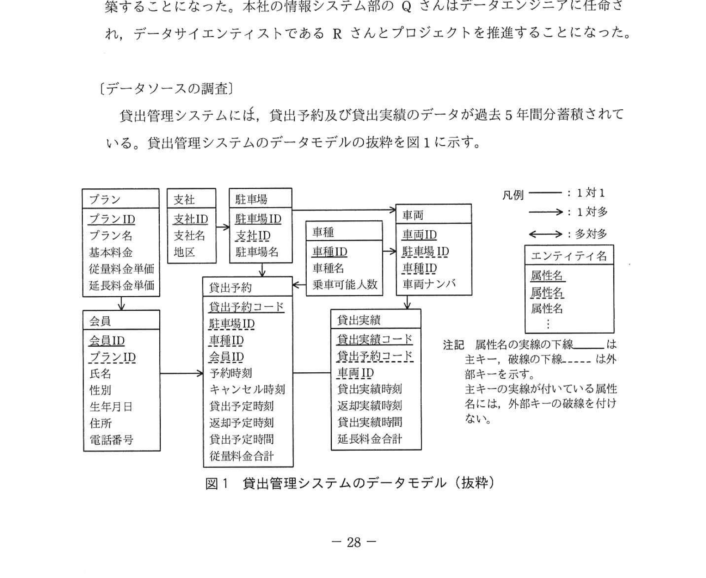
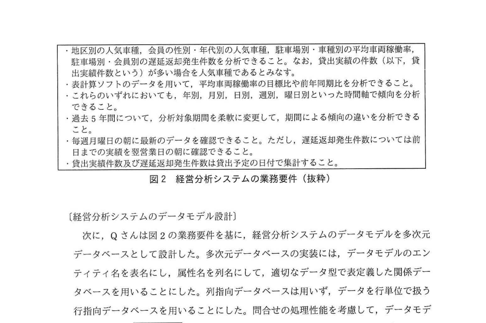
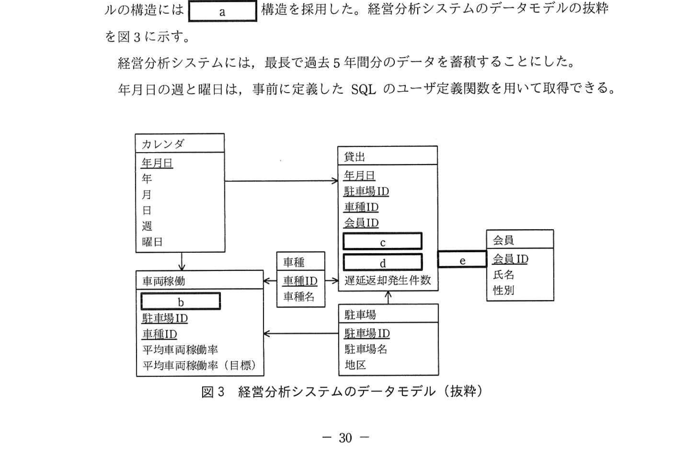
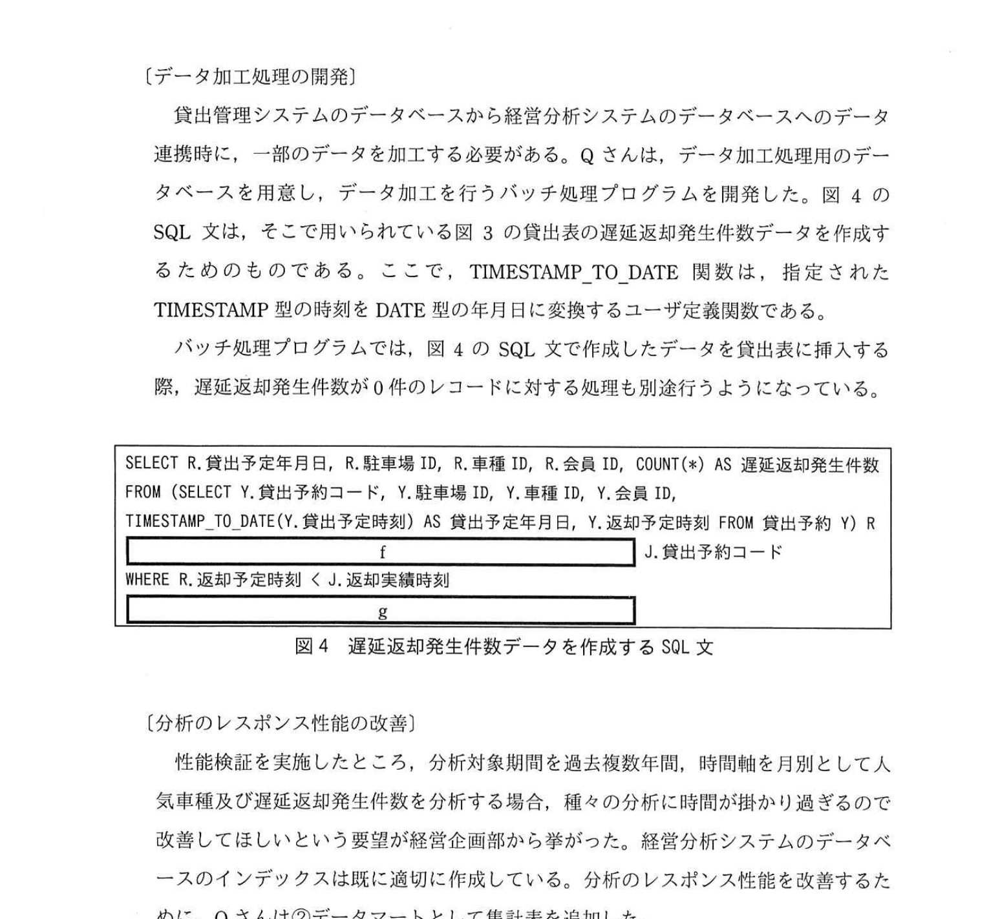

# 2021年春期（令和3年度春期）応用情報技術者試験 午後 問6（選択）
## データベース：経営分析システムのためのデータベース設計（スタースキーマ・データマート）

---

## 問題文

**問6** 経営分析システムのためのデータベース設計に関する次の記述を読んで、設問1〜4に答えよ。

P社は、個人向けのカーシェアリングサービスを運営するMaaS（Mobility as a Service）事業者である。シェアリングのニーズが高い大都市の地区を中心に、500駐車場で約2,000台の自動車（以下、車両という）を貸し出している。P社には本社のほかに、各地区でのサービス運営を担当する支社が10社ある。本社はサービス全体を統括しており、新サービスの企画やマーケティングなどを行っている。支社は貸出管理システムを用いて現場で車両の貸出管理業務を行っている。

本社では、サービス運営状況を多角的な観点でタイムリーに把握して、適切な意思決定を行うために、貸出管理システムのデータをソースとする経営分析システムを構築することになった。本社の情報システム部のQさんはデータエンジニアに任命され、データサイエンティストであるRさんとプロジェクトを推進することになった。

---

### 〔データソースの調査〕

貸出管理システムには、貸出予約及び貸出実績のデータが過去5年間分蓄積されている。貸出管理システムのデータモデルの抜粋を図1に示す。

### 図1 貸出管理システムのデータモデル（抜粋）



利用希望者はあらかじめP社の会員になり、いずれかのプランに加入しておく必要がある。プランごとに基本料金（月額）、従量料金及び延長料金（いずれも10分単位）の単価が決まっている。会員が車両を借りたいときは、P社のホームページで借りたい日時や駐車場、車種などを選択し、貸出を予約する。貸出や返却の実績時刻が予約時の内容と異なる場合であっても、貸出予約の情報は修正しない。従量料金合計は予約時に指定された貸出予定時間を基に算出する。予約時に指定した返却予定時刻より早い時刻に返却しても、従量料金合計は減算しない。予約時に指定した返却予定時刻より遅い時刻に返却した場合は遅延返却として扱う。遅延返却は後の時間帯に予約している別の会員の迷惑となるので、超過した時間については従量料金よりも高い延長料金によって延長料金合計を算出する。これによって、遅延返却の発生件数（以下、遅延返却発生件数という）の低減を図っている。毎月末に当月の基本料金、従量料金合計及び延長料金合計を合算して、翌月に会員に請求する。

貸出管理システムのデータベースでは、データモデルのエンティティ名を表名にし、属性名を列名にして、適切なデータ型で表定義した関係データベースによって、データを管理している。時刻はTIMESTAMP型、年月日はDATE型で定義されている。

また、P社ではKPIの一つとして車両稼働率を重視している。車両稼働率とは、各車両における1日当たりの貸出実績時間の割合である。平均車両稼働率の目標データは、表計算ソフトのデータとして、年月日別・駐車場別・車種別に過去3年間分が蓄積されており、それ以前のデータは破棄されている。

---

### 〔業務要件の把握〕

P社の経営企画部では、車両の追加整備計画の立案を検討している。Rさんは経営企画部にヒアリングを行い、経営分析システムの業務要件を把握した。業務要件の抜粋を図2に示す。

### 図2 業務要件（抜粋）



Qさんは、データソースの調査結果を踏まえて、図2の業務要件の実現可能性を評価した。その結果、①**業務要件の一部は経営分析システムの運用開始直後には実現できないことが判明した**。対応方針を経営企画部と協議した結果、業務要件は変更せず、運用開始直後の分析は、実現可能な範囲で行うことで合意した。

---

### 〔経営分析システムのデータモデル設計〕

次に、Qさんは図2の業務要件を基に、経営分析システムのデータモデルを多次元データベースとして設計した。多次元データベースの実装には、データモデルのエンティティ名を表名にし、属性名を列名にして、適切なデータ型で表定義した関係データベースを用いることにした。列指向データベースは用いず、データを行単位で扱う行指向データベースを用いることにした。問合せの処理性能を考慮して、データモデルの構造には `[　a　]` 構造を採用した。経営分析システムのデータモデルの抜粋を図3に示す。

### 図3 経営分析システムのデータモデル（抜粋）



経営分析システムには、最長で過去5年間分のデータを蓄積することにした。

年月日の週と曜日は、事前に定義したSQLのユーザ定義関数を用いて取得できる。

---

### 〔データ加工処理の開発〕

貸出管理システムのデータベースから経営分析システムのデータベースへのデータ連携時に、一部のデータを加工する必要がある。Qさんは、データ加工処理用のデータベースを用意し、データを加工するバッチ処理プログラムを開発した。図4のSQL文は、そこで用いられる図3の貸出表の遅延返却発生件数データを作成するためのものである。ここで、TIMESTAMP_TO_DATE関数は、指定されたTIMESTAMP型の時刻をDATE型の年月日に変換するユーザ定義関数である。

バッチ処理プログラムでは、図4のSQL文で作成したデータを貸出表に挿入する際、遅延返却発生件数が0件のレコードに対する処理も別途行うようになっている。

### 図4 遅延返却発生件数データを作成するSQL文



```sql
SELECT R.貸出予定年月日, R.駐車場ID, R.車種ID, R.会員ID, COUNT(*) AS 遅延返却発生件数
FROM (SELECT Y.貸出予約コード, Y.駐車場ID, Y.車種ID, Y.会員ID,
      TIMESTAMP_TO_DATE(Y.貸出予定時刻) AS 貸出予定年月日, Y.返却予定時刻 FROM 貸出予約 Y) R
[　f　]  J.貸出予約コード
WHERE R.返却予定時刻 < J.返却実績時刻
[　g　]
```

---

### 〔分析のレスポンス性能の改善〕

性能検証を実施したところ、分析対象期間を過去複数年間、時間軸を月別として人気車種及び遅延返却発生件数を分析する場合、種々の分析に時間が掛かり過ぎるので改善してほしいという要望が経営企画部から挙がった。経営分析システムのデータベースのインデックスは既に適切に作成している。分析のレスポンス性能を改善するために、Qさんは②**データマートとして集計表を追加した**。

---

## 設問

### 設問1 本文中の下線①について、実現できない業務要件を40字以内で具体的に答えよ。

### 設問2 〔経営分析システムのデータモデル設計〕について、(1)、(2)に答えよ。

**(1)** 本文中の `[　a　]` に入れる適切な字句を解答群の中から選び、記号で答えよ。

**解答群：**
- ア 3層スキーマ
- イ オブジェクト指向
- ウ スタースキーマ
- エ スノーフレークスキーマ
- オ 第3正規形
- カ 非正規形

**(2)** 図3中の `[　b　]` 〜 `[　e　]` に入れる適切なエンティティ間の関連及び属性名を答えよ。なお、エンティティ間の関連及び属性名の表記は図1の凡例及び注記に倣うこと。

### 設問3 〔データ加工処理の開発〕について、(1)、(2)に答えよ。

**(1)** 図4中の `[　f　]`、`[　g　]` に入れる適切な字句を答えよ。なお、表の列名には必ずその表の相関名を付けて答えよ。

**(2)** 図4のSQL文を実行するべき頻度を2字以内で答えよ。

### 設問4 本文中の下線②について、追加した集計表の主キーを答えよ。

---

## 解答と解説

### 設問1 正解：システム稼働後2年間は、過去5年間分の平均車両稼働率のデータが蓄積できないこと（43字）

平均車両稼働率の目標データは過去3年分しか蓄積されておらず（それ以前は破棄）、かつ経営分析システムは過去5年間分を対象とする。システム稼働後2年間は、5年分のデータが揃わないため過去5年間の分析はできない。

**IPA公式：システム稼働後2年間は、過去5年間分の平均車両稼働率の目標比を表示できない。**

---

### 設問2

**(1) 正解：ウ（スタースキーマ）**

OLAPによる多次元分析に適したデータモデルは**スタースキーマ**。中央にファクトテーブル（事実表）を置き、周囲にディメンションテーブル（次元表）を配置する星型の構造。スノーフレークスキーマはディメンションをさらに正規化した構造。

**IPA公式：a=ウ（スタースキーマ）**

**(2)**
図3の空欄b/c/d/eは、エンティティ名ではなく表内の属性名およびエンティティ間の関連（矢印）を問うている。

- **b = 年月日**：車両稼働表の主キー構成属性（駐車場ID・車種IDと並ぶ）。平均車両稼働率は年月日別・駐車場別・車種別に管理されるため、b＝年月日。
- **c = 年代**（c・dは順不同）：貸出表（ファクト表）の属性。会員の性別・年代別分析のため。
- **d = 貸出実績件数**（c・dは順不同）：貸出表の属性。人気車種判定のため。
- **e = →（1対多）**：貸出表と会員表を結ぶ関連。会員1件が複数の貸出を持つので1対多の向き。

**IPA公式：b=年月日、c=年代、d=貸出実績件数（c・dは順不同）、e=→（1対多）**

---

### 設問3

**(1) 正解：f = INNER JOIN 貸出実績 J ON R.貸出予約コード =、g = GROUP BY R.貸出予定年月日, R.駐車場ID, R.車種ID, R.会員ID**

fは**JOIN句**で、副問合せRと貸出実績Jを貸出予約コードで結合する条件を完成させる。gは**GROUP BY句**で、SELECTの非集約列（貸出予定年月日・駐車場ID・車種ID・会員ID）でグルーピングし、遅延返却発生件数をCOUNT(*)で集計する。

```sql
SELECT R.貸出予定年月日, R.駐車場ID, R.車種ID, R.会員ID, COUNT(*) AS 遅延返却発生件数
FROM (SELECT Y.貸出予約コード, Y.駐車場ID, Y.車種ID, Y.会員ID,
      TIMESTAMP_TO_DATE(Y.貸出予定時刻) AS 貸出予定年月日, Y.返却予定時刻 FROM 貸出予約 Y) R
  INNER JOIN 貸出実績 J ON R.貸出予約コード = J.貸出予約コード    -- f
WHERE R.返却予定時刻 < J.返却実績時刻
GROUP BY R.貸出予定年月日, R.駐車場ID, R.車種ID, R.会員ID          -- g
```

**IPA公式：f=INNER JOIN 貸出実績 J ON R.貸出予約コード =、g=GROUP BY R.貸出予定年月日, R.駐車場ID, R.車種ID, R.会員ID**

**(2) 正解：日次**

貸出実績データは日次で処理されるため、遅延返却発生件数データも**日次**で更新する。

---

### 設問4 正解：年月, 駐車場ID, 車種ID, 会員ID

パフォーマンス改善のためのデータマート（集計表）の主キー。集計は月別に行うため粒度は**年月**（年月日ではない）。分析軸は駐車場・車種・会員。よって主キー＝**年月, 駐車場ID, 車種ID, 会員ID**。

**IPA公式：年月, 駐車場ID, 車種ID, 会員ID**

---

## 参考：主要キーワード

| 用語 | 説明 |
|------|------|
| MaaS（Mobility as a Service） | 様々な交通手段を統合してサービスとして提供する概念。カーシェアも含む |
| スタースキーマ | DWHのデータモデル。中央のファクトテーブルと周囲のディメンションテーブルで構成。OLAPに適する |
| スノーフレークスキーマ | スタースキーマのディメンションをさらに正規化した構造。雪の結晶状に分岐する |
| OLAP（Online Analytical Processing） | データウェアハウスの多次元分析。スライス・ダイス・ドリルダウンなどの操作が可能 |
| ファクトテーブル（事実表） | スタースキーマの中心。数値データ（売上・件数・時間）を格納する |
| ディメンションテーブル（次元表） | 分析軸（時間・商品・顧客・地域）を格納するテーブル |
| データマート | 特定の業務・部門向けに最適化されたDWHのサブセット。集計済みデータを保持しパフォーマンスを向上 |
| KPI（Key Performance Indicator） | 重要業績評価指標。目標達成度を測る指標（車両稼働率など） |
| NAPT（Network Address Port Translation） | IPアドレスとポート番号の組み合わせで複数の内部ホストを1つのIPで通信させる技術 |
| ユーザ定義関数 | SQLで独自に定義した関数。TIMESTAMP_TO_DATEなどのデータ変換に利用 |
