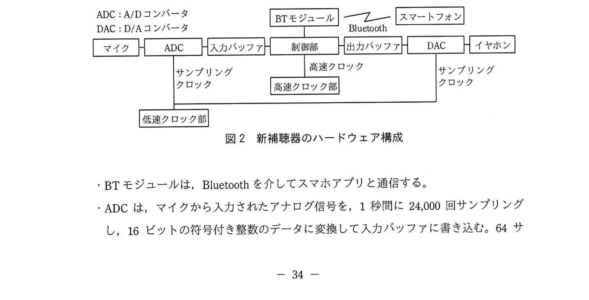
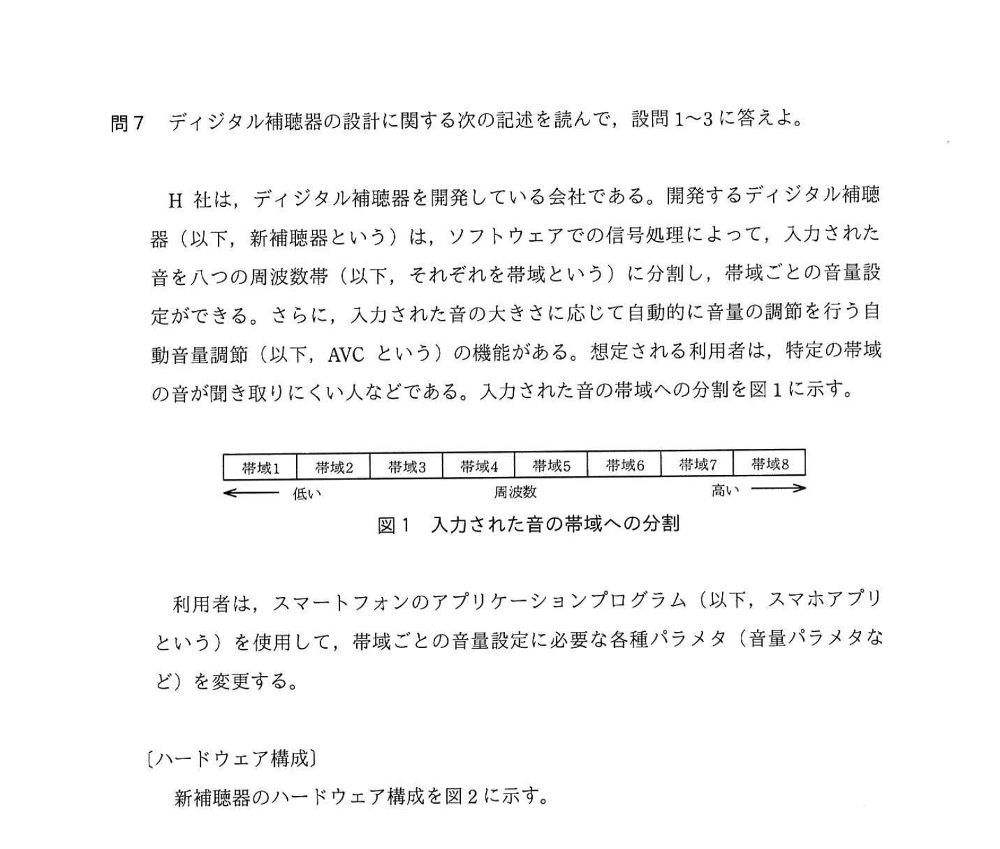
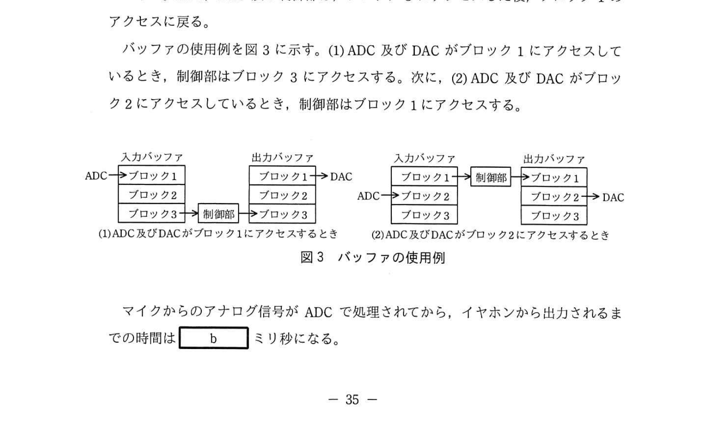
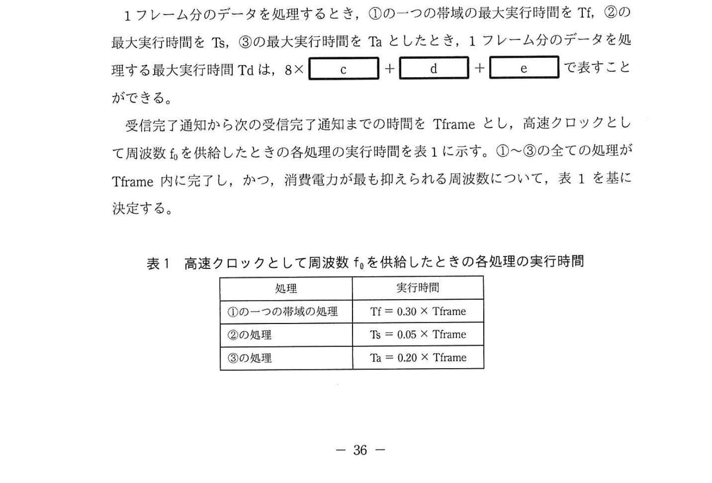
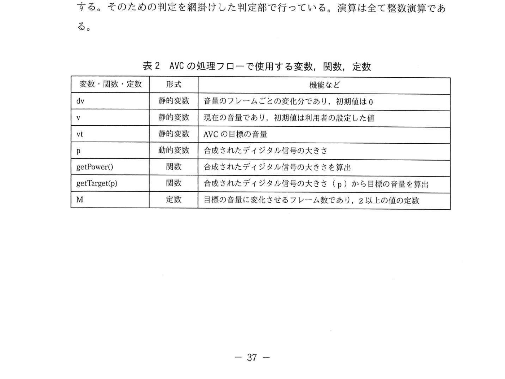
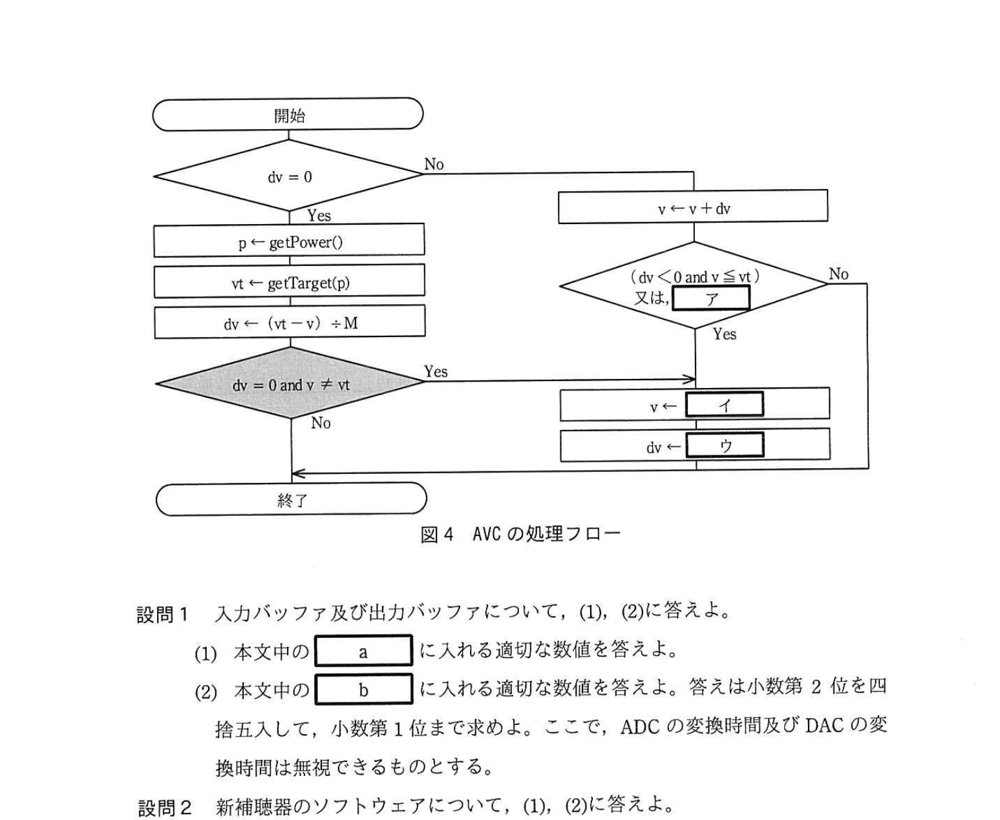

# 2021年春期（令和3年度春期）応用情報技術者試験 午後 問7（選択）
## 組込みシステム：ディジタル補聴器の設計（AVC・トリプルバッファ・クロック周波数）

---

## 問題文

**問7** ディジタル補聴器の設計に関する次の記述を読んで、設問1〜3に答えよ。

H社は、ディジタル補聴器を開発している会社である。開発するディジタル補聴器（以下、新補聴器という）は、ソフトウェアでの信号処理によって、入力された音を八つの周波数帯（以下、それぞれを帯域という）に分割し、帯域ごとの音量設定ができる。さらに、入力された音の大きさに応じて自動的に音量の調節を行う自動音量調節（以下、AVCという）の機能がある。想定される利用者は、特定の帯域の音が聞き取りにくい人などである。入力された音の帯域への分割を図1に示す。

### 図1 入力された音の帯域への分割

利用者は、スマートフォンのアプリケーションプログラム（以下、スマホアプリという）を使用して、帯域ごとの音量設定に必要な各種パラメタ（音量パラメタなど）を変更する。

---

### 〔ハードウェア構成〕

新補聴器のハードウェア構成を図2に示す。

### 図2 新補聴器のハードウェア構成

- BTモジュールは、Bluetoothを介してスマホアプリと通信する。
- ADCは、マイクから入力されたアナログ信号を、1秒間に24,000回サンプリングし、16ビットの符号付き整数のデータに変換して入力バッファに書き込む。64サンプルのデータを1フレームとして書き込み、書込みが完了したことを制御部に通知する。この通知を受信完了通知という。
- 制御部は、受信完了通知を受けると1フレーム分のデータを処理して出力バッファに書き込む。演算は全て整数演算であり、浮動小数点演算は使用しない。
- DACは、出力バッファに書き込まれた16ビットの符号付き整数のデータをアナログ信号に変換する。
- 低速クロック部は、ADC及びDACに24kHzのサンプリングクロックを供給する。
- 高速クロック部は、制御部に高速クロックを供給する。高速クロックの周波数はf₀又はその整数倍で、ソフトウェアによって決定することができる。

---

### 〔入力バッファ及び出力バッファ〕

入力バッファ及び出力バッファは、それぞれ三つのブロックで構成されている。一つのブロックには1フレーム分のデータを格納できる。入力バッファ及び出力バッファのサイズはともに `[　a　]` バイトである。

ADC及びDACは、入力バッファ及び出力バッファの同じブロック番号のブロックにアクセスする。制御部は、ADCによるデータの書込みが完了したブロックにアクセスする。ADC、DAC及び制御部は、ブロック3にアクセスした後、ブロック1のアクセスに戻る。

バッファの使用例を図3に示す。(1) ADC及びDACがブロック1にアクセスしているとき、制御部はブロック3にアクセスする。次に、(2) ADC及びDACがブロック2にアクセスしているとき、制御部はブロック1にアクセスする。

### 図3 バッファの使用例

マイクからのアナログ信号がADCで処理されてから、イヤホンから出力されるまでの時間は `[　b　]` ミリ秒になる。

---

### 〔新補聴器のソフトウェア〕

制御部のソフトウェアの主な処理内容は、①信号処理、②合成、③AVCである。制御部が受信完了通知を受けると、次に示すように処理を行う。

① サンプリングしたデータから一つの帯域を抽出し、帯域に割り当てられた音量パラメタを乗じる。これを八つの帯域に対して行う。

② ①で得られたそれぞれの帯域のディジタル信号を合成して一つのディジタル信号にする。

③ 合成されたディジタル信号について、AVCで音量を調節して、出力バッファに書き込む。

新補聴器の消費電力をできるだけ抑えたい。新補聴器では、消費電力は供給される高速クロックの周波数に比例し、ソフトウェアの実行時間（以下、実行時間という）は高速クロックの周波数に反比例することが分かっている。

最適なクロック周波数を決定するために、高速クロックの周波数を用いて、①〜③の実行時間を計測した。

1フレームのデータを処理するとき、①の一つの帯域の最大実行時間をTf、②の最大実行時間をTs、③の最大実行時間をTaとしたとき、1フレームのデータを処理する最大実行時間Tdは、8×`[　c　]` + `[　d　]` + `[　e　]` で求すことができる。

受信完了通知から次の受信完了通知までの時間をTframeとし、高速クロックとして周波数f₀を供給したときの各処理の実行時間を表1に示す。①〜③の全ての処理がTframe内に完了し、かつ、消費電力が最も抑えられる周波数について、表1を基に決定する。

### 表1 高速クロックとして周波数f₀を供給したときの各処理の実行時間

> | 処理 | 実行時間 |
> |------|--------|
> | ①の一つの帯域の処理 | Tf = 0.30 × Tframe |
> | ②の処理 | Ts = 0.05 × Tframe |
> | ③の処理 | Ta = 0.20 × Tframe |

---

### 〔AVC処理〕

〔新補聴器のソフトウェア〕の③の処理は、1フレームごとに実行し、適切な音声を出力するように音量を調節する。合成されたディジタル信号の大きさを確認して所定の大きさよりも大きいときは音量を小さくし、所定の大きさよりも小さいときは音量を大きくする。

音量を変更するときは1フレームごとに音量を変化させ、M又はM+1フレーム間で徐々に目標の音量にする。Mは2以上の値でシステムの定数である。目標の音量に到達したら、その次のフレームの合成された信号について目標の音量を決定し、同様の音量調節を行う。

---

### 〔AVC処理のソフトウェア〕

AVCの処理フローで使用する変数、関数、定数を表2に、AVCの処理フローを図4に示す。特定の条件では、目標の音量を決定したとき、直ちに音量を目標の音量にする。そのための判定を繰り返けした判定部で行っている。演算は全て整数演算である。

### 表2 AVCの処理フローで使用する変数、関数、定数

> | 変数・関数・定数 | 形式 | 機能など |
> |--------------|------|--------|
> | dv | 静的変数 | 音量のフレームごとの変化分であり、初期値は0 |
> | v | 静的変数 | 現在の音量であり、初期値は利用者の設定した値 |
> | vt | 静的変数 | AVCの目標音量 |
> | p | 動的変数 | 合成されたディジタル信号の大きさ |
> | getPower() | 関数 | 合成されたディジタル信号の大きさを算出 |
> | getTarget(p) | 関数 | 合成されたディジタル信号の大きさ（p）から目標の音量を算出 |
> | M | 定数 | 目標の音量に変化させるフレーム数であり、2以上の値の定数 |

### 図4 AVCの処理フロー

> dv = 0 → Yes → p ← getPower()、vt ← getTarget(p)、dv ← (vt - v) ÷ M
>
> dv = 0 and v ≠ vt → Yes → 終了
>
> No → v ← v + dv → 判定：(dv < 0 and v ≤ vt) 又は `[　ア　]`
>
> Yes → v ← `[　イ　]`、dv ← `[　ウ　]`

---

## 設問

### 設問1 入力バッファ及び出力バッファについて、(1)、(2)に答えよ。

**(1)** 本文中の `[　a　]` に入れる適切な数値を答えよ。

**(2)** 本文中の `[　b　]` に入れる適切な数値を答えよ。答えは小数第2位を四捨五入して小数第1位まで求めよ。ここで、ADCの変換時間及びDACの変換時間は無視できるものとする。

### 設問2 新補聴器のソフトウェアについて、(1)、(2)に答えよ。

**(1)** 本文中の `[　c　]` 〜 `[　e　]` に入れる適切な字句を答えよ。

**(2)** 決定した高速クロックの周波数はf₀の何倍か、適切な数値を整数で答えよ。

### 設問3 AVC処理のソフトウェアについて、(1)、(2)に答えよ。

**(1)** 図4中の `[　ア　]` 〜 `[　ウ　]` に入れる適切な字句を答えよ。

**(2)** 図4中の繰り返けした判定部において、判定結果が"Yes"となるのは、音量がどのような場合か、40字以内で述べよ。

---

## 解答と解説

### 設問1

**(1) 正解：a = 384（バイト）**

1フレーム = 64サンプル × 16ビット/サンプル = 64 × 2バイト = 128バイト

バッファは3ブロック構成なので：
128バイト × 3ブロック = **384バイト**

**IPA公式：a=384**

**(2) 正解：b = 8.0ミリ秒**

トリプルバッファの構造上の遅延を計算する。ADCが入力バッファのあるブロックに書込み → 制御部が次のタイミングでそのブロックを処理 → DACがさらに次のタイミングで出力、という三段パイプライン（図3）のため、**3フレーム分**の遅延が生じる。

1フレームの時間 = 64サンプル ÷ 24,000サンプル/秒 = 64/24,000秒 ≒ 2.667ミリ秒

3 × 64/24,000 × 1,000 = **8.0ミリ秒**

**IPA公式：b=8.0ミリ秒**

---

### 設問2

**(1) 正解：c = Tf、d = Ts、e = Ta**

1フレームの処理内容：
- ①の処理（帯域抽出・音量乗算）を8帯域分：8 × Tf
- ②の処理（合成）：Ts
- ③の処理（AVC）：Ta

よって：Td = 8 × **Tf** + **Ts** + **Ta**

**IPA公式：c=Tf、d=Ts、e=Ta**

**(2) 正解：3倍**

f₀での最大実行時間：
Td = 8 × 0.30 × Tframe + 0.05 × Tframe + 0.20 × Tframe
   = 2.40 × Tframe + 0.05 × Tframe + 0.20 × Tframe
   = 2.65 × Tframe

Td > Tframeなので、f₀では処理が間に合わない。クロック周波数をn倍にすると実行時間はn分の1になる：

n倍時のTd = 2.65 × Tframe / n ≤ Tframe
→ n ≥ 2.65

消費電力はクロック周波数に比例するため、最小のn（整数）で間に合う周波数を選ぶ：
n = 3（2倍では2.65/2=1.325>1で不足、3倍では2.65/3≒0.88<1で十分）

**IPA公式：3倍**

---

### 設問3

**(1) 正解：ア = dv > 0 and v ≥ vt、イ = vt、ウ = 0**

AVCフローチャートの判定部（音量が目標に達したかを判断）：
- 音量を下げているとき（dv < 0）：現在音量vが目標vt以下になったとき → 目標達成
- 音量を上げているとき（dv > 0）：現在音量vが目標vt以上になったとき → 目標達成

よって：
- **ア = dv > 0 and v ≥ vt**（増加中で目標以上に達した場合）
- **イ = vt**（音量を目標値に設定）
- **ウ = 0**（変化分をゼロにリセット）

**IPA公式：ア=dv>0 and v≥vt、イ=vt、ウ=0**

**(2) 正解：現在の音量が目標値に近く、変化量が0となり音量を変更する必要がない場合**

設問3(2)が問うのは図4の**網掛けした判定部＝「dv ＝ 0 and v ≠ vt」**である。この判定部がYesになるのは、dv＝(vt−v)÷M の整数除算で、目標音量vtと現在音量vの差がM未満のためdv＝0になったが、まだv≠vt（目標に達していない）場合。すなわち**現在の音量が目標値に近く、（1フレーム当たりの）変化量が0となり、徐々に変化させる必要がない場合**である。このとき直ちにv←vt（イ）、dv←0（ウ）にする。

---

## 参考：主要キーワード

| 用語 | 説明 |
|------|------|
| ADC（Analog to Digital Converter） | アナログ信号をディジタルデータに変換する回路 |
| DAC（Digital to Analog Converter） | ディジタルデータをアナログ信号に変換する回路 |
| サンプリング | アナログ信号を一定間隔で離散値に変換すること。24kHzは1秒に24,000回 |
| トリプルバッファ | 3ブロックのバッファ。ADC/DAC書込みと制御部処理を並行実行可能にする。遅延3フレーム |
| AVC（Auto Volume Control） | 入力音量に応じて自動的に音量を調整する機能 |
| クロック周波数と消費電力 | 消費電力はクロック周波数に比例、実行時間は反比例。最小周波数で条件を満たすことで省電力化 |
| 静的変数 | 関数呼び出しをまたいで値が保持される変数 |
| 帯域分割 | 音声信号を周波数帯域ごとに分割して個別に処理する技術 |
