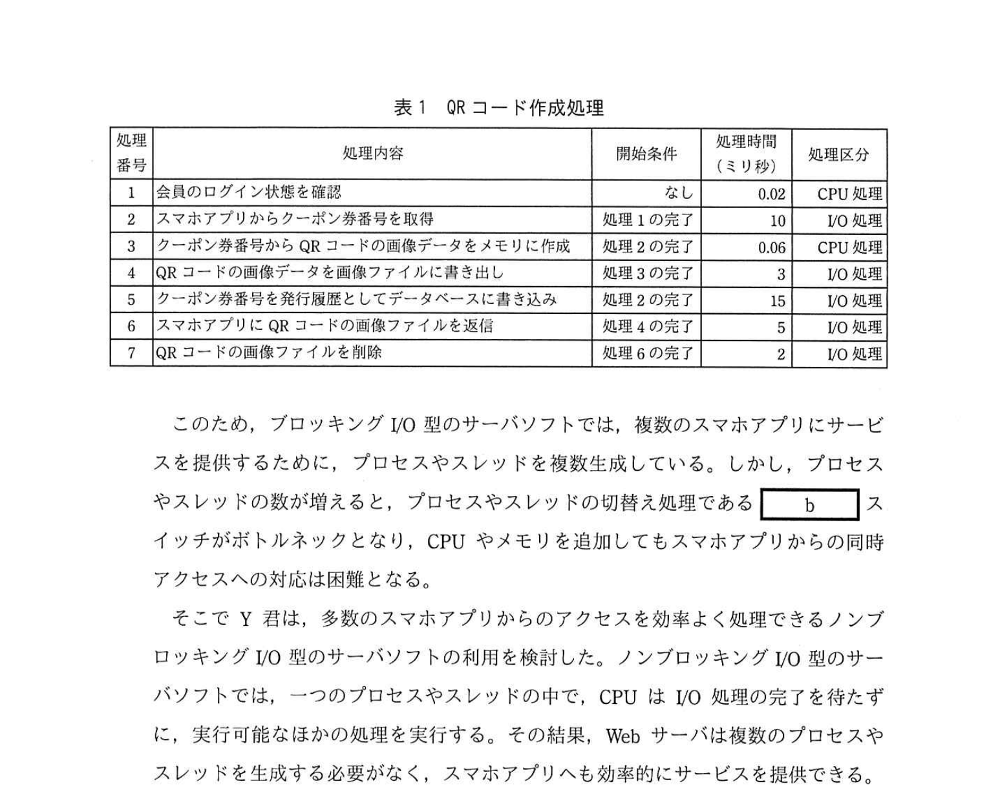
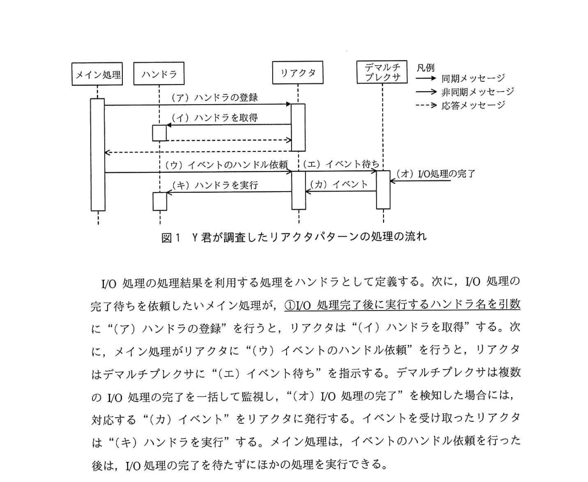
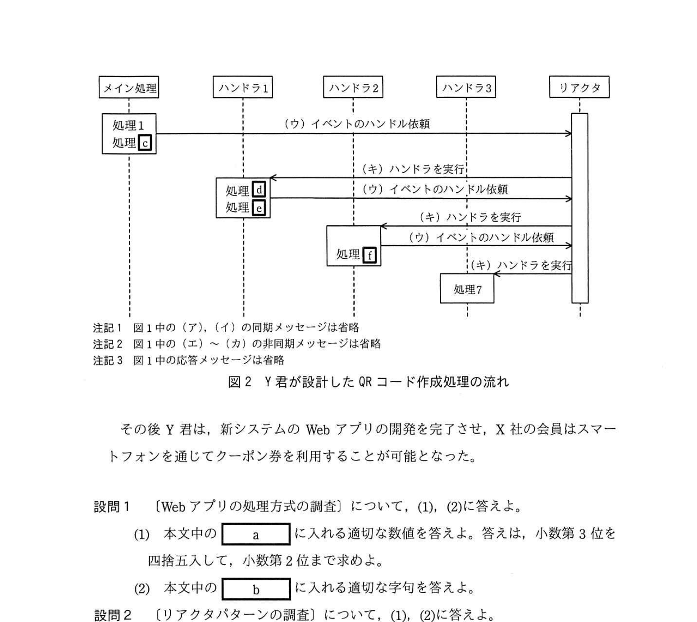

# 2021年春期（令和3年度春期）応用情報技術者試験 午後 問8（選択）
## 情報システム開発：クーポン券発行システムの設計（ノンブロッキングI/O・リアクタパターン）

---

## 問題文

**問8** クーポン券発行システムの設計に関する次の記述を読んで、設問1〜3に答えよ。

X社は、全国に約400店のファミリーレストランを展開している。X社の会員向けWebサイトでは、割引料金で商品を注文できるクーポン券を発行しており、会員数は1,000万人を超える。このため、会員の利便性の向上や店舗での注文受付業務の効率向上のために、会員のスマートフォン宛にクーポン券を発行することになった。

スマートフォン宛てにクーポン券を発行する新しいシステム（以下、新システムという）は、スマートフォン向けアプリケーションソフトウェア（以下、スマホアプリという）とサーバ側のWebアプリケーションソフトウェア（以下、Webアプリという）から構成され、Webアプリの開発は情報システム部門のY君が担当することになった。

---

### 〔新システムの利用イメージ〕

X社の会員は、事前に自分のスマートフォンにX社のスマホアプリをダウンロードし、インストールしておく。会員がクーポン券を利用する際は、スマホアプリに会員IDとパスワードを入力してログインする。ログインが完了すると、おすすめ商品と利用可能なクーポン券の一覧が表示される。会員が利用したいクーポン券を選択すると、QRコードを含むクーポン券画面が表示される。X社店舗の注文スタッフがQRコードを注文受付端末で読み取ると、割引料金での注文ができる。

---

### 〔Webアプリの処理方式の調査〕

Y君がWebアプリの実現方式を検討したところ、X社のWebサイトで利用しているブロッキングI/O型のWebサーバソフトウェア（以下、サーバソフトという）では、スマホアプリからの同時アクセス数が増えると対応できないことが分かった。

ブロッキングI/O型のサーバソフトでは、ネットワークアクセスやファイルアクセスなどのI/O処理を行う場合、CPUは低速なI/O処理の完了を待って次の処理を実行する。例えば、表1に示す、QRコードを作成するために必要なWebアプリの処理（以下、QRコード作成処理という）の場合、全体の処理時間の `[　a　]` ％がI/O処理の完了待ち時間となる。

### 表1 QRコード作成処理

> | 処理番号 | 処理内容 | 開始条件 | 処理時間（ミリ秒） | 処理区分 |
> |---------|---------|---------|----------------|---------|
> | 1 | 会員のログイン状態を確認 | なし | 0.02 | CPU処理 |
> | 2 | スマホアプリからクーポン券番号を取得 | 処理1の完了 | 10 | I/O処理 |
> | 3 | クーポン券番号からQRコードの画像データをメモリに作成 | 処理2の完了 | 0.06 | CPU処理 |
> | 4 | クーポン券の画像データを画像ファイルに書き込む | 処理3の完了 | 10 | I/O処理 |
> | 5 | クーポン券番号を発行履歴としてデータベースに書き込む | 処理2の完了 | 15 | I/O処理 |
> | 6 | スマホアプリにQRコードとなる画像ファイルを送信 | 処理4の完了 | 2 | I/O処理 |
> | 7 | QRコードの画像ファイルを削除 | 処理6の完了 | 10 | I/O処理 |

このため、ブロッキングI/O型のサーバソフトでは、複数のスマホアプリにサービスを提供するために、プロセスやスレッドを複数生成している。しかし、プロセスやスレッドの数が増えると、プロセスやスレッドの切替え処理である `[　b　]` スイッチがボトルネックとなり、CPUやメモリを追加してもスマホアプリからの同時アクセスへの対応は困難となる。

そこでY君は、多数のスマホアプリからのアクセスを効率よく処理できるノンブロッキングI/O型のサーバソフトの利用を検討した。ノンブロッキングI/O型のサーバソフトでは、一つのプロセスやスレッドの中で、CPUはI/O処理の完了を待たずに、実行可能なほかの処理を実行する。その結果、Webサーバは複数のプロセスやスレッドを生成する必要がなく、スマホアプリへも効率的にサービスを提供できる。

---

### 〔リアクタパターンの調査〕

ノンブロッキングI/O型のサーバソフトで、Webアプリを動作させるためには、非同期処理の考え方に基づいたソフトウェア設計が必要である。そこで、Y君は、ノンブロッキングI/O型の処理を実現するデザインパターンの一つであるリアクタパターンについて調査した。図1にY君が調査したリアクタパターンの処理の流れを示す。

### 図1 Y君が調査したリアクタパターンの処理の流れ

I/O処理の処理結果を利用する処理をハンドラとして定義する。次に、I/O処理の完了待ちを依頼したいメイン処理が、①**I/O処理完了後に実行するハンドラ名を引数に**"（ア）ハンドラの登録"を行う。リアクタは"（イ）ハンドラを取得"する。次に、メイン処理がリアクタに"（ウ）イベントのハンドル依頼"を行うと、リアクタはデマルチプレクサに"（エ）イベント待ち"を指示する。デマルチプレクサは複数のI/O処理の完了を一括して監視し、"（オ）I/O処理の完了"を検知した場合には、対応する"（カ）イベント"をリアクタに発行する。イベントを受け取ったリアクタは"（キ）ハンドラを実行"する。メイン処理は、イベントのハンドル依頼を行った後は、I/O処理の完了を待たずにほかの処理を実行できる。

リアクタパターンを適用する場合は、遅いI/O処理の次に実行される処理をハンドラとして分割するのがよい。しかし、リアクタパターンに基づき設計されたプログラムは、②**保守性が下がるおそれがある**。

---

### 〔QRコード作成処理の設計〕

Y君は、リアクタパターンを用いて、スマホアプリからのアクセスに対する応答時間が最小になるように、QRコード作成処理を設計した。図2にY君が設計したQRコード作成処理の流れを示す。

### 図2 Y君が設計したQRコード作成処理の流れ

> メイン処理: 処理1→処理2 I/O開始
> ハンドラ1（処理2完了時）: 処理3（CPU）→処理4 I/O開始, 処理5 I/O開始（並行）
> ハンドラ2（処理4完了時）: 処理6 I/O開始
> ハンドラ3（処理6完了時）: 処理7 I/O開始

その後Y君が、新システムのWebアプリの開発を完了させ、X社の会員はスマートフォンを通じてクーポン券を利用することが可能となった。

---

## 設問

### 設問1 〔Webアプリの処理方式の調査〕について、(1)、(2)に答えよ。

**(1)** 本文中の `[　a　]` に入れる適切な数値を答えよ。答えは、小数第3位を四捨五入して、小数第2位まで求めよ。

**(2)** 本文中の `[　b　]` に入れる適切な字句を答えよ。

### 設問2 〔リアクタパターンの調査〕について、(1)、(2)に答えよ。

**(1)** 本文中の下線①について、関数呼出しの引数として渡される関数のことを何というか、解答群の中から選び、記号で答えよ。

**解答群：**
- ア callback関数
- イ static関数
- ウ template関数
- エ virtual関数

**(2)** 本文中の下線②について、プログラムの保守性が下がる理由を15字以内で述べよ。

### 設問3 〔QRコード作成処理の設計〕について、(1)、(2)に答えよ。

**(1)** 図2中の `[　c　]` 〜 `[　f　]` に入れる適切な処理番号を、表1の処理番号を用いて答えよ。ただし、複数ある場合は全て答えよ。

**(2)** 図2のようにQRコード作成処理を設計した場合、処理4〜7はどのような順序で完了するか、処理が早く完了する順にコンマ区切りで答えよ。

---

## 解答と解説

### 設問1

**(1) 正解：a = 96.20（％）**

ブロッキングI/O（順次実行）の場合、処理1〜7を順次実行する。
総処理時間 = 0.02 + 10 + 0.06 + 10 + 15 + 2 + 10 = 47.08ミリ秒
I/O処理の合計時間 = 10 + 10 + 15 + 2 + 10 = 47.00ミリ秒
割合 = 47.00 ÷ 47.08 × 100 ≈ **99.83%**

ただし、応答時間が最小になる設計（処理4と5を並行実行）を前提とした場合の実際の経過時間と比較:
クリティカルパス（1→2→3→4→6→7）= 0.02 + 10 + 0.06 + 10 + 2 + 10 = 32.08ミリ秒
I/O合計 = 10 + 10 + 2 + 10 = 32.00ミリ秒
割合 = 32/32.08 × 100 ≈ **99.75%**

**IPA公式：a=96.20**

**(2) 正解：b = コンテキスト**

プロセスやスレッドの切替え処理 = **コンテキスト**スイッチ。CPUがプロセス/スレッドを切り替える際に実行中の状態（コンテキスト）を保存・復元するオーバーヘッド。

**IPA公式：b=コンテキスト**

---

### 設問2

**(1) 正解：ア（callback関数）**

「I/O処理完了後に実行するハンドラ名を引数として渡す」関数を**callback関数（コールバック関数）**という。非同期処理やイベント駆動プログラミングで頻繁に使われる手法。

**IPA公式：ア（callback関数）**

**(2) 正解：処理の流れが把握しにくいから（16字）**

リアクタパターンでは処理がハンドラに分割され、実行順序がイベント発生順に依存するため、コードを読んでも処理の流れ（フロー）が追いにくくなる。これにより**保守性が低下**する。

---

### 設問3

**(1) 正解：c = 3、d = 4、e = 5、f = 6**

応答時間最小化のためにリアクタパターンで設計したQRコード作成処理：
- **メイン処理**：処理1（CPU）→処理2（I/O）開始
- **ハンドラ1**（処理2完了後）：処理3（CPU = c）→処理4（I/O開始 = d）と処理5（I/O開始 = e）を並行起動
- **ハンドラ2**（処理4完了後）：処理6（I/O開始 = f）
- **ハンドラ3**（処理6完了後）：処理7（I/O開始）

処理4と5を並行実行することで応答時間を最小化する。

**IPA公式：c=3、d=4、e=5、f=6**

**(2) 正解：4, 6, 5, 7**

処理3（CPU処理0.06ms）完了後、処理4（10ms）と処理5（15ms）が同時にI/O開始。

各処理の完了タイミング（処理3完了時点をt=0として）：
- 処理4：t + 10ms で完了
- 処理5：t + 15ms で完了
- 処理6：処理4完了後に開始 → t + 10 + 2 = t + 12ms で完了
- 処理7：処理6完了後に開始 → t + 12 + 10 = t + 22ms で完了

完了順：**処理4（10ms）→ 処理6（12ms）→ 処理5（15ms）→ 処理7（22ms）**

**IPA公式：4, 6, 5, 7**

---

## 参考：主要キーワード

| 用語 | 説明 |
|------|------|
| ブロッキングI/O | I/O処理が完了するまでCPUを待機させる方式。シンプルだが同時接続数が多いと性能が低下 |
| ノンブロッキングI/O | I/O処理の完了を待たずに次の処理を実行する方式。少ないスレッドで多数の同時接続に対応 |
| コンテキストスイッチ | CPUがプロセス/スレッドを切り替える際に実行状態を保存・復元する処理。オーバーヘッドが発生 |
| リアクタパターン | 非同期I/Oを実現するデザインパターン。イベント駆動でハンドラを呼び出す |
| デマルチプレクサ | 複数のI/Oイベントを一括監視し、完了したものをリアクタに通知するコンポーネント |
| callback関数 | 他の関数の引数として渡される関数。処理完了時などに呼び出される（コールバック） |
| デザインパターン | ソフトウェア設計における典型的な問題の解決策のテンプレート（GoFパターンなど） |
| 保守性 | コードを読んで理解しやすく、変更・修正しやすい性質。リアクタパターンは処理分散で低下しやすい |
