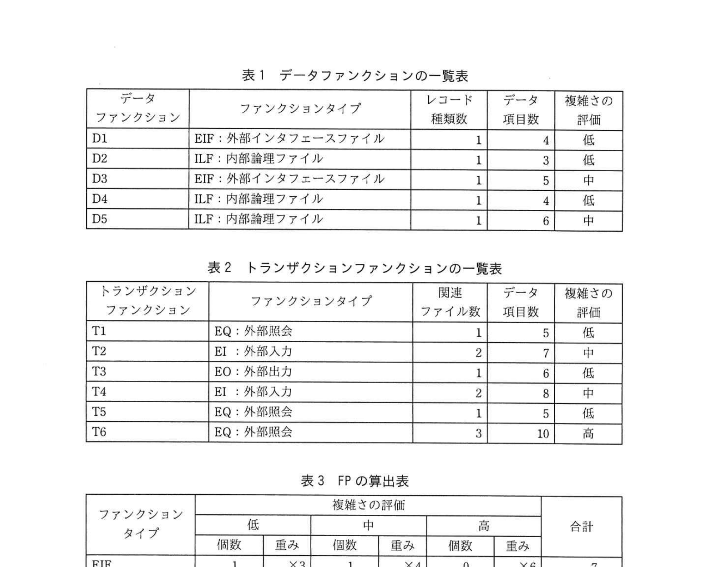
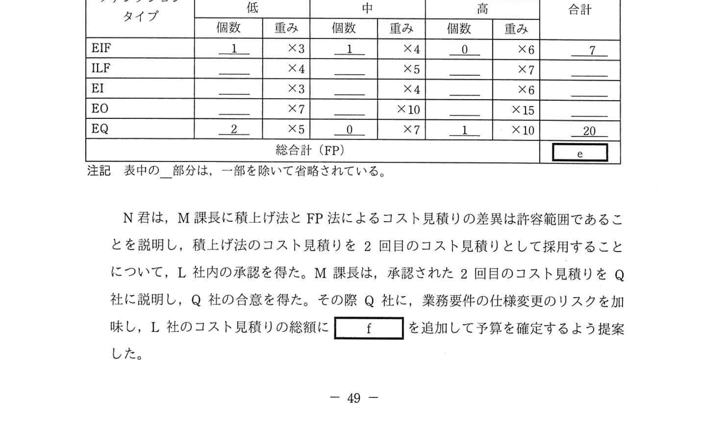
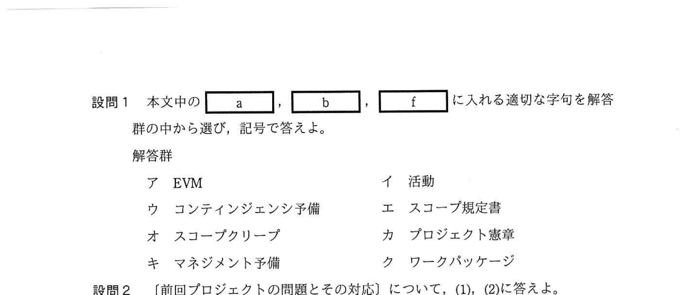

# 2021年春期（令和3年度春期）応用情報技術者試験 午後 問9（選択）
## プロジェクトマネジメント：プロジェクトのコスト見積り（FP法・積上げ法・三点見積り）

---

## 問題文

**問9** プロジェクトのコスト見積りに関する次の記述を読んで、設問1〜4に答えよ。

L社は大手機械メーカーQ社のシステム子会社であり、Q社の様々なシステムの開発、運用及び保守を行っている。Q社は、新工場の設立に伴い、新工場用の生産管理システムを新規開発することを決定した。この生産管理システム開発プロジェクト（以下、本プロジェクトという）では、業務要件定義と受入れをQ社が担当し、システム設計から導入までと受入れの支援をL社が担当することになった。L社とQ社は、システム設計完了から導入まで（以下、実装工程という）を請負契約とした。

本プロジェクトのプロジェクトマネージャには、L社システム開発部のM課長が任命された。本プロジェクトは現在Q社での業務要件定義が完了し、これからL社でシステム設計に着手するところである。L社側実装工程のコスト見積りは、同部門のN君が担当することになった。

なお、L社はQ社の情報システム部が、最近になって子会社として独立した会社であり、本プロジェクトの直前に実施した別の新工場用の生産管理システム開発プロジェクト（以下、前回プロジェクトという）が、L社独立後にQ社から最初に受注したプロジェクトであった。本プロジェクトのL社とQ社の担当範囲や契約形態は前回プロジェクトと同じである。

---

### 〔前回プロジェクトの問題とその対応〕

前回プロジェクトの実装工程では、見積り時のスコープは工程完了まで変更がなかったのに、L社のコスト実績がコスト見積りを大きく超過した。しかし、①**L社は超過コストをQ社に要求することはできなかった**。本プロジェクトでも請負契約となるので、M課長はまず、前回プロジェクトで超過コストが発生した問題点を次のとおり洗い出した。

- コスト見積りの機能の範囲について、Q社が範囲に含まれると認識していた機能が、L社は範囲に含まれないと誤解していた。
- 予算確保のためにできるだけ早く実装工程に対するコスト見積りを提出してほしいというQ社の要求に応えるため、L社はシステム設計の途中でWBSを一旦作成し、これに基づいてボトムアップ見積りの手法（以下、積上げ法という）によって実施したが、スコープを十分詰めずにコスト見積りを提出したため、後で積上げに使用したWBSが不十分で見落とした作業が多くあり、コスト見積りが低くなってしまった。

そこで今回このプロジェクトでは、積上げ法でコスト見積りを2回提出することにした。

(i) 1回目のコスト見積りは、システム設計の初期の段階で、本プロジェクトに類似したシステム開発の複数のプロジェクトを基に類推法によって実施して、概算値ではあるが、できるだけ早く提出すること

(ii) 2回目のコスト見積りは、システム設計の完了後に②**積上げ法に加えてファンクションポイント（以下、FPという）法でも実施すること**

- 積上げ法については、次の点について考慮すること。
  - 作業を十分詳細に分解してWBSを完成させること
  - 標準的なリスクへの対応に基づく通常のケースだけでなく、特定したリスクがいずれも顕在化しない最良のケースと、特定したリスクが全て顕在化する最悪のケースも想定してコスト見積りを作成すること

---

### 〔1回目のコスト見積り〕

これらの指示を基に、N君はまず、Q社の業務要件定義の結果を基に `[　a　]` を作成し、Q社とその内容を確認した。

次に、1回目のコスト見積りを類推法で実施し、その結果をM課長に報告した。その際、L社が独立する前も含めて実施した複数のプロジェクトのコスト見積りとコスト実績を比較対象にして、概算値を見積もったと説明した。

しかし、M課長は、"③**自分がコスト見積りに対して指示した事項を、適切に実施したという説明がない**"とN君に指摘した。

N君は、M課長の指摘に対して漏れていた説明を追加して、1回目のコスト見積りについてL社内の承認を得た。M課長は、この1回目のコスト見積りをQ社に提出した。

---

### 〔2回目のコスト見積り〕

N君は、システム設計の完了後に、積上げ法とFP法で2回目のコスト見積りを実施した。

**(1) 積上げ法によるコスト見積り**

N君は、まず作業を、工数が漏れなく見積もれるWBSの最下位のレベルである `[　b　]` まで分解してWBSを完成させた後、工数を見積もり、これに単価を乗じてコストを算出した。

次に、この見積もったコストを最頻値とし、これに加えて、最良のケースを想定して見積もった楽観値と、最悪のケースを想定して見積もった悲観値を算出した。楽観値と悲観値の重み付けをそれぞれ1とし、最頻値の重み付けを4としてコストに乗じ、これらを合計した値を6で割って期待値を算出することとした。例えば、最頻値が100千円で、楽観値は最頻値−10%、悲観値は最頻値+100%となった作業のコストの期待値は `[　c　]` 千円となる。

`[　b　]` のコストの期待値を合計して、本プロジェクトの積上げ法によるコスト見積りを作成した。

**(2) FP法によるコスト見積り**

N君は、FP法によってFPを算出して開発 `[　d　]` を見積もり、これを工数に換算し単価を乗じて、コスト見積りを作成した。表1〜3は、本プロジェクトにおけるある1機能でのFPの算出例である。表1、表2を基に、表3でFPを算出した。

### 表1 データファンクションの一覧表

> | データファンクション | ファンクションタイプ | レコード種類数 | データ項目数 | 複雑さの評価 |
> |-----------------|---------------|------------|-----------|-----------|
> | D1 | EIF：外部インタフェースファイル | 1 | 4 | 低 |
> | D2 | ILF：内部論理ファイル | 1 | 3 | 低 |
> | D3 | EIF：外部インタフェースファイル | 1 | 5 | 中 |
> | D4 | ILF：内部論理ファイル | 1 | 4 | 低 |
> | D5 | ILF：内部論理ファイル | 1 | 6 | 中 |

### 表2 トランザクションファンクションの一覧表

> | トランザクションファンクション | ファンクションタイプ | 関連ファイル数 | データ項目数 | 複雑さの評価 |
> |--------------------------|---------------|------------|-----------|-----------|
> | T1 | EQ：外部照会 | 1 | 5 | 低 |
> | T2 | EI：外部入力 | 2 | 7 | 中 |
> | T3 | EO：外部出力 | 1 | 6 | 低 |
> | T4 | EI：外部入力 | 2 | 8 | 中 |
> | T5 | EQ：外部照会 | 1 | 5 | 低 |
> | T6 | EQ：外部照会 | 3 | 10 | 高 |

### 表3 FPの算出表

> | ファンクションタイプ | 低（個数×重み） | 中（個数×重み） | 高（個数×重み） | 合計 |
> |-----------------|-------------|-------------|-------------|-----|
> | EIF | 1×3 | 1×4 | 0×6 | 7 |
> | ILF | （2×4） | （1×5） | （0×7） | （13） |
> | EI | （0×3） | （2×4） | （0×6） | （8） |
> | EO | （1×7） | （0×10） | （0×15） | （7） |
> | EQ | 2×5 | 0×7 | 1×10 | 20 |
> | 総合計（FP） | | | | `[　e　]` |
>
> 注記：表中の\_部分は、一部を略して省略されている。

N君は、M課長に積上げ法とFP法によるコスト見積りの差異は許容範囲であることを説明し、積上げ法のコスト見積りとして採用することについて、L社内の承認を得た。M課長は、承認された2回目のコスト見積りをQ社に説明し、Q社の合意を得た。その際Q社に、業務要件の仕様変更のリスクを加味し、L社のコスト見積りの総額に `[　f　]` を追加して予算を確定するよう提案した。

---

## 設問

### 設問1 本文中の `[　a　]`、`[　b　]`、`[　f　]` に入れる適切な字句を解答群の中から選び、記号で答えよ。

**解答群：**
- ア EVM
- イ 活動
- ウ コンティンジェンシー予備
- エ スコープ規定書
- オ スコープクリープ
- カ プロジェクト憲章
- キ マネジメント予備
- ク ワークパッケージ

### 設問2 〔前回プロジェクトの問題とその対応〕について、(1)、(2)に答えよ。

**(1)** 本文中の下線①の理由を、契約形態の特徴を含めて30字以内で述べよ。

**(2)** 本文中の下線②について、積上げ法に加えてもう一つの別の手法で見積りを行う目的を30字以内で述べよ。

### 設問3 〔1回目のコスト見積り〕について、本文中の下線③で漏れていた説明の内容を40字以内で答えよ。

### 設問4 〔2回目のコスト見積り〕について、(1)〜(3)に答えよ。

**(1)** 本文中の `[　c　]` に入れる適切な数値を答えよ。計算の結果、小数第1位以降に端数が出る場合は、小数第1位を四捨五入せよ。

**(2)** 本文中の `[　d　]` に入れる適切な字句を、2字で答えよ。

**(3)** 表3中の `[　e　]` に入れる適切な数値を答えよ。

---

## 解答と解説

### 設問1 正解：a = エ（スコープ規定書）、b = ク（ワークパッケージ）、f = キ（マネジメント予備）

- **a = エ（スコープ規定書）**：Q社の業務要件定義の結果をもとにスコープ（作業範囲）を明確に定義するための文書。前回の問題（範囲の誤解）を防ぐため。
- **b = ク（ワークパッケージ）**：WBSの最下位レベル。工数を漏れなく見積もれる粒度まで作業を分解したもの。
- **f = キ（マネジメント予備）**：空欄fは「業務要件の仕様変更のリスクを加味し、L社のコスト見積りの総額に `[f]` を追加して予算を確定する」という文脈。業務要件の仕様変更は、L社が実装工程で識別・特定したリスク（積上げ法で最良/最悪ケースとして織り込み済み）とは別の、発注者側の未特定リスクである。プロジェクト予算の外に確保する**マネジメント予備**が該当する。コンティンジェンシー予備は特定済みリスク用なので不適。

**IPA公式：a=エ、b=ク、f=キ**

---

### 設問2

**(1) 正解：請負契約では超過コストを発注者に請求できないから（27字）**

請負契約は成果物の完成を約束する契約。成果物が完成すれば、作業コストがいくら超過しても受注者（L社）の自己負担となる。発注者（Q社）に超過コストを要求する権利がない。

**IPA公式：請負契約では超過コストをQ社に要求できないから**

**(2) 正解：積上げ法の見積り結果の妥当性を確認するため（23字）**

2つの異なる手法（積上げ法とFP法）で見積りを行い、結果を比較することで、一方の見積りが極端にずれていないかを検証できる（相互検証）。

---

### 設問3 正解：本プロジェクトに類似したシステム開発の複数のプロジェクトと比較したこと（38字）

M課長の指示は「本プロジェクトに類似したシステム開発の複数のプロジェクトを基に類推法で実施すること」だった。N君の説明では「L社独立前も含む複数のプロジェクトとの比較」と言ったが、それが「本プロジェクトと類似したシステム開発プロジェクト」かどうかの確認が漏れていた。

**IPA公式：本プロジェクトに類似したシステム開発の複数のプロジェクトと比較したこと**

---

### 設問4

**(1) 正解：c = 115（千円）**

三点見積り（PERT）による期待値の計算：
- 最頻値（M）= 100千円
- 楽観値（O）= 最頻値 × (1 - 10%) = 100 × 0.9 = **90**千円
- 悲観値（P）= 最頻値 × (1 + 100%) = 100 × 2 = **200**千円

期待値 = (O + 4M + P) ÷ 6 = (90 + 400 + 200) ÷ 6 = 690 ÷ 6 = **115**千円

**IPA公式：c=115**

**(2) 正解：d = 規模**

FP法はシステムの機能的な規模（FP数）を測定し、そこから開発**規模**（工数）を見積もる手法。

**IPA公式：d=規模**

**(3) 正解：e = 55**

表3の計算：
- EIF：D1(低)×3 + D3(中)×4 = 3 + 4 = **7**（問題に記載）
- ILF：D2(低)×4 + D4(低)×4 + D5(中)×5 = 8 + 5 = **13**
- EI：T2(中)×4 + T4(中)×4 = 4 + 4 = **8**
- EO：T3(低)×7 = **7**
- EQ：T1(低)×5 + T5(低)×5 + T6(高)×10 = 10 + 10 = **20**（問題に記載）

総合計FP = 7 + 13 + 8 + 7 + 20 = **55**

**IPA公式：e=55**

---

## 参考：主要キーワード

| 用語 | 説明 |
|------|------|
| 請負契約 | 成果物完成を約束する契約。超過コストは受注者負担。発注者は成果物完成を要求する権利のみ |
| スコープ規定書 | プロジェクトのスコープ（作業範囲・成果物）を明確に定義した文書 |
| WBS（Work Breakdown Structure） | 成果物やプロセスを段階的に分解した階層図 |
| ワークパッケージ | WBSの最下位レベル。工数見積り・コスト見積りの単位 |
| 積上げ法（ボトムアップ見積り） | WBSの各作業のコストを積み上げてプロジェクト全体コストを算出する手法 |
| 類推法（アナロジー見積り） | 類似プロジェクトの実績を基に概算コストを見積もる手法。精度は低いが早い |
| FP法（ファンクションポイント法） | システムの機能の複雑さを数値化して開発規模を定量的に測定する手法 |
| 三点見積り | 楽観値・最頻値・悲観値の3点からPERT式で期待値を計算する見積り手法 |
| コンティンジェンシー予備 | 識別済みリスクが顕在化した際のための予備費（プロジェクト予算に含む） |
| マネジメント予備 | 未識別の予期しないコストのための予備費（プロジェクト予算の外に設定） |
| EIF（外部インタフェースファイル） | 他システムが管理する参照専用のデータグループ |
| ILF（内部論理ファイル） | 本システムが管理する内部データグループ |
| EI（外部入力）・EO（外部出力）・EQ（外部照会） | FPのトランザクションファンクションの種別 |
