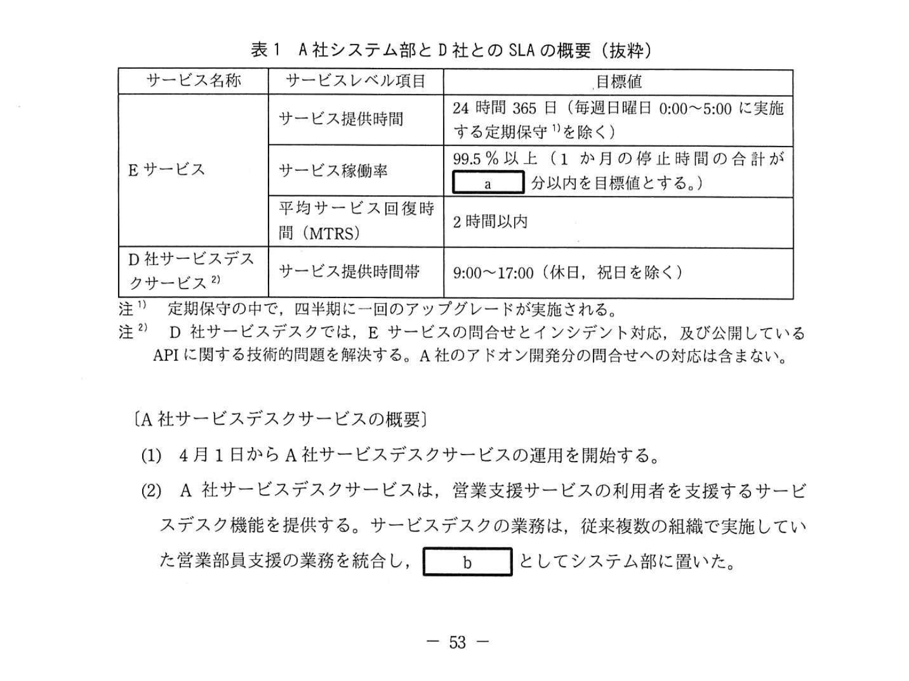
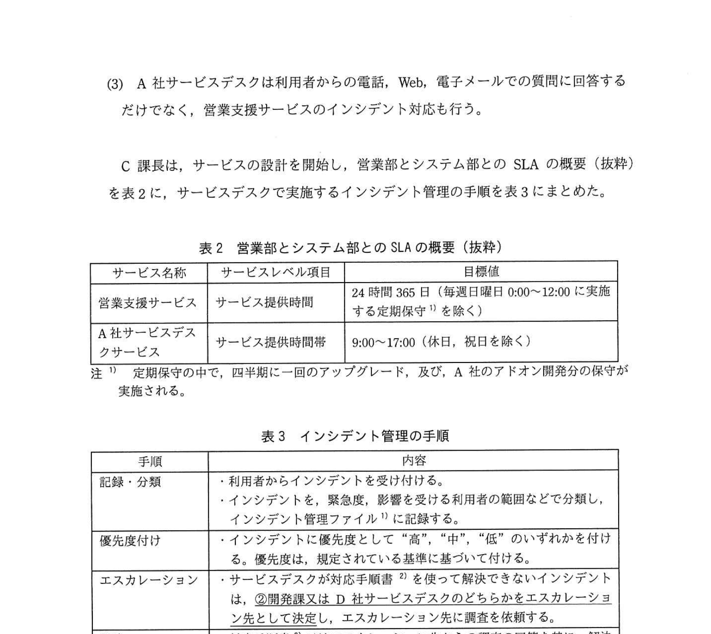
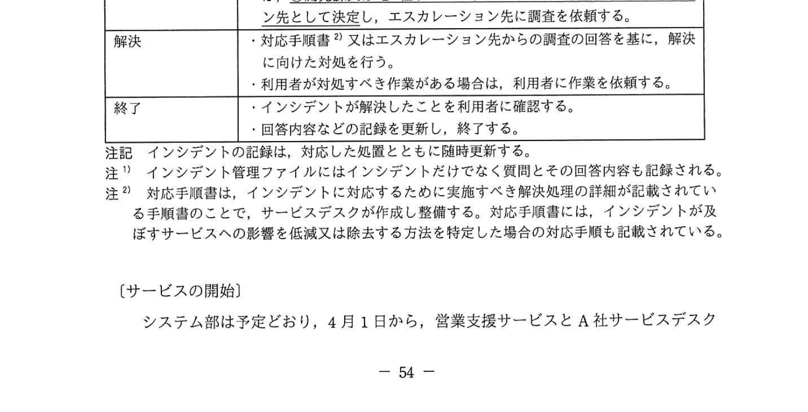
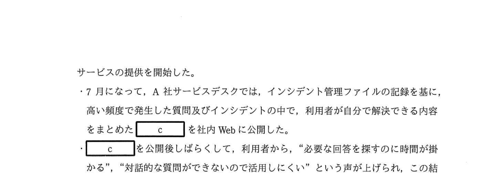

# 2021年春期（令和3年度春期）応用情報技術者試験 午後 問10（選択）
## サービスマネジメント：SaaSを使った営業支援サービスの設計（SLA・インシデント管理・チャットボット）

---

## 問題文

**問10** SaaSを使った営業支援サービスに関する次の記述を読んで、設問1〜4に答えよ。

A社は、オフィス機器の販売・設計・施工会社であり、自社で企画・設計したオフィス機器の販売や設計・施工をA社の顧客に実施している。A社営業部の営業部員は一日の大半を得意先との面会や移動に費やした後に、事務処理のために帰社する必要があって残業時間が増加していた。そこで、A社では、働き方改革の一環として、営業部員が営業拠点のPCだけではなく、自宅や外出先からスマートフォンやタブレットなどの端末からも仕事ができる環境を整えることになった。

このような背景から、A社システム部は、営業部員に対して自宅や外出先からも利用できる営業支援サービスを新規に提供することになった。これに合わせて、システム部のB部長は、システム部内にサービスデスクを設置することを決定し、サービスデスクのリーダとしてC課長を任命した。

---

### 〔営業支援サービスの概要〕

(1) 4月1日から営業支援サービスを開始する。

(2) 営業支援サービスは、①**D社が提供しているSaaSであるEサービスを採用し**、一部の機能をアドオン開発して、提供する。

(3) 営業支援サービスは、顧客管理、営業管理及び販売促進の三つのモジュールで構成され、利用者は端末を使って営業支援サービスを利用する。
  - 顧客管理モジュール及び営業管理モジュールは、EサービスE社サービスで提供される機能及び画面をそのまま使用する。
  - 販売促進モジュールは、Eサービスで提供される標準の機能及び画面に、A社固有の機能及び画面をアドオン開発する。システム部の開発課はD社が公開しているAPIを利用してアドオン開発し、開発したソフトウェアを保守する。

(4) D社からA社向けに、開発・テスト環境及び稼働環境が提供される。
  - 開発・テスト環境は、開発課がアドオン開発及びテストで利用する環境である。D社によって、Eサービスの標準の機能及び画面のモジュールが展開される。
  - 稼働環境は、A社の利用者に営業支援サービスを提供する環境であり、開発課によって三つのモジュールが展開される。

(5) EサービスはD社によって定期的にアップグレードされる。Eサービスのアップグレード及び営業支援サービスへの適用に関する概要は以下のとおりである。
  - Eサービスのアップグレードは、四半期に一回、事前に決められたスケジュールに従って実施される。
  - アップグレード予定日の4週間前に、D社からアップグレードされる機能及び画面や変更点を記載したリリースノートが発行される。
  - Eサービスで提供される標準の機能及び画面については、D社によってリグレッションテストが実施される。テスト完了後に、Eサービスの標準の機能及び画面のモジュールが開発・テスト環境に対して展開される。
  - 開発課は、アップグレードの適用に関して、サービスデスクと協議し、社内調整と必要な作業を行った後、稼働環境に営業支援サービスの三つのモジュールを展開する。

(6) EサービスとD社サービスデスクサービスに関するA社システム部とD社とのSLAの概要（抜粋）を表1に示す。

### 表1 A社システム部とD社とのSLAの概要（抜粋）

> | サービス名称 | サービスレベル項目 | 目標値 |
> |------------|----------------|-------|
> | Eサービス | サービス提供時間 | 24時間365日（毎週日曜日0:00〜5:00に実施する定期保守を除く） |
> | Eサービス | サービス稼働率 | 99.5%以上（1か月の停止時間の合計が `[　a　]` 分以内を目標値とする。） |
> | Eサービス | 平均サービス回復時間（MTRS） | 2時間以内 |
> | D社サービスデスクサービス | サービス提供時間帯 | 9:00〜17:00（休日、祝日を除く） |
>
> 注1 定期保守の中で、四半期に一回のアップグレードが実施される。
> 注2 D社サービスデスクでは、Eサービスの問合せとインシデント対応、及び公開しているAPIに関する技術的問題を解決する。A社のアドオン開発の問合せへの対応は含まない。

---

### 〔A社サービスデスクサービスの概要〕

(1) 4月1日からA社サービスデスクサービスの運用を開始する。

(2) A社サービスデスクサービスは、営業支援サービスの利用者を支援するサービスデスク機能を提供する。サービスデスクの業務は、従来複数の組織で実施していた営業部員支援の業務を統合し、 `[　b　]` としてシステム部に置いた。

(3) A社サービスデスクは利用者からの電話、Web、電子メールでの質問に回答するだけでなく、営業支援サービスのインシデント対応も行う。

C課長は、サービスの設計を開始し、営業部とシステム部とのSLAの概要（抜粋）を表2に、サービスデスクで実施するインシデント管理の手順を表3にまとめた。

### 表2 営業部とシステム部とのSLAの概要（抜粋）

> | サービス名称 | サービスレベル項目 | 目標値 |
> |------------|----------------|-------|
> | 営業支援サービス | サービス提供時間 | 24時間365日（毎週日曜日0:00〜12:00に実施する定期保守を除く） |
> | A社サービスデスクサービス | サービス提供時間帯 | 9:00〜17:00（休日、祝日を除く） |
>
> 注1 定期保守の中で、四半期に一回のアップグレード及びA社のアドオン開発分の保守が実施される。

### 表3 インシデント管理の手順

> | 手順 | 内容 |
> |------|------|
> | 受付・分類 | ・利用者からインシデントを受け付ける。・インシデントを集計し、問題点を把握する。 |
> | 優先度付け | ・インシデントを集結を受けると、影響度を評価する。深刻なインシデントを優先する。 |
> | 初期サポート | ・サービスデスク対応可能なインシデントを解決する。・インシデントを迅速かつ正確にインシデント管理ファイルに記録する。 |
> | 正式エスカレーション | ・サービスデスクで解決できない場合は、適切な担当グループにエスカレーションする。 |
> | 解決 | ・解決方法を確認してインシデントを解決する。利用者に解決を通知し、確認を取る。 |
> | 終了 | ・インシデントを終了する。インシデント管理ファイルに記録された内容を精査・確認する。 |

---

### 〔サービスの開始〕

システム部は予定どおり、4月1日から営業支援サービスとA社サービスデスクサービスを開始した。

- 7月になって、A社サービスデスクでは、インシデント管理ファイルの記録を基に、高い頻度で発生した質問及びインシデントのうち、利用者が自分で解決できる内容をまとめた `[　c　]` を社内Webに公開した。
- `[　c　]` を公開後しばらくして、利用者から、"必要な回答を探すのに時間が掛かる"、"対話的な質問ができないので活用しにくい"という声が上げられ、この結果、`[　c　]` の利用率が低いという課題が明らかになった。

C課長は、利用者からの声に対処するために、10月1日からチャットボットを利用することにした。チャットボットは、新たにD社が提供を開始するEサービスの新モジュールであり、A社はチャットボットを利用して質問に回答できる。システム部は、チャットボットを営業支援サービスの四つ目のモジュールとして位置づけた。利用者が質問のキーワードを入力すると、想定される質問とその回答を返す。利用者が期待する回答が得られない場合には、キーワードを追加させるなど対話的な対応をする。チャットボットによって、利用者は、 `[　d　]` 以外でも質問に回答してもらうことができる。なお、チャットボットを使っても期待する回答が得られない質問に対しては、サービスデスクが電子メールで対応する。

---

### 〔Eサービスのアップグレード対応〕

C課長は、EサービスがアップグレードされるときにA社システム部で必要となる作業を計画した。

- 開発課は、アップグレードされる機能及び画面について記載された `[　e　]` の中から、A社の業務に関連した機能及び画面を抽出し、影響するモジュールを特定する。
- 開発課は、アップグレードがアドオン開発した機能に影響を及ぼさないかどうかを調査し、評価する。
- サービスデスクは、`[　e　]` に基づいて開発課と協議し、`[　f　]` を判断する。判断の結果に応じて、サービスデスクは必要な作業を行う。
- サービスデスクは、営業支援サービスについて利用者に案内すべき内容をまとめ、アップグレードの適用に先立って利用者に通知する。

---

## 設問

### 設問1 〔営業支援サービスの概要〕について、(1)、(2)に答えよ。

**(1)** 本文中の下線①について、SaaSを利用するA社のサービスマネジメントとして、最も適切なものを解答群の中から選び、記号で答えよ。

**解答群：**
- ア Eサービスが定期的にアップグレードされる場合、開発課は営業支援サービスのリグレッションテストを行う必要はない。
- イ Eサービスを構成品目として管理するだけでなく、Eサービスを構成するシステムリソースも構成品目として必ず管理する。
- ウ 発生したインシデントをD社が解決する場合でも、A社システム部はA社営業部に対して、インシデントの解決についての説明責任をもつ。
- エ 予算業務及び会計業務において、営業支援サービスが使用する物理的リソースの減価償却費を計算する必要がある。

**(2)** 表1中の `[　a　]` に入れる適切な数値を答えよ。ここで、1か月は30日、日曜日は月4回で計算し、小数点以下は四捨五入して整数で求めよ。

### 設問2 〔A社サービスデスクサービスの概要〕について、(1)、(2)に答えよ。

**(1)** 本文中の `[　b　]` に入れる適切な字句を解答群の中から選び、記号で答えよ。

**解答群：**
- ア BCP
- イ BPO
- ウ PMO
- エ SPOC

**(2)** 表3中の下線②において、エスカレーション先を決定するときに必要となる判断内容は何か、30字以内で述べよ。

### 設問3 〔サービスの開始〕について、(1)、(2)に答えよ。

**(1)** 本文中の `[　c　]` に入れる適切な字句を5字以内で答えよ。

**(2)** 本文中の `[　d　]` に入れる適切な字句を、表1、2又は3で使用されている字句を使って15字以内で答えよ。

### 設問4 〔Eサービスのアップグレード対応〕について、(1)、(2)に答えよ。

**(1)** 本文中の `[　e　]` に入れる適切な字句を、〔営業支援サービスの概要〕で使用されている字句を使って10字以内で答えよ。

**(2)** 本文中の `[　f　]` には、サービスデスクで実施する作業に関連する内容が入る。その内容について20字以内で答えよ。

---

## 解答と解説

### 設問1

**(1) 正解：ウ**

SaaSを利用する場合、インフラやシステムリソースはD社が管理する。各選択肢の評価：
- **ア**：開発課のアドオン部分のリグレッションテストは必要なため、不適切。
- **イ**：SaaSではA社はEサービスの物理的なシステムリソースを管理しないため不適切。
- **ウ**（正解）：SaaSを利用していてD社がインシデントを解決する場合でも、A社システム部はA社営業部に対してサービス品質についての説明責任（アカウンタビリティ）を持つ。
- **エ**：SaaSでは物理リソースはD社所有のため、A社が減価償却費を計算する必要はない。

**IPA公式：ウ**

**(2) 正解：a = 210（分）**

月間のEサービス提供時間を計算する：
- 月間総時間：30日 × 24時間 × 60分 = 43,200分
- 定期保守除外：日曜0:00〜5:00 × 4回 = 5時間 × 4 × 60分 = 1,200分
- 実際のサービス提供時間：43,200 − 1,200 = **42,000分**

許容停止時間 = 42,000 × (1 − 0.995) = 42,000 × 0.005 = **210分**

**IPA公式：a=210**

---

### 設問2

**(1) 正解：エ（SPOC）**

「従来複数の組織で実施していた営業部員支援の業務を統合」してシステム部に置いた → **SPOC（Single Point Of Contact：単一の連絡窓口）**。利用者からの問い合わせをすべて一元的に受け付ける窓口として機能する。

**IPA公式：b=エ（SPOC）**

**(2) 正解：Eサービスへのインシデントかアドオンへのインシデントかどうか（31字）**

D社サービスデスクはEサービス標準機能とAPIの技術的問題を担当し、A社アドオン開発の問い合わせは担当しない（表1注2）。エスカレーション先（D社 or A社開発課）を決定するには、インシデントがEサービス標準機能に関わるものか、A社アドオンに関わるものかを判断する必要がある。

---

### 設問3

**(1) 正解：c = FAQ（3字）**

「利用者が自分で解決できる内容をまとめた」文書 → **FAQ（よくある質問と回答集）**。5字以内の制約に適合。

**IPA公式：c=FAQ**

**(2) 正解：d = A社サービスデスクのサービス提供時間帯（21字→ 正確には「サービス提供時間帯」9字）**

チャットボットによって「サービス提供時間帯」（9:00〜17:00）以外でも質問に回答できるようになる。表2で使用されている用語「サービス提供時間帯」を使用。

**IPA公式：d=サービス提供時間帯**

---

### 設問4

**(1) 正解：e = リリースノート（6字）**

〔営業支援サービスの概要〕(5)に「D社からアップグレードされる機能及び画面や変更点を記載した**リリースノート**が発行される」とあることから。

**IPA公式：e=リリースノート**

**(2) 正解：f = 対応手順書の修正が必要かどうか（14字）**

[f]の直後の「判断の結果に応じて、サービスデスクは必要な作業を行う」と、別項目の「利用者に案内すべき内容をまとめ…通知する」は別々の作業である。[f]は「必要な作業」に直結する判断＝サービスデスクが作成・整備する**対応手順書**（表3注2）の修正要否。アップグレードでEサービスの機能・画面が変わると既存の対応手順書が実態と合わなくなるため、リリースノート[e]に基づき開発課と協議して「対応手順書の修正が必要かどうか」を判断し、必要なら修正作業を行う。

**IPA公式：f=対応手順書の修正が必要かどうか**

---

## 参考：主要キーワード

| 用語 | 説明 |
|------|------|
| SaaS（Software as a Service） | インターネット経由でソフトウェアを提供するクラウドサービス形態。インフラ管理は提供者が担当 |
| SPOC（Single Point Of Contact） | 利用者から見て単一の連絡窓口。複数の組織の支援機能を統合した窓口サービス |
| BPO（Business Process Outsourcing） | 業務プロセスを外部委託すること。SPOCと混同注意 |
| SLA（Service Level Agreement） | サービス品質を定量的に定めた合意書。稼働率・回復時間などを規定 |
| MTRS（Mean Time to Restore Service） | 平均サービス回復時間。インシデント発生からサービス回復までの平均時間 |
| インシデント管理 | サービスを正常な状態に戻すための対応プロセス。エスカレーション含む |
| エスカレーション | 一次対応で解決できないインシデントを上位・専門担当に引き継ぐこと |
| FAQ（Frequently Asked Questions） | よくある質問と回答集。ナレッジベースの一形態 |
| チャットボット | AI・ルールベースで自動的に質問に回答するシステム。24時間対応が可能 |
| リリースノート | ソフトウェアのバージョンアップで追加・変更された機能を記載した文書 |
| リグレッションテスト | 変更後に既存機能が正常に動作することを確認するテスト |
| アドオン開発 | 既存のシステム・サービスに独自機能を追加開発すること |
