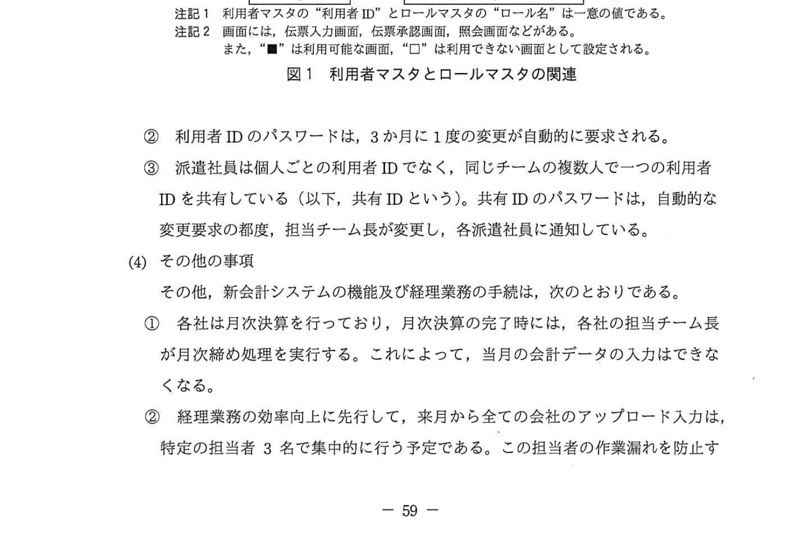
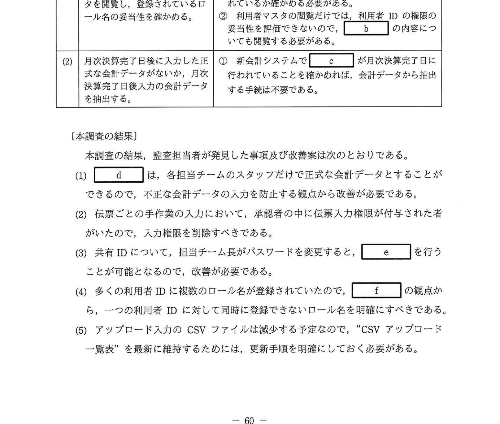

# 2021年春期（令和3年度春期）応用情報技術者試験 午後 問11（必須）
## システム監査：新会計システムの運用状況監査（アクセス管理・職務の分離・共有ID）

---

## 問題文

**問11** 新会計システムのシステム監査に関する次の記述を読んで、設問1〜6に答えよ。

U社は中堅の総合商社であり、12社の傘下に置いて事業を運営している。U社グループでは、経理業務の最適化を進めるために U社グループの経理業務を集中的に行う経理センタを設立するとともに、グループ共通で利用するための新会計システムを3か月前に導入した。U社の内部監査部では、新会計システムに関する運用状況のシステム監査を実施することにした。

---

### 〔予備調査の概要〕

予備調査で入手した情報は次のとおりである。

**(1) 経理センタと新会計システムの概要**

① 経理センタでは、グループ各社の独自の経理マニュアルを利用しており、各社の経理部門の担当者がそのまま各社担当の担当チーム長とそのスタッフとして配置されている。また、現状の経理業務は手作業が多く、多くの派遣社員が担当している。しかしながら、1年後を目標として、グループ共通の経理マニュアルを策定し、担当業務のタスクにフォームを組み込む形で経理業務の手作業を減らす方向で準備を進めている。

② 新会計システムはパッケージシステムであり、仕訳・決裁機能、預金・信用管理機能、税金管理機能、経費支払機能が組み込まれている。これらのインターフェースは、基幹システムからダウンロードされるCSVファイルの作業によるものと、自社インターフェースは自動で行うことができるようになっている。

**(2) 自社アップロード入力の概要**

各社の担当チームのスタッフが作業を行い、当該データのアップロード入力については、各社の担当チームの担当チーム長が承認し、承認後に正式な会計データとなる。決裁情報は承認処理後、自動的に会計データに転記される。

**(3) 新会計システムのアクセス管理**

新会計システムでは、現状において次のようにアクセス権限を管理している。

① アクセス権限は、図1のように利用者マスタの利用者IDに対してロール名を設定することで制御される。ロールマスタでは、ロールごとに利用可能な会社、当該会社で利用可能な画面・機能などが設定されている。このロールマスタは、各社の担当チーム長のロールマスタ申請書に基づいてU社のシステム部で登録される。また、利用者マスタは、利用者が入力した後、**利用者マスタ承認権限**のある同じチームの担当チーム長が承認入力を行うことで、登録される。

### 図1 利用者マスタとロールマスタの関連

> 注記1 利用者マスタの"利用者ID"とロールマスタの"ロール名"は一意の値である。
> 注記2 画面には、伝票入力画面、伝票承認画面、照会画面などがある。また、"■"は利用可能な画面、"□"は利用できない画面として設定される。

② 利用者IDのパスワードは、3か月に1度の変更が自動的に要求される。

③ 派遣社員は個人ごとの利用者IDでなく、同じチームの複数人で1つの利用者IDを共有している（以下、共有IDという）。共有IDのパスワードは、自動的な変更要求の都度、担当チーム長が変更し、各派遣社員に通知している。

**(4) その他の事項**

その他、新会計システムの機能及び経理業務の手続は次のとおりである。

① 各社は月次決算を行っており、月次決算の完了時には、各社の担当チーム長が**月次締め処理**を実行する。これによって、当月の会計データの入力はできなくなる。

② 経理業務の効率向上に先行して、来月から全ての会社のアップロード入力は、特定の担当者3名で集中的に行う予定である。この担当者の作業漏れを防止するために、各社の担当者が **"CSVアップロード一覧表"** を作成している。

---

### 〔監査手続の検討〕

予備調査に基づき監査担当者が策定した監査手続案、及び内部監査部長のレビューコメントは、表1のとおりである。

### 表1 監査手続案及び内部監査部長のレビューコメント

> | 項番 | 監査手続案 | 内部監査部長のレビューコメント |
> |-----|----------|--------------------------|
> | (1) | 利用者IDの権限設定の妥当性を確かめるために、利用者マスタを閲覧し、登録されているロール名の妥当性を確かめる。 | ① 利用者マスタの登録手続きのコントロールとして、担当チーム長の利用者IDだけに `[　a　]` が付与されているかを確かめる必要がある。 ② 利用者マスタの閲覧だけでは、利用者IDの権限の妥当性を評価できないので、`[　b　]` の内容についても閲覧する必要がある。 |
> | (2) | 月次決算完了日後に入力された正式な会計データがないか、月次決算完了日後入力の会計データを抽出する。 | ① 新会計システムで `[　c　]` が月次決算完了日に行われていることを確認すれば、会計データから抽出する手続は不要である。 |

上述の(2)について、内部監査部長は、"当該事項に対応する（ア）**新会計システムに組み込まれたコントロールがある**"ので追加確認することを指示した。

---

### 〔本調査の結果〕

本調査の結果、監査担当者が発見した事項及び改善案は次のとおりである。

(1) `[　d　]` は、各担当チームのスタッフだけで正式な会計データとすることができるので、不正な会計データの入力を防止する観点から改善が必要である。

(2) 伝票ごとの手作業の入力において、承認者の中に伝票入力権限が付与された者がいたので、入力権限を削除すべきである。

(3) 共有IDについて、担当チーム長がパスワードを変更すると、`[　e　]` を行うことが可能となるので、改善が必要である。

(4) 多くの利用者IDに複数のロール名が登録されていたので、`[　f　]` の観点から、1つの利用者IDに対して同時に登録できないロール名を明確にすべきである。

(5) アップロード入力のCSVファイルは減少する予定なので、"CSVアップロード一覧表"を最新に維持するためには、更新手順を明確にしておく必要がある。

---

## 設問

### 設問1

表1中の `[　a　]`、`[　b　]` 及び `[　c　]` に入れる適切な字句をそれぞれ10字以内で答えよ。

### 設問2

〔本調査の結果〕の `[　d　]` に入れる適切な字句を10字以内で答えよ。

### 設問3

〔本調査の結果〕の `[　e　]` に入れる適切な字句を15字以内で答えよ。

### 設問4

〔本調査の結果〕の `[　f　]` に入れる最も適切な字句を解答群の中から選び、記号で答えよ。

**解答群：**
- ア 業務の継続性
- イ 業務の効率向上
- ウ 作業漏れ防止
- エ 職務の分離
- オ ロールの簡素化

### 設問5

〔本調査の結果〕の(5)で、CSVファイルは減少する予定があるとした理由を20字以内で答えよ。

### 設問6

〔本調査の結果〕の下線（ア）のコントロールは何か。10字以内で答えよ。

---

## 解答と解説

### 設問1

**a = 利用者マスタ承認権限（10字）**

担当チーム長が利用者マスタの登録を承認する役割を持つため、担当チーム長の利用者IDだけに「利用者マスタ承認権限」が付与されているかを確認する必要がある。

**b = ロールマスタ（6字）**

利用者マスタだけでは「どのロール名が付いているか」しかわからず、そのロール名がどのような権限を持つかはロールマスタを参照しなければ評価できない。

**c = 月次締め処理（7字）**

月次締め処理が実行されると当月の会計データ入力ができなくなる（問題文(4)①）。これがシステム上のコントロールとして機能しているため、月次締め処理の実施確認で十分。

**IPA公式：a=利用者マスタ承認権限、b=ロールマスタ、c=月次締め処理**

---

### 設問2

**d = アップロード入力（9字）**

(2)「自社アップロード入力の概要」によると、担当チームのスタッフがアップロード入力を行い、担当チーム長が承認する。しかし本調査では、スタッフだけで正式な会計データとすることができる状況（つまり承認なしで完了できる）が判明した。

→ **アップロード入力**（における入力と承認の分離が不十分）

**IPA公式：d=アップロード入力**

---

### 設問3

**e = 担当チーム長が入力と承認（13字）**

共有IDは複数の派遣社員が使うIDであり、パスワードは担当チーム長が変更して通知する。担当チーム長がパスワードを知っているため、共有IDを使って**担当チーム長が入力と承認**の両方を行うことが可能となる（職務の分離が崩れる）。

**IPA公式：e=担当チーム長が入力と承認**

---

### 設問4

**f = エ（職務の分離）**

1つの利用者IDに対して複数のロール名が登録されると、入力と承認を同一人物が行えるリスクが生じる。これは**職務の分離（Segregation of Duties）**の観点から問題であり、同一IDに登録できないロールの組み合わせを明確化すべき。

**IPA公式：f=エ（職務の分離）**

---

### 設問5

**正解：自動インタフェースを拡大させるから（18字）**

問題文(1)②に「自社インターフェースは自動で行うことができる」とあり、経理業務の効率化・自動化が進むと、現在手動でアップロードしていたCSVファイルが自動インターフェースに置き換えられ、手動アップロードのCSVファイル数が減少する。

**IPA公式：自動インタフェースを拡大させるから**

---

### 設問6

**正解：入力者が承認できない（11字）**

月次締め処理が完了すると当月の会計データの入力ができなくなる（システム的に制限される）。しかし設問6が問うのは下線（ア）の「新会計システムに組み込まれたコントロール」であり、これは(2)アップロード入力において「**入力者が承認できない**」というシステム上の制御（入力と承認の機能分離）を指している。

**IPA公式：入力者が承認できない**

---

## 参考：主要キーワード

| 用語 | 説明 |
|------|------|
| システム監査 | 情報システムを客観的な立場で検証・評価し、信頼性・安全性・効率性を確保するための活動 |
| 内部監査 | 組織内部の監査部門が実施する監査。外部監査と異なり組織の内側から行う |
| 予備調査 | 本調査前に対象組織の概要・リスクを把握するための調査。監査手続の策定に活用 |
| 職務の分離（Segregation of Duties） | 不正防止のため、入力・承認・照合などの職務を異なる担当者に割り当てること |
| アクセスコントロール | 情報システムへのアクセスを利用者ごとに制限・管理する仕組み |
| ロールベースアクセス制御（RBAC） | 役割（ロール）単位で権限を設定し、利用者にロールを割り当てる管理方式 |
| 利用者マスタ | 利用者IDとその属性（ロール名・所属など）を管理するマスタデータ |
| ロールマスタ | ロールごとに利用可能な画面・機能・会社を定義したマスタデータ |
| 共有ID | 複数のユーザーが1つのIDを共有して使用する形態。アクセスログが個人に紐付かなくなる問題がある |
| 月次締め処理 | 月次決算完了時に当月データの入力を不可にするシステム的コントロール |
| アップロード入力 | CSVファイルを会計システムにアップロードして会計データを登録する手法 |
| コントロール（内部統制上） | 不正・誤謬を防止・発見するために組み込まれた手続き・仕組み |
