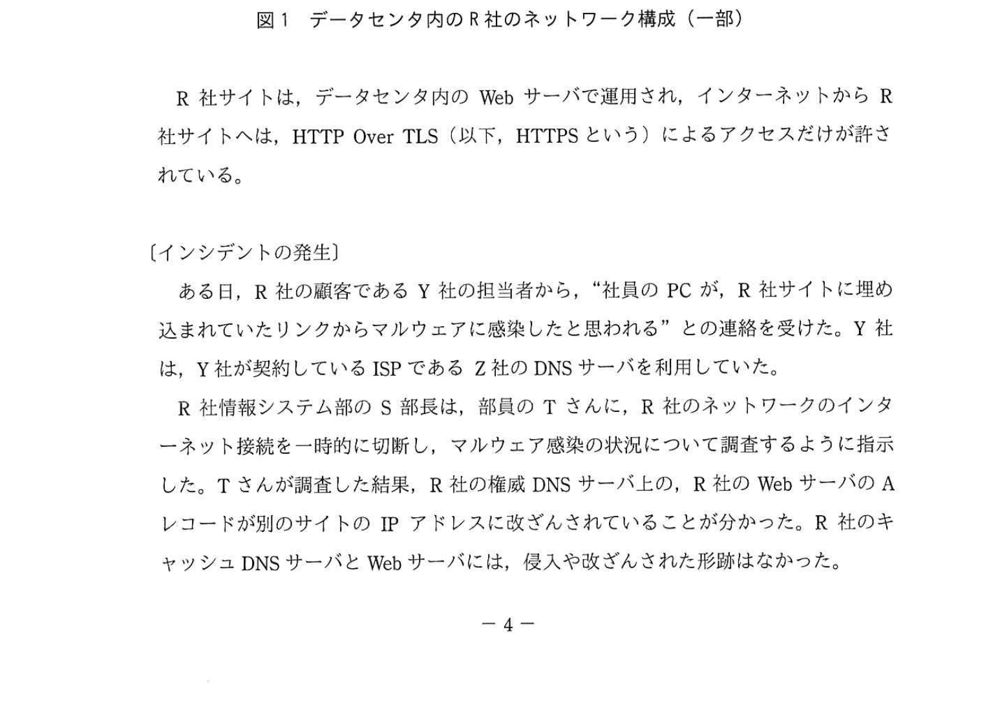
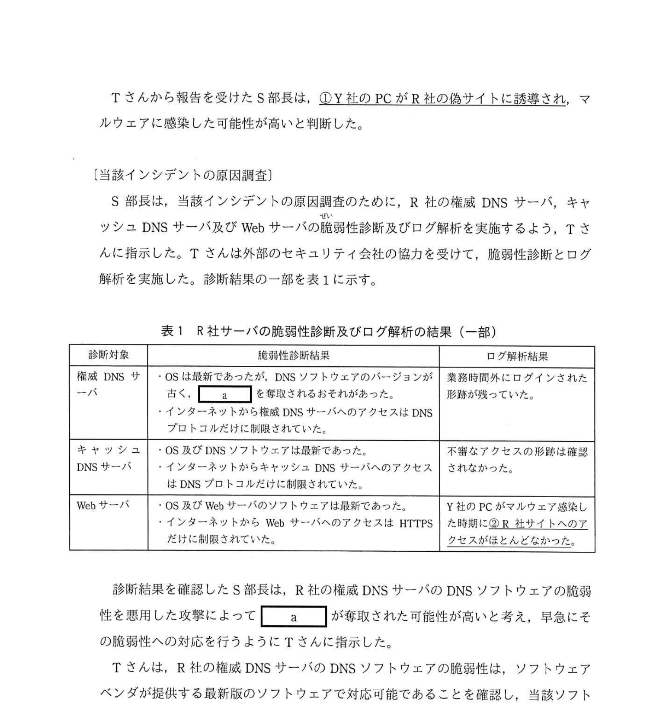

# 2021年春期（令和3年度春期）応用情報技術者試験 午後 問1（必須）
## 情報セキュリティ：DNSのセキュリティ対策（DNSキャッシュポイズニング・DNSSECほか）

---

## 問題文

**問1** DNSのセキュリティ対策に関する次の記述を読んで、設問1〜3に答えよ。

R社は、Webサイト向けソフトウェアの開発を主業務とする、従業員約50名の企業である。R社の会社概要や事業内容などをR社のWebサイト（以下、R社サイトという）に掲示している。

R社内からインターネットへのアクセスは、R社が使用するデータセンタを経由して行われている。データセンタのDMZには、R社のWebサーバ、権威DNSサーバ、キャッシュDNSサーバなどが設置されている。DMZは、ファイアウォール（以下、FWという）を介して、インターネットとR社社内LANの両方に接続している。データセンタ内のR社のネットワーク構成の一部を図1に示す。

### 図1 データセンタ内のR社のネットワーク構成（一部）

R社サイトは、データセンタ内のWebサーバで運用され、インターネットからR社サイトへは、HTTPS によるアクセスだけが許されている。

---

### 〔インシデントの発生〕

ある日、R社の顧客であるY社の担当者から、"社員のPCが、R社サイトに埋め込まれていたリンクからマルウェアに感染したと思われる"との連絡を受けた。Y社は、Y社が契約しているISPであるZ社のDNSサーバを利用していた。

R社情報システム部のS部長は、部員のTさんに、R社のネットワークのインターネット接続を一時的に切断し、マルウェア感染の状況について調査するように指示した。Tさんが調査した結果、R社の権威DNSサーバ上の、R社のWebサーバのAレコードが別のサイトのIPアドレスに改ざんされていることが分かった。R社のキャッシュDNSサーバとWebサーバには、侵入や改ざんされた形跡はなかった。

---

### 〔当該インシデントの原因調査〕

S部長は、当該インシデントの原因調査のために、R社の権威DNSサーバ、キャッシュDNSサーバ及びWebサーバの脆弱性診断及びログ解析を実施するよう、Tさんに指示した。Tさんは外部のセキュリティ会社の協力を受けて、脆弱性診断とログ解析を実施した。診断結果の一部を表1に示す。

### 表1 R社サーバの脆弱性診断及びログ解析の結果（一部）

> | 診断対象 | 脆弱性診断結果 | ログ解析結果 |
> |---------|--------------|------------|
> | 権威DNSサーバ | OSは最新であったが、DNSソフトウェアのバージョンが古く、`[　a　]` を取得されるおそれがあった。インターネットから権威DNSサーバへのアクセスはDNSプロトコルだけに制限されていた | 業務時間外にログインされた形跡が残っていた |
> | キャッシュDNSサーバ | OS及びDNSソフトウェアは最新であった。インターネットからキャッシュDNSサーバへのアクセスはDNSプロトコルだけに制限されていた | 不審なアクセスの形跡は確認されなかった |
> | Webサーバ | OS及びWebサーバのソフトウェアは最新であった。インターネットからWebサーバへのアクセスはHTTPSだけに制限されていた | Y社のPCがマルウェア感染した時期に②**R社サイトへのアクセスがほとんどなかった** |

診断結果を確認したS部長は、R社の権威DNSサーバのDNSソフトウェアの脆弱性を悪用した攻撃によって `[　a　]` が取得された可能性が高いと考え、早急にその脆弱性への対応を行うようにTさんに指示した。

Tさんは、R社の権威DNSサーバのDNSソフトウェアの脆弱性は、ソフトウェアベンダが提供する最新版のソフトウェアで対応可能であることを確認し、当該ソフトウェアをアップデートしたことをS部長に報告した。S部長はTさんに、R社の権威DNSサーバ上のR社のWebサーバのAレコードを正しいIPアドレスに戻し、R社のネットワークのインターネット接続を再開させた。Y社のPCからR社サイトに正しくアクセスできるようになるまで、③**しばらく時間が掛かった**。R社は、Y社に謝罪するとともに、当該インシデントに関連する経緯などをとりまとめて、R社サイトなどを通じて、顧客を含む関係者に周知した。

---

### 〔セキュリティ対策の検討〕

S部長は、R社の権威DNSサーバに対する当該インシデントの再発防止に関して、ドメインの所有者であることを証明できるEV（Domain Validation）認証の仕組みを利用することにした。さらに、EV（Extended Validation）認証を取得することにした。これにより、Webブラウザでも、R社のWebサイトがインターネット経由でHTTPSでアクセスできると、 `[　b　]` を確認できる。

S部長は、この脅威については対応済みとして報告した。

---

## 設問

### 設問1 本文中の下線①で、Y社のPCがR社の偽サイトに誘導された際に、Y社のPCに偽のIPアドレスを返した可能性のあるDNSサーバを、解答群の中から全て選び、記号で答えよ。

**解答群：**
- ア DNSルートサーバ
- イ R社のキャッシュDNSサーバ
- ウ R社の権威DNSサーバ
- エ Z社のDNSサーバ

### 設問2 〔当該インシデントの原因調査〕について、(1)〜(3)に答えよ。

**(1)** 表1及び本文中の `[　a　]` に入れる適切な字句を、解答群の中から選び、記号で答えよ。

**解答群：**
- ア 管理者権限
- イ シリアル番号
- ウ ディジタル証明書
- エ 利用者パスワード

**(2)** 表1中の下線②で、R社サイトへのアクセスがほとんどなかった理由を20字以内で述べよ。

**(3)** 本文中の下線③で、Y社のPCが正しいR社サイトにアクセスできるようになるまで、しばらく時間が掛かった理由は、どのDNSサーバにキャッシュが残っていたからか、解答群の中から選び、記号で答えよ。

**解答群：**
- ア DNSルートサーバ
- イ R社のキャッシュDNSサーバ
- ウ R社の権威DNSサーバ
- エ Z社のDNSサーバ

### 設問3 〔セキュリティ対策の検討〕について、(1)〜(4)に答えよ。

**(1)** 本文中の下線④で、同様なインシデントの再発防止に有効な対策として、R社の権威DNSサーバに実施すべきものを、解答群の中から選び、記号で答えよ。

**解答群：**
- ア 逆引きDNSレコードを設定する。
- イ シリアル番号の桁数を増やす。
- ウ ゾーン転送を禁止する。
- エ 定期的に脆弱性検査と対策を実施する。

**(2)** 本文中の `[　b　]` に入れる適切な字句を、解答群の中から選び、記号で答えよ。

**解答群：**
- ア 会社名
- イ 担当者の電子メールアドレス
- ウ 担当者の電話番号
- エ ディジタル証明書の所有者

**(3)** 本文中の下線⑤で、R社のキャッシュDNSサーバがインターネットから問合せ可能な状態であることによって発生する可能性のあるサイバー攻撃を、解答群の中から選び、記号で答えよ。

**解答群：**
- ア DDoS攻撃
- イ SQLインジェクション攻撃
- ウ パスワードリスト攻撃
- エ 水飲み場攻撃

**(4)** 本文中の `[　c　]` に入れるサイバー攻撃手法の名称を、15字以内で答えよ。

---

## 解答と解説

### 設問1 正解：ウ、エ

Y社のPCが偽のIPアドレスを受け取るには、Y社のPCが名前解決を問い合わせるDNSサーバが偽のIPアドレスを返す必要がある。

- **ウ（R社の権威DNSサーバ）**：AレコードがIPアドレスに改ざんされており、直接偽アドレスを応答する可能性がある
- **エ（Z社のDNSサーバ）**：Y社はZ社のDNSを利用。Z社のキャッシュDNSにR社権威DNSの改ざんされた回答がキャッシュされていれば偽アドレスを返す

**IPA公式：ウ、エ**

---

### 設問2

**(1) 正解：ア（管理者権限）**

権威DNSサーバのDNSソフトウェアの古いバージョンの脆弱性を悪用すると「**管理者権限**」が取得される可能性があり、そのためにAレコードが改ざんされた。

**IPA公式：a=ア（管理者権限）**

**(2) 正解：偽サイトのIPアドレスに誘導されていたから（23字）**

Webサーバのログにはほとんどアクセスがなかった。これは、AレコードがすでにY社からも偽サイトのIPアドレスに改ざんされて誘導されていたため、本物のWebサーバにはアクセスが届かなかったから。

**(3) 正解：エ（Z社のDNSサーバ）**

AレコードのTTL（Time To Live）が残っている間、Z社のキャッシュDNSサーバには偽のIPアドレスがキャッシュされている。正しいIPアドレスに戻しても、このキャッシュが消えるまで（TTL経過まで）Y社のPCから正しくアクセスできない。

**IPA公式：エ（Z社のDNSサーバ）**

---

### 設問3

**(1) 正解：エ（定期的に脆弱性検査と対策を実施する）**

同様のインシデント再発防止に最も効果的な対策。DNSソフトウェアのバージョンを最新に保ち、定期的な脆弱性検査を実施することで権限取得リスクを低減する。

**IPA公式：エ**

**(2) 正解：ア（会社名）**

EV（Extended Validation）証明書を取得すると、Webブラウザのアドレスバーに**会社名**が表示される（EV証明書の特徴）。DV証明書では会社名は確認できない。

**IPA公式：b=ア（会社名）**

**(3) 正解：ア（DDoS攻撃）**

キャッシュDNSサーバがインターネットから問合せ可能（オープンリゾルバ状態）の場合、攻撃者がDNSアンプ攻撃（DNSリフレクション攻撃）に悪用し、**DDoS攻撃**の踏み台にされる可能性がある。

**IPA公式：ア（DDoS攻撃）**

**(4) 正解：DNSキャッシュポイズニング（13字）**

キャッシュDNSサーバに偽の情報を注入し、利用者を偽サイトに誘導する攻撃手法。DNS応答パケットを偽造してキャッシュを汚染（ポイズン）する。

**IPA公式：DNSキャッシュポイズニング**

---

## 参考：主要キーワード

| 用語 | 説明 |
|------|------|
| 権威DNSサーバ | ドメインのDNSレコードを正式に管理するサーバ |
| キャッシュDNSサーバ（リゾルバ） | 問合せを受け応答をキャッシュするDNSサーバ。フルサービスリゾルバとも呼ぶ |
| Aレコード | ドメイン名をIPv4アドレスに対応付けるDNSリソースレコード |
| TTL（Time To Live） | DNSキャッシュの有効期間。期間内はキャッシュされた情報を使用する |
| DNSキャッシュポイズニング | 偽のDNS応答をキャッシュさせ利用者を偽サイトへ誘導する攻撃 |
| EV証明書（Extended Validation） | 会社実在確認が厳格なSSL証明書。ブラウザに会社名が表示される |
| DV証明書（Domain Validation） | ドメイン所有者確認のみのSSL証明書。会社名は検証されない |
| オープンリゾルバ | インターネット上の誰からでも問合せ可能なキャッシュDNSサーバ。DDoS踏み台になるリスクがある |
| DDoS攻撃 | 複数の踏み台から大量パケットを送りサービスを停止させる攻撃 |
| DNSアンプ攻撃 | オープンリゾルバを踏み台にDNS応答を増幅してDDoS攻撃を行う手法 |
