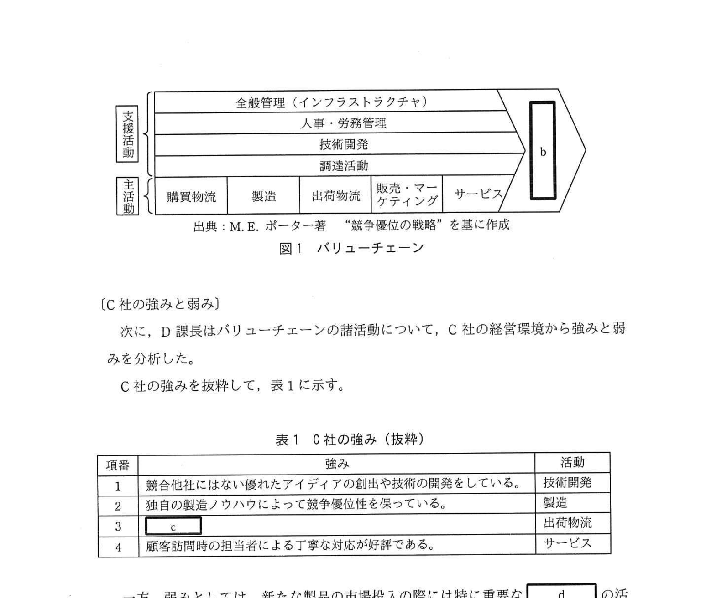
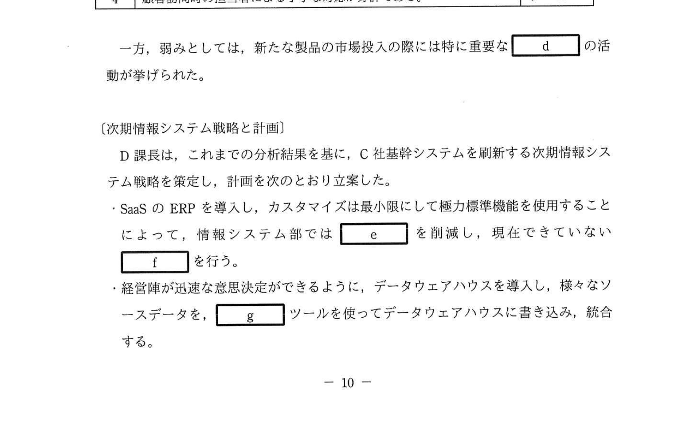
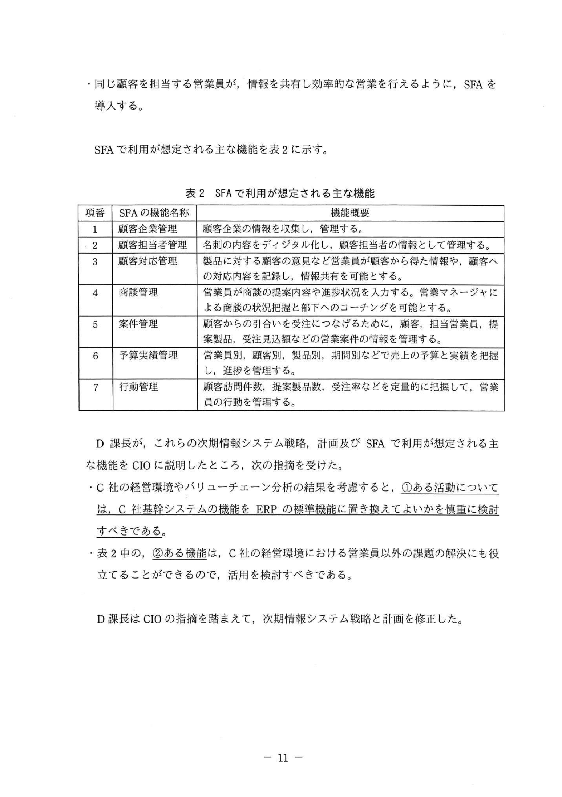

# 2021年春期（令和3年度春期）応用情報技術者試験 午後 問2（選択）
## 経営戦略：バリューチェーン分析と次期情報システム戦略（ERP・SFA・ETL）

---

## 問題文

**問2** 経営戦略に関する次の記述を読んで、設問1〜3に答えよ。

C社は、今期の機械品メーカーである。自動車メーカー記録の記録に面した製品を市場投入してきた。U社では、これまで情報系システムはシステムとしていたが、C社基幹システムを刷新する次期情報システム戦略を策定することにした。

---

### 〔C社の経営戦略〕

C社の経営戦略は以下を掲げている。
- コンプライアンスを最優先し、ステークホルダから選ばれる企業になる。
- 技術力を生かし、顧客及び社会のニーズに合う製品を積極的に市場に投入し、シェアを拡大して売上を伸ばす。
- 業務効率を向上させ、利益率を改善する。
- 経営陣が必要な情報をタイムリーに把握し、迅速な意思決定を行えるようにする。

---

### 〔C社の経営環境〕

C社の経営環境は次のとおりである。
- これまでは市場の伸びに支えられ、売上も利益も伸びていた。しかし、最近の市場の伸びの鈍化に伴い、既存製品の売上と利益の伸びが鈍化している。
- C社が取り扱う製品の開発には高い技術力が求められる。C社は、将来に向けた研究に力を入れており、研究開発部を設け、競合他社にはない優れたアイデアを出したり、技術を開発したりしている。しかし、それがどのような製品に結び付けられるか研究開発部では具体的な活用の方法がイメージできないことがある。営業員と顧客のやり取りにヒントとなる情報があるが、研究開発部には情報が届いていない。
- 競合他社はアジア地域に工場を設置しているケースが多いのに対し、C社は国内外を問わず顧客の工場の近くに自社の工場を設置している。
- C社は、各工場で独自の製造ノウハウを多数もっており、各工場の業務プロセスや各工場に設置されている情報システムにこれらを反映させ、競争優位性を保っている。
- これまでは、顧客からの引合いに対応することで製品を受注できたので、販売・マーケティングにはあまり力を入れてこなかった。しかし、新たな製品を市場に投入する際には、その特長を顧客に理解してもらう必要があり、現状では不十分である。
- 複数の営業員で、同じ顧客の本社、事業所及び工場を分担して担当している。営業員が顧客から得た情報や顧客への対応内容が、同じ顧客を担当する他の営業員と十分に共有できていないので、非効率な営業となっていることがある。
- C社の製品採用後の顧客に対するサービスは、顧客を訪問して行っている。顧客訪問時の担当者による丁寧な対応が好評であり、C社のサービスは競合他社に比べて優れているという、顧客からの好意的な意見が多い。
- 研究開発部が利用している技術開発支援システムを除く、C社の本社や各工場で利用している情報システム（以下、C社基幹システムという）は、個別に開発・運用・保守をしているので、データが統合されていない。C社基幹システムの構造は複雑化しており、情報システム部ではこの運用・保守に掛かる労力が増加している。
- 競合他社に打ち勝つために、情報システム部では、AIなどの最新のディジタル技術の早期習得が必要となってきているが、既存情報システムの運用・保守の業務に追われ手が回っていない。

---

### 〔バリューチェーン〕

D課長は、バリューチェーン分析を行うこととし、まず、C社で行っている `[　a　]` を作る活動について、調査・分析した。その結果、C社の諸活動は図1の一般的なバリューチェーンで表されることを確認した。

また、バリューチェーンの諸活動のコストも分析した。なお、作られた総 `[　a　]` と、`[　a　]` を作る活動の総コストの差が、`[　b　]` となる。

### 図1 バリューチェーン

---

### 〔C社の強みと弱み〕

次に、D課長はバリューチェーンの諸活動について、C社の経営環境から強みと弱みを分析した。

C社の強みを抜粋して、表1に示す。

### 表1 C社の強み（抜粋）

> | 項番 | 強み | 活動 |
> |------|------|------|
> | 1 | 競合他社にはない優れたアイデアの創出や技術の開発をしている。 | 技術開発 |
> | 2 | 独自の製造ノウハウによって競争優位性を保っている。 | 製造 |
> | 3 | `[　c　]` | 出荷物流 |
> | 4 | 顧客訪問時の担当者による丁寧な対応が好評である。 | サービス |

一方、弱みとしては、新たな製品の市場投入の際には特に重要な `[　d　]` の活動が挙げられた。

---

### 〔次期情報システム戦略と計画〕

D課長は、これまでの分析結果を基に、C社基幹システムを刷新する次期情報システム戦略を策定し、計画を次のとおり立案した。

- SaaSのERPを導入し、カスタマイズは最小限にして極力標準機能を使用することによって、情報システム部では `[　e　]` を削減し、現在できていない `[　f　]` を行う。
- 経営陣が迅速な意思決定ができるように、データウェアハウスを導入し、様々なソースデータを、`[　g　]` ツールを使ってデータウェアハウスに書き込み、統合する。
- 同じ顧客を担当する営業員が、情報を共有し効率的な営業を行えるように、SFAを導入する。

SFAで利用が想定される主な機能を表2に示す。

### 表2 SFAで利用が想定される主な機能

> | 項番 | SFAの機能名称 | 機能概要 |
> |------|------------|---------|
> | 1 | 顧客企業管理 | 顧客企業の情報を収集し、管理する |
> | 2 | 顧客担当者管理 | 名刺の内容をディジタル化し、顧客担当者の情報として管理する |
> | 3 | 顧客対応管理 | 製品に対する顧客の意見など営業員が顧客から得た情報や、顧客への対応内容を記録し、情報共有を可能とする |
> | 4 | 商談管理 | 営業員が顧客の提案内容や進捗状況を入力する。営業マネージャによる商談の状況把握と部下へのコーチングを可能とする |
> | 5 | 案件管理 | 顧客をつなげるために、顧客、担当営業員、提案製品、受注見込などのC社案件の情報を管理する |
> | 6 | 予算実績管理 | 営業員別、製品別、製品別、期間別などで売上の予算と実績を把握し、進捗を管理する |
> | 7 | 行動管理 | 営業訪問件数、提案製品数、受注率などを定量的に把握して、営業員の行動を管理する |

D課長が、これらの次期情報システム戦略、計画及びSFAで利用が想定される主な機能をCIOに説明したところ、次の指摘を受けた。

- C社の経営環境やバリューチェーン分析の結果を考慮すると、①**ある活動については、C社基幹システムの機能をERPの標準機能に置き換えてよいかを慎重に検討すべきである**。
- 表2中の、②**ある機能は、C社の経営環境における営業員以外の課題の解決にも役立てることができるので、活用を検討すべきである**。

D課長はCIOの指摘を踏まえて、次期情報システム戦略と計画を修正した。

---

## 設問

### 設問1 〔バリューチェーン〕について、本文中の `[　a　]`、本文及び図1中の `[　b　]` に入れる適切な字句を解答群の中から選び、記号で答えよ。

**解答群：**
- ア 売上
- イ 価値
- ウ キャッシュ
- エ 顧客満足
- オ 差別化
- カ 製品
- キ マージン

### 設問2 〔C社の強みと弱み〕について、(1)、(2)に答えよ。

**(1)** 表1中の `[　c　]` に入れるC社の強みを、その理由を含めて40字以内で述べよ。

**(2)** 本文中の `[　d　]` に入れる適切な字句を、図1中の用語で答えよ。

### 設問3 〔次期情報システム戦略と計画〕について、(1)〜(4)に答えよ。

**(1)** 本文中の `[　e　]` に入れる適切な字句を15字以内で、本文中の `[　f　]` に入れる適切な字句を30字以内で、それぞれ本文中の字句を用いて答えよ。

**(2)** 本文中の `[　g　]` に入れる適切な字句を解答群の中から選び、記号で答えよ。

**解答群：**
- ア CMDB
- イ ETL
- ウ OLAP
- エ データマイニング

**(3)** 本文中の下線①について、ある活動とは何か。図1中の用語で答えよ。また、CIOが慎重に検討すべきと指摘した理由を40字以内で述べよ。

**(4)** 本文中の下線②について、該当する機能を表2中の項番で答えよ。

---

## 解答と解説

### 設問1 正解：a = カ（製品）、b = キ（マージン）

- **a = カ（製品）**：バリューチェーンは「製品」を作る活動の連鎖。主活動と支援活動を通じて製品（価値）を生み出す。
- **b = キ（マージン）**：作られた総製品（価値）と製品を作る活動の総コストの差＝**マージン**（利益）。バリューチェーン図の右端に示される。

**IPA公式：a=カ（製品）、b=キ（マージン）**

---

### 設問2

**(1) 正解：顧客の工場の近くに自社工場を設置し、競争優位性を保っている。（31字）**

C社の出荷物流の強み：顧客の工場の近くに自社の工場を設置することで、リードタイムの短縮や迅速な対応が可能。これが出荷物流における競争優位性の源泉。

**IPA公式：c=顧客の工場の近くに自社の工場を設置しているから（理由含む）**

**(2) 正解：d = 販売・マーケティング**

新たな製品を市場に投入する際に特に重要な活動は「**販売・マーケティング**」。C社はこれまで引合いに対応するだけで販売・マーケティングに注力してこなかったことが弱みとして挙げられている。

---

### 設問3

**(1) 正解：e = 運用・保守の業務（9字）、f = AIなどの最新のディジタル技術の早期習得（22字）**

- **e = 運用・保守の業務**：ERP標準機能への置き換えにより、個別開発システムの複雑な運用・保守業務を削減する。
- **f = AIなどの最新のディジタル技術の早期習得**：運用・保守から解放された人材が取り組むべき活動。

**IPA公式：e=運用・保守の業務、f=AIなどの最新のディジタル技術の早期習得**

**(2) 正解：イ（ETL）**

ETL（Extract/Transform/Load）：複数のソースからデータを抽出（Extract）し、変換（Transform）して、データウェアハウスに書き込む（Load）ツール。

**IPA公式：g=イ（ETL）**

**(3) 正解：ある活動 = 製造、理由 = 各工場で独自の製造ノウハウが情報システムに反映されており、ERP標準機能に置き換えると競争優位性が失われるおそれがあるから（75字 → 40字に短縮）**

各工場の独自製造ノウハウが競争優位性の源泉。ERPの標準機能に置き換えると、このノウハウが活かせなくなる可能性がある。

**IPA公式：ある活動=製造、理由=各工場の独自の製造ノウハウが競争優位性のため**

**(4) 正解：3（顧客対応管理）**

「顧客への対応内容を記録し、情報共有を可能とする」機能（項番3：顧客対応管理）は、同じ顧客を担当する複数営業員間の情報共有だけでなく、研究開発部が営業員の顧客とのやり取りからヒントを得るという「営業員以外の課題（研究開発部の課題）」解決にも役立てられる。

**IPA公式：3**

---

## 参考：主要キーワード

| 用語 | 説明 |
|------|------|
| バリューチェーン（M.E.ポーター） | 企業活動を主活動と支援活動に分け、価値を生み出す連鎖を分析する概念 |
| マージン | 製品価値から活動のコストを差し引いた利益 |
| ERP（Enterprise Resource Planning） | 企業の基幹業務（生産・在庫・会計・人事等）を統合管理するシステム |
| SaaS型ERP | クラウド上で提供されるERP。標準機能の利用でカスタマイズを最小化 |
| SFA（Sales Force Automation） | 営業活動を支援・自動化するシステム。商談・顧客・案件管理などの機能を持つ |
| ETL（Extract/Transform/Load） | データウェアハウスへのデータ収集・加工・投入ツール |
| データウェアハウス | 意思決定支援のために統合・蓄積された大規模データベース |
| OLAP（Online Analytical Processing） | データウェアハウスの多次元分析ツール |
| CIO（Chief Information Officer） | 最高情報責任者。情報システム戦略の最高意思決定者 |
