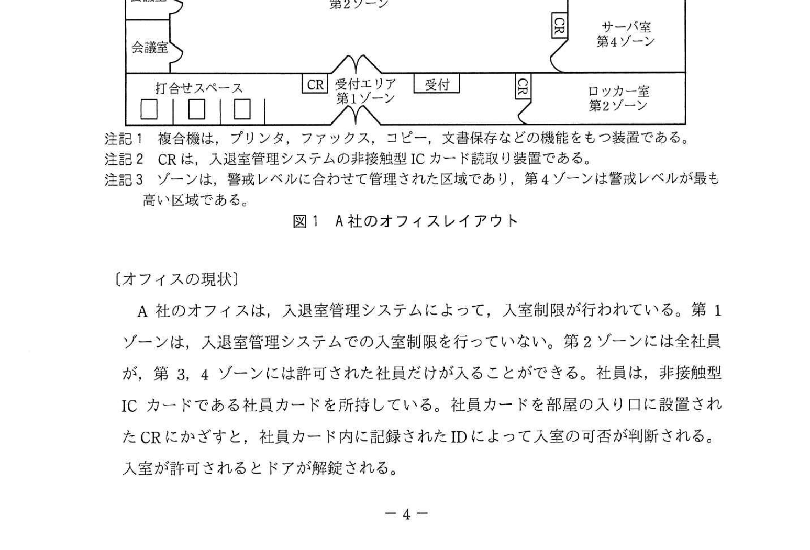
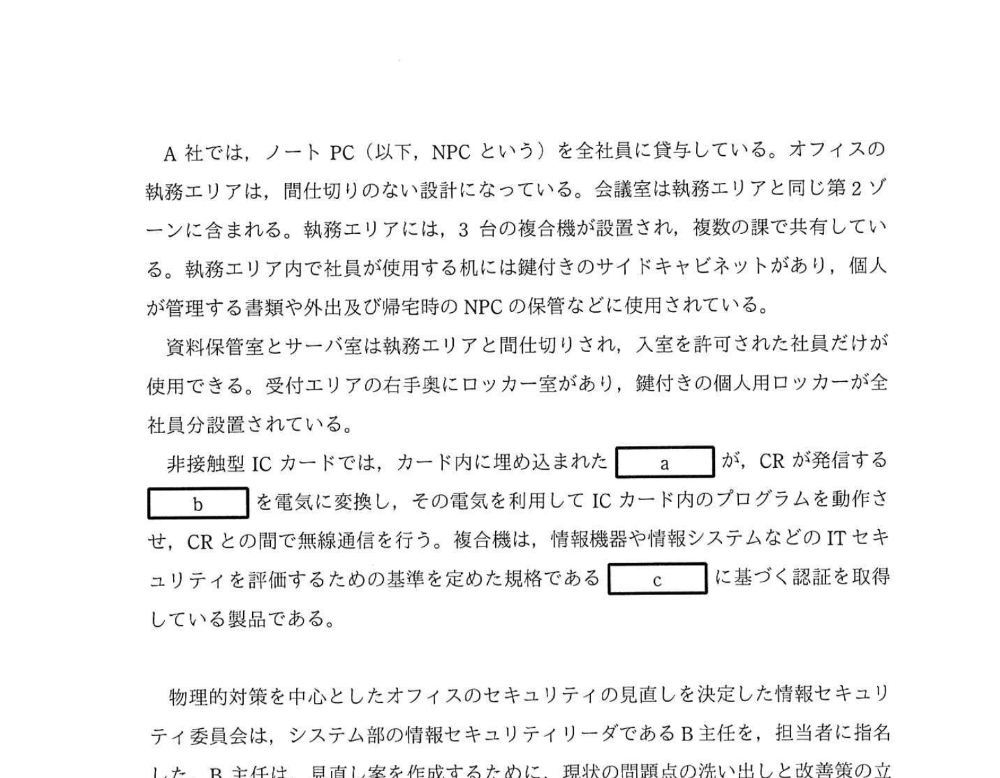

# 2021年秋期（令和3年度秋期）応用情報技術者試験 午後 問1（必須）
## 情報セキュリティ：オフィスのセキュリティ対策（入退室管理・アンチパスバック・物理的対策）

---

## 問題文

**問1** オフィスのセキュリティ対策に関する次の記述を読んで、設問1〜3に答えよ。

A社は、日用雑貨の通信販売会社である。A社では、会員にカタログ冊子を送付し、冊子にとじ込まれた注文書又はインターネットでの注文を受け付けている。

A社では、情報セキュリティ担当役員を委員長とする情報セキュリティ委員会を設置しており、情報セキュリティの適正な管理を目的として、情報セキュリティ管理規程を制定している。

A社の通信販売事業は順調に拡大し、大量の個人情報を管理するようになったことから、情報セキュリティ委員会は今回、物理的対策を中心にオフィスのセキュリティを見直すことにした。A社のオフィスレイアウトを図1に示す。

### 図1 A社のオフィスレイアウト

> オフィスは4つのゾーンに分かれており:
> - 第1ゾーン：受付エリア（来訪者が立ち入れる）
> - 第2ゾーン：執務エリア・会議室（全社員が入室可能）
> - 第3,4ゾーン：資料保管室・サーバ室（許可された社員のみ）
>
> 注記1 複合機は、プリンタ、ファックス、コピー、文書保存などの機能をもつ装置である。
> 注記2 CRは、入退室管理システムの非接触型ICカード読取り装置である。
> 注記3 ゾーンは、警戒レベルに合わせて管理された区域であり、第4ゾーンは警戒レベルが最も高い区域である。

---

### 〔オフィスの現状〕

A社のオフィスは、入退室管理システムによって、入室制限が行われている。第1ゾーンは、入退室管理システムでの入室制限を行っていない。第2ゾーンには全社員が、第3、4ゾーンには許可された社員だけが入ることができる。社員は、非接触型ICカードである社員カードを所持している。社員カードを部屋の入り口に設置されたCRにかざすと、社員カード内に記録されたIDによって入室の可否が判断される。入室が許可されるとドアが解錠される。

A社では、ノートPC（以下、NPCという）を全社員に貸与している。オフィスの執務エリアは、間仕切りのない設計になっている。会議室は執務エリアと同じ第2ゾーンに含まれる。執務エリアには、3台の複合機が設置され、複数の課で共有している。執務エリア内で社員が使用する机には鍵付きのサイドキャビネットがあり、個人が管理する書類や外出及び帰宅時のNPCの保管などに使用されている。

資料保管室とサーバ室は執務エリアと間仕切りされ、入室を許可された社員だけが使用できる。受付エリアの右手奥にロッカー室があり、鍵付きの個人用ロッカーが全社員分設置されている。

非接触型ICカードでは、カード内に埋め込まれた `[　a　]` が、CRが発信する `[　b　]` を電気に変換し、その電気を利用してICカード内のプログラムを動作させ、CRとの間で無線通信を行う。複合機は、情報機器や情報システムなどのITセキュリティを評価するための基準を定めた規格である `[　c　]` に基づく認証を取得している製品である。

---

### 〔現状の問題点〕

C社のコンサルタントであるD氏は、オフィスの現状を調査して、四つの項目に関する六つの問題点をB主任に報告した。D氏が指摘した問題点を表1に示す。

### 表1 D氏が指摘した問題点

> | 項番 | 項目 | 問題点 |
> |-----|------|-------|
> | 1 | 入退室管理について | 共連れでの入室が散見される。 |
> | 2 | 入退室管理について | 来訪者の執務エリアなどでの単独行動が散見される。 |
> | 3 | 複合機の運用について | 個人データが印刷された書類が複合機に放置されていることがある。 |
> | 4 | 執務エリア内への私物の持込みについて | 多くの社員が、私物を入れた鞄を執務エリア内に持ち込んでいる。 |
> | 5 | 紙文書やNPCの管理について | 書類や印刷物などを机の上に放置したまま離席が散見される。 |
> | 6 | 紙文書やNPCの管理について | NPCにログイン後、操作が可能な状態での離席が散見される。 |

---

### 〔問題点についての打合せ〕

D氏から指摘された問題点について、B主任がD氏と打合せを行ったときの二人の会話を次に示す。

B主任：項番1、2についてはどのような対策が有効でしょうか。

D氏：低コストで実現できる項番1の対策としては、CRを入り口側と同様に出口側にも設置して、アンチパスバックを導入することが有効です。アンチパスバックでは、"入室状態になっていない人が退室しようとした場合は解錠しない"、という処理が行われます。①そのほかにも、アンチパスバックでは、通行を許可された社員カードをCRにかざしても、利用状況によっては異常と判断して解錠しない場合があります。項番2の対策としては、来訪者を入室させる場合は、入室から退室まで担当者が付き添うようにします。しかし、サーバの保守作業など担当者が付き添えない場合もありますから、サーバコンソールでの操作内容のログ取得などの技術的対策のほかに、②第4ゾーンでは、来訪者の行動を事後に確認できるようにします。

B主任：分かりました。アンチパスバックと来訪者の行動を事後に確認できる設備の導入を検討します。また、来訪者を入室させる場合の対応方法については、情報セキュリティ管理規程に明記するようにします。項番3については、印刷物の放置を禁止していますが徹底できていません。何か良い方策はないでしょうか。

D氏：御社の複合機本体には、社員カードが使用できるICカードリーダを装備できますから、ICカードリーダを装備して、オンデマンド印刷機能を利用することを推奨します。③オンデマンド印刷機能を利用すると、NPCから印刷指示した文書の用紙への印刷は、社員カードを複合機のICカードリーダにかざして認証を受けた後に行われることになります。

B主任：運用方法を検討してみます。項番4については、社員の反対が多く、私物の持込みは禁止できていません。社員に受け入れられる方策はないでしょうか。

D氏：私物の鞄の持込みは禁止し、代わりに `[　d　]` 鞄を貸与して、その中に入れた私物については、持込みを許可するのが良いでしょう。その場合、持込みを禁止する私物の種類や持ち込んだ私物のオフィス内での使用上の禁止事項を、情報セキュリティ管理規程に明記してください。

B主任：なるほど、その方策なら当社でも実施可能ですから、改善策として検討します。項番5、6については、実施すべき内容を情報セキュリティ管理規程に明記して徹底させるようにします。

D氏：それで良いと思います。

B主任は打合せ結果を基に、オフィスの物理的対策を中心とした見直し案をまとめて、情報セキュリティ委員会に報告した。見直し案が承認され、情報セキュリティ管理規程の改定と対策案が実施されることになった。

---

## 設問

### 設問1

本文中の `[　a　]` 〜 `[　c　]` に入れる適切な字句を解答群の中から選び、記号で答えよ。

**解答群：**
- ア CC（Common Criteria）
- イ ISMS
- ウ JIS Q 15001
- エ UHFアンテナ
- オ Wi-Fi電波
- カ アンテナコイル
- キ 赤外線
- ク 電磁波
- ケ ヘリカルアンテナ

### 設問2

表1中の項番5の問題点への対策はクリアデスクと呼ばれるが、項番6の問題点への対策は何と呼ばれているか。10字以内で答えよ。

### 設問3

〔問題点についての打合せ〕について、(1)〜(4)に答えよ。

**(1)** 本文中の下線①について、どのような場合に解錠しないかを、30字以内で答えよ。

**(2)** 本文中の下線②について、具体的な対策内容を25字以内で述べよ。

**(3)** 本文中の下線③の機能が、表1中の項番3の問題を低減させる対策となる理由を30字以内で述べよ。

**(4)** 本文中の `[　d　]` に入れる適切な字句を10字以内で答えよ。また、その `[　d　]` の貸与によって、禁止された私物の持込みのほかに、低減できる可能性のある不正行為を15字以内で答えよ。

---

## 解答と解説

### 設問1

**正解：a=カ（アンテナコイル）、b=ク（電磁波）、c=ア（CC）**

- **a=カ（アンテナコイル）**：非接触型ICカードには、CRが発信する電磁波を受信してエネルギーに変換するアンテナコイルが埋め込まれている。
- **b=ク（電磁波）**：CRが発信して、ICカードのアンテナコイルが受信・変換するのは電磁波。
- **c=ア（CC / Common Criteria）**：情報機器のITセキュリティを評価する国際的な基準規格。正式名称は「情報技術セキュリティ評価のための共通基準」（ISO/IEC 15408）。

**IPA公式：a=カ（アンテナコイル）、b=ク（電磁波）、c=ア（CC）**

---

### 設問2

**正解：クリアスクリーン（6字）**

- 項番5（書類・PCを放置したまま離席）への対策 → **クリアデスク**（机上に書類・貴重品を残さない）
- 項番6（NPCにログインしたまま離席）への対策 → **クリアスクリーン**（席を離れる際にスクリーンロックやログオフを行う）

---

### 設問3

**(1) 正解：入室状態となっている人が再度入室しようとした場合（23字）**

アンチパスバックでは、入退室の記録の整合性をチェックする。既に入室状態となっている（＝入室記録があり退室記録がない）人が、同じカードで再度入室しようとした場合、利用状況が異常と判断され、通行を許可された社員カードであっても解錠しない。

**IPA公式：入室状態となっている人が再度入室しようとした場合**

**(2) 正解：監視カメラを設置して来訪者の行動を記録する。（22字）**

来訪者の行動を事後に確認できるようにするための具体的対策 → 第4ゾーンに**監視カメラ（CCTV）を設置し、来訪者の行動を録画・記録**する。

**IPA公式：監視カメラを設置して来訪者の行動を記録する。**

**(3) 正解：複合機の側に行かないと用紙への印刷ができないから（24字）**

オンデマンド印刷では、社員が複合機のICカードリーダに社員カードをかざして認証を受けるまで用紙への印刷が実行されない。社員が複合機の側に来てから印刷されるので、個人データが印刷された書類が複合機に放置されることがなくなる。

**IPA公式：複合機の側に行かないと用紙への印刷ができないから**

**(4) 正解：d=中が透けて見える、不正行為=秘密書類の持出し**

- **d=中が透けて見える**：私物の鞄の持込みを禁止する代わりに、**中が透けて見える鞄**を貸与し、その中に入れた私物の持込みを許可する。
- 追加で低減できる不正行為：**秘密書類の持出し**。中が透けて見える鞄なら中身が外から見えるので、私物の持込み禁止に加えて、秘密書類を鞄に隠して持ち出す不正行為を低減できる。

---

## 参考：主要キーワード

| 用語 | 説明 |
|------|------|
| 入退室管理システム | ICカードや生体認証などを用いて、区域への入退室を記録・制御するシステム |
| アンチパスバック（Anti-passback） | 入退室記録を整合させることで共連れや不正入室を防ぐ機能。入室記録がない状態での退室や再入室を拒否する |
| 共連れ（ tailgating） | 認証した人の後ろについて、認証なしに立入制限区域に入る不正な入室方法 |
| 非接触型ICカード | アンテナコイルで電磁波を受信し、ICチップを動作させる。CRとの無線通信で認証を行う |
| CR（Card Reader） | 入退室管理システムの非接触型ICカード読取り装置 |
| CC（Common Criteria） | 情報機器のITセキュリティを評価するための国際規格（ISO/IEC 15408）。製品の認証取得に使用 |
| クリアデスク | 離席・退社時に机上に書類・貴重品を置かないセキュリティ対策 |
| クリアスクリーン | 離席時にPCのスクリーンをロック・ログオフするセキュリティ対策 |
| オンデマンド印刷 | ユーザーが複合機のそばで認証してから印刷実行する方式。機密情報の放置リスクを低減 |
| JIS Q 15001 | 個人情報保護マネジメントシステムの規格。プライバシーマーク認定の基準 |
| ISMS | 情報セキュリティマネジメントシステム（ISO/IEC 27001）。情報セキュリティ全般を体系的に管理する |
