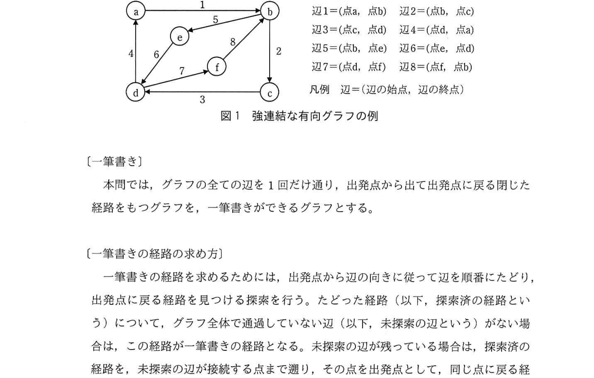
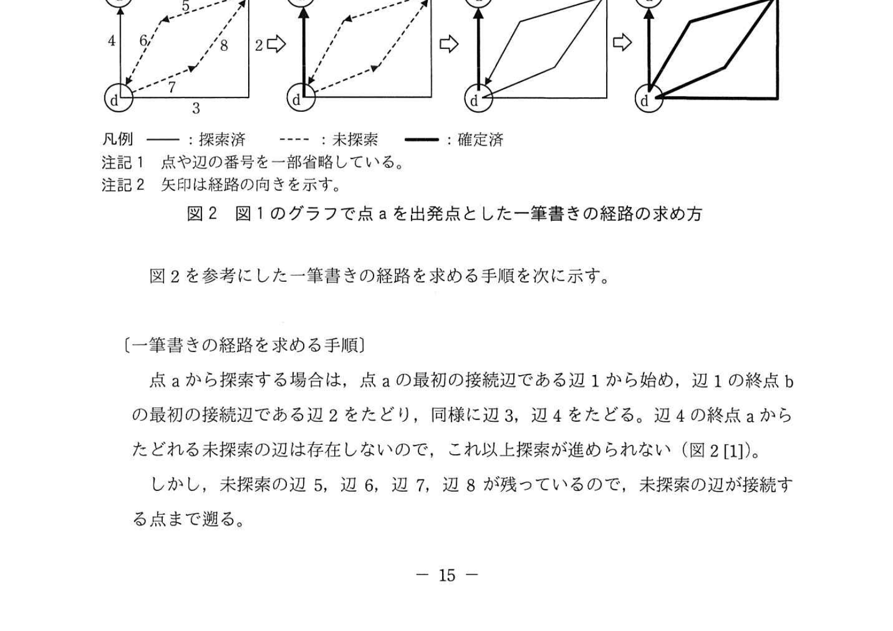
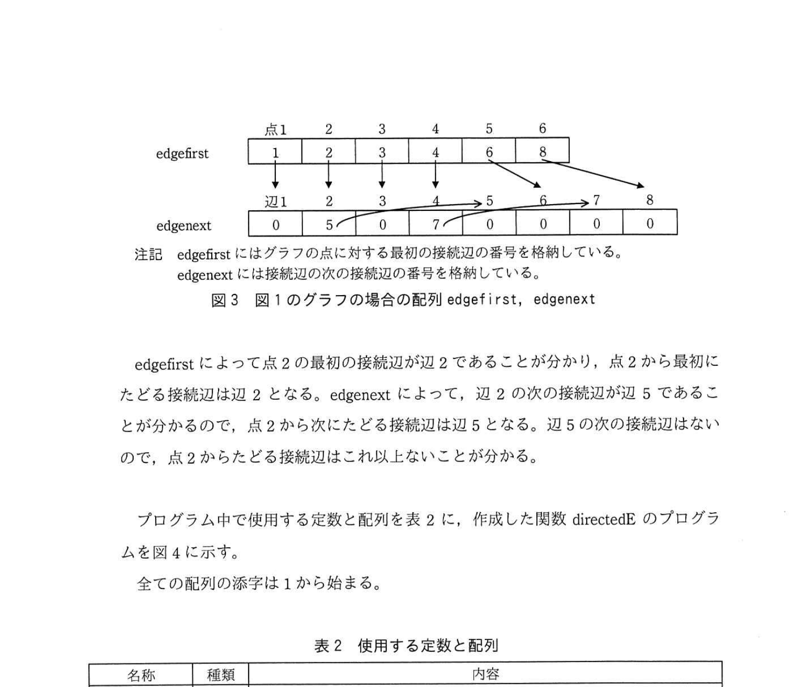
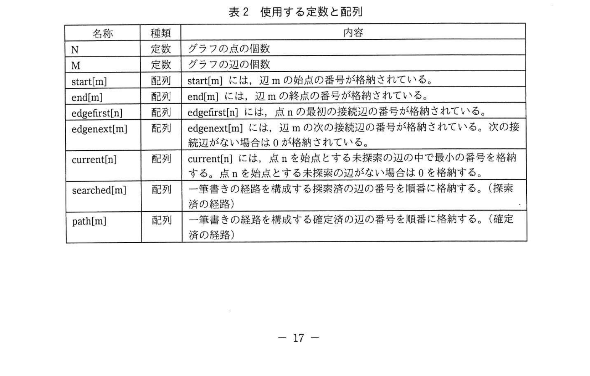
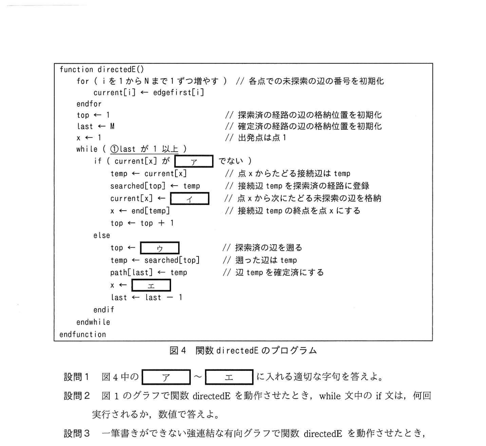

# 2021年秋期（令和3年度秋期）応用情報技術者試験 午後 問3（選択）
## プログラミング：一筆書きアルゴリズム（グラフ・深さ優先探索・オイラー路）

---

## 問題文

**問3** 一筆書きに関する次の記述を読んで、設問1〜4に答えよ。

グラフは、有限個の点の集合と、その中の2点を結ぶ辺の集合から成る数理モデルである。グラフの点と点の間をつなぐ辺の列のことを経路という。本問では、任意の2点間で、辺をたどることで互いに行き来することができる経路が存在する（以下、強連結という）有向グラフを扱う。強連結な有向グラフの例を図1に示す。辺は始点と終点の組で定義される。各辺には1から始まる番号が付けられている。

### 図1 強連結な有向グラフの例



> 辺1=(点a, 点b)　辺2=(点b, 点c)　辺3=(点c, 点d)　辺4=(点d, 点a)
> 辺5=(点b, 点e)　辺6=(点e, 点d)　辺7=(点d, 点f)　辺8=(点f, 点b)
> 凡例 辺=(辺の始点, 辺の終点)

---

### 〔一筆書き〕

本問では、グラフの全ての辺を1回だけ通過し、出発点から出発点に戻る有向グラフをもとのグラフとする。一筆書きができるグラフ（以下、一筆書きができるという）とは、全ての辺をちょうど1回だけ通り、始点と終点が同じ経路（オイラー路）をもつグラフのことをいう。

---

### 〔一筆書きの経路の求め方〕

一筆書きの経路を求めるために、出発点から全ての辺をたどったりする。出発点から辺を次々に未探索の辺をたどっていき（この経路を探索済の経路という）、未探索の辺が接続する点まで到達するまで探索を行う。

一筆書きの経路の探索において、一つの点に複数の接続辺がある場合には、最初の接続辺から順にたどることにする。

図1のグラフで点aを出発点とした一筆書きの経路の求め方を図2に示す。経路を構成する辺とその順番が、これ以上変わらない場合、確定済の経路という。

### 図2 図1のグラフで点aを出発点とした一筆書きの経路の求め方



---

### 〔一筆書きの経路を求める手順〕

点aから探索する場合は、点aの最初の接続辺である辺1から始め、辺1の終点bの最初の接続辺である辺2をたどり、同様に辺3、辺4をたどる。辺4の終点aからたどれる未探索の辺は存在しないので、これ以上探索が進められない（図2[1]）。

しかし、未探索の辺5、辺6、辺7、辺8が残っているので、未探索の辺が接続する点まで遡る。終点aから辺4を遡ると、辺4の始点dで未探索の辺7が接続している。遡った経路は途中で未探索の辺が存在しないので、これ以上辺の順番が変わらず、辺4は、一筆書きの経路の一部として確定済の経路となる（図2[2]）。

点dから同様に辺7→辺8→辺5→辺6と探索できるので、辺3までの経路と連結した新しい経路ができる（図2[3]）。辺6の終点dからは、辺6→辺5→辺8→辺7→辺3→辺2→辺1と出発点の点aまで遡り、これ以上、未探索の辺がないことが分かるので、全ての辺が確定済の経路になる（図2[4]）。

---

一筆書きの経路は、次の(1)〜(4)の手順で求められる。

(1) 一筆書きの経路の出発点を決める。
(2) 出発点から、未探索の辺が存在する限り、その辺をたどり、たどった経路を探索済経路に追加する。
(3) 探索済の経路を未探索の辺が接続する点又は一筆書きの経路の出発点まで遡る。遡った経路は、探索済の経路から確定済の経路にする。未探索の辺が接続する点がある場合は、それを新たな出発点として、(2)に戻って新たな経路を見つける。
(4) 全ての辺が確定済の経路になった時点で探索が完了して、その確定済の経路が一筆書きの経路になる。

---

### 〔一筆書きの経路を求めるプログラム〕

一筆書きの経路を求める関数 directedE のプログラムを作成した。実装に当たって、各点をn（nは1〜N）と記す。例えば、図1のグラフでは、点aは点1、点bは点2と記す。

グラフの探索のために、あらかじめ、グラフの点に対する最初の接続辺の配列 edgefirst 及び接続辺に対する次の接続辺の配列 edgenext を用意しておく。edgenext において、次の接続辺がない場合は、要素に0を格納する。

図1のグラフの場合の配列 edgefirst、edgenext を図3に示す。

### 図3 図1のグラフの場合の配列 edgefirst、edgenext



> | | 点1 | 点2 | 点3 | 点4 | 点5 | 点6 |
> |---|---|---|---|---|---|---|
> | edgefirst | 1 | 2 | 3 | 4 | 6 | 8 |
> | | 辺1 | 辺2 | 辺3 | 辺4 | 辺5 | 辺6 | 辺7 | 辺8 |
> | edgenext | 0 | 5 | 0 | 7 | 0 | 0 | 0 | 0 |
>
> 注記 edgefirst にはグラフの点に対する最初の接続辺の番号を格納している。edgenext には接続辺の次の接続辺の番号を格納している。

edgefirst によって点2の最初の接続辺が辺2であることが分かり、点2から最初にたどる接続辺は辺2となる。edgenext によって、辺2の次の接続辺が辺5であることが分かるので、点2から次にたどる接続辺は辺5となる。辺5の次の接続辺はないので、点2からたどる接続辺はこれ以上ないことが分かる。

プログラム中で使用する定数と配列を表2に、作成した関数 directedE のプログラムを図4に示す。

### 表2 使用する定数と配列



> | 名称 | 種類 | 内容 |
> |-----|------|------|
> | N | 定数 | グラフの点の個数 |
> | M | 定数 | グラフの辺の個数 |
> | start[m] | 配列 | start[m]には、辺mの始点の番号が格納されている。 |
> | end[m] | 配列 | end[m]には、辺mの終点の番号が格納されている。 |
> | edgefirst[n] | 配列 | edgefirst[n]には、点nの最初の接続辺の番号が格納されている。 |
> | edgenext[m] | 配列 | edgenext[m]には、辺mの次の接続辺の番号が格納されている。次の接続辺がない場合は0が格納されている。 |
> | current[n] | 配列 | current[n]には、点nを始点とする未探索の辺のうち最小の番号を格納する。点nを始点とする未探索の辺がない場合は0を格納する。 |
> | searched[m] | 配列 | 一筆書きの経路を構成する探索済の辺の番号を順番に格納する。（探索済の経路） |
> | path[m] | 配列 | 一筆書きの経路を構成する確定済の辺の番号を順番に格納する。（確定済の経路） |

全ての配列の添字は1から始まる。

### 図4 関数 directedE のプログラム



```
function directedE()
    for (i = 1 から N まで 1 ずつ増やす)  // 各点での未探索の辺の番号を初期化
        current[i] ← edgefirst[i]
    endfor
    top ← 1             // 探索済の経路の格納位置を初期化
    last ← M            // 確定済の経路の格納位置を初期化
    x ← 1              // 出発点は点1
    while ( ①last が 1 以上 )
        if ( current[x] が [　ア　] でない )
            temp ← current[x]          // 点xからたどる接続辺はtemp
            searched[top] ← temp       // 接続辺tempを探索済の経路に登録
            current[x] ← [　イ　]     // 点xから次にたどる未探索の辺を格納
            x ← end[temp]             // 接続辺tempの終点をxにする
            top ← top + 1
        else
            top ← [　ウ　]            // 探索済の辺を遡る
            temp ← searched[top]      // 遡った辺はtemp
            path[last] ← temp         // 辺tempを確定済にする
            x ← [　エ　]             // 確定済の辺の始点に戻る
            last ← last - 1
        endif
    endwhile
endfunction
```

---

## 設問

### 設問1

図4中の `[　ア　]` 〜 `[　エ　]` に入れる適切な字句を答えよ。

### 設問2

図1のグラフで関数 directedE を動作させたとき、while文中のif文は何回実行されるか、数値で答えよ。

### 設問3

一筆書きができない強連結な有向グラフで関数 directedE を動作させたとき、探索はどのようになるかを、解答群の中から選び、記号で答えよ。

**解答群：**
- ア 探索が完了するが、配列 path に格納された経路は一筆書きの経路にならない。
- イ 探索が完了せずに終了して、配列 path に格納された経路は一筆書きの経路路にならない。
- ウ 探索が無限ループに陥り、探索が終了しない。

### 設問4

図4のプログラムは、配列 searched を配列 path に置き換えることで、使用する領域を減らすことができる。このとき、無駄な繰り返しが発生しないように、下線①の繰り返し条件を、変数 top と last を用いて変更せよ。

---

## 解答と解説

### 設問1

**正解：ア=0、イ=edgenext[temp]、ウ=top-1、エ=start[temp]**

アルゴリズムの各ブランチの意味を分析する：

**ア=0**：`current[x]` が 0 でない場合（未探索の辺がある）に if ブランチへ進む。0 はあらかじめ "未探索の辺なし" の意味として格納されている値（表2 current[n] の説明より）。

**イ=edgenext[temp]**：辺 temp を使用した後、点 x からの次の未探索の辺を指すように `current[x]` を更新する。辺 temp の次の接続辺の番号は `edgenext[temp]`。

**ウ=top-1**：確定済み経路への書き込み前に、`top` を1減らして explored 配列の最後に追加された辺を参照する。

**エ=start[temp]**：辺 temp を確定済の経路に入れた後、その辺の始点（出発点）に戻る。辺 temp の始点は `start[temp]`。

**IPA公式：ア=0、イ=edgenext[temp]、ウ=top-1、エ=start[temp]**

---

### 設問2 **正解：16回**

図1のグラフ（N=6、M=8）を実際にトレースする：

```
初期状態: current = [1,2,3,4,6,8], top=1, last=8, x=1(a)

Step 1: x=a, current[a]=1≠0 → if: temp=1, searched[1]=1, current[a]=0, x=b, top=2
Step 2: x=b, current[b]=2≠0 → if: temp=2, searched[2]=2, current[b]=5, x=c, top=3
Step 3: x=c, current[c]=3≠0 → if: temp=3, searched[3]=3, current[c]=0, x=d, top=4
Step 4: x=d, current[d]=4≠0 → if: temp=4, searched[4]=4, current[d]=7, x=a, top=5
Step 5: x=a, current[a]=0  → else: top=4, temp=4, path[8]=4, x=start[4]=d, last=7
Step 6: x=d, current[d]=7≠0 → if: temp=7, searched[4]=7, current[d]=0, x=f, top=5
Step 7: x=f, current[f]=8≠0 → if: temp=8, searched[5]=8, current[f]=0, x=b, top=6
Step 8: x=b, current[b]=5≠0 → if: temp=5, searched[6]=5, current[b]=0, x=e, top=7
Step 9: x=e, current[e]=6≠0 → if: temp=6, searched[7]=6, current[e]=0, x=d, top=8
Step 10: x=d, current[d]=0  → else: top=7, temp=6, path[7]=6, x=e, last=6
Step 11: x=e, current[e]=0  → else: top=6, temp=5, path[6]=5, x=b, last=5
Step 12: x=b, current[b]=0  → else: top=5, temp=8, path[5]=8, x=f, last=4
Step 13: x=f, current[f]=0  → else: top=4, temp=7, path[4]=7, x=d, last=3
Step 14: x=d, current[d]=0  → else: top=3, temp=3, path[3]=3, x=c, last=2
Step 15: x=c, current[c]=0  → else: top=2, temp=2, path[2]=2, x=b, last=1
Step 16: x=b, current[b]=0  → else: top=1, temp=1, path[1]=1, x=a, last=0

last=0 → while条件(last≥1)が偽 → 終了
```

while ループは合計**16回**実行され、その都度 if 文も16回実行される。

**IPA公式：16**

---

### 設問3 **正解：ア**

一筆書きができない強連結有向グラフ（オイラー路を持たないグラフ）で関数 directedE を実行した場合：

- 各辺は `current` 配列を更新するたびに "使用済み" となり、同じ辺を2回以上探索しない（∵ edgenext チェーンは有限）
- そのため、有限回の反復で必ず終了する → **無限ループにはならない（ウは不正解）**
- ただし全辺をうまく一筆でつなぐオイラー路がないため、`path` 配列に格納された経路は一筆書きの経路にはならない

→ **ア（探索が完了するが、配列 path に格納された経路は一筆書きの経路にならない）**

**IPA公式：ア**

---

### 設問4 **正解：top が last 以下**

`searched` と `path` を同一配列に統合した場合の動作：
- `top` は配列の先頭から増加（探索済辺を追加）
- `last` は配列の末尾から減少（確定済辺を追加）
- 両者が交差（`top > last`）したとき、全辺が確定済になった状態

現在の条件 `last が 1 以上` を、`top ≤ last`（= **top が last 以下**）に変更することで、探索域と確定域が重なるタイミングで終了する。

**IPA公式：top が last 以下**

---

## 参考：主要キーワード

| 用語 | 説明 |
|------|------|
| 有向グラフ | 辺に方向（始点・終点）がある グラフ。一方通行の道路ネットワークなどを表現 |
| 強連結グラフ | 任意の2頂点間に有向路が存在するグラフ。全ての点から互いに行き来できる |
| オイラー路（一筆書き） | グラフの全ての辺をちょうど1回だけ通る経路。始点=終点の場合をオイラー閉路という |
| オイラー路の存在条件（有向グラフ） | 全頂点の入次数=出次数のとき、強連結グラフはオイラー閉路を持つ |
| 深さ優先探索（DFS） | グラフ探索の手法。行き止まりになるまで進み、戻って次の経路を探す |
| Hierholzerのアルゴリズム | 本問で実装されている一筆書き（オイラー路）を求める効率的なアルゴリズム |
| edgefirst | 各頂点の最初の接続辺番号を格納する配列。隣接リストの先頭ポインタ |
| edgenext | 各辺の次の接続辺番号を格納する配列。隣接リストの連結リスト構造 |
| current | 各頂点で次にたどる未探索の接続辺番号を追跡する配列 |
| searched / path | 探索済経路と確定済経路をそれぞれ格納する配列。統合することでメモリ効率向上 |
