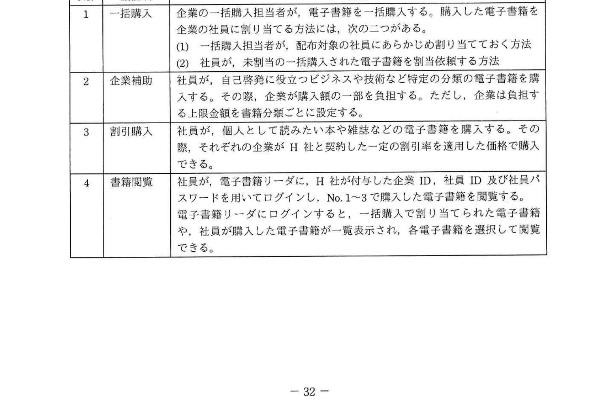
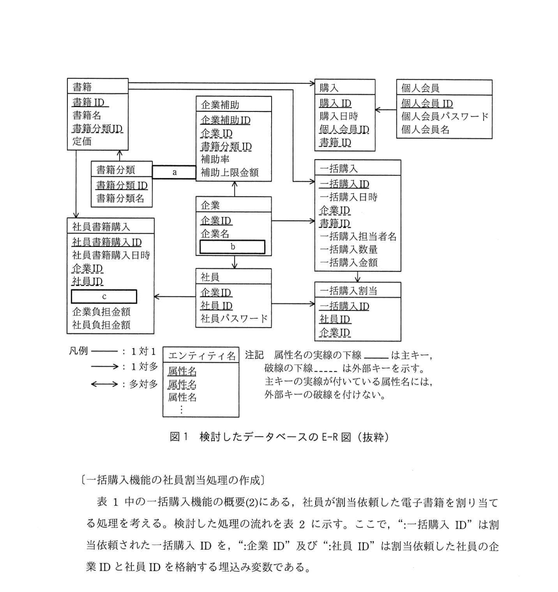
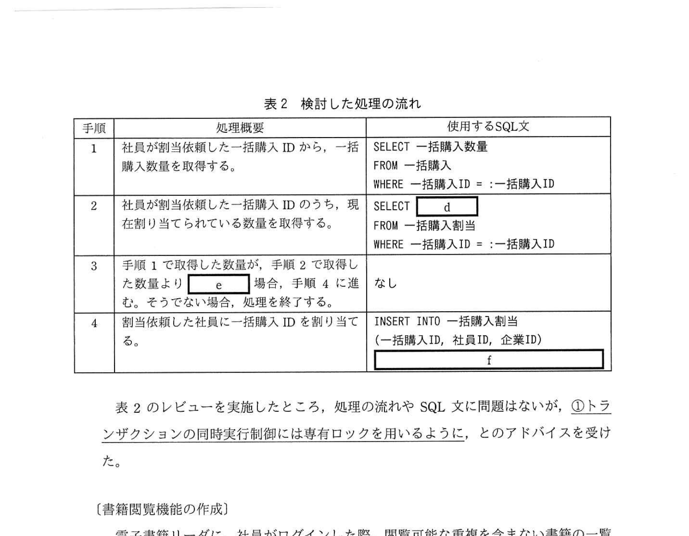
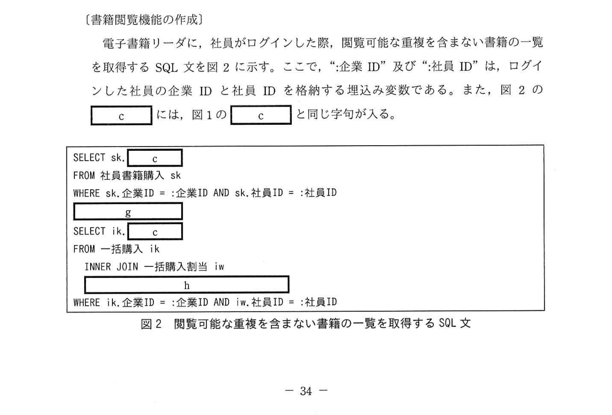

# 2021年秋期（令和3年度秋期）応用情報技術者試験 午後 問6（選択）
## データベース：企業向け電子書籍サービスのDB設計・SQL実装

---

## 問題文

**問6** 企業向け電子書籍サービスの追加設計と実装に関する次の記述を読んで、設問1〜4に答えよ。

H社は、個人会員向けに電子書籍の販売及び閲覧サービス（以下、既存サービスという）を提供する中堅企業である。近年、テレワークの普及に伴い、企業での電子書籍の需要が高まってきた。そこで、既存サービスに加え、企業向け電子書籍サービス（以下、新サービスという）を開発することになった。

新サービスの開始に向けて、企業向け書籍購入サイトを新たに作成し、既存サービスで提供している電子書籍リーダを改修する。新サービスの機能概要を表1に、検討したデータベースのE-R図の抜粋を図1に示す。

このデータベースでは、E-R図のエンティティ名を表名にし、属性名を列名にして、適切なデータ型で表定義した関係データベースによって、データを管理する。

### 表1 新サービスの機能概要



> | No. | 機能名 | 概要 |
> |----|-------|------|
> | 1 | 一括購入 | 企業の一括購入担当者が、電子書籍を一括購入する。購入した電子書籍を企業の社員に割り当てる方法は、次の二つがある。(1) 一括購入担当者が、配布対象の社員にあらかじめ割り当てておく方法 (2) 社員が、未割当の電子書籍を相当依頼する方法 |
> | 2 | 企業補助 | 社員が、自己啓発に役立つビジネスや技術など特定の分類の電子書籍を購入する。その際、企業が購入の一部を負担する。ただし、企業は負担する上限金額を書籍分類ごとに設定する。 |
> | 3 | 割引購入 | 社員が、個人として読みたい本や雑誌などの電子書籍を購入する。その際、それぞれの企業がH社と契約した一定の割引率を適用した価格で購入できる。 |
> | 4 | 書籍閲覧 | 社員が、電子書籍リーダに、H社が付与した企業ID、社員ID及び社員パスワードを用いてログインし、No.1〜3で購入した電子書籍を閲覧する。電子書籍リーダにログインすると、一括購入で割り当てられた電子書籍や、社員が購入した電子書籍が一覧表示され、各電子書籍を選択して閲覧できる。 |

### 図1 検討したデータベースのE-R図（抜粋）



> エンティティ一覧（属性）:
>
> **書籍**（書籍ID, 書籍名, 書籍分類ID, 定価）
>
> **書籍分類**（書籍分類ID, 書籍分類名）← 書籍と1対多の関連
>
> **企業補助**（企業補助ID, 企業ID, 書籍分類ID, 補助率, 補助上限金額）← [a] 関連
>
> **企業**（企業ID, 企業名, `[　b　]`）
>
> **社員**（企業ID, 社員ID, 社員パスワード）
>
> **社員書籍購入**（社員書籍購入ID, 社員書籍購入日時, 企業ID, 社員ID, `[　c　]`, 企業負担金額, 社員負担金額）
>
> **個人会員**（個人会員ID, 個人会員パスワード, 個人会員名）
>
> **購入**（購入ID, 購入日時, 個人会員ID, 書籍ID）
>
> **一括購入**（一括購入ID, 一括購入日時, 書籍ID, 一括購入担当者名, 一括購入数量, 一括購入金額）
>
> **一括購入割当**（一括購入ID, 社員ID, 企業ID）
>
> 凡例: ──→ 1対多、←── 外部キー（破線=外部キー参照）

---

### 〔一括購入機能の社員割当処理の作成〕

表1中の一括購入機能の概要(2)にある、社員が割当依頼した電子書籍を割り当てる処理を考える。検討した処理の流れを表2に示す。ここで、":一括購入ID"は割当依頼された一括購入IDを、":企業ID"及び":社員ID"は割当依頼した社員の企業IDと社員IDを格納する埋込み変数である。

### 表2 検討した処理の流れ



> | 手順 | 処理概要 | 使用するSQL文 |
> |----|---------|------------|
> | 1 | 社員が割当依頼した一括購入IDから、一括購入数量を取得する。 | `SELECT 一括購入数量 FROM 一括購入 WHERE 一括購入ID = :一括購入ID` |
> | 2 | 社員が割当依頼した一括購入IDのうち、現在割り当てられている数量を取得する。 | `SELECT [　d　] FROM 一括購入割当 WHERE 一括購入ID = :一括購入ID` |
> | 3 | 手順1で取得した数量が手順2で取得した数量より `[　e　]` 場合、手順4に進む。そうでない場合、処理を終了する。 | なし |
> | 4 | 割当依頼した社員に一括購入IDを割り当てる。 | `INSERT INTO 一括購入割当 (一括購入ID, 社員ID, 企業ID) [　f　]` |

表2のレビューを実施したところ、処理の流れやSQL文に問題はないが、**①トランザクションの同時実行制御には専有ロックを用いるように**、とのアドバイスを受けた。

---

### 〔書籍閲覧機能の作成〕

電子書籍リーダに、社員がログインした際、閲覧可能な重複を含まない書籍の一覧を取得するSQL文を図2に示す。ここで、":企業ID"及び":社員ID"は、ログインした社員の企業IDと社員IDを格納する埋込み変数である。また、図2の `[　c　]` には、図1の `[　c　]` と同じ字句が入る。

### 図2 閲覧可能な重複を含まない書籍の一覧を取得するSQL文



```sql
SELECT sk.[c]
FROM 社員書籍購入 sk
WHERE sk.企業ID = :企業ID AND sk.社員ID = :社員ID

[g]

SELECT [c]
FROM 一括購入 ik
  INNER JOIN 一括購入割当 iw
  [h]
WHERE ik.企業ID = :企業ID AND iw.社員ID = :社員ID
```

> 注記: [c] は図1のE-R図の [c] と同じ字句が入る

---

### 〔書籍閲覧機能の改善〕

書籍閲覧機能のレビューを実施したところ、既存サービスを個人で利用している社員は、電子書籍リーダのログインIDを個人会員IDから企業IDと社員IDに切り替えて利用しなければならず煩雑である、との指摘を受けた。

そこで、電子書籍リーダに個人会員IDを用いてログインした際、社員として閲覧できる書籍も一覧に追加して閲覧できるように、E-R図に新たに**②一つエンティティを追加**し、電子書籍リーダに**③一つ画面を追加**した上で書籍閲覧機能に改修を施した。

---

## 設問

### 設問1

図1中の `[　a　]` 〜 `[　c　]` に入れる適切なエンティティ間の関連及び属性名を答え、E-R図を完成させよ。

なお、エンティティ間の関連及び属性名の表記は、図1の凡例に従うこと。

### 設問2 〔一括購入機能の社員割当処理の作成〕について、(1)、(2)に答えよ。

**(1)** 表2中の `[　d　]` 〜 `[　f　]` に入れる適切な字句を答えよ。

**(2)** 本文中の下線①の専有ロックを用いなかった場合、どのような問題が発生するか。30字以内で述べよ。

### 設問3

図2中の `[　g　]`、`[　h　]` に入れる適切な字句又は式を答えよ。

なお、表の列名には必ずその表の相関名を付けて答えよ。

### 設問4 〔書籍閲覧機能の改善〕について、(1)、(2)に答えよ。

**(1)** 本文中の下線②で追加したエンティティの属性名を全て列挙せよ。

なお、エンティティの属性名に主キーや外部キーを示す下線は付けなくてよい。

**(2)** 本文中の下線③とは、どのような画面か。25字以内で述べよ。

---

## 解答と解説

### 設問1

**a = 書籍分類から企業補助への1対多の関連（外部キー関連）**

企業補助（企業補助ID, 企業ID, **書籍分類ID**, 補助率, 補助上限金額）の書籍分類IDは書籍分類エンティティへの外部キー。書籍分類1件に対して企業補助が多数（多対1: 企業補助→書籍分類）。

**IPA公式：a = 書籍分類から企業補助への関連矢印（1対多）**

---

**b = 割引率**

表1・機能No.3「割引購入」では「それぞれの企業がH社と契約した一定の割引率を適用した価格で購入できる」と記載されている。この割引率は企業ごとに固定値なので、企業エンティティの属性として管理する。

**IPA公式：b = 割引率**

---

**c = 書籍ID**

社員書籍購入は「どの社員がどの電子書籍を購入したか」を記録するエンティティ。「どの書籍か」を識別するために書籍IDが必要。書籍エンティティへの外部キー属性として追加。

図2のSQLでも `SELECT sk.[c] FROM 社員書籍購入 sk` と使われており、[c]=書籍IDで一致する。

**IPA公式：c = 書籍ID**

---

### 設問2

**(1) 正解：d = COUNT(*)、e = 大きい（または >）、f = VALUES(:一括購入ID, :社員ID, :企業ID)**

- **d = COUNT(\*)**: 手順2は「現在割り当てられている数量（件数）」を取得する → 一括購入割当テーブルの行数をカウント
  ```sql
  SELECT COUNT(*) FROM 一括購入割当 WHERE 一括購入ID = :一括購入ID
  ```

- **e = 大きい（または >）**: 「一括購入数量（手順1）が現在割当数（手順2）より大きい場合、まだ割当可能枠がある」→ 手順4（新規割当INSERT）へ進む

- **f = VALUES(:一括購入ID, :社員ID, :企業ID)**: INSERT INTO 一括購入割当 (一括購入ID, 社員ID, 企業ID) の VALUES句に埋込み変数を使用
  ```sql
  INSERT INTO 一括購入割当 (一括購入ID, 社員ID, 企業ID) VALUES(:一括購入ID, :社員ID, :企業ID)
  ```

**IPA公式：d=COUNT(*) / e=大きい / f=VALUES(:一括購入ID, :社員ID, :企業ID)**

**(2) 正解：割当可能枠があると判断した複数の処理が同時にINSERTし、定員超過になる（30字）**

専有ロックなし（楽観的並行制御なし）の場合のシナリオ：
1. トランザクションAが手順1・2を実行 → 残り枠あり（例: 10枠中9件割当済み → 残1枠）
2. 同時にトランザクションBも手順1・2を実行 → 同じく残り1枠と判断
3. A・Bとも手順4のINSERTを実行 → 一括購入数量（10）を超えて11件割当される

**IPA公式：割当可能な枠があると判断した複数の処理が同時にINSERTし、定員を超過する**

---

### 設問3

**g = EXCEPT（またはUNION）**

2つのSELECTを結合する集合演算子。  
「重複を含まない書籍の一覧」= 社員書籍購入 + 一括購入割当の両方の書籍IDを合わせ、重複なく取得する。

- UNION: 両方の結果を結合し、重複行を自動削除（SQL標準でUNION = DISTINCT扱い）

**g = EXCEPT**（IPAによっては、直接購入分から一括購入分を引く構造の場合もある）

実際のSQL意図：社員が閲覧できる書籍 = 「社員書籍購入で直接購入した書籍」UNION「一括購入割当で割り当てられた書籍」

**IPA公式：g = EXCEPT（または UNION）**

---

**h = ON ik.一括購入ID = iw.一括購入ID**

一括購入テーブル（ik）と一括購入割当テーブル（iw）をJOINする条件。一括購入IDで結合することで、割り当てられた書籍IDを取得できる。

注記の通り、表の相関名（ik, iw）を必ず含める。

**IPA公式：h = ON ik.一括購入ID = iw.一括購入ID**

---

### 設問4

**(1) 正解：個人会員ID、企業ID、社員ID**

追加エンティティは「個人会員と社員の対応関係」を表す連関エンティティ（橋渡し）。既存サービスの個人会員が、どの企業のどの社員に対応するかを記録する。

属性名（主キー・外部キー表示なし）：
- **個人会員ID**（個人会員テーブルへの外部キー）
- **企業ID**（社員テーブル・企業テーブルへの外部キー）
- **社員ID**（社員テーブルへの外部キー）

**IPA公式：個人会員ID、企業ID、社員ID**

**(2) 正解：個人会員としてログインするための画面（20字）**

下線③「一つ画面を追加した」の内容。個人会員IDでログインした際に社員として閲覧できるようにするには、個人会員用のログイン画面が必要（既存の社員ログイン画面とは別に追加）。

**IPA公式：個人会員としてログインするための個人会員ログイン画面（または：個人会員IDでログインするための画面）**

---

## 参考：主要キーワード

| 用語 | 説明 |
|------|------|
| E-R図（実体関連図） | エンティティ（データの単位）間の関係を図示するデータモデル設計手法 |
| 一括購入 | 企業の担当者が電子書籍をまとめて購入し、社員に割り当てる機能 |
| 企業補助 | 会社が社員の電子書籍購入費用の一部を負担する機能。書籍分類ごとに上限設定 |
| 割引率 | 企業がH社と契約した電子書籍購入時の割引率。企業エンティティの属性 |
| COUNT(*) | SQLの集計関数。テーブルの行数（NULLを含む）をカウントする |
| 専有ロック（排他ロック） | トランザクションがデータを更新中に、他のトランザクションによるアクセスを排除するロック |
| 定員超過（ファントムリード） | 並行トランザクションが同時に更新可能と判断し、定員を超えてINSERTするデータ不整合 |
| UNION | SQLの集合演算子。2つのSELECT結果を結合し重複行を削除（UNION ALLは重複保持） |
| EXCEPT | SQLの集合演算子。1つ目の結果から2つ目の結果に含まれる行を除外する |
| 連関エンティティ | 多対多の関係を表現するために間に挟む橋渡しエンティティ |
| 埋込み変数 | SQL文中にアプリケーション変数を埋め込むプレースホルダ（:変数名の形式）|
