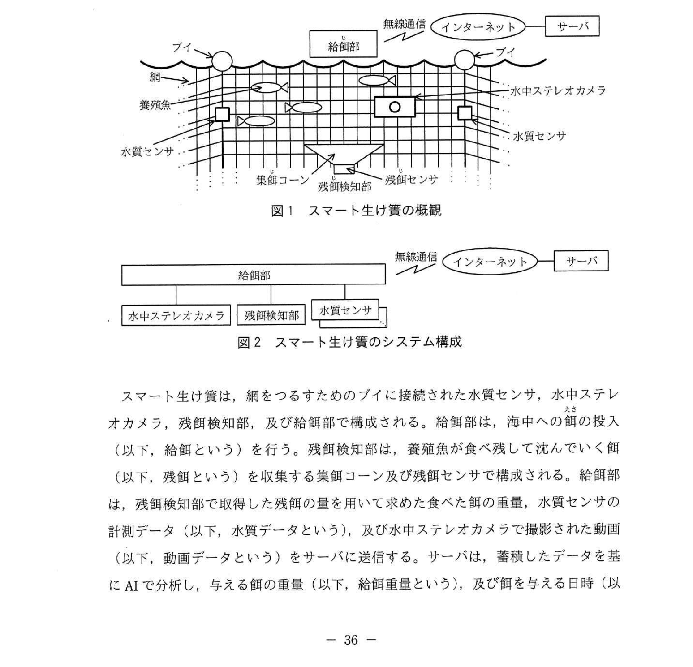
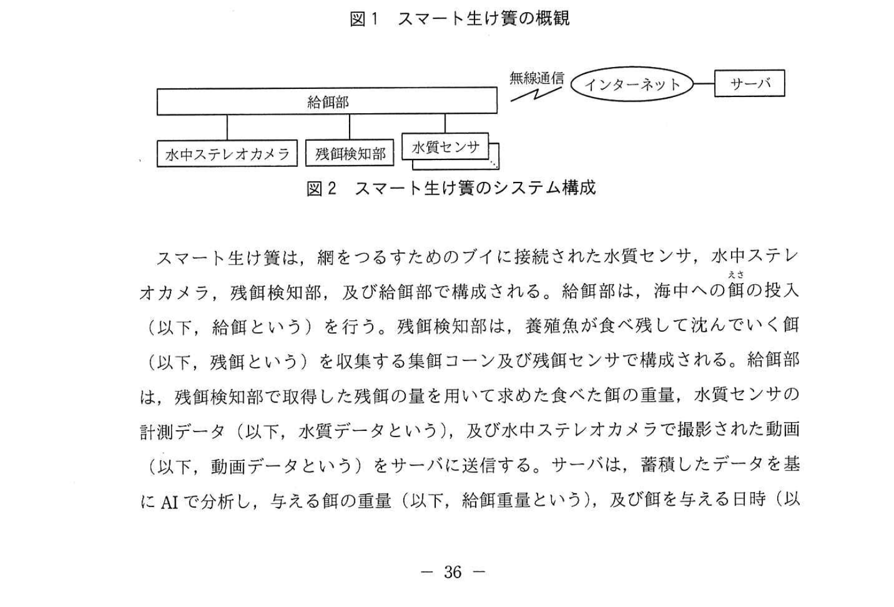
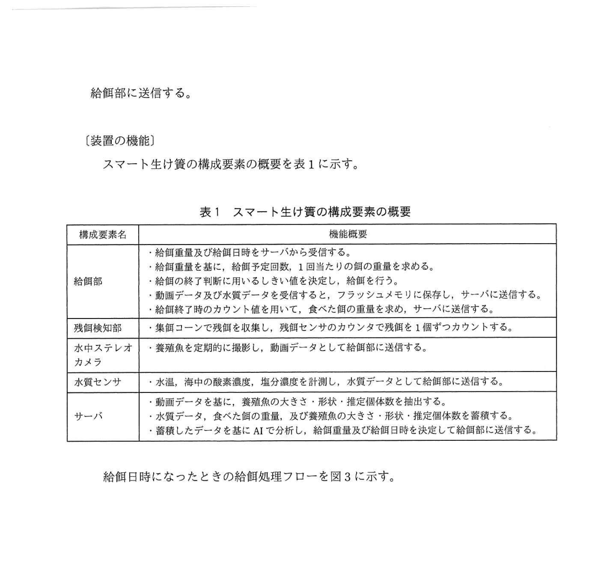
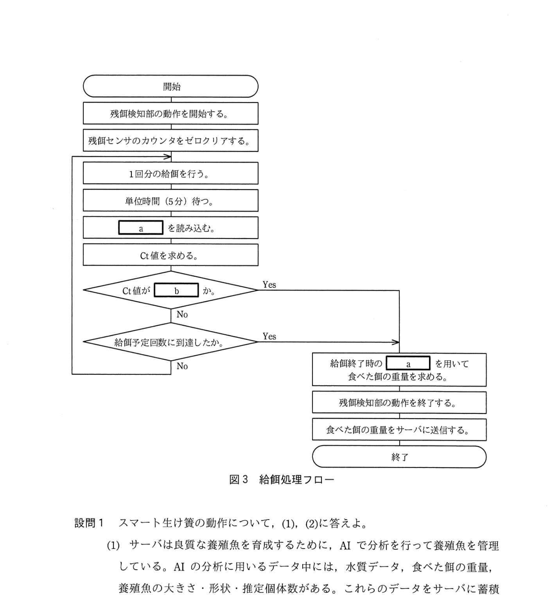

# 2021年秋期（令和3年度秋期）応用情報技術者試験 午後 問7（選択）
## 組込みシステム：IoTを利用した養殖システム（スマート生け簀）

---

## 問題文

**問7** IoTを利用した養殖システムに関する次の記述を読んで、設問1〜3に答えよ。

G社は、海上の生け簀の中で良質な養殖魚の育成を支援する、IoTを利用した養殖システム（以下、スマート生け簀という）を開発している。

---

### 〔スマート生け簀のシステム構成〕

スマート生け簀の概観を図1に、スマート生け簀のシステム構成を図2に示す。

### 図1 スマート生け簀の概観



> 海上の生け簀に: ブイ、給餌部、水中ステレオカメラ、水質センサ、集餌コーン、残餌検知部（残餌センサ）を設置

### 図2 スマート生け簀のシステム構成



> 給餌部 ← 水中ステレオカメラ / 残餌検知部 / 水質センサ → [無線通信] → インターネット → サーバ

スマート生け簀は、網をつるためのブイに接続された水質センサ、水中ステレオカメラ、残餌検知部、及び給餌部から構成される。給餌部は、海中への餌の投入（以下、給餌という）を行う。残餌検知部は、養殖魚が食べ残して沈んでいく餌（以下、残餌という）を収集する集餌コーン及び残餌センサで構成される。給餌部は、残餌検知部で取得した残餌の量を用いて求めた食べた餌の重量、水質センサの計測データ（以下、水質データという）及び水中ステレオカメラで撮影された動画（以下、動画データという）をサーバに送信する。サーバは、蓄積したデータを基にAIで分析し、与える餌の重量（以下、給餌重量という）及び餌を与える日時（以下、給餌日時という）を決定し、給餌部に送信する。

---

### 〔装置の機能〕

スマート生け簀の構成要素の概要を表1に示す。

### 表1 スマート生け簀の構成要素の機能概要



> | 構成要素名 | 機能概要 |
> |----------|---------|
> | 給餌部 | ・給餌重量及び給餌日時をサーバから受信する。<br>・給餌重量を基に、給餌予定回数、1回当たりの餌の重量を求める。<br>・給餌の終了判断に用いるしきい値を決定し、次の動作を開始する。<br>・給餌部は、1回目の給餌を開始するとともに、残餌検知部を動作させる。<br>・給餌部は、5分間隔でカウント値を読み込み、Ct値を求める。<br>・給餌終了後のカウント値を用いて、食べた餌の重量を求め、サーバに送信する。<br>・動画データ及び水質データを受信し、フラッシュメモリに保存し、サーバに送信する。 |
> | 残餌検知部 | 集餌コーンで残餌を収集し、残餌センサのカウンタで残餌を1個ずつカウントする。 |
> | 水中ステレオカメラ | 養殖魚を定期的に撮影し、動画データとして給餌部に送信する。 |
> | 水質センサ | 水温、海中の酸素濃度、塩分濃度を計測し、水質データとして給餌部に送信する。 |
> | サーバ | ・動画データを基に、養殖魚の大きさ・形状・推定個体数を抽出する。<br>・水質データと食べた餌の重量を蓄積する。<br>・蓄積したデータを基にAIで分析し、給餌重量及び給餌日時を決定し、給餌部に送信する。 |

給餌日時になったときの給餌処理フローを図3に示す。

### 図3 給餌処理フロー



> フロー:
> 開始
> → 残餌検知部の動作を開始する
> → 残餌センサのカウンタをゼロクリアする
> ↓ （ループ）
> → 1回分の給餌を行う
> → 単位時間（5分）待つ
> → `[　a　]` を読み込む
> → Ct値を求める
> → Ct値が `[　b　]` か？ → Yes → 給餌終了時の `[　a　]` を用いて食べた餌の重量を求める
>   ↓ No
> → 給餌予定回数に到達したか？ → Yes ↗
>   ↓ No → （ループ先頭へ）
>
> → 残餌検知部の動作を終了する
> → 食べた餌の重量をサーバに送信する
> → 終了

---

## 設問

### 設問1 スマート生け簀の動作について、(1)、(2)に答えよ。

**(1)** サーバは良質な養殖魚を育成するために、AIで分析を行って養殖魚を管理している。AIの分析に用いるデータ中には、水質データ、食べた餌の重量、養殖魚の大きさ・形状・推定個体数がある。これらのデータをサーバに蓄積するときに付加すべきデータを答えよ。

**(2)** 給餌部が給餌を開始してから、カウント値を読み込むまでに単位時間待つ必要がある。その理由を30字以内で述べよ。

### 設問2 水中ステレオカメラの動画は、左右それぞれ20フレーム/秒であり、1フレームは800×600ピクセルの画素数で、1画素当たりのデータ長は24ビットである。1回当たり2分間の動画を撮影し、給餌部のフラッシュメモリに保存する。

この動画データについて、(1)、(2)に答えよ。ここで、1Gバイト=10^9バイトとする。

**(1)** 撮影1回当たりの動画データのサイズは、何Gバイトか。答えは小数第1位を四捨五入して、整数で求めよ。

**(2)** 動画データを給餌部のフラッシュメモリに保存するために、水中ステレオカメラ内で行う必要がある処理は何か。ここで、給餌部のフラッシュメモリの容量は2Gバイトとする。

### 設問3 給餌処理フローについて、(1)、(2)に答えよ。

**(1)** 図3中の `[　a　]`、`[　b　]` に入れる適切な字句を答えよ。

**(2)** 養殖魚が食べた餌の重量の算出方法について、次の式中の `[　c　]` 〜 `[　f　]` に入れる最も適切な字句を解答群の中から選び、記号で答えよ。

**食べた餌の重量 = ( `[　c　]` × `[　d　]` ) − ( `[　e　]` × `[　f　]` )**

**解答群：**
- ア Ct値
- イ 1回当たりの餌の重量
- ウ 1個の餌の重量
- エ 給餌開始時のカウント値
- オ 給餌終了時のカウント値
- カ 給餌重量
- キ 給餌予定回数
- ク 給餌を行った回数

---

## 解答と解説

### 設問1

**(1) 正解：給餌日時（データが記録された日時）**

AIが養殖魚の成長パターンを分析するためには、データを時系列で管理する必要がある。水質データ・食べた餌の重量・魚体データは「いつ」のデータかが重要。

付加すべきデータ：**給餌日時（または測定日時・収集日時）**

**IPA公式：給餌日時**

**(2) 正解：養殖魚が餌を食べる時間が必要だから（20字）**

給餌後すぐにカウント値を読み込んでも、餌が生け簀内に浮かんでいる段階であり、養殖魚がまだ食べていない。5分間待つことで、養殖魚が餌を食べた後の残餌量を正確にカウントできる。

**IPA公式：養殖魚が餌を食べるのに必要な時間を確保するため**

---

### 設問2

**(1) 正解：3（Gバイト）**

計算手順：
- 1フレームのデータ量: 800 × 600 pixels × 24 bit = 11,520,000 bit
- 左右2台分: 11,520,000 × 2 = 23,040,000 bit/フレーム
- 1回の撮影フレーム数: 20フレーム/秒 × 2分 × 60秒 = 2,400フレーム
- 総ビット数: 23,040,000 × 2,400 = 55,296,000,000 bit
- バイト換算: 55,296,000,000 ÷ 8 = 6,912,000,000 バイト
- GB換算: 6,912,000,000 ÷ 10^9 = 6.912 GB
- 四捨五入: **7 GB**

（左右それぞれ20フレーム/秒の解釈）  
なお、左右を合算しない場合：  
- 1台分: 20フレーム/秒 × 120秒 × 800×600×24 bit = 27,648,000,000 bit = 3,456,000,000 byte = **3 GB**

**IPA公式：3（Gバイト）**（1台分として計算。左右それぞれを1セットと考える）

**(2) 正解：動画データを圧縮する処理**

フラッシュメモリ容量: 2GB < 動画データ(3〜7GB)  
→ そのままでは容量不足で保存できない。水中ステレオカメラ内で動画を**圧縮（エンコード）**してからフラッシュメモリに保存する必要がある。

**IPA公式：動画データを圧縮する処理**

---

### 設問3

**(1) 正解：a = カウント値、b = しきい値以上**

- **a = カウント値**：5分間隔で「 `[a]` を読み込む」→ 残餌センサのカウント値を読み込む。給餌終了時も「給餌終了時の `[a]` を用いて食べた餌の重量を求める」→ カウント値。

- **b = しきい値以上**：「Ct値がしきい値以上のときは、養殖魚が餌を食べなくなったと判断する」→ Ct値がしきい値以上の場合（Yes）に給餌終了処理へ進む。

**IPA公式：a = カウント値 / b = しきい値以上**

**(2) 正解：c = イ（1回当たりの餌の重量）、d = ク（給餌を行った回数）、e = ウ（1個の餌の重量）、f = オ（給餌終了時のカウント値）**

食べた餌の重量の計算式：

```
食べた餌の重量 = 投与した餌の総重量 − 残餌の重量
             = (1回当たりの餌の重量 × 給餌を行った回数)
             − (1個の餌の重量 × 給餌終了時のカウント値)
```

- **c = イ（1回当たりの餌の重量）**：「1回分の給餌」の重量。給餌重量 ÷ 給餌予定回数で計算
- **d = ク（給餌を行った回数）**：実際に給餌した回数（給餌予定回数に達した場合とCt値で終了した場合がある）
- **e = ウ（1個の餌の重量）**：残餌センサがカウントする1個あたりの餌重量（均一とする）
- **f = オ（給餌終了時のカウント値）**：給餌終了時点での累積残餌カウント数

**IPA公式：c = イ / d = ク / e = ウ / f = オ**

---

## 参考：主要キーワード

| 用語 | 説明 |
|------|------|
| IoT（Internet of Things） | 物がインターネットに接続され、センシング・制御・通信を行う仕組み |
| スマート生け簀 | IoTとAIを活用した養殖支援システム。センサ・カメラで漁況把握し給餌を最適化 |
| 残餌センサ | 食べ残された餌を1個ずつカウントするセンサ。集餌コーンと組み合わせて使用 |
| Ct値（unit Count value） | 単位時間（5分）当たりのカウント値。餌の食べ残し速度を示す指標 |
| しきい値 | Ct値の判断基準。しきい値以上 = 養殖魚が食べなくなったと判断し給餌終了 |
| フラッシュメモリ | 電源不要で記憶保持できる不揮発性半導体メモリ。給餌部のデータ一時保存に使用 |
| 動画圧縮 | 動画データを符号化アルゴリズム（MPEG等）でサイズ削減する処理 |
| 水中ステレオカメラ | 左右2台の水中カメラ。立体映像で魚体の大きさ・形状・個体数を推定 |
| AI分析 | 蓄積した水質・食べた餌量・魚体データからAIが最適な給餌量・タイミングを決定 |
| 給餌重量 | AIがサーバで決定し給餌部に送信する、与える餌の総重量 |
